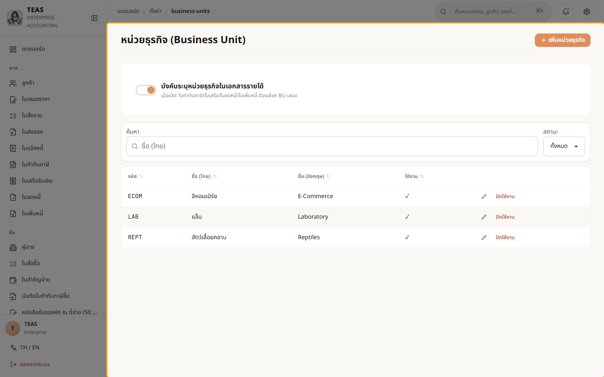
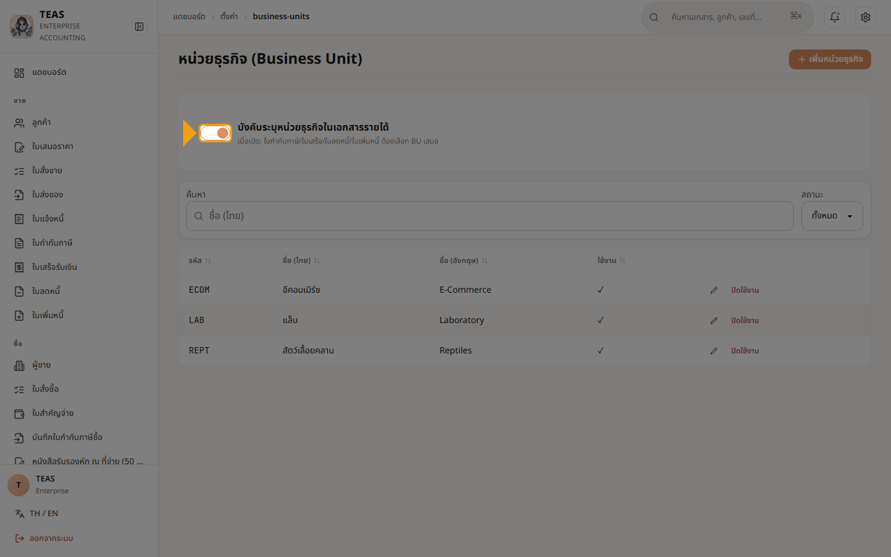
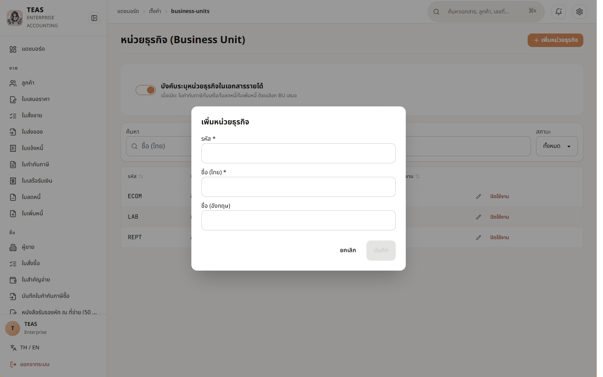
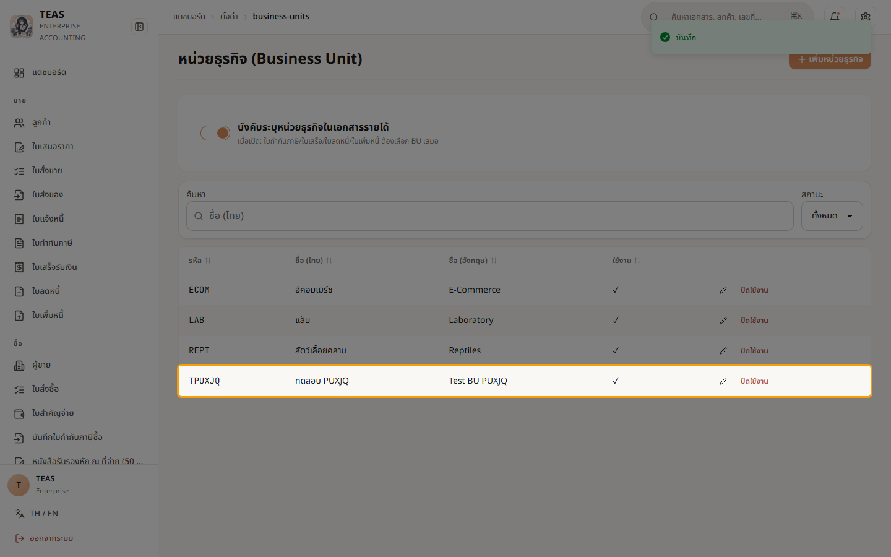
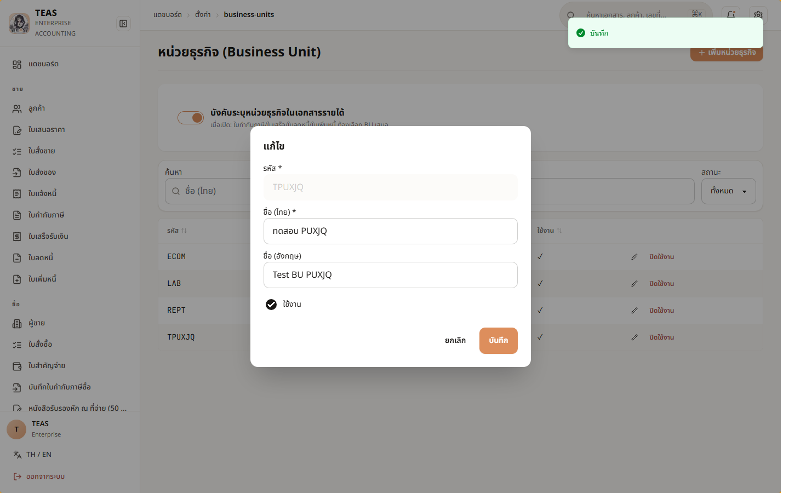
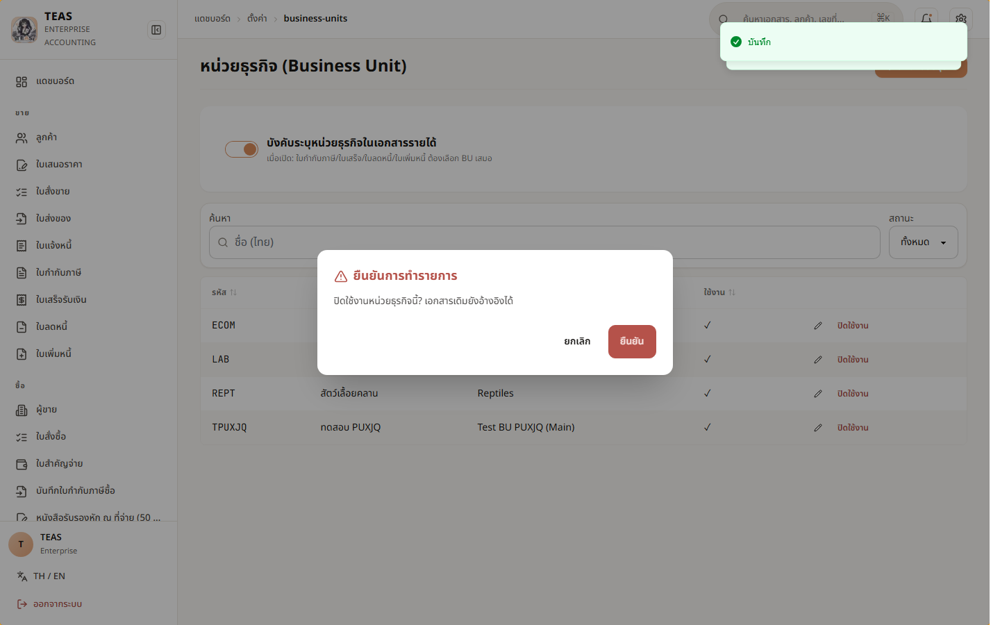
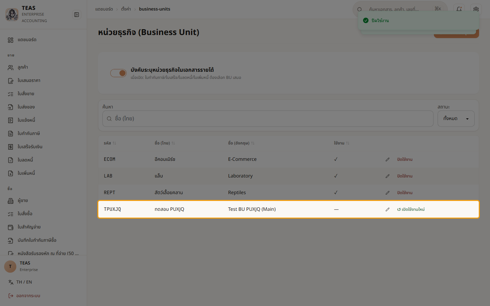
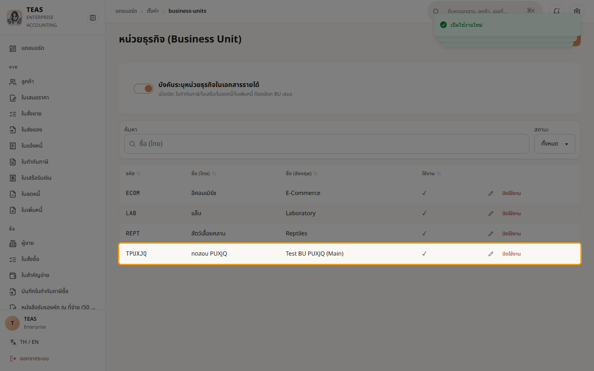

## 02.01 — ตั้งค่าหน่วยธุรกิจ (Business Unit)

> **เงื่อนไขก่อนใช้งาน:** login ในฐานะ admin หรือ accountant (ทั้งคู่มีสิทธิ์ master.business_unit.manage) · manual-demo seed applied (ECOM/LAB/REPT)

หน่วยธุรกิจ (BU) ใช้แบ่งกลุ่มภายในบริษัทเดียวกัน — รหัส BU (อักษรพิมพ์ใหญ่
A-Z + ตัวเลข ≤20 ตัว) จะถูกแทรกใน prefix เลขเอกสาร เช่น
`12-2026-TI-ECOM-0001`.

ตั้งให้เรียบร้อยก่อนเริ่มออกเอกสาร — เปลี่ยนรหัสภายหลังจะกระทบเอกสารเก่า
ที่อ้างรหัสเดิม.

ในบทนี้คุณจะได้สาธิตทั้ง 4 actions: เพิ่ม → แก้ไข → ปิดใช้งาน → เปิดใช้งานใหม่.

### ขั้นที่ 1

<figure markdown="span">
  
  <figcaption>หน้า "หน่วยธุรกิจ (Business Unit)" — 3 BUs จาก seed (ECOM อีคอมเมิร์ซ / LAB แล็บ / REPT สัตว์เลื้อยคลาน). คอลัมน์: รหัส, ชื่อ (ไทย), ชื่อ (อังกฤษ), ใช้งาน, [✏️ แก้ไข] [ปิดใช้งาน]</figcaption>
</figure>

### ขั้นที่ 2

<figure markdown="span">
  
  <figcaption>toggle "บังคับระบุหน่วยธุรกิจในเอกสารรายได้" — เมื่อเปิด: ออกใบกำกับภาษี/ใบเสร็จ/ใบลดหนี้/ใบเพิ่มหนี้ ต้องเลือก BU ทุกครั้ง (กดยังต่อไม่ได้ถ้าไม่เลือก)</figcaption>
</figure>

### ขั้นที่ 3

<figure markdown="span">
  
  <figcaption>คลิก "+ เพิ่มหน่วยธุรกิจ" → modal เปิด. Fields: รหัส* (A-Z + 0-9, ≤20), ชื่อ (ไทย)*, ชื่อ (อังกฤษ). ปุ่ม "บันทึก" จะ enable เมื่อกรอก required ครบ</figcaption>
</figure>

### ขั้นที่ 4

<figure markdown="span">
  
  <figcaption>กด "บันทึก" → POST /api/proxy/business-units → toast เขียว "บันทึก" มุมขวาบน → modal ปิด → row ใหม่ "TPUXJQ / ทดสอบ PUXJQ / Test BU PUXJQ" ปรากฏพร้อม ✓ ใช้งาน</figcaption>
</figure>

### ขั้นที่ 5

<figure markdown="span">
  
  <figcaption>คลิก ✏️ แก้ไข ใน row "TPUXJQ" → modal เปิดพร้อมค่าปัจจุบัน. ตัวอย่าง: แก้ "ชื่ออังกฤษ" เป็น "Test BU PUXJQ (Main)" → กด "บันทึก" → PUT 204 → table refresh. หมายเหตุ: ห้ามแก้รหัส (code) หลังออกเอกสารแล้ว</figcaption>
</figure>

### ขั้นที่ 6

<figure markdown="span">
  
  <figcaption>กด "ปิดใช้งาน" → custom AlertDialog เปิด (Sprint 13d-P1): "⚠️ ยืนยันการทำรายการ — ปิดใช้งานหน่วยธุรกิจนี้? เอกสารเดิมยังอ้างอิงได้". 2 ปุ่ม: "ยกเลิก" (เทา) + "ยืนยัน" (สีแดง — destructive variant)</figcaption>
</figure>

### ขั้นที่ 7

<figure markdown="span">
  
  <figcaption>ยืนยัน → DELETE 204 (soft) → "TPUXJQ" row ใช้งาน column เป็น "—" (inactive). ปุ่ม action เปลี่ยน: "ปิดใช้งาน" → "↺ เปิดใช้งานใหม่" (Sprint 13d-P4)</figcaption>
</figure>

### ขั้นที่ 8

<figure markdown="span">
  
  <figcaption>คลิก "↺ เปิดใช้งานใหม่" → PUT isActive=true → toast "เปิดใช้งานใหม่" → row "TPUXJQ" กลับเป็น ✓ ใช้งาน + ปุ่มกลับเป็น "ปิดใช้งาน"</figcaption>
</figure>
