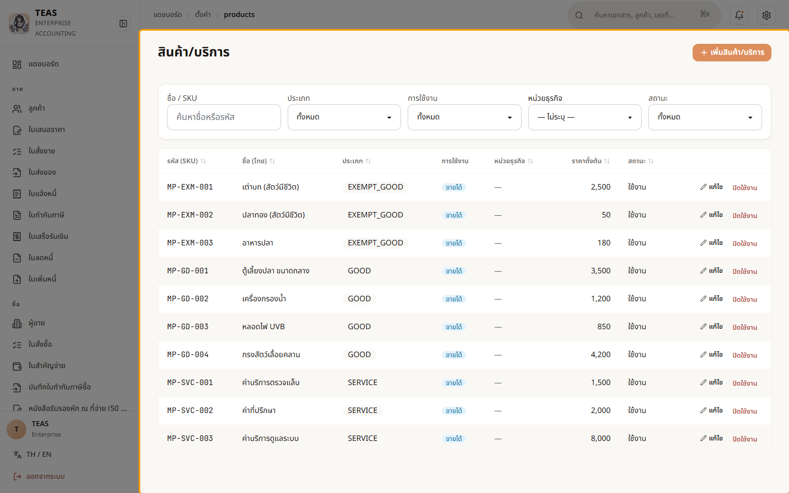
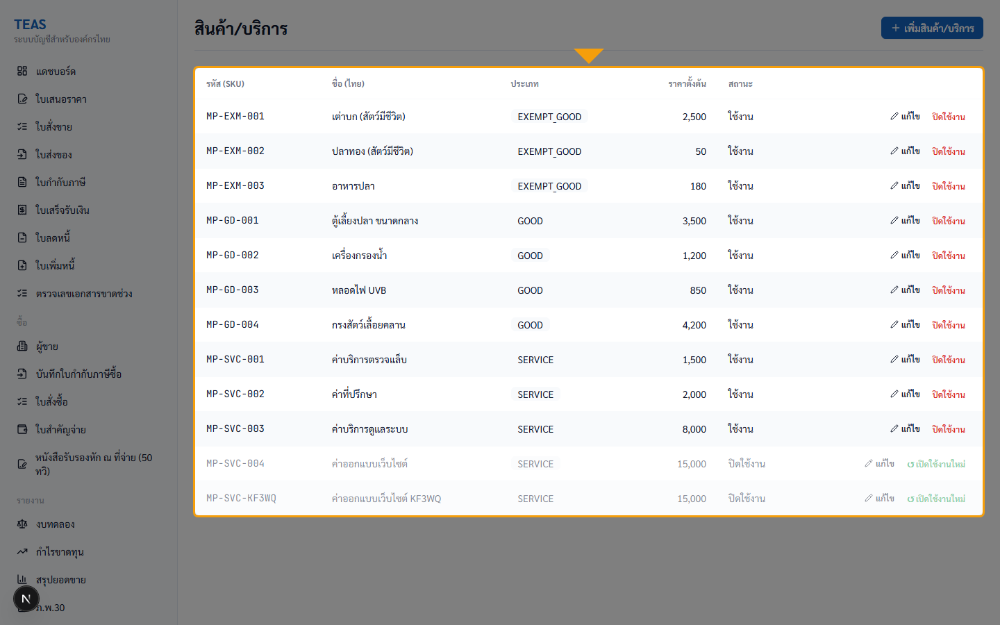
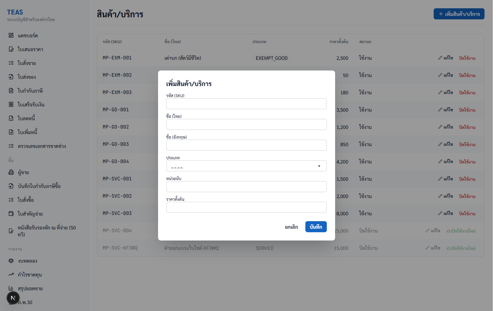
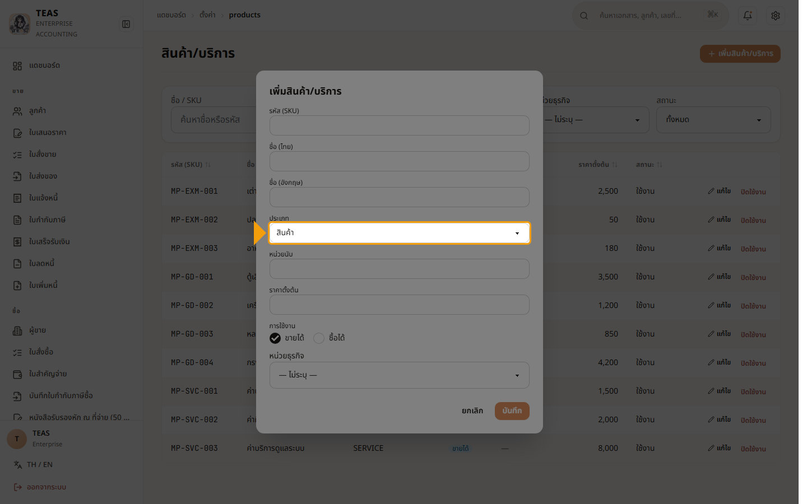
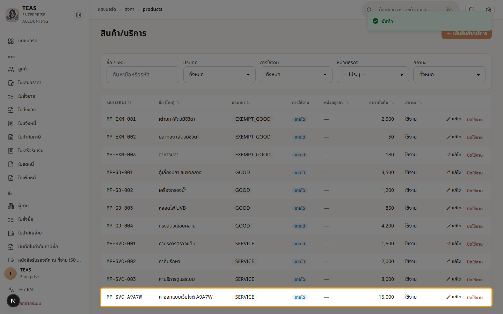
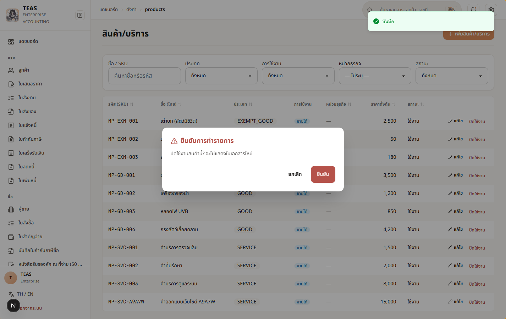
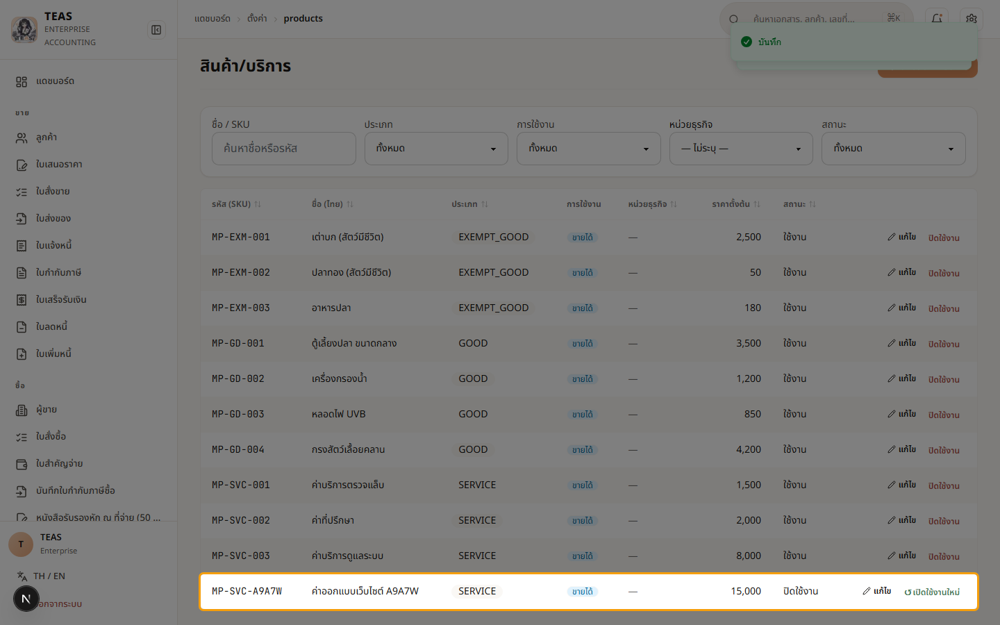

## 02.02 — ตั้งค่าสินค้า/บริการ

> **เงื่อนไขก่อนใช้งาน:** login (admin หรือ accountant) · manual-demo seed (10 product rows)

สินค้า/บริการคือ master data ที่ใช้ในทุก line item ของเอกสาร
(Quotation, Sales Order, Tax Invoice, Vendor Invoice). การตั้ง
**ประเภท** ให้ถูกต้องสำคัญที่สุด — กระทบการคิด VAT 7% ทันที.

ระบบรองรับ 4 ประเภท:

| ประเภท | VAT 7% | ตัวอย่าง |
|---|---|---|
| GOOD | ✓ ต้องเสีย | ตู้เลี้ยงปลา, เครื่องกรองน้ำ |
| SERVICE | ✓ ต้องเสีย | ค่าที่ปรึกษา, ค่าบริการตรวจ |
| EXEMPT_GOOD | — ยกเว้น | สัตว์มีชีวิต, อาหารสัตว์ |
| EXEMPT_SERVICE | — ยกเว้น | บริการการศึกษา, ค่ารักษาพยาบาล |

ตั้งประเภทผิด → คิด VAT ผิด → ภ.พ.30 ยื่นผิด → โดนเบี้ยปรับ.

รหัส (SKU) จะ lock หลังจากมีการใช้ใน document แล้ว — ตั้งให้ดีตั้งแต่แรก.
"ราคาตั้งต้น" คือ default ที่ pre-fill ตอนเลือกสินค้าในเอกสาร — ผู้ใช้
แก้ราคาในเอกสารได้ตามจริง.

### ขั้นที่ 1

<figure markdown="span">
  
  <figcaption>หน้า "สินค้า/บริการ" — 10 รายการจาก seed. คอลัมน์: รหัส (SKU), ชื่อ (ไทย), ประเภท, ราคาตั้งต้น, สถานะ, [✏️ แก้ไข] [ปิดใช้งาน]</figcaption>
</figure>

### ขั้นที่ 2

<figure markdown="span">
  
  <figcaption>สังเกตคอลัมน์ "ประเภท" — แต่ละ row บอก VAT rule: EXEMPT_GOOD (MP-EXM-* ปลา/อาหารสัตว์ = VAT 0%), GOOD (MP-GD-* อุปกรณ์ = VAT 7%), SERVICE (MP-SVC-* บริการ = VAT 7% + อาจ WHT)</figcaption>
</figure>

### ขั้นที่ 3

<figure markdown="span">
  
  <figcaption>คลิก "+ เพิ่มสินค้า/บริการ" → modal เปิด. Fields: รหัส (SKU)*, ชื่อ (ไทย)*, ชื่อ (อังกฤษ), ประเภท (dropdown 4 options), หน่วยนับ, ราคาตั้งต้น</figcaption>
</figure>

### ขั้นที่ 4

<figure markdown="span">
  
  <figcaption>dropdown "ประเภท" มี 4 options: GOOD (default), SERVICE, EXEMPT_GOOD, EXEMPT_SERVICE. ตัวเลือกที่ขึ้นต้น "EXEMPT_" = ไม่คิด VAT 7%</figcaption>
</figure>

### ขั้นที่ 5

<figure markdown="span">
  
  <figcaption>กด "บันทึก" → POST → toast "บันทึก" → row ใหม่ "MP-SVC-A9A7W / ค่าออกแบบเว็บไซต์ A9A7W / SERVICE / 15,000.00 / ใช้งาน" ปรากฏ. ระบบจะคิด VAT 7% และเตือนหัก ณ ที่จ่ายอัตโนมัติเมื่อใช้ในเอกสาร</figcaption>
</figure>

### ขั้นที่ 6

<figure markdown="span">
  
  <figcaption>กด "ปิดใช้งาน" → AlertDialog เปิด (เหมือน BU 02.01). ถ้าเอกสารเดิมอ้างสินค้านี้ — ยังอ้างได้ (soft delete + audit trail)</figcaption>
</figure>

### ขั้นที่ 7

<figure markdown="span">
  
  <figcaption>row "MP-SVC-A9A7W" สถานะเปลี่ยนเป็น "—" + action เป็น "↺ เปิดใช้งานใหม่". Restore = PUT isActive=true (Sprint 13d-P4)</figcaption>
</figure>
