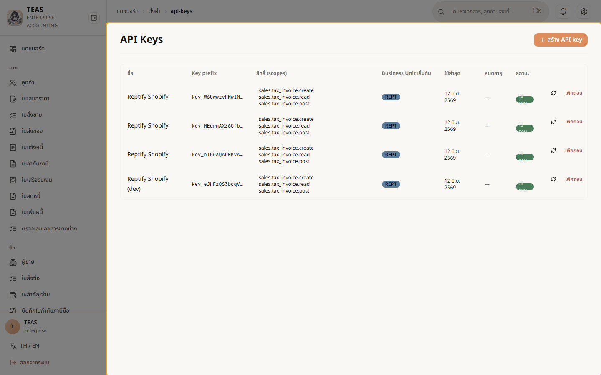
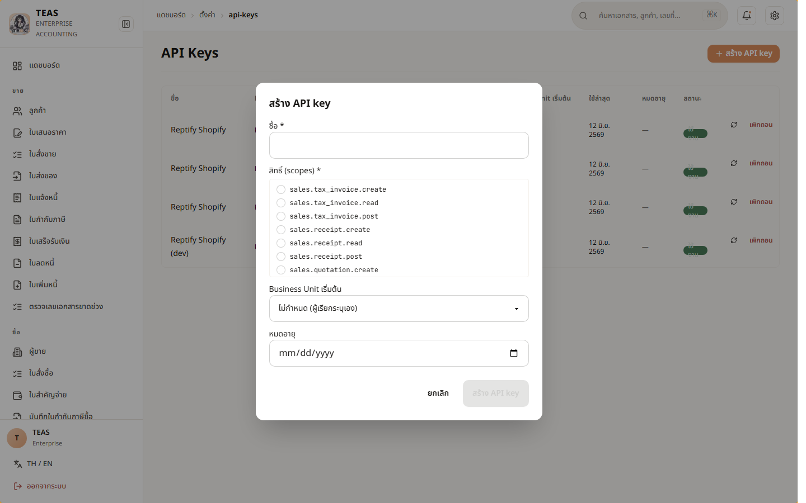
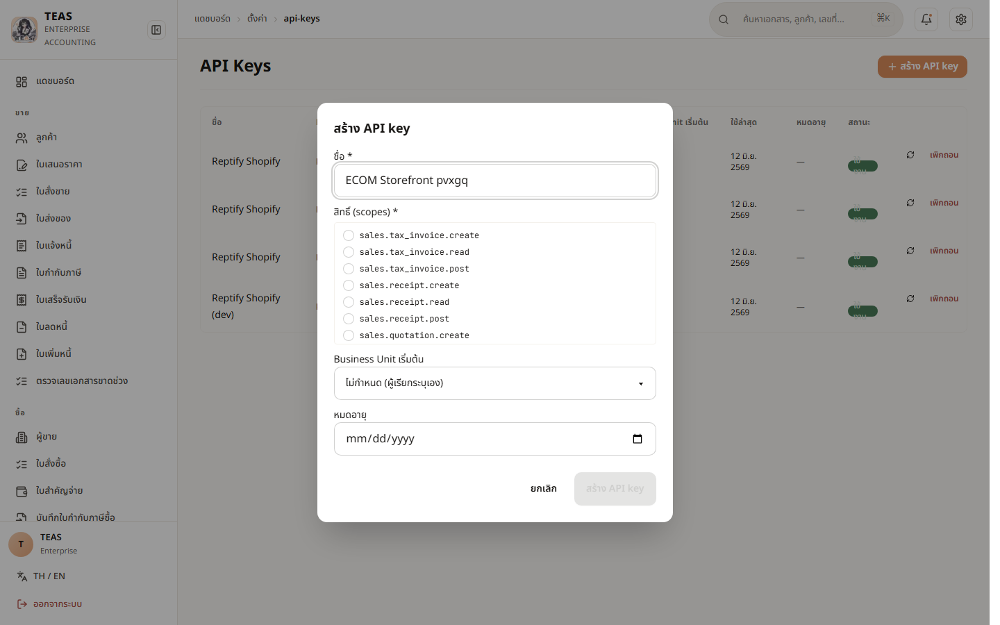
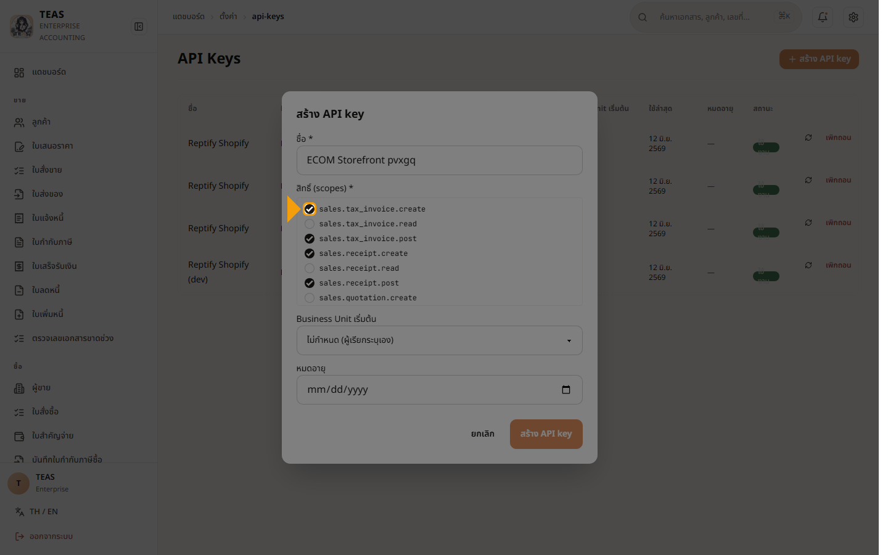
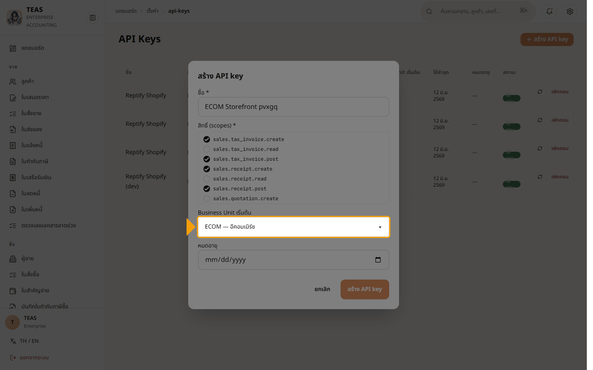
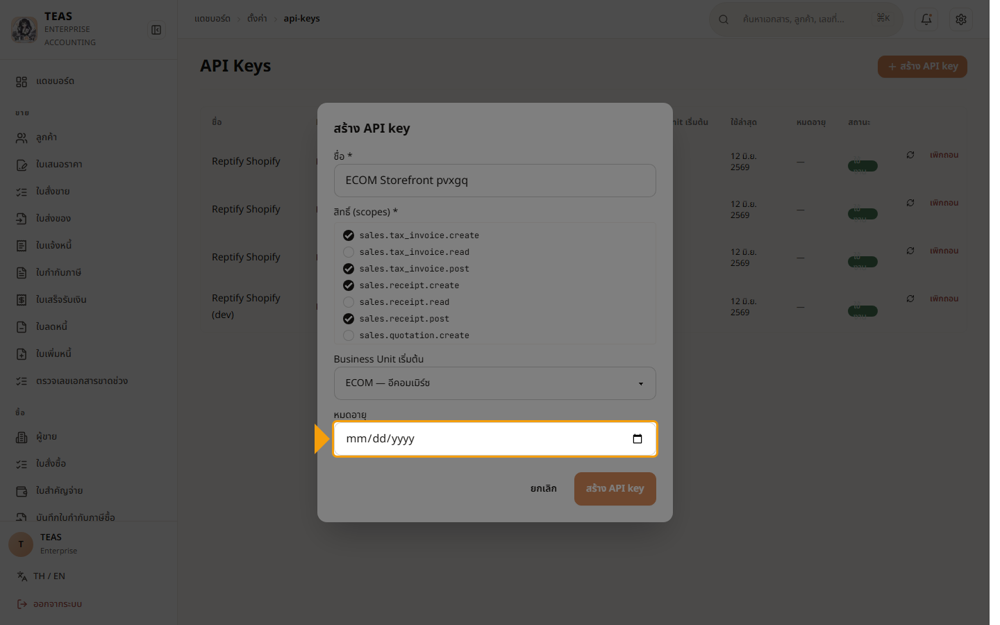
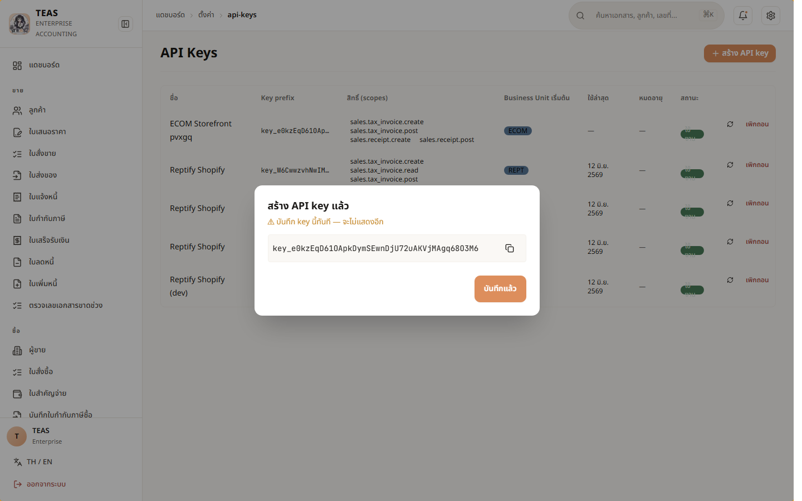

## 02.04 — สร้าง API Keys (Admin only)

> **เงื่อนไขก่อนใช้งาน:** login ในฐานะ ADMIN (demo-admin) · BU ตั้งครบแล้ว (walkthrough 02.01) · ทราบว่า external app จะใช้ scopes อะไรบ้าง (least privilege)

API Key ใช้ให้ระบบภายนอก (microservice, mobile app, partner integration)
เรียก TEAS โดยไม่ต้อง login. แต่ละ key มี:

- **Scopes** — granular permissions เฉพาะที่จำเป็น (least privilege)
  เช่น `sales.tax_invoice.create`, `sales.receipt.post`
- **Business Unit เริ่มต้น** (Sprint 14) — ผูก key กับ 1 BU
  เอกสารที่สร้างจาก key นี้จะถูก tag กับ BU นั้นอัตโนมัติ —
  ป้องกัน microservice ของ ECOM ไปสร้างเอกสารใน LAB โดยไม่ตั้งใจ
- **หมดอายุ** (optional) — แนะนำตั้งสำหรับ contractor / temp staff

**🔐 สำคัญ — key เห็นได้ครั้งเดียวเท่านั้น**: หลังกด "สร้าง" ระบบจะแสดง
full key 1 ครั้ง. ระบบเก็บแค่ hash + prefix. ถ้าไม่ copy เก็บใน secret
manager ของ external app → ลืมแล้วต้องสร้างใหม่ (revoke ของเก่า).

**Request header**: external app ส่ง key มาทาง `X-Api-Key: <full_key>`
ในทุก request ไป `/api/v1/*` endpoints.

**Role**: ADMIN only — sys.api_key.manage scope. Accountant เห็น
NoAccessState ("ต้องมีสิทธิ์ผู้ดูแลระบบ").

### ขั้นที่ 1

<figure markdown="span">
  
  <figcaption>หน้า "API Keys" — เริ่มต้นไม่มี key (empty state พร้อม icon). คอลัมน์: ชื่อ, Key prefix, สิทธิ์ (scopes), Business Unit เริ่มต้น, ใช้ล่าสุด, หมดอายุ, สถานะ</figcaption>
</figure>

### ขั้นที่ 2

<figure markdown="span">
  
  <figcaption>หมายเหตุ — accountant ที่เข้าหน้านี้จะเห็น "ต้องมีสิทธิ์ ผู้ดูแลระบบ" (Sprint 13d-P2 NoAccessState) + ไม่มีปุ่ม "+ สร้าง" (Sprint 13d-P3 PermissionGate). ต้อง admin เท่านั้น</figcaption>
</figure>

### ขั้นที่ 3

<figure markdown="span">
  
  <figcaption>คลิก "+ สร้าง API key" → modal เปิด. 4 sections: ชื่อ*, สิทธิ์ (scopes)*, Business Unit เริ่มต้น, หมดอายุ</figcaption>
</figure>

### ขั้นที่ 4

<figure markdown="span">
  
  <figcaption>กรอก "ชื่อ" — ใช้บอกว่า key นี้สำหรับอะไร (เช่น "ECOM Storefront — production"). ไม่กระทบความปลอดภัย แต่ช่วย ตอน revoke ทีหลัง</figcaption>
</figure>

### ขั้นที่ 5

<figure markdown="span">
  
  <figcaption>เลือก scopes — สำหรับ storefront ทั่วไป: sales.tax_invoice.create, sales.tax_invoice.post, sales.receipt.create, sales.receipt.post. หลีกเลี่ยง .delete หรือ admin scopes ที่ไม่ใช้</figcaption>
</figure>

### ขั้นที่ 6

<figure markdown="span">
  
  <figcaption>เลือก "Business Unit เริ่มต้น" — เช่น ECOM. ทุกเอกสารที่ key นี้สร้างจะ tag เป็น BU ECOM อัตโนมัติ. ถ้าเลือก "ไม่กำหนด" → ผู้เรียกต้องส่ง BU ในทุก request</figcaption>
</figure>

### ขั้นที่ 7

<figure markdown="span">
  
  <figcaption>"หมดอายุ" (optional). แนะนำตั้งสำหรับ contractor / temp. Production keys อาจปล่อยว่าง แต่ควร rotate ทุก 90 วัน (best practice)</figcaption>
</figure>

### ขั้นที่ 8

<figure markdown="span">
  
  <figcaption>กด "สร้าง" → modal แสดง **full key 1 ครั้งเท่านั้น** พร้อม ปุ่ม "Copy". 🔐 Copy ใส่ secret manager ของ external app ทันที (Azure Key Vault / AWS Secrets Manager / Vault). ถ้าปิด modal ก่อน copy → ต้อง revoke + สร้างใหม่ (ระบบเก็บแค่ hash)</figcaption>
</figure>
