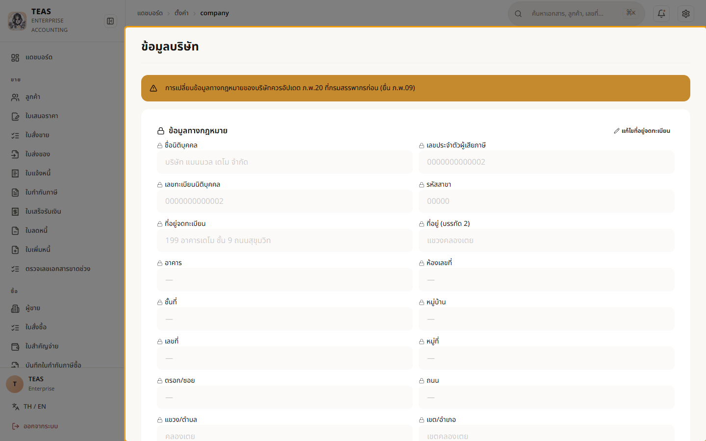
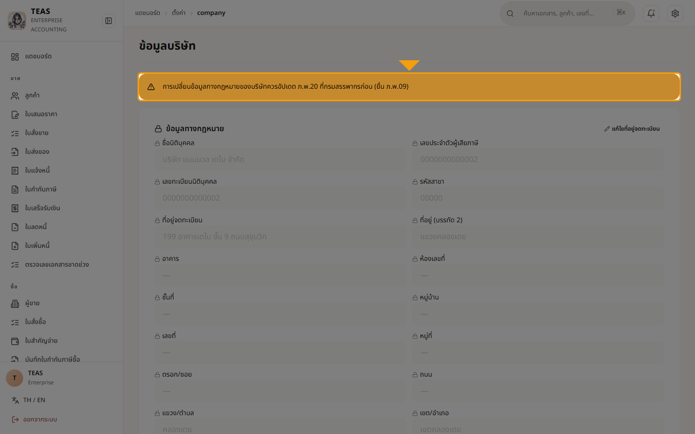
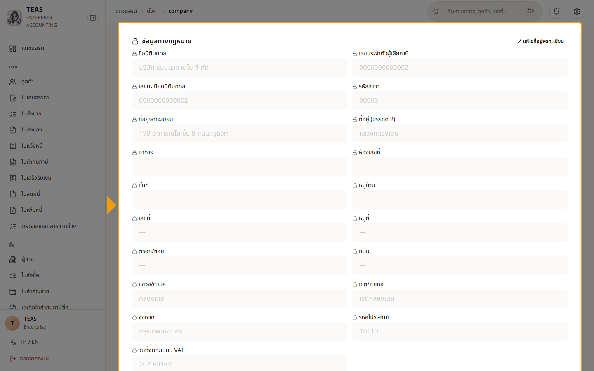
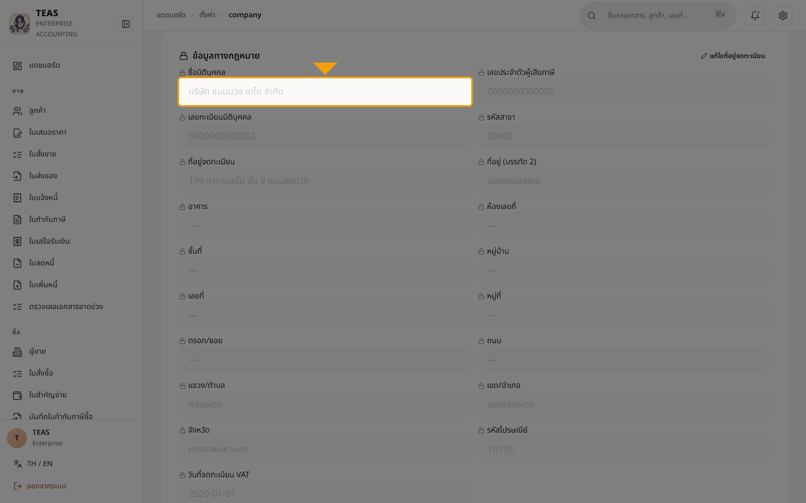
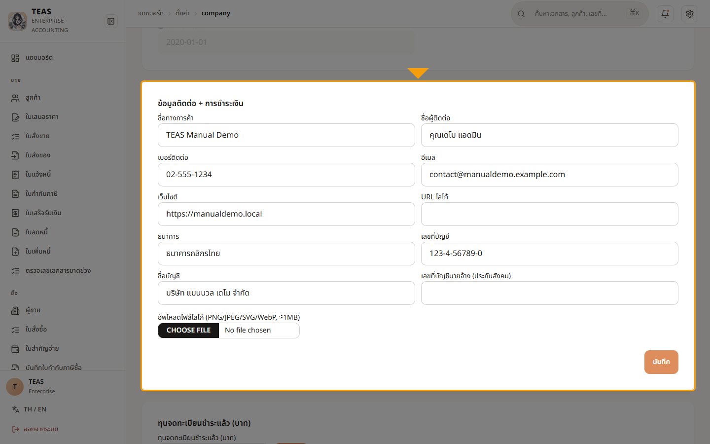
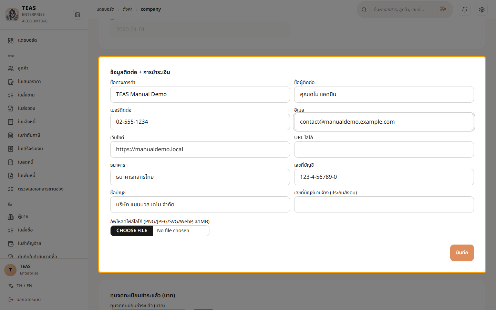
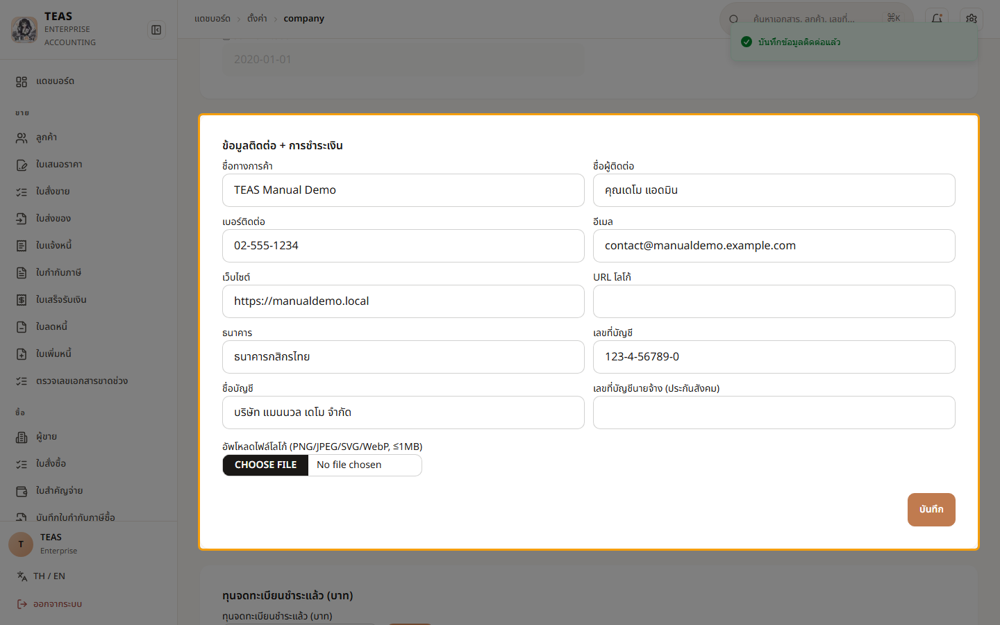
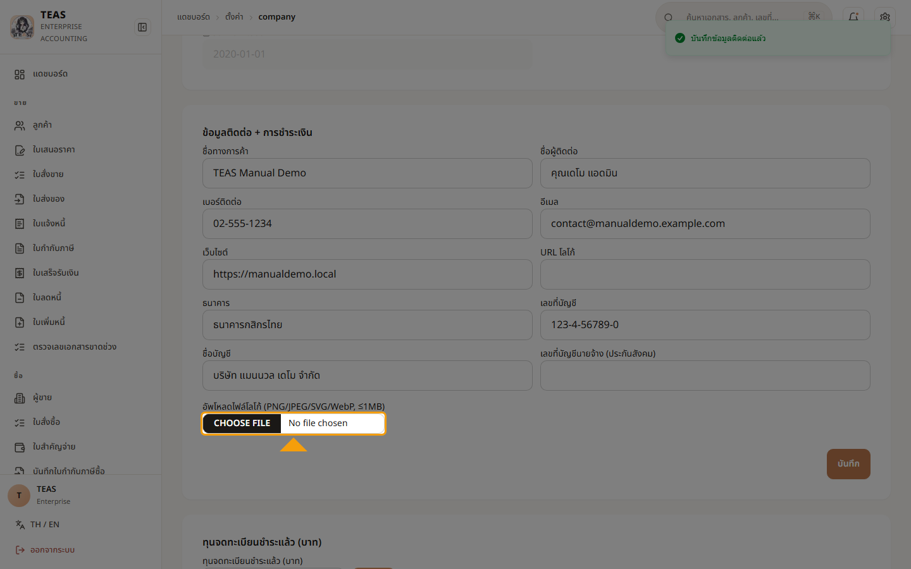
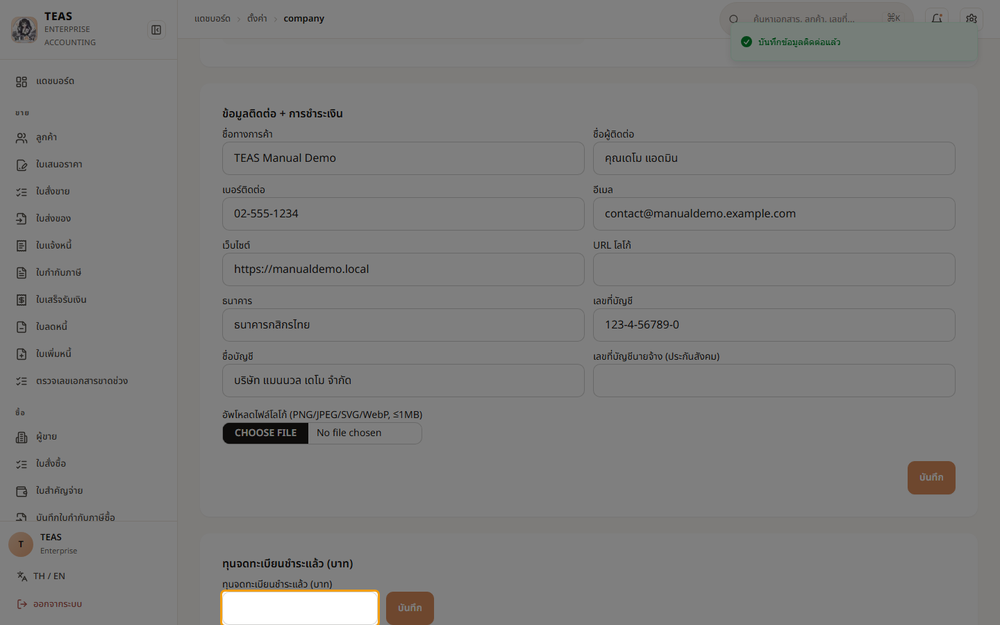

## 02.05 — ตั้งค่าข้อมูลบริษัท (Company Profile — ทำก่อนเป็นอันแรก)

> **เงื่อนไขก่อนใช้งาน:** login ในฐานะ ADMIN (demo-admin) สำหรับ edit · manual-demo seed (รัน 410_seed_manual_demo_company_profile.sql)

ข้อมูลบริษัทถูก embed ในทุกเอกสารทางภาษี (Tax Invoice / Receipt / CN / DN
header). ตามกฎหมาย ข้อมูลที่พิมพ์ในเอกสารต้องตรงกับ ภ.พ.20 ที่จดทะเบียน
VAT กับกรมสรรพากร.

**Hybrid lock model** (plan §6.7):

**Hard fields (อ่านอย่างเดียวใน Phase 1):**
- ชื่อนิติบุคคล, เลขผู้เสียภาษี, เลขทะเบียนนิติบุคคล, รหัสสาขา
- ที่อยู่จดทะเบียน (line 1+2, แขวง, เขต, จังหวัด, ไปรษณีย์)
- วันที่จดทะเบียน VAT

→ ต้องแก้ผ่าน ops + ยื่น ภ.พ.09 ก่อน. Phase 2 จะมี 2-person approval +
attachment upload ของ ภ.พ.09.

**Soft fields (admin role แก้ได้):**
- ชื่อทางการค้า (Brand name), โลโก้, เบอร์, อีเมล, เว็บไซต์, ผู้ติดต่อ
- Banking info (สำหรับ payment instructions)

**สำคัญ**: ทำ walkthrough นี้ **ก่อน** walkthrough อื่นใน chapter 2 หาก
เพิ่งตั้ง tenant ใหม่ — เพราะข้อมูลถูก embed ในเอกสารที่ออกหลังจากนั้น.

**Role**:
- Read: ทุก authenticated user (ใช้ render document headers)
- Update soft: ADMIN only (master.company.manage scope)
- Update hard: returns 501 — Phase 2 feature

### ขั้นที่ 1

<figure markdown="span">
  
  <figcaption>หน้า "ข้อมูลบริษัท" (sidebar "ตั้งค่า" → ลิงก์แรก). 2 sections: "ข้อมูลทางกฎหมาย" (hard, locked) + "ข้อมูลติดต่อ + การชำระเงิน" (soft, editable). Banner ⚠️ ส้มด้านบนเตือนเรื่อง ภ.พ.09</figcaption>
</figure>

### ขั้นที่ 2

<figure markdown="span">
  
  <figcaption>Banner ⚠️ — "การเปลี่ยนข้อมูลทางกฎหมายของบริษัทควรอัปเดต ภ.พ.20 ที่กรมสรรพากรก่อน (ยื่น ภ.พ.09)". ผู้ใช้ต้องไปสรรพากรก่อน จึงจะมาแก้ในระบบ</figcaption>
</figure>

### ขั้นที่ 3

<figure markdown="span">
  
  <figcaption>Section "ข้อมูลทางกฎหมาย" 🔒 — 11 fields ทั้งหมด disabled+readOnly. ตัวอย่าง: ชื่อนิติบุคคล "บริษัท แมนนวล เดโม จำกัด", เลขผู้เสียภาษี 0000000000002, ที่อยู่ "199 อาคารเดโม ชั้น 9 ถนนสุขุมวิท", จังหวัดกรุงเทพ, รหัสไปรษณีย์ 10110, วันที่จดทะเบียน VAT 2020-01-01. ไม่มีปุ่ม Save section นี้ (read-only by design)</figcaption>
</figure>

### ขั้นที่ 4

<figure markdown="span">
  
  <figcaption>hover hard field → tooltip: "การเปลี่ยนข้อมูลนี้ต้องผ่านขั้นตอนพิเศษ — ติดต่อผู้ดูแลระบบหรือยื่น ภ.พ.09 ก่อน". อธิบายworkaround ให้ผู้ใช้ทราบทันทีโดยไม่ต้องไปอ่านคู่มือ</figcaption>
</figure>

### ขั้นที่ 5

<figure markdown="span">
  
  <figcaption>Section "ข้อมูลติดต่อ + การชำระเงิน" — fields editable: ชื่อทางการค้า, โลโก้ URL, เบอร์ติดต่อ, อีเมล, เว็บไซต์, ผู้ติดต่อ, Banking (ธนาคาร / เลขที่บัญชี / ชื่อบัญชี). ปุ่ม "บันทึก" สำหรับ section นี้แยกต่างหาก</figcaption>
</figure>

### ขั้นที่ 6

<figure markdown="span">
  
  <figcaption>กรอกตัวอย่าง — ชื่อทางการค้า "TEAS Manual Demo", เบอร์ "02-555-1234", อีเมล "contact@manualdemo.example.com"</figcaption>
</figure>

### ขั้นที่ 7

<figure markdown="span">
  
  <figcaption>กด "บันทึก" → PUT /api/proxy/company-profile/soft → 204 → toast เขียว → fields ใหม่ persistent. Hard fields ไม่กระทบ (ดู section "ข้อมูลทางกฎหมาย" ด้านบน — ค่าเดิม)</figcaption>
</figure>

### ขั้นที่ 8

<figure markdown="span">
  
  <figcaption>"โลโก้บริษัท" — อัปโหลดไฟล์ภาพได้โดยตรง (PNG / JPEG / SVG / WebP, ไม่เกิน 1 MB). ระบบเก็บเป็น attachment แล้ว embed โลโก้นี้ใน หัวกระดาษ PDF ของทุกใบกำกับภาษี / ใบเสร็จ / CN / DN. มีช่อง "URL โลโก้" และตัวอย่าง (preview) ให้ตรวจก่อนบันทึก</figcaption>
</figure>

### ขั้นที่ 9

<figure markdown="span">
  
  <figcaption>"ทุนจดทะเบียนที่ชำระแล้ว" — ใช้จัดประเภท SME สำหรับภาษีเงินได้ นิติบุคคล (CIT): ทุน ≤ 5 ล้านบาท และรายได้ ≤ 30 ล้านบาท/ปี ได้อัตรา ลดหย่อนแบบขั้นบันได. ค่านี้อยู่บนข้อมูลหลักบริษัท — แก้ได้โดย super-admin</figcaption>
</figure>
