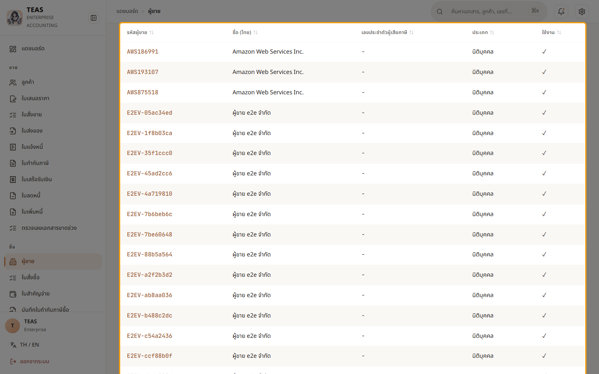
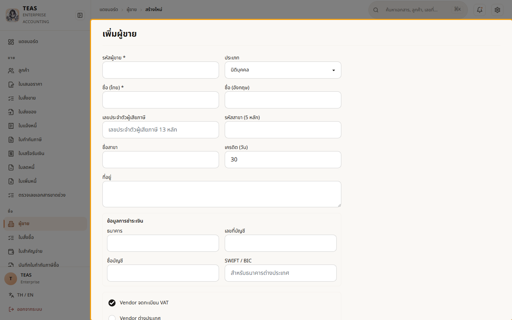
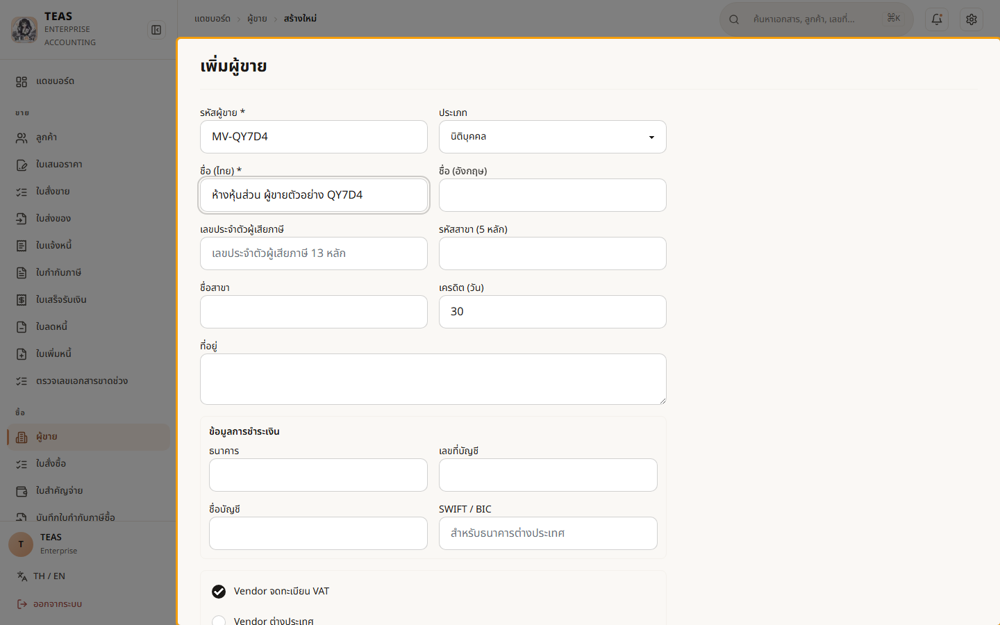

## 03.02 — สร้างผู้ขาย

> **เงื่อนไขก่อนใช้งาน:** login ในฐานะผู้มีสิทธิ์ master.vendor.manage (admin)

ผู้ขาย (Vendor) คือ master data ฝั่งซื้อ — ใช้เป็นคู่ค้าในใบสั่งซื้อ,
ใบกำกับภาษีซื้อ, และใบสำคัญจ่าย. การตั้งค่าผู้ขายให้ถูกต้องสำคัญต่อ
**ภาษีซื้อ (Input VAT)** ที่ขอคืนได้ และ **ภาษีหัก ณ ที่จ่าย (WHT)**.

ฟอร์มรองรับเคสพิเศษที่กระทบภาษีอัตโนมัติ:

- **ผู้ขายจดทะเบียน VAT / ไม่จด** — non-VAT (รายได้ < 1.8 ล้าน หรือบุคคลธรรมดา)
  ออกได้แค่ใบเสร็จ, เคลม Input VAT ไม่ได้, แต่ยังหัก WHT ได้ปกติ
- **ผู้ขายต่างประเทศ** — ถ้ายังไม่จด VAT-D ในไทย ระบบจะ default หัก WHT 15% (ม.70)
  + self-assess VAT 7% (ภ.พ.36) ตอนสร้าง PV/VI ให้อัตโนมัติ

กรอกข้อมูลให้ถูกตั้งแต่สร้าง → ระบบคิดภาษีตอนทำเอกสารซื้อให้ถูกเอง.

### ขั้นที่ 1

<figure markdown="span">
  
  <figcaption>หน้า "ผู้ขาย" — รายการผู้ขายทั้งหมด. ปุ่ม "เพิ่มผู้ขาย" มุมขวาบนเปิดฟอร์มสร้างใหม่</figcaption>
</figure>

### ขั้นที่ 2

<figure markdown="span">
  
  <figcaption>ฟอร์ม "เพิ่มผู้ขาย" — รหัสผู้ขาย*, ประเภท (นิติบุคคล/บุคคลธรรมดา), ชื่อ*, เลขผู้เสียภาษี, รหัสสาขา, เครดิต, ที่อยู่ + ข้อมูลการชำระเงิน (ธนาคาร/เลขบัญชี). มีสวิตช์ "Vendor ต่างประเทศ" / "จด VAT" สำหรับเคสพิเศษ</figcaption>
</figure>

### ขั้นที่ 3

<figure markdown="span">
  
  <figcaption>กรอกรหัส "MV-QY7D4" + ชื่อไทย. เลือกประเภท/สวิตช์ VAT ให้ตรง กับสถานะจริงของผู้ขาย เพราะมีผลต่อการคิด Input VAT + WHT ตอนทำเอกสารซื้อ. กด "บันทึกผู้ขาย" เพื่อเพิ่มเข้า master</figcaption>
</figure>
