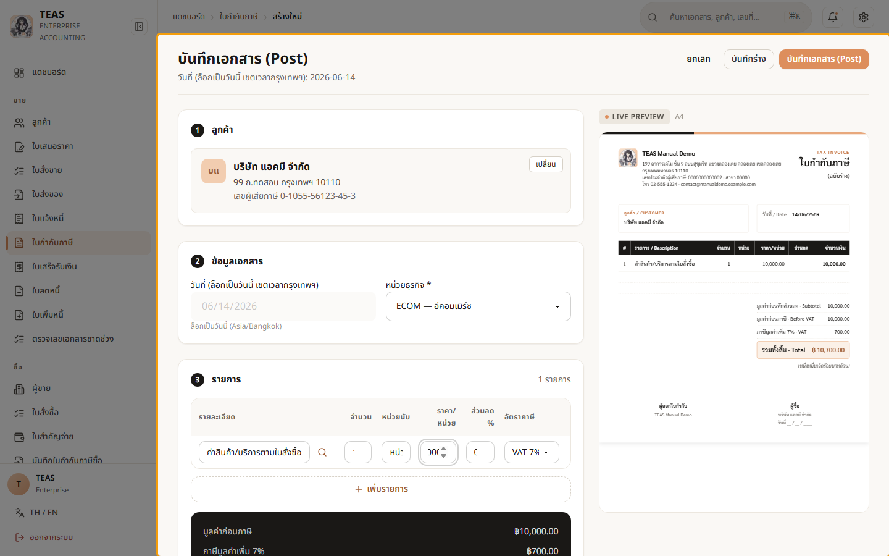
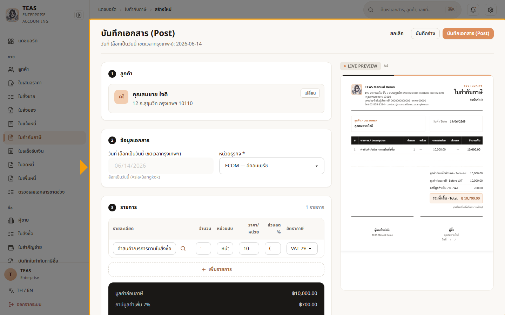

## 04.09 — ลูกค้าจด VAT vs ไม่จด VAT (ม.86/4)

> **เงื่อนไขก่อนใช้งาน:** login admin (สิทธิ์ tax_invoice) · มีลูกค้าทั้งจด VAT และไม่จด VAT ในระบบ

ผู้ขายที่จด VAT ออกใบกำกับภาษีให้ผู้ซื้อได้ "ทุกราย" — แต่กฎ **ม.86/4 #3** กำหนดให้ใส่
**ชื่อ-ที่อยู่-เลขผู้เสียภาษีของผู้ซื้อ "เฉพาะเมื่อผู้ซื้อจด VAT"**:

- **ผู้ซื้อจด VAT** (นิติบุคคล/กิจการจด VAT) → ใบกำกับภาษีต้องมี **เลขผู้เสียภาษี 13 หลัก +
  สาขา** ของผู้ซื้อ (เพื่อให้ผู้ซื้อเอาไปเคลมภาษีซื้อได้).
- **ผู้ซื้อไม่จด VAT** (บุคคลธรรมดา/ผู้บริโภคทั่วไป) → **ไม่ต้องมีเลขผู้เสียภาษีผู้ซื้อ**
  (ใส่แค่ชื่อก็พอ) เพราะผู้ซื้อเคลมภาษีซื้อไม่ได้อยู่แล้ว.

ระบบดึงสถานะ VAT จากข้อมูลหลักลูกค้า (ดู 03.01) มาแสดง/ซ่อนเลขผู้เสียภาษีบนเอกสารให้เอง.

### ขั้นที่ 1

<figure markdown="span">
  
  <figcaption>ผู้ซื้อ "บริษัท แอคมี จำกัด" (จด VAT) → ตัวอย่างใบกำกับภาษีด้านขวาแสดง "เลขผู้เสียภาษี 13 หลัก + สาขา" ของผู้ซื้อ ตาม ม.86/4 #3 (ผู้ซื้อนำไปเคลมภาษีซื้อได้)</figcaption>
</figure>

### ขั้นที่ 2

<figure markdown="span">
  
  <figcaption>เปลี่ยนผู้ซื้อเป็น "คุณสมชาย ใจดี" (บุคคลธรรมดา ไม่จด VAT) → บล็อกผู้ซื้อ บนเอกสารแสดงแค่ "ชื่อ" ไม่มีเลขผู้เสียภาษี (ม.86/4 #3 ไม่บังคับเมื่อผู้ซื้อไม่จด VAT). ยังเป็นใบกำกับภาษีเต็มรูปที่ถูกต้อง — VAT ยังคิด 7% ตามปกติ</figcaption>
</figure>
