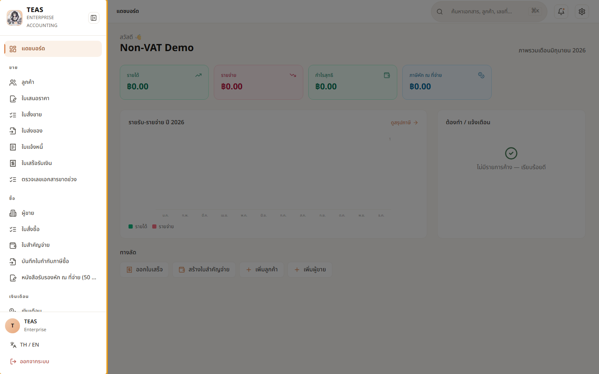
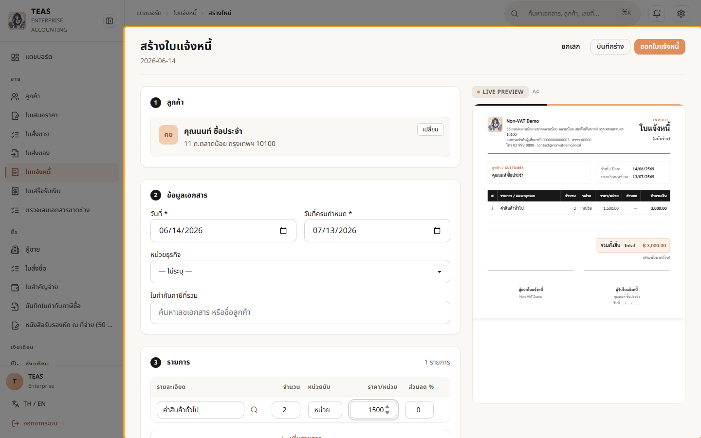

## 04.10 — กิจการไม่จด VAT (non-VAT)

> **เงื่อนไขก่อนใช้งาน:** login เป็นผู้ใช้ของกิจการที่ไม่จด VAT

**สถานะ VAT เป็นข้อมูลของ "บริษัท"** (ตั้งโดยผู้ดูแลระบบสูงสุด ตอนสร้างบริษัท — §4.6,
ดูบทที่ 0). กิจการที่ **ไม่จด VAT** มีระบบที่ต่างจากกิจการ VAT ดังนี้:

| เรื่อง | กิจการจด VAT | กิจการไม่จด VAT |
|---|---|---|
| ภาษีบนเอกสาร | VAT 7% ทุกใบ | **ไม่มี VAT** (ยอดรวม = ยอดก่อนภาษี) |
| ใบกำกับภาษี (ม.86) | ออกได้ | **ออกไม่ได้** — ใช้ใบแจ้งหนี้/ใบเสร็จแทน |
| ใบลดหนี้/เพิ่มหนี้ | มี | ไม่มี (ผูกกับใบกำกับภาษี) |
| เมนูด้านซ้าย | มีครบ | **ซ่อนเมนูที่เกี่ยวกับ VAT** อัตโนมัติ |
| ภ.พ.30 / e-Tax | ต้องยื่น | ไม่เกี่ยวข้อง |

ระบบ **ปรับให้อัตโนมัติ** ตามสถานะบริษัท — ผู้ใช้ไม่ต้องตั้งค่าเอง และไม่มีปุ่มให้สลับ
โหมด VAT ในหน้าผู้ใช้ทั่วไป (กันออกเอกสารผิดประเภท).

### ขั้นที่ 1

<figure markdown="span">
  
  <figcaption>เมนูด้านซ้ายของกิจการไม่จด VAT — สังเกตว่า "ไม่มี" ใบกำกับภาษี / ใบลดหนี้ / ใบเพิ่มหนี้ (เมนูที่เกี่ยวกับ VAT ถูกซ่อนอัตโนมัติ ตาม ม.86). ยังขายของได้ผ่านใบเสนอราคา → ใบส่งของ → ใบแจ้งหนี้ → ใบเสร็จ</figcaption>
</figure>

### ขั้นที่ 2

<figure markdown="span">
  
  <figcaption>ใบแจ้งหนี้ของกิจการไม่จด VAT — ตารางรายการ "ไม่มีคอลัมน์ VAT" และ ตัวอย่างเอกสารด้านขวา ยอดรวม = ยอดก่อนภาษี (2 × 1,500 = 3,000) ไม่มีบรรทัด ภาษีมูลค่าเพิ่ม. เทียบกับกิจการ VAT ที่จะมี VAT 7% เพิ่มทุกใบ</figcaption>
</figure>
