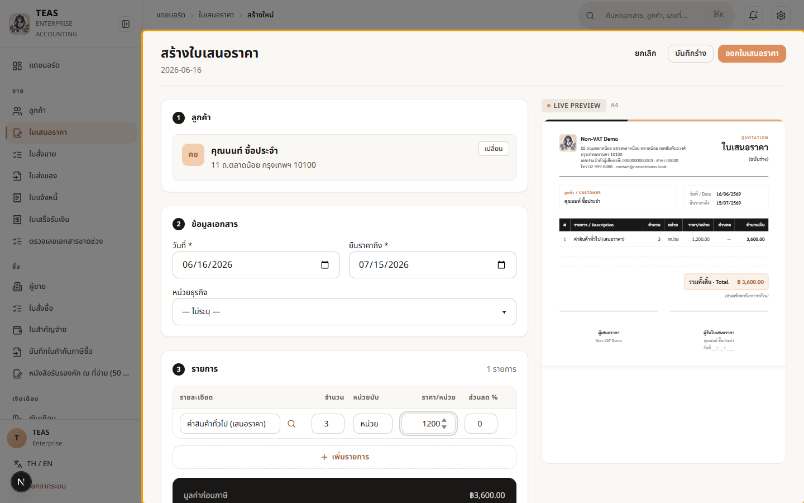
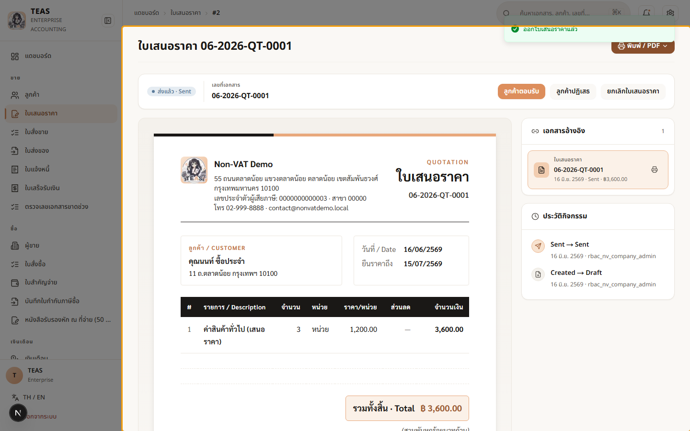
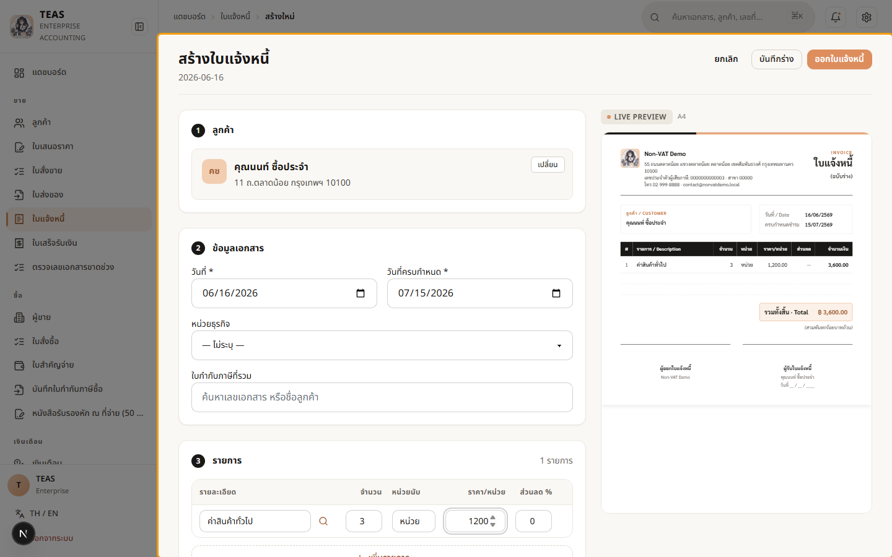
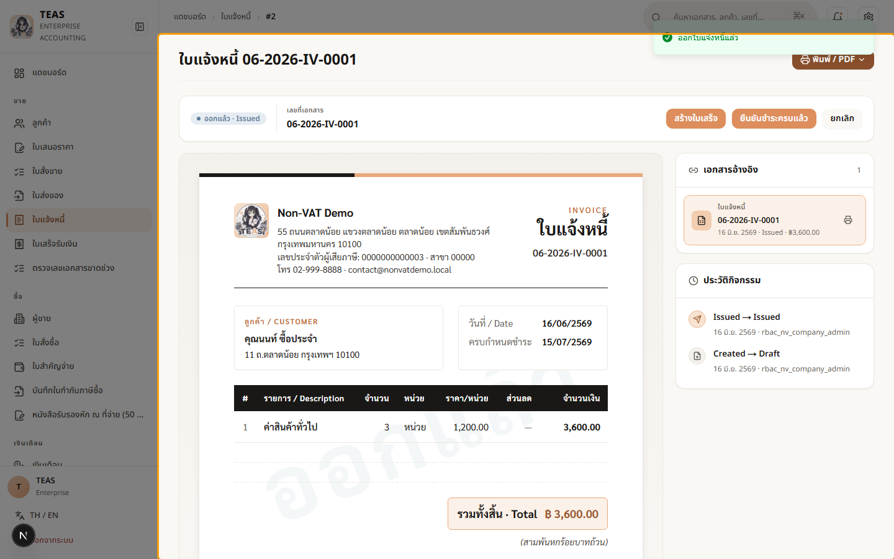
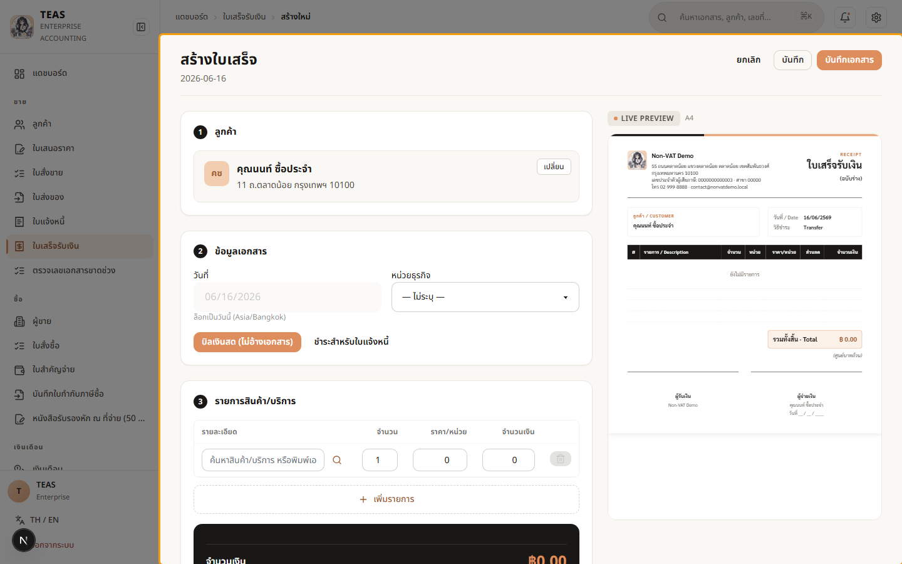

## 04.11 — กิจการไม่จด VAT: วงจรขายครบจบ

> **เงื่อนไขก่อนใช้งาน:** login เป็นผู้ใช้ของกิจการที่ไม่จด VAT (co3) · มีลูกค้า + สินค้าในระบบ

กิจการที่ **ไม่จด VAT** ก็มีวงจรขายครบเหมือนกิจการ VAT — เพียงแต่ **ไม่มีภาษีมูลค่าเพิ่ม**
และ **ออกใบกำกับภาษีไม่ได้** (ม.86). วงจรเอกสารคือ:

1. **ใบเสนอราคา (Quotation)** — เสนอราคาให้ลูกค้า (ยอดเป็นราคาเต็ม ไม่บวก VAT).
2. **ใบแจ้งหนี้ / บิลเงินสด (Billing Note)** — เรียกเก็บเงิน. **ไม่ใช่ "ใบกำกับภาษี"** —
   กิจการไม่จด VAT ออกใบกำกับภาษีไม่ได้ จึงใช้ใบแจ้งหนี้/ใบเสร็จแทน.
3. **ใบเสร็จรับเงิน (Receipt)** — เมื่อรับเงิน. กิจการไม่จด VAT ออกได้แบบ "บิลเงินสด"
   ที่ **ไม่ต้องอ้างใบกำกับภาษี** (เพราะไม่มีใบกำกับภาษีให้อ้าง).

**ทุกเอกสารไม่มีบรรทัด VAT — ยอดรวม = ยอดก่อนภาษีเสมอ** (ราคาที่ตกลง = ราคาที่จ่ายจริง).
ระบบปรับเมนู + เอกสารให้อัตโนมัติตามสถานะ VAT ของบริษัท (per-company, §4.6).

### ขั้นที่ 1

<figure markdown="span">
  
  <figcaption>ใบเสนอราคาของกิจการไม่จด VAT — ตารางรายการ "ไม่มีคอลัมน์ VAT" และกล่องสรุป ยอดรวม = ยอดก่อนภาษี (3 × 1,200 = 3,600) ไม่มีบรรทัดภาษีมูลค่าเพิ่ม</figcaption>
</figure>

### ขั้นที่ 2

<figure markdown="span">
  
  <figcaption>ออกใบเสนอราคาแล้ว → ระบบออกเลขที่เอกสาร. จากหน้านี้แปลงเป็น "ใบแจ้งหนี้" ได้ — แต่ไม่มีปุ่ม "ออกใบกำกับภาษี" (กิจการไม่จด VAT ออกไม่ได้)</figcaption>
</figure>

### ขั้นที่ 3

<figure markdown="span">
  
  <figcaption>ใบแจ้งหนี้ / บิลเงินสด (Billing Note) — เอกสารเรียกเก็บเงินของกิจการ ไม่จด VAT. หัวเอกสารคือ "ใบแจ้งหนี้" ไม่ใช่ "ใบกำกับภาษี" และยอดเรียกเก็บ = ยอดก่อนภาษี 3,600 (ไม่มี VAT 7% เพิ่มเหมือนกิจการ VAT)</figcaption>
</figure>

### ขั้นที่ 4

<figure markdown="span">
  
  <figcaption>ออกใบแจ้งหนี้แล้ว (สถานะ "ออกแล้ว") — เลขที่เอกสารออกตามลำดับ. เมื่อรับเงินจะออก "ใบเสร็จ/บิลเงินสด" อ้างอิงใบแจ้งหนี้นี้ (ดูขั้นถัดไป)</figcaption>
</figure>

### ขั้นที่ 5

<figure markdown="span">
  
  <figcaption>ฟอร์มใบเสร็จของกิจการไม่จด VAT เปิดเป็นโหมด "บิลเงินสด (ไม่อ้างเอกสาร)" อัตโนมัติ — ไม่ต้องอ้างใบกำกับภาษี (เพราะออกใบกำกับภาษีไม่ได้). กรอกรายการ + ยอดรับ แล้ว "บันทึกเอกสาร" เพื่อออกใบเสร็จ. ยอดรับ = ยอดก่อนภาษี ไม่มี VAT</figcaption>
</figure>
