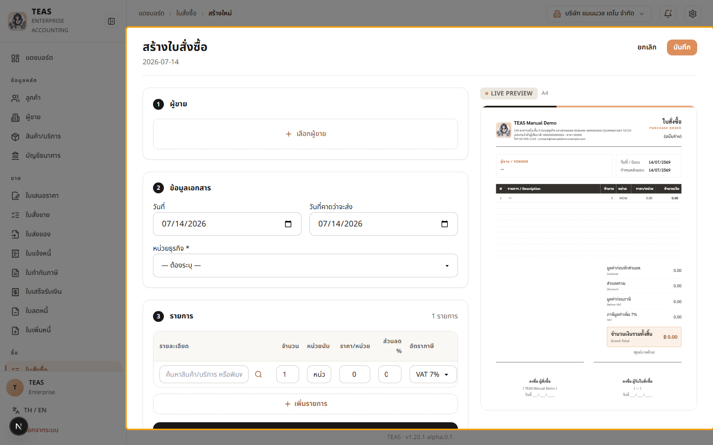
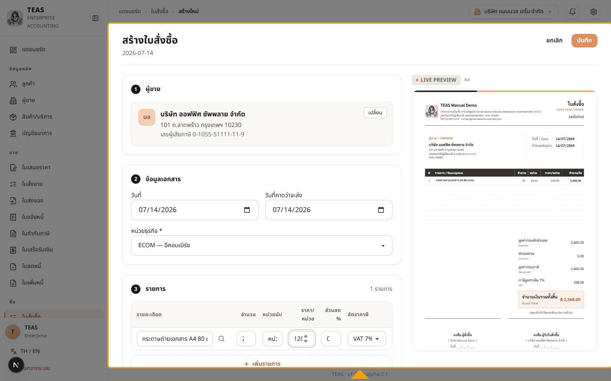
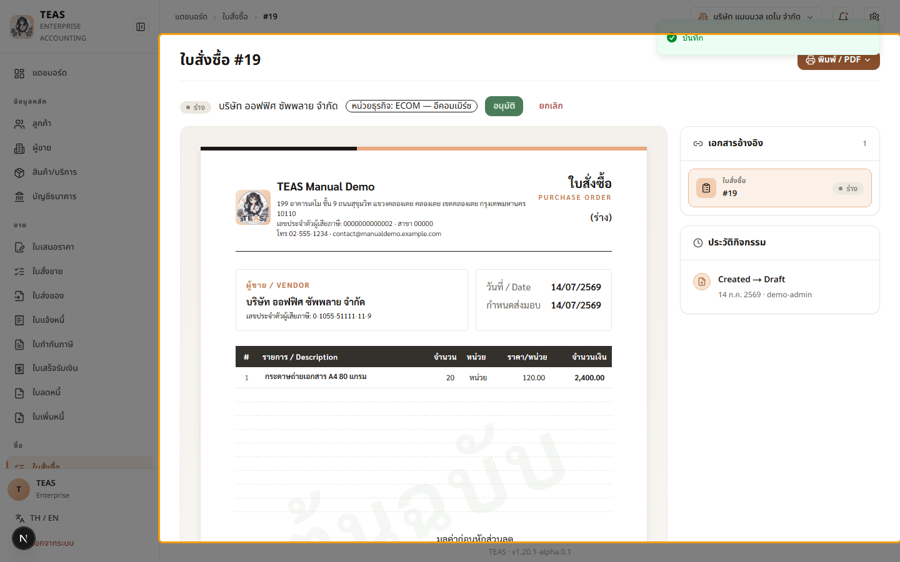
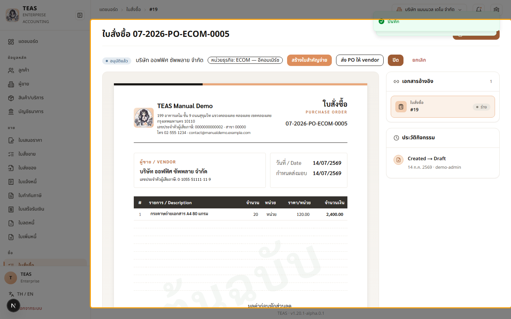

## 05.01 — ออกและอนุมัติใบสั่งซื้อ

> **เงื่อนไขก่อนใช้งาน:** login admin (สิทธิ์ purchase_order create + approve) · มีผู้ขาย + หน่วยธุรกิจ ในระบบ (บทที่ 3)

ใบสั่งซื้อ (Purchase Order / PO) คือเอกสารแรกของงานซื้อ — ใช้สั่งซื้อสินค้า/บริการจาก
ผู้ขาย และเป็นเครื่องมือ **ควบคุมการใช้จ่าย** ภายในกิจการ (อนุมัติก่อนซื้อจริง).

**สายงานซื้อเต็มรูป (document chain):**

ใบสั่งซื้อ → **บันทึกใบกำกับภาษีซื้อ** (รับของ + ภาษีซื้อ) → ใบสำคัญจ่าย (จ่ายเงิน +
หัก ณ ที่จ่าย) → หนังสือรับรองหัก ณ ที่จ่าย (50ทวิ)

**ขั้นตอนอนุมัติ (workflow):** ใบสั่งซื้อสร้างเป็น "ฉบับร่าง" ก่อน แล้วต้อง **อนุมัติ** จึงจะ
ใช้งานต่อได้ — และระบบจะออก **เลขที่เอกสารตอนอนุมัติ** เท่านั้น รูปแบบ
"MM-YYYY-PO-หน่วยธุรกิจ-NNNN" (เช่น "07-2026-PO-ECOM-0001"). ระบบนี้รองรับ
กิจการขนาดเล็กที่มีผู้ใช้คนเดียว (ผู้สร้างอนุมัติเองได้) แต่กิจการใหญ่สามารถแยกผู้สร้าง/
ผู้อนุมัติตามสิทธิ์ได้ (Segregation of Duties).

**หมายเหตุ VAT บนใบสั่งซื้อ:** ยอดรวมจะมีแถว "ภาษีมูลค่าเพิ่ม 7%" ก็ต่อเมื่อ **ทั้งกิจการ
และผู้ขายจดทะเบียน VAT ทั้งคู่** — ถ้ากิจการตั้งค่าไม่จด VAT หรือผู้ขายไม่จด VAT แถวนี้จะ
ไม่ปรากฏ (ยอดรวมเป็นยอดก่อนภาษีตรงๆ).

### ขั้นที่ 1

<figure markdown="span">
  
  <figcaption>ฟอร์ม "สร้างใบสั่งซื้อ" — ส่วน ① ผู้ขาย, ② ข้อมูลเอกสาร (วันที่ + วันที่คาดว่าจะส่ง), ③ รายการ. ตัวอย่างเอกสารด้านขวาออกในนามบริษัทเรา ส่งถึงผู้ขาย</figcaption>
</figure>

### ขั้นที่ 2

<figure markdown="span">
  
  <figcaption>เลือกผู้ขาย "บริษัท ออฟฟิศ ซัพพลาย จำกัด" (ในประเทศ จด VAT) + หน่วย ธุรกิจ + กรอกรายการ (20 × 120). ระบบคำนวณยอดก่อนภาษี 2,400 + VAT 7% ให้อัตโนมัติ</figcaption>
</figure>

### ขั้นที่ 3

<figure markdown="span">
  
  <figcaption>บันทึกแล้ว → ใบสั่งซื้อสถานะ "ฉบับร่าง" ยัง "ไม่มีเลขที่เอกสาร" (แสดง #id ชั่วคราว). มุมขวามีปุ่ม "อนุมัติ" — กิจการตรวจสอบก่อนอนุมัติเพื่อควบคุมการใช้จ่าย</figcaption>
</figure>

### ขั้นที่ 4

<figure markdown="span">
  
  <figcaption>กด "อนุมัติ" → ระบบออกเลขที่เอกสาร (MM-YYYY-PO-หน่วยธุรกิจ-NNNN) และเปลี่ยน สถานะเป็น "อนุมัติแล้ว". แถบปุ่มเปลี่ยนเป็น "สร้างใบสำคัญจ่าย" · "ส่ง PO ให้ vendor" (แค่ประทับวันที่ส่ง ไม่ได้ส่งอีเมลจริง) · "ปิด" · "ยกเลิก" — ขั้นถัดไปคือบันทึกใบกำกับ ภาษีซื้อ (05.02) เมื่อได้รับของ/ใบกำกับภาษีจากผู้ขาย</figcaption>
</figure>
