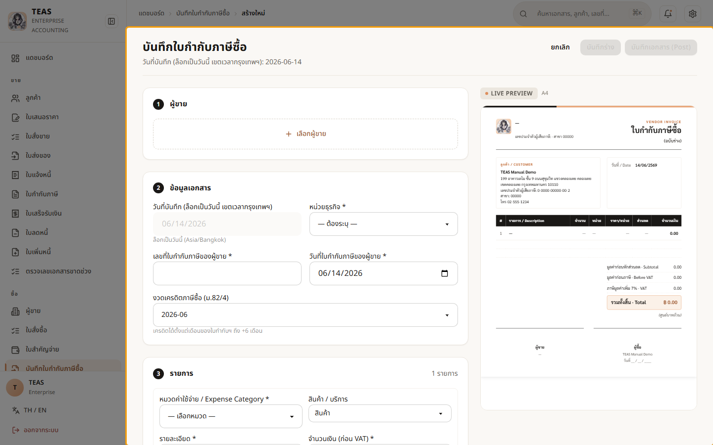
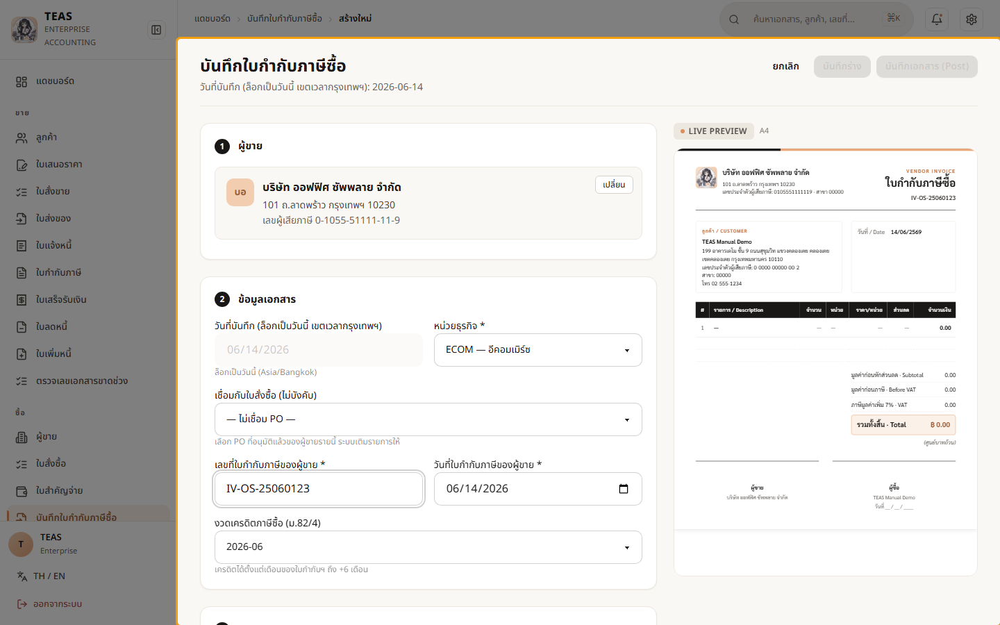
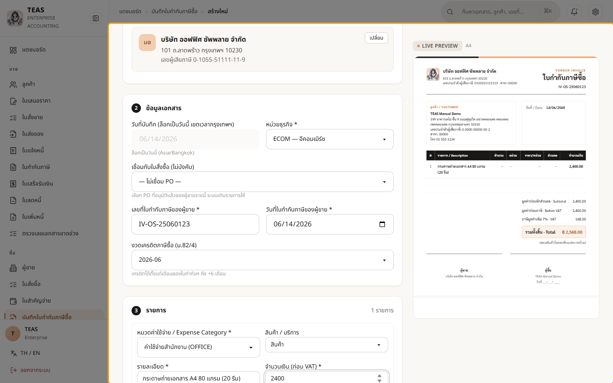
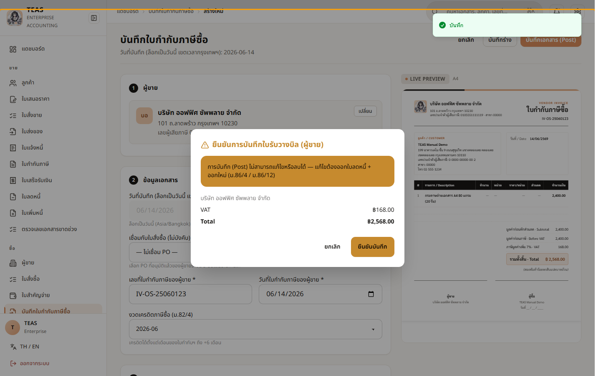
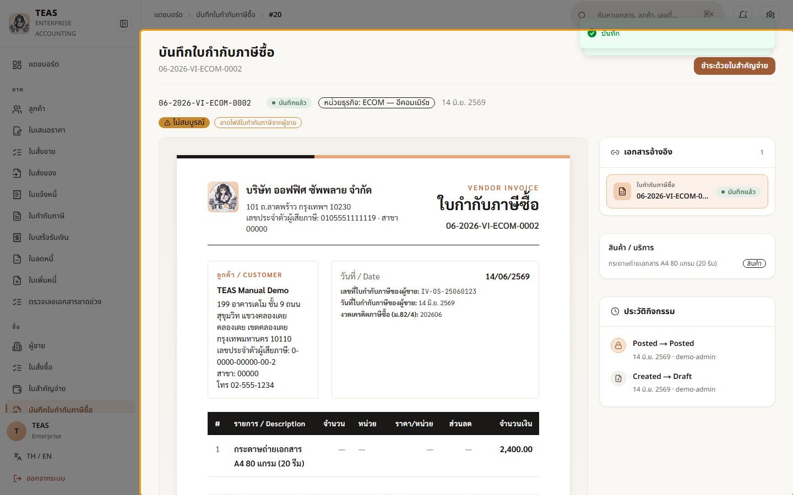

## 05.02 — บันทึกใบกำกับภาษีซื้อ

> **เงื่อนไขก่อนใช้งาน:** login admin (สิทธิ์ vendor_invoice create + post) · ได้รับใบกำกับภาษีจากผู้ขายจริง (เลขที่/วันที่)

ใบกำกับภาษีซื้อ (Vendor Invoice) คือการ **บันทึกใบกำกับภาษีที่ได้รับจากผู้ขาย** เข้าระบบ
เพื่อขอเครดิต **ภาษีซื้อ (Input VAT)** ไปหักกับภาษีขายในแบบ ภ.พ.30.

**สิ่งที่ต้องระบุ:**

- **เลขที่ + วันที่ใบกำกับภาษีของผู้ขาย** — เลขเอกสารต้นฉบับจากผู้ขาย (ไม่ใช่เลขของเรา).
- **งวดเครดิตภาษีซื้อ (ม.82/4)** — ภาษีซื้อใช้เครดิตได้ตั้งแต่เดือนของใบกำกับฯ ถึง +6 เดือน.
- **หมวดค่าใช้จ่าย** — กำหนดว่าภาษีซื้อ "เครดิตได้" หรือเป็น **"ภาษีซื้อต้องห้าม"**
  (เช่น ค่ารับรอง — เครดิตไม่ได้ตามกฎหมาย).

ถ้าเคยออกใบสั่งซื้อให้ผู้ขายรายนี้ (05.01) ระบบมีตัวเลือก "เชื่อมกับใบสั่งซื้อ" เพื่อดึง
รายการมาให้ — ที่นี่แสดงการบันทึกแบบกรอกเอง.

### ขั้นที่ 1

<figure markdown="span">
  
  <figcaption>ฟอร์ม "บันทึกใบกำกับภาษีซื้อ" — ① ผู้ขาย, ② ข้อมูลเอกสาร (เลขที่/วันที่ ใบกำกับฯ ของผู้ขาย + งวดเครดิต ม.82/4), ③ รายการพร้อมหมวดค่าใช้จ่าย</figcaption>
</figure>

### ขั้นที่ 2

<figure markdown="span">
  
  <figcaption>เลือกผู้ขาย + กรอก "เลขที่ใบกำกับภาษีของผู้ขาย" (เลขต้นฉบับจากผู้ขาย). "งวดเครดิตภาษีซื้อ (ม.82/4)" ตั้งค่าเริ่มต้นเป็นเดือนของใบกำกับฯ — เลือกได้ถึง +6 เดือน</figcaption>
</figure>

### ขั้นที่ 3

<figure markdown="span">
  
  <figcaption>เลือก "หมวดค่าใช้จ่าย" + กรอกรายละเอียด + จำนวนเงินก่อน VAT 2,400. กล่องสรุปแยก "ภาษีซื้อ (เครดิตได้)" 168 ออกจาก "ภาษีซื้อต้องห้าม" ตามหมวดที่เลือก</figcaption>
</figure>

### ขั้นที่ 4

<figure markdown="span">
  
  <figcaption>กด "บันทึกเอกสาร (Post)" → กล่องยืนยันสรุปยอดและภาษีซื้อ. การโพสต์ บันทึกภาษีซื้อเข้าระบบ ภ.พ.30 ของงวดที่เลือก</figcaption>
</figure>

### ขั้นที่ 5

<figure markdown="span">
  
  <figcaption>บันทึกใบกำกับภาษีซื้อเรียบร้อย — ภาษีซื้อถูกบันทึกเข้าระบบเพื่อใช้เครดิต ในแบบ ภ.พ.30. ขั้นถัดไปคือจ่ายเงินผู้ขายด้วย "ใบสำคัญจ่าย" (05.03)</figcaption>
</figure>
