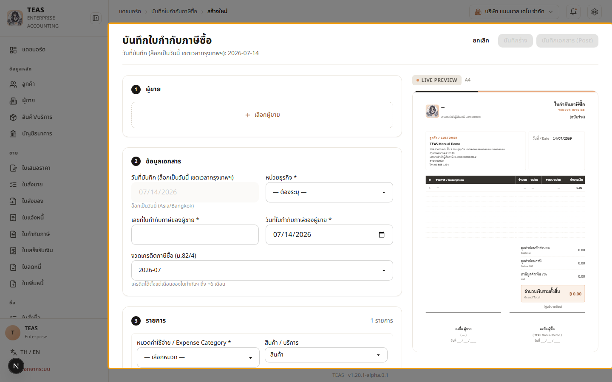
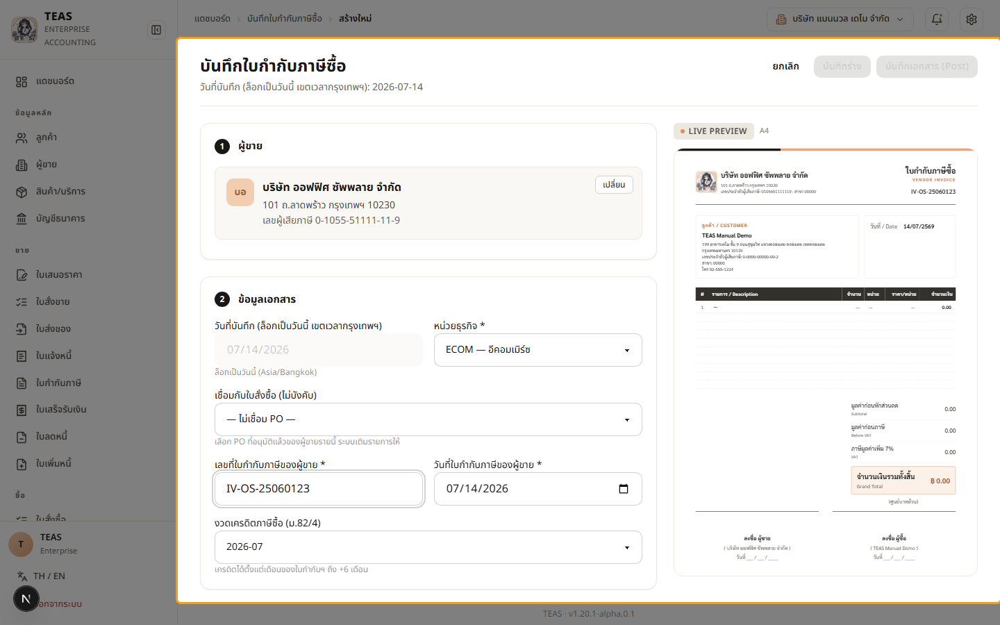
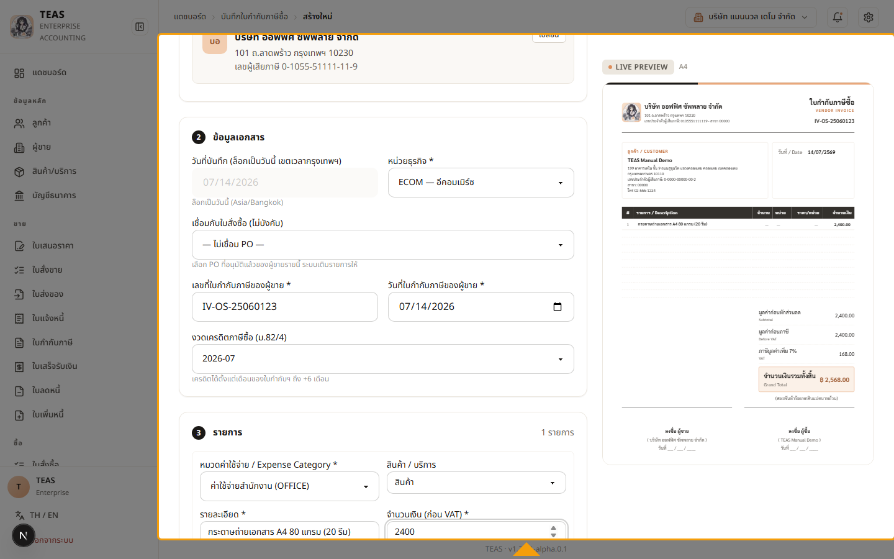
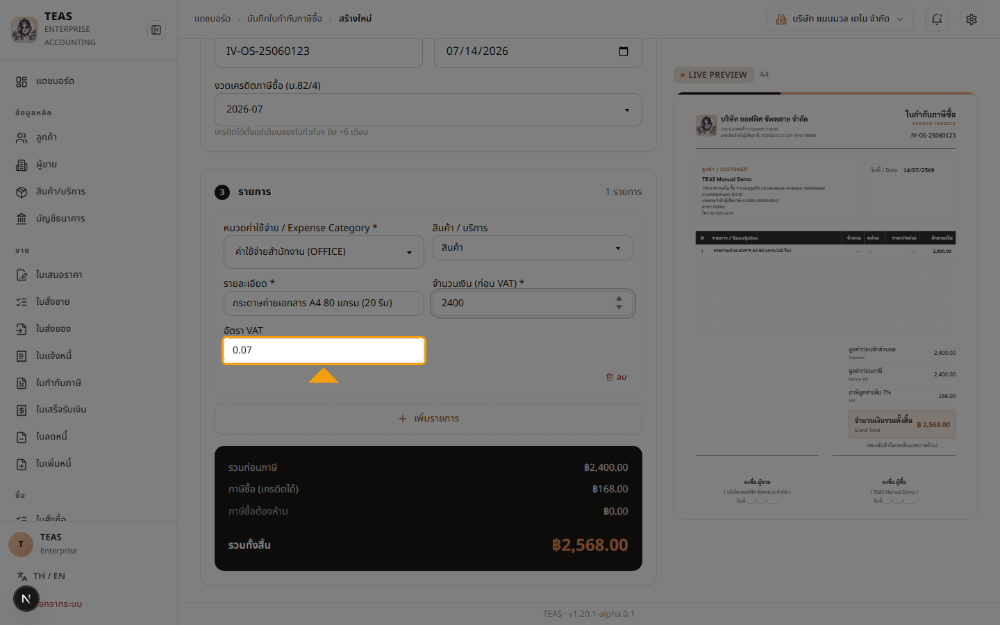
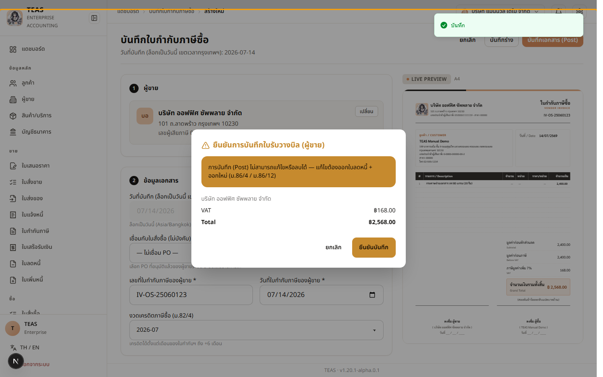
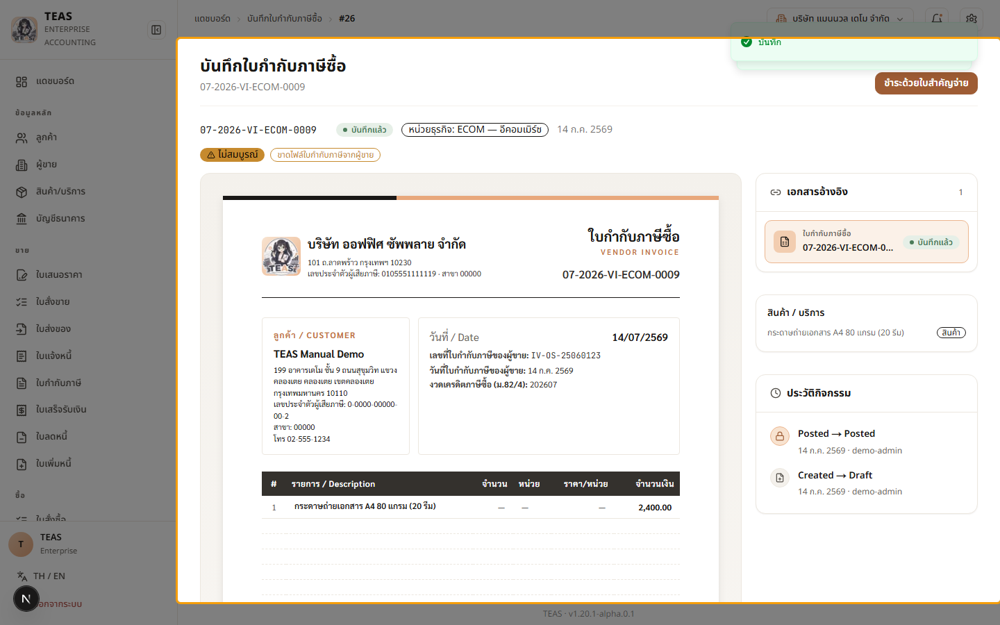
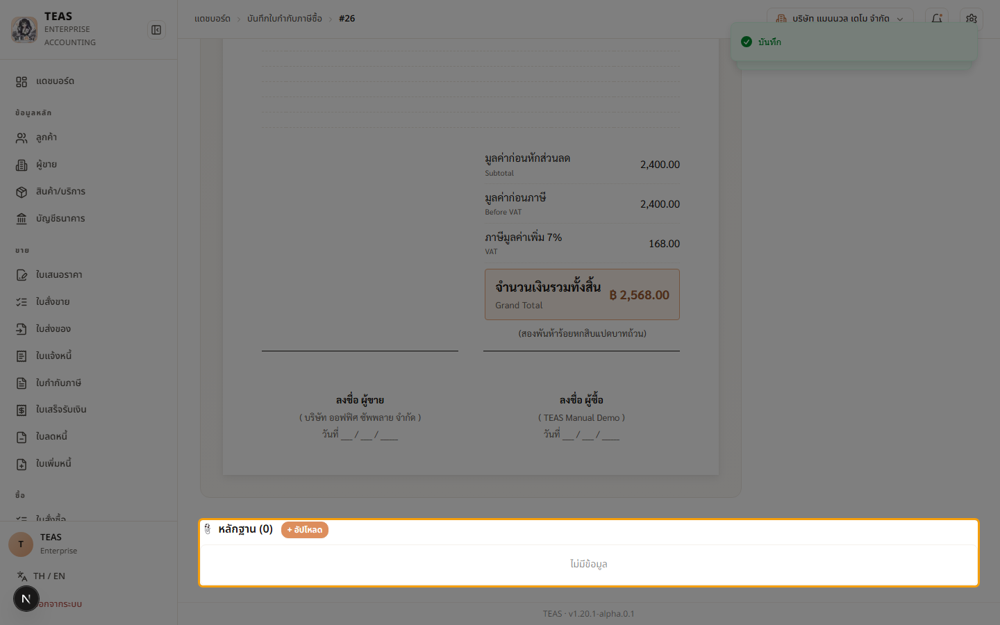

## 05.02 — บันทึกใบกำกับภาษีซื้อ

> **เงื่อนไขก่อนใช้งาน:** login admin (สิทธิ์ vendor_invoice create + post) · ได้รับใบกำกับภาษีจากผู้ขายจริง (เลขที่/วันที่)

ใบกำกับภาษีซื้อ (Vendor Invoice) คือการ **บันทึกใบกำกับภาษีที่ได้รับจากผู้ขาย** เข้าระบบ
เพื่อขอเครดิต **ภาษีซื้อ (Input VAT)** ไปหักกับภาษีขายในแบบ ภ.พ.30.

**สิ่งที่ต้องระบุ:**

- **เลขที่ + วันที่ใบกำกับภาษีของผู้ขาย** — เลขเอกสารต้นฉบับจากผู้ขาย (ไม่ใช่เลขของเรา).
- **งวดเครดิตภาษีซื้อ (ม.82/4)** — ภาษีซื้อใช้เครดิตได้ตั้งแต่เดือนของใบกำกับฯ ถึง +6 เดือน.
- **หมวดค่าใช้จ่าย** — กำหนดว่าภาษีซื้อ "เครดิตได้" หรือเป็น **"ภาษีซื้อต้องห้าม"**
  (เช่น ค่ารับรอง — เครดิตไม่ได้ตามกฎหมาย).

ถ้าเคยออกใบสั่งซื้อให้ผู้ขายรายนี้ (05.01) ระบบมีตัวเลือก "เชื่อมกับใบสั่งซื้อ (ไม่บังคับ)"
เพื่อดึงรายการมาให้ (ดูขั้นที่ 8 ท้ายบทนี้) — ส่วนหลักของบทนี้แสดงการบันทึกแบบกรอกเอง.

> ⚠️ **คำเตือน — ช่อง "อัตรา VAT" รับค่าเป็นเศษส่วน ไม่ใช่เปอร์เซ็นต์**: พิมพ์ "0.07"
> สำหรับ VAT 7% — ถ้าพิมพ์ "7" เฉยๆ ระบบจะตีความเป็น 700% ทันทีโดยไม่มีคำเตือน/ตรวจสอบ
> ค่า (0–1). รายการที่ดึงมาจาก PO ("เชื่อมกับใบสั่งซื้อ") อาจตั้งอัตรานี้มาให้ไม่ตรง —
> ตรวจสอบทุกครั้งก่อนบันทึก.

หลัง Post แล้ว ถ้ายังไม่แนบไฟล์ใบกำกับภาษีจากผู้ขาย เอกสารจะขึ้นสถานะ "ไม่สมบูรณ์"
(หลักฐานตรวจสรรพากร ม.86/4, ม.82/4) — ดูขั้นที่ 7 การแนบไฟล์.

### ขั้นที่ 1

<figure markdown="span">
  
  <figcaption>ฟอร์ม "บันทึกใบกำกับภาษีซื้อ" — ① ผู้ขาย, ② ข้อมูลเอกสาร (เลขที่/วันที่ ใบกำกับฯ ของผู้ขาย + งวดเครดิต ม.82/4), ③ รายการพร้อมหมวดค่าใช้จ่าย</figcaption>
</figure>

### ขั้นที่ 2

<figure markdown="span">
  
  <figcaption>เลือกผู้ขาย + กรอก "เลขที่ใบกำกับภาษีของผู้ขาย" (เลขต้นฉบับจากผู้ขาย). "งวดเครดิตภาษีซื้อ (ม.82/4)" ตั้งค่าเริ่มต้นเป็นเดือนของใบกำกับฯ — เลือกได้ถึง +6 เดือน</figcaption>
</figure>

### ขั้นที่ 3

<figure markdown="span">
  
  <figcaption>เลือก "หมวดค่าใช้จ่าย" + กรอกรายละเอียด + จำนวนเงินก่อน VAT 2,400. กล่องสรุปแยก "ภาษีซื้อ (เครดิตได้)" 168 ออกจาก "ภาษีซื้อต้องห้าม" ตามหมวดที่เลือก</figcaption>
</figure>

### ขั้นที่ 4

<figure markdown="span">
  
  <figcaption>ช่อง "อัตรา VAT" ปัจจุบันแสดง 0.07 — ช่องนี้รับค่าเป็น "เศษส่วน" (0.07 = 7%) ไม่ใช่เปอร์เซ็นต์ และไม่ตรวจสอบค่าเกินจริง. พิมพ์ "7" เฉยๆ จะกลายเป็น VAT 700% ทันทีโดยไม่มีคำเตือน — ตรวจสอบค่านี้ทุกครั้งก่อนบันทึก</figcaption>
</figure>

### ขั้นที่ 5

<figure markdown="span">
  
  <figcaption>กด "บันทึกเอกสาร (Post)" → กล่องยืนยันเตือนว่า "การบันทึก (Post) ไม่สามารถแก้ไขหรือลบได้ — แก้ไขต้องออกใบลดหนี้ + ออกใหม่ (ม.86/4 / ม.86/12)" พร้อมสรุปยอด VAT/รวม. การโพสต์บันทึกภาษีซื้อเข้าระบบ ภ.พ.30 ของงวดที่เลือก</figcaption>
</figure>

### ขั้นที่ 6

<figure markdown="span">
  
  <figcaption>บันทึกใบกำกับภาษีซื้อเรียบร้อย — ภาษีซื้อถูกบันทึกเข้าระบบเพื่อใช้เครดิต ในแบบ ภ.พ.30. เอกสารขึ้นป้าย "ไม่สมบูรณ์ / ขาดไฟล์ใบกำกับภาษีจากผู้ขาย" จนกว่าจะ แนบไฟล์ (ขั้นที่ 7). มุมขวามีปุ่ม "ชำระด้วยใบสำคัญจ่าย" ไปสร้างใบสำคัญจ่าย (05.03)</figcaption>
</figure>

### ขั้นที่ 7

<figure markdown="span">
  
  <figcaption>เลื่อนลงมาที่ส่วน "หลักฐาน" ท้ายเอกสาร แล้วกด "อัปโหลด" — แนบไฟล์ใบกำกับภาษี ตัวจริงที่ผู้ขายออกให้ (หลักฐานตรวจสรรพากร ม.86/4, ม.82/4) เพื่อให้เอกสารพ้นสถานะ "ไม่สมบูรณ์"</figcaption>
</figure>

### ขั้นที่ 8

<figure markdown="span">
  
  <figcaption>(ขั้นทางเลือก) เลือก "เชื่อมกับใบสั่งซื้อ (ไม่บังคับ)" → ระบบดึงรายการจาก PO ที่อนุมัติแล้วมาให้อัตโนมัติ (ยังต้องเลือก "หมวดค่าใช้จ่าย" เอง). อัตรา VAT ที่ ดึงมาคือ 0.07 — ตรวจสอบค่านี้เสมอก่อนบันทึก (ดูคำเตือนขั้นก่อนหน้า)</figcaption>
</figure>
