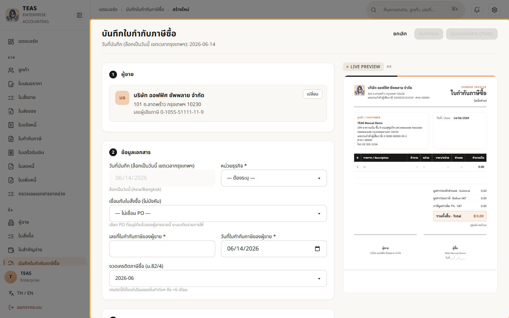
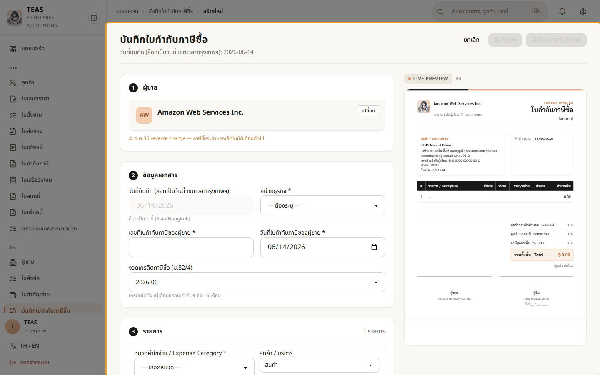

## 05.05 — ผู้ขาย จด VAT / ไม่จด VAT / ต่างประเทศ

> **เงื่อนไขก่อนใช้งาน:** login admin (สิทธิ์ vendor_invoice) · มีผู้ขายหลายชนิด (VAT/ไม่จด VAT/ต่างประเทศ) ในระบบ

"ภาษีซื้อ (Input VAT)" ที่เคลมคืนได้ มีก็ต่อเมื่อ **ผู้ขายจด VAT** และออกใบกำกับภาษีให้.
ระบบดูสถานะผู้ขายแล้วแสดงข้อความกำกับให้อัตโนมัติ — แบ่งผู้ขายเป็น 4 แบบ:

| ผู้ขาย | ภาษีซื้อ | หมายเหตุระบบ |
|---|---|---|
| **ในประเทศ จด VAT** | เคลมได้ปกติ | (ไม่มีข้อความ — กรณีปกติ) |
| **ในประเทศ ไม่จด VAT** | **เคลมไม่ได้** | VAT รวมเป็นค่าใช้จ่าย |
| **ต่างประเทศ ไม่มี VAT-D ไทย** | คำนวณเอง | **ภ.พ.36 reverse charge** (นำส่งแทน) |
| **ต่างประเทศ มี VAT-D ไทย** | เคลมได้ปกติ | จดทะเบียน VAT-D ในไทยแล้ว |

(สถานะ VAT/ต่างประเทศ/VAT-D ตั้งที่ข้อมูลหลักผู้ขาย — ดู 03.02.)

### ขั้นที่ 1

<figure markdown="span">
  
  <figcaption>ผู้ขาย "บริษัท ออฟฟิศ ซัพพลาย จำกัด" (ในประเทศ จด VAT) — กรณีปกติ ไม่มีข้อความเตือน, เคลมภาษีซื้อได้ตามใบกำกับภาษีที่ผู้ขายออกให้</figcaption>
</figure>

### ขั้นที่ 2

<figure markdown="span">
  
  <figcaption>เปลี่ยนเป็น "ร้านโชห่วยตัวอย่าง" (ไม่จด VAT) → ระบบเตือน "เคลม Input VAT ไม่ได้ (VAT รวมเป็นค่าใช้จ่าย)" เพราะผู้ขายไม่จด VAT จึงออกใบกำกับภาษีไม่ได้</figcaption>
</figure>

### ขั้นที่ 3

<figure markdown="span">
  
  <figcaption>เปลี่ยนเป็น "Amazon Web Services" (ต่างประเทศ ไม่มี VAT-D ไทย) → ระบบเตือน "ภ.พ.36 reverse charge" — ผู้จ่ายในไทยต้องนำส่ง VAT แทน แล้วเคลมภาษีซื้อเดือนถัดไป</figcaption>
</figure>

### ขั้นที่ 4

<figure markdown="span">
  
  <figcaption>เปลี่ยนเป็น "Netflix" (ต่างประเทศ แต่จด VAT-D ในไทย) → ระบบแจ้ง "เคลม Input VAT ปกติ" เพราะจดทะเบียน VAT-D ในไทยแล้ว จึงปฏิบัติเหมือนผู้ขายในประเทศจด VAT</figcaption>
</figure>
