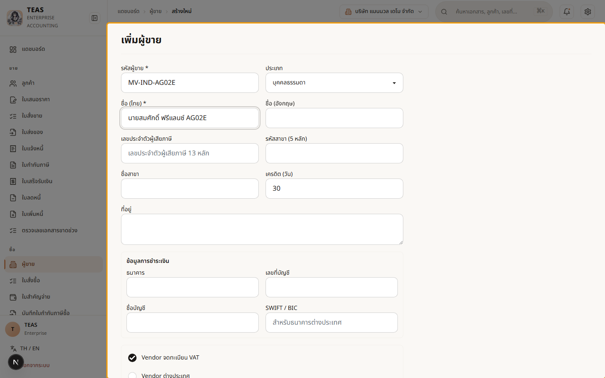
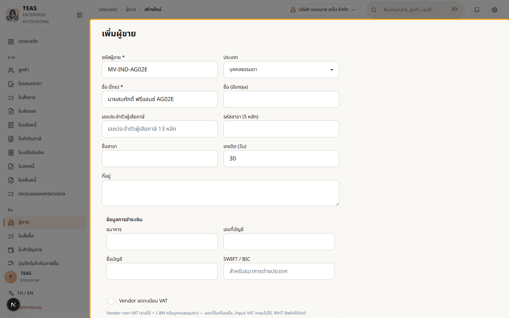
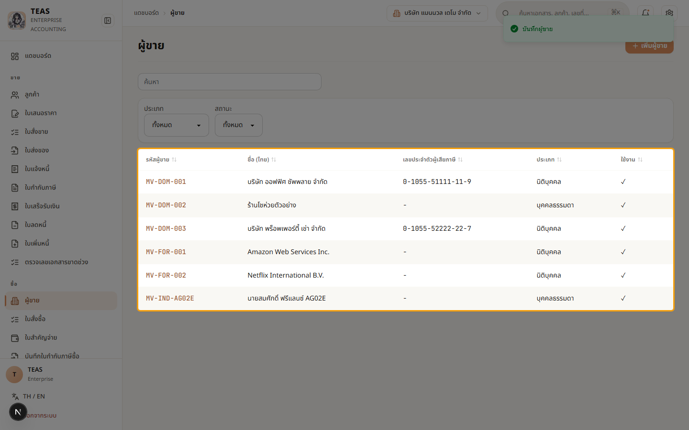
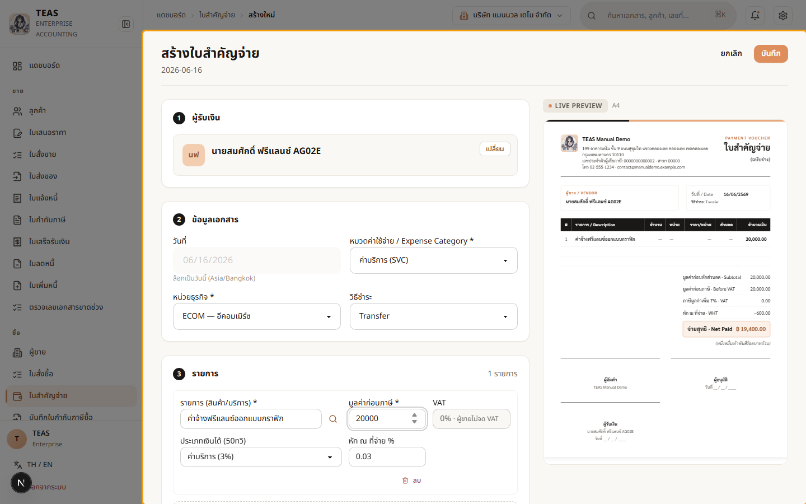
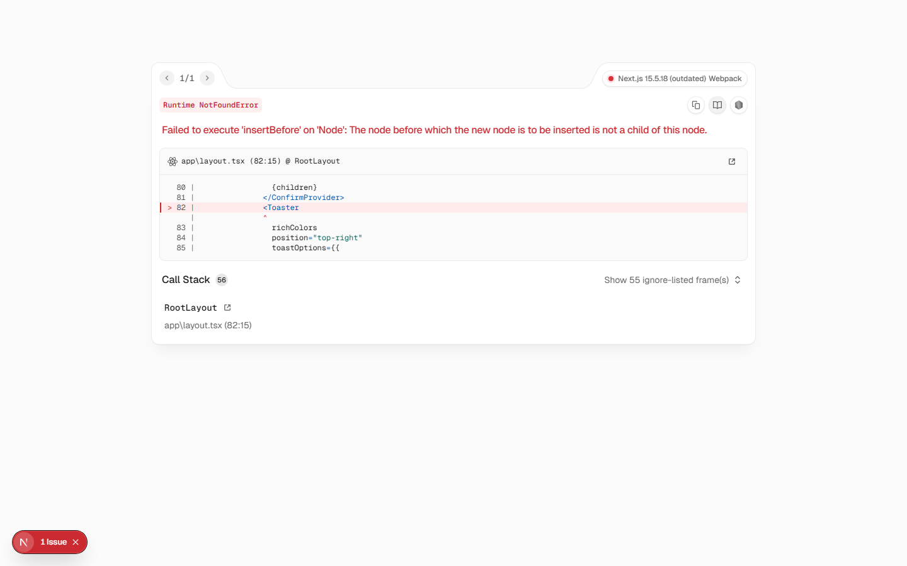
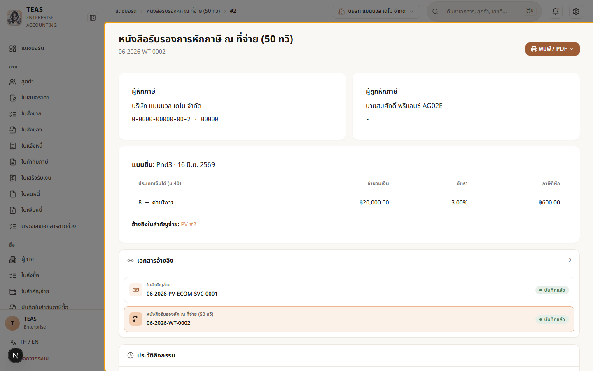

## 05.06 — ผู้ขายบุคคลธรรมดา + 50ทวิ แบบ ภ.ง.ด.3

> **เงื่อนไขก่อนใช้งาน:** login admin (สิทธิ์ master.vendor.manage + payment_voucher create/approve/post) · มีประเภทเงินได้ 50ทวิ (ค่าบริการ) ในระบบ

แบบนำส่งภาษีหัก ณ ที่จ่าย (50ทวิ) ขึ้นกับ **ประเภทของผู้รับเงิน**:

| ผู้รับเงิน | แบบนำส่ง |
|---|---|
| **นิติบุคคล** (บริษัท/ห้างฯ) | **ภ.ง.ด.53** |
| **บุคคลธรรมดา** (ฟรีแลนซ์/บุคคลทั่วไป) | **ภ.ง.ด.3** |

อัตราการหักเหมือนกัน (เช่น ค่าบริการ 3%, ค่าเช่า 5%) — ต่างกันแค่ "แบบที่นำส่งสรรพากร".
ระบบดู **ประเภทของผู้ขาย** (ตั้งที่ข้อมูลหลัก — บุคคลธรรมดา / นิติบุคคล) แล้วเลือกแบบให้เอง.

บทนี้: สร้างผู้ขาย **บุคคลธรรมดา** (ฟรีแลนซ์) → จ่ายค่าบริการ + หัก ณ ที่จ่าย 3% →
ระบบออก 50ทวิ แบบ **ภ.ง.ด.3** ให้อัตโนมัติ (เทียบ 05.03 ที่จ่ายนิติบุคคล = ภ.ง.ด.53).

### ขั้นที่ 1

<figure markdown="span">
  
  <figcaption>สร้างผู้ขายใหม่ — ช่อง "ประเภท" เลือก "บุคคลธรรมดา" (ฟรีแลนซ์/บุคคลทั่วไป). ประเภทนี้เป็นตัวกำหนดว่า 50ทวิ จะเป็นแบบ ภ.ง.ด.3 (บุคคล) หรือ ภ.ง.ด.53 (นิติบุคคล)</figcaption>
</figure>

### ขั้นที่ 2

<figure markdown="span">
  
  <figcaption>ปิดสวิตช์ "Vendor จดทะเบียน VAT" (ฟรีแลนซ์บุคคลธรรมดาทั่วไปไม่จด VAT) → ระบบแจ้งว่าเคลมภาษีซื้อไม่ได้ แต่ "WHT ยังหักได้ปกติ". เลขผู้เสียภาษีไม่บังคับ</figcaption>
</figure>

### ขั้นที่ 3

<figure markdown="span">
  
  <figcaption>บันทึกแล้ว — ผู้ขายบุคคลธรรมดา "นายสมศักดิ์ ฟรีแลนซ์ AG02E" เข้า master (ประเภท = บุคคลธรรมดา). พร้อมใช้เป็นผู้รับเงินในใบสำคัญจ่าย</figcaption>
</figure>

### ขั้นที่ 4

<figure markdown="span">
  
  <figcaption>ใบสำคัญจ่ายให้ฟรีแลนซ์ — ค่าบริการ 20,000 + ประเภทเงินได้ "ค่าบริการ (3%)". ระบบหัก ณ ที่จ่าย 600 (ผู้ขายไม่จด VAT จึงไม่มีภาษีซื้อ) — จ่ายสุทธิ = 20,000 − 600</figcaption>
</figure>

### ขั้นที่ 5

<figure markdown="span">
  
  <figcaption>อนุมัติ + บันทึก (Post) → ระบบลงบัญชีและออกหนังสือรับรอง 50ทวิ ให้. เพราะผู้รับเงินเป็นบุคคลธรรมดา ระบบจะออกแบบ ภ.ง.ด.3 (ไม่ใช่ ภ.ง.ด.53)</figcaption>
</figure>

### ขั้นที่ 6

<figure markdown="span">
  
  <figcaption>หนังสือรับรอง 50ทวิ ที่ระบบออกให้ — ช่อง "แบบนำส่ง" = ภ.ง.ด.3 (เพราะผู้รับเงินเป็นบุคคลธรรมดา). เทียบกับ 05.03 ที่จ่ายให้นิติบุคคล = ภ.ง.ด.53. แบบนำส่งจึงตามประเภทของผู้รับเงินโดยอัตโนมัติ</figcaption>
</figure>
