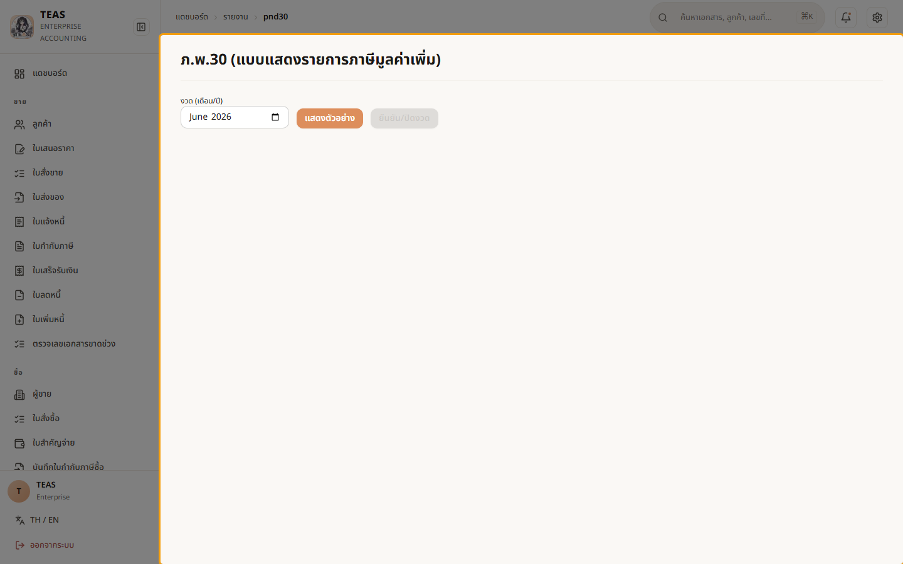
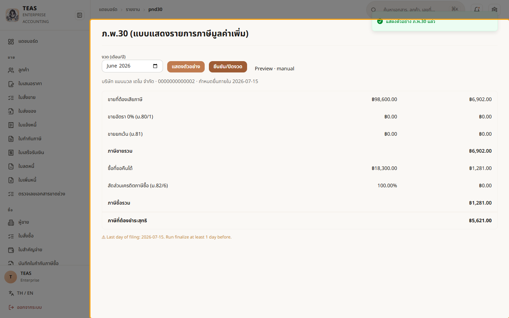

## 07.01 — ภ.พ.30 ภาษีมูลค่าเพิ่ม — ภาษีขาย − ภาษีซื้อ

> **เงื่อนไขก่อนใช้งาน:** login admin (สิทธิ์ report.pnd30) · กิจการจด VAT + มีใบกำกับภาษี/ภาษีซื้อ ในงวด (ดู บท 4–5)

**ภ.พ.30** คือแบบแสดงรายการ **ภาษีมูลค่าเพิ่ม (VAT)** ที่กิจการจด VAT ต้องยื่น
**ทุกเดือน ภายในวันที่ 15 ของเดือนถัดไป** (§4.5):

- **ภาษีขาย (Output VAT)** — VAT 7% ที่เก็บจากลูกค้า รวมจาก **ใบกำกับภาษี/ใบเพิ่มหนี้**
  ที่ออกในงวด หัก **ใบลดหนี้**.
- **ภาษีซื้อ (Input VAT)** — VAT 7% ที่จ่ายให้ผู้ขาย รวมจาก **ใบกำกับภาษีซื้อ** ที่บันทึก
  (เคลมได้ตามงวดเครดิต ม.82/4 — ดู 05.02).
- **ภาษีที่ต้องชำระสุทธิ = ภาษีขาย − ภาษีซื้อ** (ถ้าติดลบ = **เครดิตยกไปงวดหน้า**).

หน้านี้แยก 2 ขั้น: **"แสดงตัวอย่าง"** = คำนวณจากบัญชีแยกประเภท (GL) ทันที ดูได้ไม่จำกัด;
**"ยืนยัน/ปิดงวด"** = ปิดงวดเพื่อนำส่ง (โหมด `auto` ยื่นผ่าน RD API / `manual` ยื่นเอง —
ตั้งระดับบริษัท §4.6). คู่มือนี้สาธิตเฉพาะ **แสดงตัวอย่าง** (อ่านอย่างเดียว).

### ขั้นที่ 1

<figure markdown="span">
  
  <figcaption>หน้า "ภ.พ.30" — เลือก "งวด (เดือน/ปี)" แล้วกด "แสดงตัวอย่าง" เพื่อให้ระบบ คำนวณภาษีขาย/ภาษีซื้อของงวดนั้นจากบัญชีให้อัตโนมัติ. ปุ่ม "ยืนยัน/ปิดงวด" ใช้ตอนนำส่งจริง</figcaption>
</figure>

### ขั้นที่ 2

<figure markdown="span">
  
  <figcaption>ผลการแสดงตัวอย่าง — ตารางสรุปทีละบรรทัด: ขายที่ต้องเสียภาษี · ขาย 0% · ขายยกเว้น → รวมเป็น "ภาษีขายรวม"; ซื้อที่ขอคืนได้ + สัดส่วนเครดิต (ม.82/6) → "ภาษีซื้อรวม"; บรรทัดล่างสุด "ภาษีที่ต้องชำระสุทธิ" = ภาษีขาย − ภาษีซื้อ. มีกำหนดยื่น + ชื่อ/เลขผู้เสียภาษีบริษัทกำกับ</figcaption>
</figure>
