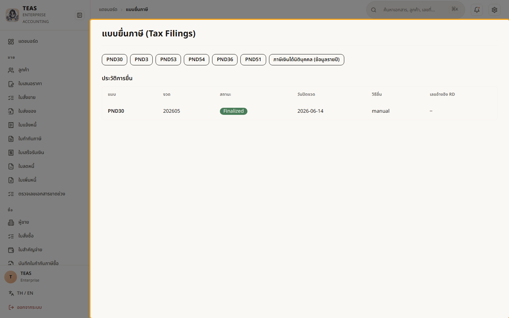
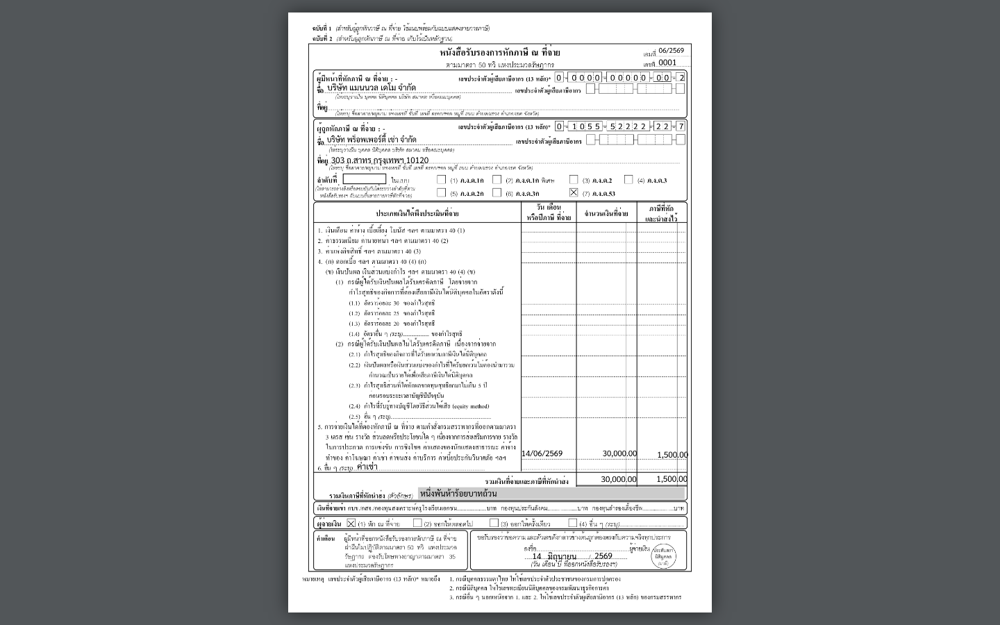

## 07.02 — ภ.ง.ด.3 / ภ.ง.ด.53 นำส่งภาษีหัก ณ ที่จ่าย

> **เงื่อนไขก่อนใช้งาน:** login admin (สิทธิ์ report/tf) · มีใบ 50ทวิ ในงวด (ออกตอน post ใบสำคัญจ่าย — ดู 05.03)

เมื่อจ่ายเงินแล้วหักภาษี ณ ที่จ่าย (ออกใบ **50ทวิ** ดู 05.03) กิจการต้อง **นำส่งภาษีที่หักไว้**
ให้สรรพากรเป็นรายเดือน **ภายในวันที่ 7 ของเดือนถัดไป** โดยแยกแบบตามประเภทผู้รับเงิน:

- **ภ.ง.ด.3** — ผู้รับเงินเป็น **บุคคลธรรมดา**.
- **ภ.ง.ด.53** — ผู้รับเงินเป็น **นิติบุคคล** (บริษัท/ห้างฯ).
- **ภ.ง.ด.54** — จ่ายไปต่างประเทศ (ม.70) · **ภ.พ.36** — VAT นำส่งแทน (reverse charge, ม.83/6).

ในแต่ละแบบ ระบบ **รวมใบ 50ทวิ ของงวดให้อัตโนมัติ** → กด **"แสดงตัวอย่าง"** เห็นรายการ
ราย 50ทวิ + ยอดรวม (อ่านอย่างเดียว คำนวณจากบัญชีทันที) → **ดาวน์โหลดไฟล์รูปแบบกลาง (.txt)**
อัปโหลดเข้าโปรแกรมโอนย้ายข้อมูล/ยื่นผ่าน e-Filing → **"ยืนยัน/ปิดงวด"** เมื่อยื่นแล้ว.
หน้านี้แสดง **ศูนย์รวมแบบยื่นภาษี** ที่ลิงก์ไปทุกแบบและเก็บประวัติการยื่น.

### ขั้นที่ 1

<figure markdown="span">
  
  <figcaption>ศูนย์รวม "แบบยื่นภาษี" — ปุ่มลัดไปแต่ละแบบ (PND30 ภาษีมูลค่าเพิ่ม · PND3/53/54 ภาษีหัก ณ ที่จ่าย · PND36 reverse charge · PND51 ภาษีเงินได้นิติบุคคลครึ่งปี · CIT). ด้านล่างเป็น "ประวัติการยื่น" ทุกแบบที่ปิดงวดแล้ว พร้อมสถานะ/เลขอ้างอิงสรรพากร</figcaption>
</figure>

### ขั้นที่ 2

<figure markdown="span">
  
  <figcaption>ตัวอย่าง **หนังสือรับรองการหักภาษี ณ ที่จ่าย (50ทวิ)** ที่ระบบกรอกให้อัตโนมัติ ตอน post ใบสำคัญจ่าย (05.03) — แบบ ของกรมสรรพากรตัวจริง: ผู้จ่าย/ผู้รับ + เลขผู้เสียภาษี + ประเภทเงินได้ + ยอดเงิน/ภาษีหัก (ตัวอย่าง: ค่าเช่า 30,000 → หัก 5% = 1,500). ใบนี้คือต้นทางของ ภ.ง.ด.3/53</figcaption>
</figure>
