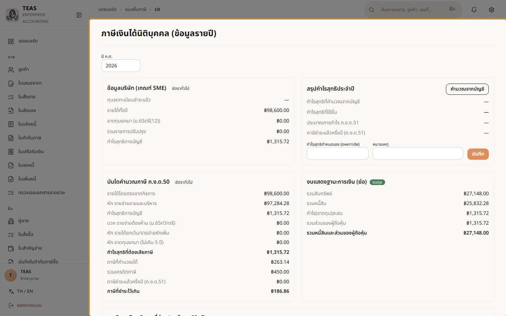
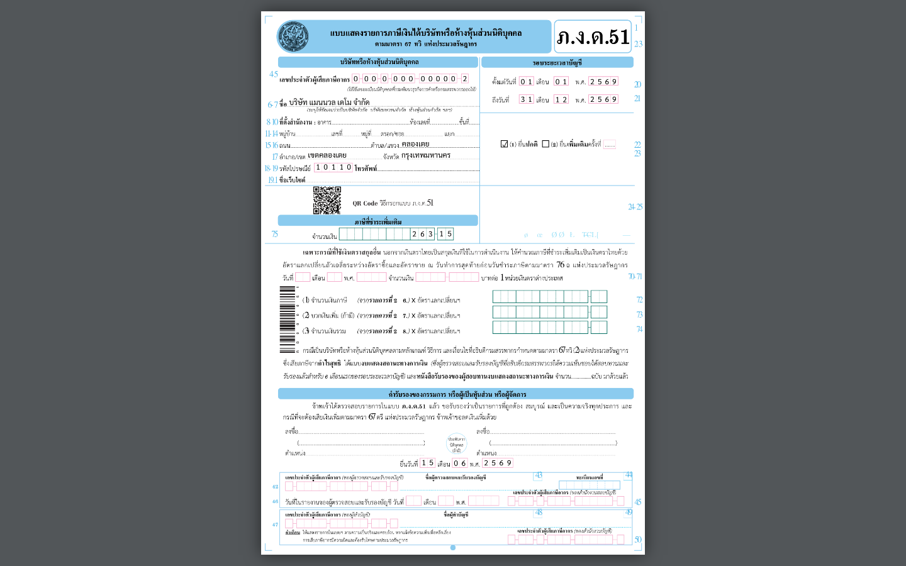
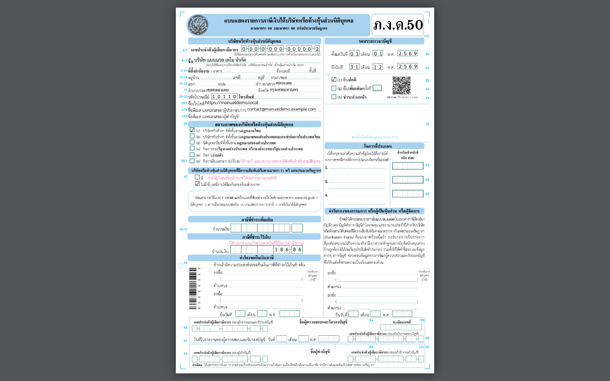

## 07.03 — ภาษีเงินได้นิติบุคคล — ภ.ง.ด.51 / ภ.ง.ด.50

> **เงื่อนไขก่อนใช้งาน:** login admin (สิทธิ์ดู CIT/รายงาน) · มีรายการบัญชีในรอบปี (รายได้/รายจ่าย) + เครดิต 50ทวิ (ดู บท 4–5) · รัน manual/render-pdf-samples.py แล้ว (สร้างตัวอย่าง PDF)

นิติบุคคลเสียภาษีเงินได้จาก **กำไรสุทธิทางภาษี** (ไม่ใช่กำไรทางบัญชีตรง ๆ) โดยยื่น 2 แบบต่อปี:

- **ภ.ง.ด.51 (ครึ่งปี, ม.67ทวิ)** — ประมาณการกำไรทั้งปี เสียภาษีครึ่งหนึ่งล่วงหน้า
  ยื่นภายใน 2 เดือนนับจากวันสิ้นครึ่งรอบบัญชี.
- **ภ.ง.ด.50 (ประจำปี)** — ยื่นภายใน 150 วันนับจากวันสิ้นรอบบัญชี; ภาษีที่จ่ายตาม ภ.ง.ด.51
  และ **เครดิตภาษีถูกหัก ณ ที่จ่าย (50ทวิ ขาเข้า)** นำมาหักออกได้.

ระบบดึงรายได้/รายจ่ายจากบัญชีมาทำ **"บันไดคำนวณ"** — กำไรทางบัญชี → บวกกลับรายจ่ายต้องห้าม
(ม.65ตรี) → หักรายการยกเว้น → **กำไรสุทธิทางภาษี** → ภาษี (อัตรา SME/ทั่วไป) แล้ว
**กรอกแบบ RD ตัวจริงให้อัตโนมัติ**. แดชบอร์ดโชว์ทุกตัวเลขก่อน (dry-run) — รวมงบแสดงฐานะ
การเงินย่อที่ต้อง **ดุล (balanced)** — แล้วกดออก PDF.

### ขั้นที่ 1

<figure markdown="span">
  
  <figcaption>แดชบอร์ด CIT (/tax-filings/cit) — การ์ด "โปรไฟล์ SME", "บันไดคำนวณ ภ.ง.ด.50" (กำไรทางบัญชี → กำไรสุทธิทางภาษี → ภาษี − เครดิต = สุทธิ), "งบแสดงฐานะการเงินย่อ" พร้อมป้าย ดุล/ไม่ดุล, ตารางเครดิต 50ทวิ ขาเข้า, และส่วนออก PDF ภ.ง.ด.50 (ติ๊กคำรับรองก่อนดาวน์โหลด)</figcaption>
</figure>

### ขั้นที่ 2

<figure markdown="span">
  
  <figcaption>ตัวอย่าง **ภ.ง.ด.51** (ภาษีกลางปี) ที่ระบบกรอกลงแบบ ของกรมสรรพากรตัวจริงให้ — หัวกระดาษ (ชื่อ/เลขผู้เสียภาษี/รอบบัญชี) + ช่องคำนวณภาษีจากประมาณการ พิมพ์ออกยื่นได้</figcaption>
</figure>

### ขั้นที่ 3

<figure markdown="span">
  
  <figcaption>ตัวอย่าง **ภ.ง.ด.50** (ภาษีประจำปี) หน้าปก ที่ระบบกรอกให้ — แบบเต็มมีหลายหน้า (รายการคำนวณภาษี + งบการเงิน + ใบแนบ) เติมจากบัญชีจริง ตรงกับตัวเลขในแดชบอร์ดขั้นที่ 1</figcaption>
</figure>
