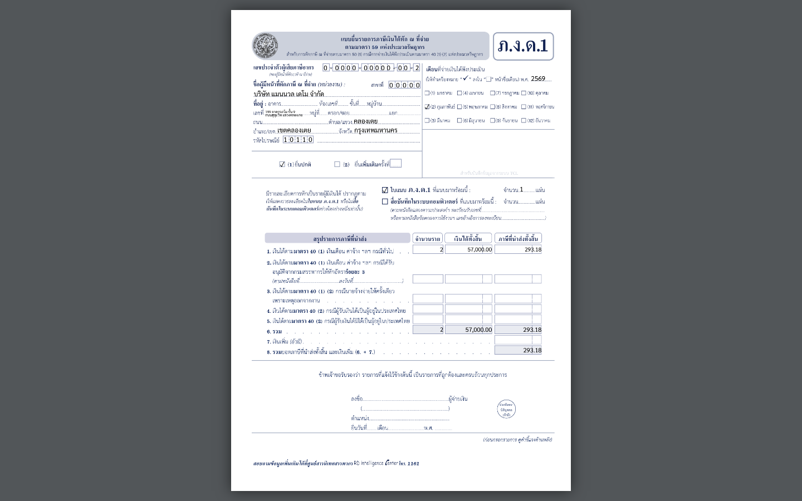

## 07.06 — ภ.ง.ด.1 — นำส่งภาษีเงินเดือนรายเดือน

> **เงื่อนไขก่อนใช้งาน:** login admin · มีรอบจ่ายเงินเดือนในงวด (ดู 06.01) · รัน manual/render-pdf-samples.py แล้ว

เมื่อทำ **รอบจ่ายเงินเดือน** (06.01) ระบบหักภาษีเงินได้บุคคลธรรมดา (PIT) จากพนักงานแต่ละคน
ไว้แล้ว — ภาษีก้อนนี้ต้อง **นำส่งกรมสรรพากรรายเดือน** ด้วยแบบ **ภ.ง.ด.1** (ตาม ม.59 เงินได้
ม.40(1)) ภายในวันที่ 7 ของเดือนถัดไป.

ระบบ **กรอกแบบ ภ.ง.ด.1 ของกรมสรรพากรให้อัตโนมัติ** จากรอบจ่าย: หัวกระดาษ (ชื่อ/เลขผู้เสียภาษี/
สาขา/งวด) + สรุปจำนวนพนักงาน · เงินได้รวม · ภาษีที่นำส่ง — พิมพ์ออกยื่นได้เลย (สรุปทั้งปีใช้
**ภ.ง.ด.1ก** หลังปิดรอบจ่ายทั้งปี).

### ขั้นที่ 1

<figure markdown="span">
  
  <figcaption>ตัวอย่าง **ภ.ง.ด.1** ที่ระบบกรอกจากรอบจ่ายเงินเดือนให้ — หัวกระดาษ (ชื่อ/เลขผู้เสียภาษี/สาขา/งวด) + แถวสรุป เงินได้ ม.40(1): จำนวนพนักงาน · เงินได้รวม · ภาษีนำส่ง (ตัวอย่าง: 2 คน · 57,000 · ภาษี 293.18 — ตรงกับรอบจ่าย 06.01). พิมพ์ออกยื่นที่สรรพากรได้เลย</figcaption>
</figure>
