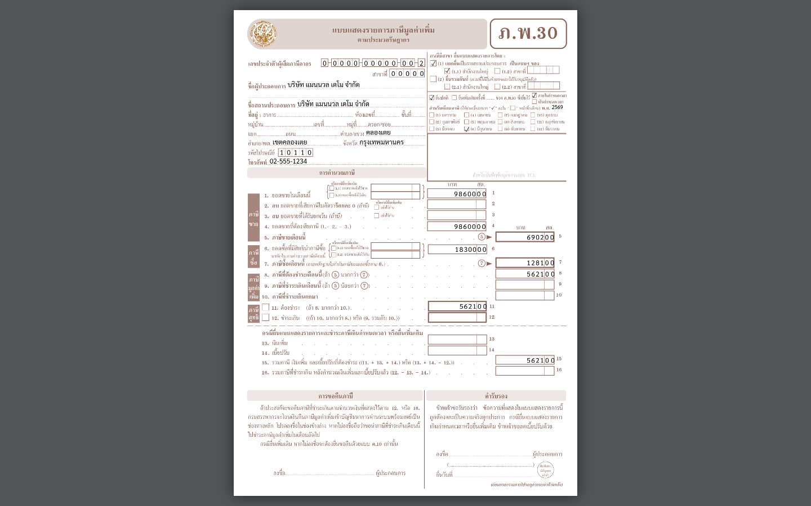

## 07.07 — ภ.พ.30 — แบบ VAT ที่ระบบกรอกให้

> **เงื่อนไขก่อนใช้งาน:** login admin (สิทธิ์ report.pnd30) · กิจการจด VAT + มีใบกำกับภาษี/ภาษีซื้อ ในงวด (ดู บท 4–5) · รัน manual/render-pdf-samples.py แล้ว

ใน 07.01 เราดู **ตัวอย่างบนจอ** ของ ภ.พ.30 (ภาษีขาย − ภาษีซื้อ = สุทธิ). เมื่อจะยื่นจริง
ระบบ **กรอกแบบ ภ.พ.30 ของกรมสรรพากรให้อัตโนมัติ** จากยอดชุดเดียวกัน: เลขผู้เสียภาษี ·
สาขา · ชื่อสถานประกอบการ · งวด (เดือน/ปี) · ยอดขายและภาษีขาย · ยอดซื้อและภาษีซื้อ ·
ภาษีที่ต้องชำระ/ขอคืน — **VAT แสดงแยกจากฐาน** (ม.86/4).

เปิด **/reports/pnd30 → เลือกงวด → "ดาวน์โหลด PDF (ภ.พ.30)"** ได้ไฟล์ที่กรอกครบ
พิมพ์ออกยื่นที่สรรพากรได้เลย (ระบบนี้ **ไม่ส่งให้สรรพากรแทน** — เป็นแบบพิมพ์-แล้ว-ยื่นเอง).

### ขั้นที่ 1

<figure markdown="span">
  
  <figcaption>ตัวอย่าง **ภ.พ.30** ที่ระบบกรอกให้ — หัวกระดาษ (ชื่อ/เลขผู้เสียภาษี/สาขา/งวด) + ช่องยอดขายและภาษีขาย − ยอดซื้อและภาษีซื้อ → ภาษีที่ต้องชำระสุทธิ (ตัวอย่างงวด มิ.ย.: ภาษีขาย 6,902 − ภาษีซื้อ 1,281 = ชำระสุทธิ 5,621 — ตรงกับตัวอย่างบนจอใน 07.01). VAT แสดงแยกจากฐาน</figcaption>
</figure>
