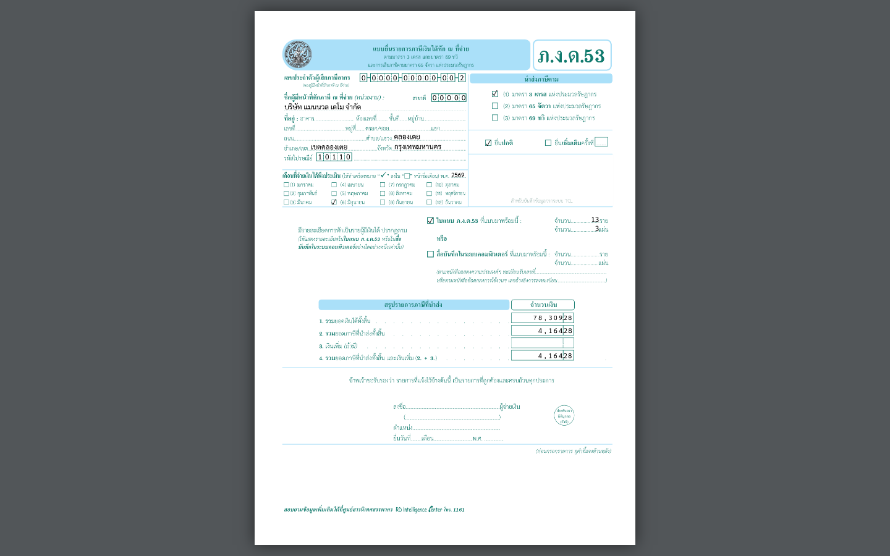

## 07.09 — ภ.ง.ด.53 — WHT นิติบุคคล + ใบแนบ

> **เงื่อนไขก่อนใช้งาน:** login admin · มี 50ทวิ ของผู้รับเงินนิติบุคคลในงวด (ดู 05.03) · รัน manual/render-pdf-samples.py แล้ว

**ภ.ง.ด.53** ใช้นำส่งภาษีหัก ณ ที่จ่ายที่หักจาก **ผู้รับเงินที่เป็นนิติบุคคล** (บริษัท/
ห้างหุ้นส่วน) — เช่น จ่ายค่าเช่าอาคารให้บริษัท หัก 5%, จ่ายค่าบริการให้บริษัทรับเหมา หัก 3%.
เป็นแบบฟอร์มตระกูลเดียวกับ **ภ.ง.ด.3** (บุคคลธรรมดา, 07.08) — ระบบเลือกแบบให้อัตโนมัติ
ตามประเภทผู้รับเงิน.

ระบบกรอกให้ **หน้าหลัก** (หัวกระดาษผู้จ่าย · เดือน · ยอดรวมเงินได้/ภาษีนำส่ง · ☑ ใบแนบ +
จำนวน ราย/แผ่น) และ **ใบแนบ** ที่ลงผู้ถูกหักทีละราย (เลขผู้เสียภาษี 13 หลัก · ชื่อ · ประเภท
เงินได้ · วันที่จ่าย · จำนวนเงิน · อัตรา % · ภาษี · เงื่อนไข) — พิมพ์ออกยื่นได้เลย.

### ขั้นที่ 1

<figure markdown="span">
  
  <figcaption>ตัวอย่าง **ภ.ง.ด.53** (หน้าหลัก) ที่ระบบกรอกให้ — หัวกระดาษผู้จ่าย + เดือนที่จ่าย + ยอดรวมเงินได้/ภาษีนำส่ง + ☑ "ใบแนบที่แนบมาพร้อมนี้" พร้อมจำนวน ราย/แผ่น. ผู้รับเงินนิติบุคคล แต่ละรายอยู่ใน **ใบแนบ** (หน้าถัดไป) เรียงทีละแถว พร้อมยอดรวมทุกคอลัมน์</figcaption>
</figure>
