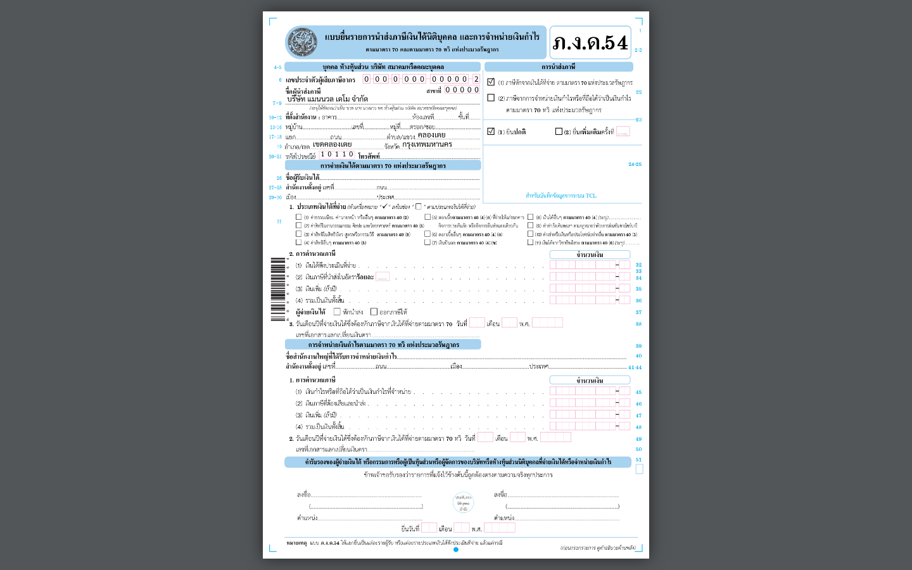

## 07.10 — ภ.ง.ด.54 — WHT จ่ายต่างประเทศ (ม.70)

> **เงื่อนไขก่อนใช้งาน:** login admin · มีการจ่ายเงินให้ผู้รับเงินต่างประเทศที่ถูกหัก ม.70 ในงวด (ดูบริบทใน 07.04) · รัน manual/render-pdf-samples.py แล้ว

**ภ.ง.ด.54** ใช้นำส่งภาษีหัก ณ ที่จ่ายตาม **มาตรา 70** — เมื่อจ่ายเงินได้ (ค่าบริการ ค่าสิทธิ
ดอกเบี้ย เงินปันผล ฯลฯ) ให้ **บริษัท/ห้างหุ้นส่วนนิติบุคคลต่างประเทศที่มิได้ประกอบกิจการในไทย**.
มักมาคู่กับ **ภ.พ.36** (นำส่ง VAT แทนผู้ขายต่างประเทศ — reverse charge, ดู 07.04): เงินก้อน
เดียวกันอาจต้องทั้งหัก ม.70 (ภ.ง.ด.54) และนำส่ง VAT 7% (ภ.พ.36).

แบบนี้เป็นการ **จ่ายครั้งเดียวต่อแผ่น** (ไม่มีใบแนบรายผู้รับเงินแบบ ภ.ง.ด.3/53). ระบบกรอก
**หัวฟอร์มให้**: ชื่อ/เลขผู้เสียภาษี/ที่อยู่ผู้จ่าย + เครื่องหมาย **(1) ตามมาตรา 70** + **ยื่นปกติ**
และช่องชื่อผู้รับเงิน/จำนวนเงิน/อัตรา/ภาษี เมื่อมีรายการจ่ายต่างประเทศที่ถูกหักในงวด.

> งวดสาธิตของบริษัทตัวอย่างยังไม่มีรายการจ่ายต่างประเทศที่ถูกหัก ม.70 ตัวอย่างด้านล่างจึงเป็น
> **หัวฟอร์ม** (เหมือนแบบคำขอ ภ.พ.01/09 ใน 07.05 — ช่องจำนวนเงินกรอกเมื่อมีการจ่ายจริง).

### ขั้นที่ 1

<figure markdown="span">
  
  <figcaption>ตัวอย่าง **ภ.ง.ด.54** ที่ระบบกรอกหัวฟอร์มให้ — ชื่อ/เลขผู้เสียภาษี/ที่อยู่ผู้จ่าย + เครื่องหมาย "(1) ตามมาตรา 70" + "ยื่นปกติ". เป็นแบบจ่ายครั้งเดียว (ไม่มีใบแนบ); ช่องจำนวนเงิน/อัตรา/ภาษี จะกรอกเมื่อมีการจ่ายต่างประเทศที่ถูกหัก ม.70 ในงวด (มักคู่กับ ภ.พ.36 — ดู 07.04)</figcaption>
</figure>
