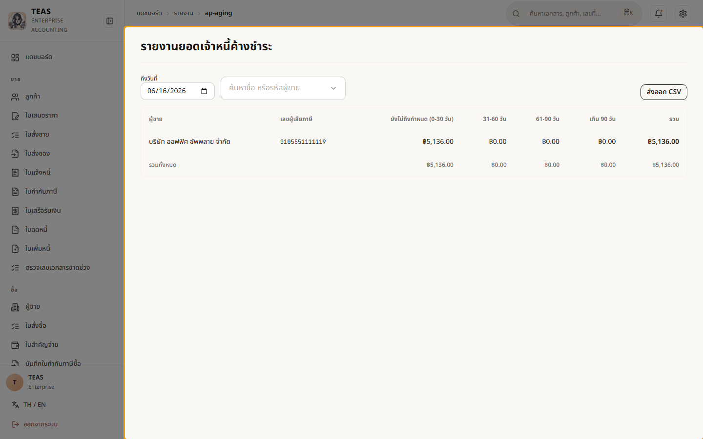
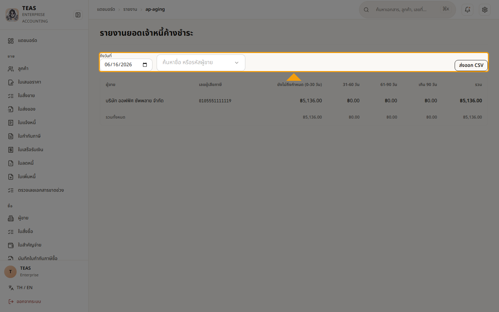

## 08.03 — รายงานอายุหนี้เจ้าหนี้ (AP Aging)

> **เงื่อนไขก่อนใช้งาน:** login admin (สิทธิ์ดูรายงาน) · มีใบแจ้งหนี้ผู้ขายที่ยังค้างจ่าย (ดู บท 5 — ซื้อ/จ่าย)

**รายงานอายุหนี้เจ้าหนี้ (AP Aging)** สรุปยอด **ที่ยังค้างจ่าย** ให้ผู้ขายแต่ละราย แล้วแยกตาม
**ช่วงอายุหนี้** นับจากกำหนดชำระถึงวันที่เลือก:

- **ยังไม่ครบกำหนด/current** · **31–60 วัน** · **61–90 วัน** · **เกิน 90 วัน**

ใช้เพื่อ (1) วางแผนกระแสเงินสด — รู้ว่าต้องเตรียมจ่ายเท่าไรเมื่อไร, (2) จัดลำดับการจ่าย —
หนี้ที่ค้างนานควรจ่ายก่อน, (3) กระทบยอดเจ้าหนี้กับบัญชีแยกประเภท.

ปรับได้: **เลือกวันที่ (ณ วันที่)** เพื่อย้อนดูภาพ ณ จุดเวลาใด ๆ · **กรองผู้ขายรายเดียว** ·
**Export CSV** เอาไปทำงานต่อ. ตัวเลขมาจากใบแจ้งหนี้ผู้ขายที่ยังค้างจริง (ดู บทที่ 5 การซื้อ).

> รายงานบริหารตัวอื่น (PO คงค้าง, ภาษีถูกหักรอเครดิต) อยู่ในเมนูรายงานเดียวกัน — เปิดดูได้
> แบบเดียวกัน เมื่อมีข้อมูลตัวอย่างที่สะอาดจะทยอยเพิ่มลงคู่มือ.

### ขั้นที่ 1

<figure markdown="span">
  
  <figcaption>รายงานอายุหนี้เจ้าหนี้ ณ วันที่เลือก — แต่ละแถว = ผู้ขายหนึ่งราย พร้อมยอดค้างแยกช่วงอายุ (current / 31-60 / 61-90 / เกิน 90) + คอลัมน์รวม และแถวรวมทั้งหมด</figcaption>
</figure>

### ขั้นที่ 2

<figure markdown="span">
  
  <figcaption>ปรับมุมมองได้ — เลือก "ณ วันที่" เพื่อย้อนภาพ ณ จุดเวลาใด ๆ · กรองผู้ขายรายเดียว · ปุ่ม "ส่งออก CSV" ดาวน์โหลดตารางไปทำงานต่อ (อ่านอย่างเดียว ไม่กระทบข้อมูล)</figcaption>
</figure>
