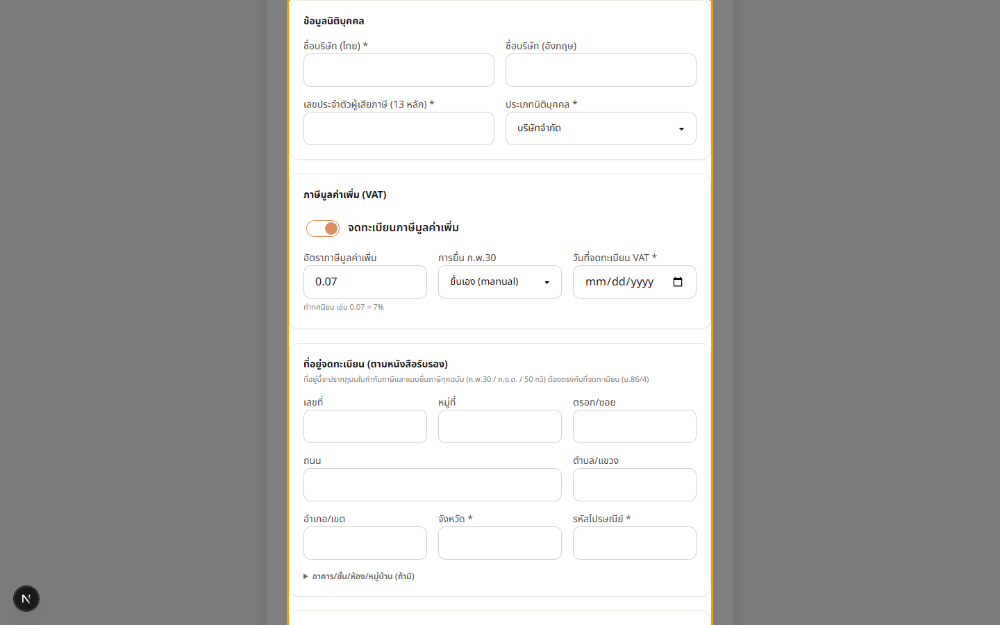
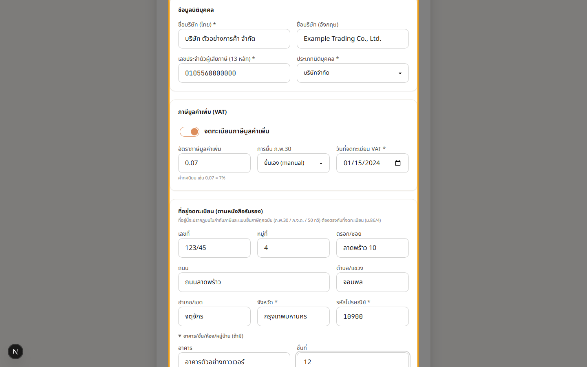

# 0. ติดตั้งและผู้ดูแลระบบ

## 00.01 — สร้างบริษัทแรกด้วย Setup Wizard

> **เงื่อนไขก่อนใช้งาน:** มีบัญชี Super Admin ที่ยังไม่มีบริษัทผูกอยู่ · รู้ข้อมูลนิติบุคคล: ชื่อ, เลขผู้เสียภาษี 13 หลัก, สถานะ VAT, ที่อยู่จดทะเบียน

หลังติดตั้งระบบและเข้าสู่ระบบด้วยผู้ดูแลสูงสุด (Super Admin) ครั้งแรก — หากบัญชีนั้น
**ยังไม่มีบริษัทผูกอยู่** ระบบจะนำเข้าสู่ **หน้า Setup Wizard** โดยอัตโนมัติ เพื่อ
สร้าง "บริษัทแรก" ก่อนเข้าใช้งานหน้าอื่น ๆ.

ระบบดูจากการที่บัญชียัง **ไม่ถูกมอบหมายให้บริษัทใด** (ไม่ใช่ดูจากการที่ฐานข้อมูลว่าง) —
Super Admin ที่ไม่มี role จะเข้าสู่ระบบในสถานะ "ยังไม่มีบริษัท" และถูกพาเข้าหน้านี้.

ในบทนี้จะเห็น:
- หน้า Wizard เปล่าเมื่อเข้าครั้งแรก
- ตัวอย่างการกรอกข้อมูลตั้งบริษัท: ชื่อ (ไทย/อังกฤษ), เลขผู้เสียภาษี, สถานะ VAT +
  อัตรา + โหมด ภ.พ.30, และที่อยู่จดทะเบียนแบบแยกช่อง (ตามหนังสือรับรอง / ม.86/4)

### ขั้นที่ 1

<figure markdown="span">
  
  <figcaption>Super Admin ที่ยังไม่มีบริษัทผูกอยู่จะถูกพาเข้าหน้า Setup Wizard นี้โดยอัตโนมัติ — เป็นหน้าแบบ "เต็มจอ" ไม่มีเมนู เพราะต้องสร้างบริษัทแรกให้เสร็จก่อนจึงเข้าใช้งานส่วนอื่นได้. ฟอร์มแบ่งเป็น: ข้อมูลนิติบุคคล, ภาษี (VAT), ที่อยู่จดทะเบียน, และรอบปีบัญชี</figcaption>
</figure>

### ขั้นที่ 2

<figure markdown="span">
  
  <figcaption>ตัวอย่างการกรอก: ชื่อนิติบุคคล (ไทย/อังกฤษ), เลขประจำตัวผู้เสียภาษี 13 หลัก, สถานะจด VAT พร้อมอัตรา (เช่น 0.07) และโหมดยื่น ภ.พ.30 — หมายเหตุ: โหมด "อัตโนมัติ (RD API)" ยังถูกปิดไว้ในขั้นตั้งค่า เลือกได้เฉพาะ "ด้วยตนเอง". ที่อยู่จดทะเบียนกรอกแยกช่อง (บ้านเลขที่/หมู่/ซอย/ถนน/ตำบล/อำเภอ/จังหวัด/รหัสไปรษณีย์) ให้ตรงหนังสือรับรอง เพื่อนำไปขึ้นหัวใบกำกับภาษี (ม.86/4). เมื่อกด "สร้างบริษัท" ระบบจะสร้างบริษัท สลับ context เข้าบริษัทนั้น แล้วพาเข้า Dashboard</figcaption>
</figure>
