# 1. เริ่มต้นใช้งาน

## 01.01 — เข้าสู่ระบบ

> **เงื่อนไขก่อนใช้งาน:** มี user account ที่ผู้ดูแลระบบสร้างให้แล้ว · รู้ username + password ของตัวเอง

TEAS ใช้รหัสผ่านปกติร่วมกับ MFA (ถ้าเปิดใช้) ผ่านหน้า login เพียงหน้าเดียว.
ระบบจะออก JWT เก็บเป็น httpOnly cookie — ไม่เก็บใน localStorage ของ browser
เพื่อความปลอดภัย (BFF cookie pattern).

ในบทนี้คุณจะได้เรียนรู้:
- หน้าตา login screen
- การกรอก username + password
- หน้า dashboard ที่ปรากฏหลัง login สำเร็จ

### ขั้นที่ 1

<figure markdown="span">
  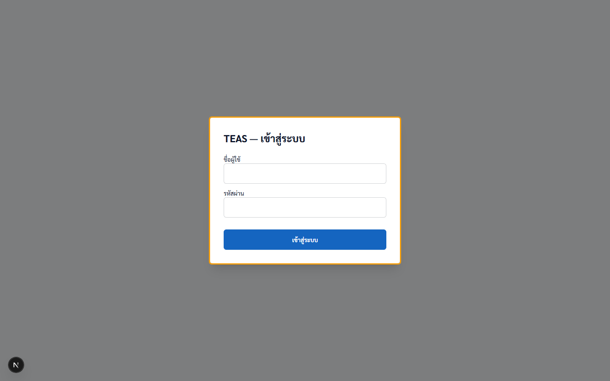
  <figcaption>เปิด browser ไปที่ URL ของระบบ — หน้าเข้าสู่ระบบจะแสดงพร้อม ช่อง "ชื่อผู้ใช้" และ "รหัสผ่าน"</figcaption>
</figure>

### ขั้นที่ 2

<figure markdown="span">
  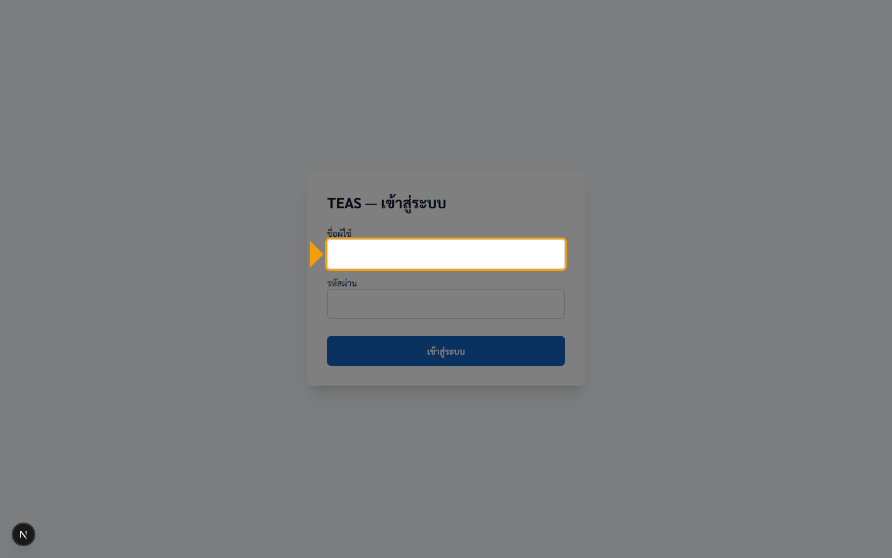
  <figcaption>กรอก "ชื่อผู้ใช้" ที่ผู้ดูแลระบบให้มา (ตัวอย่างคู่มือนี้ใช้ demo-accountant)</figcaption>
</figure>

### ขั้นที่ 3

<figure markdown="span">
  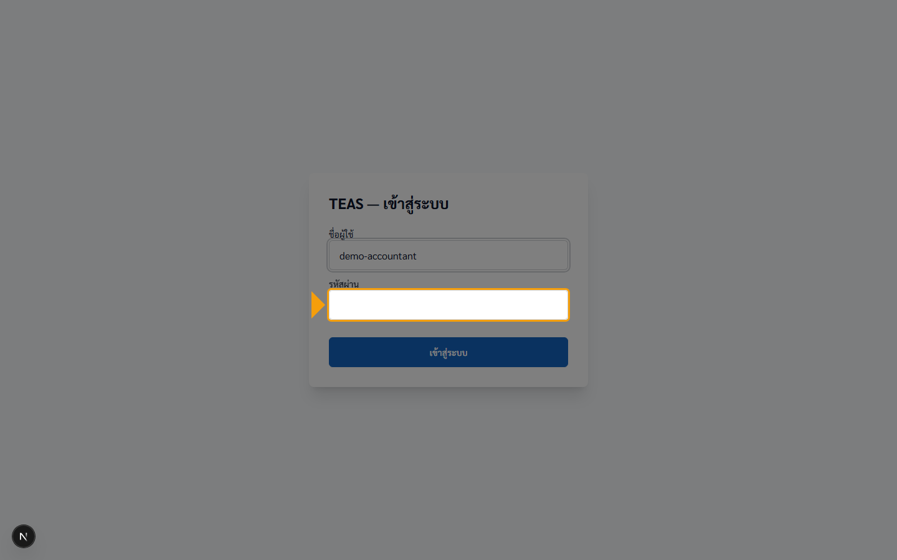
  <figcaption>กรอก "รหัสผ่าน" — ตัวอักษรจะถูกซ่อนเป็นจุด. หากตั้ง MFA ไว้ ระบบจะถามรหัส OTP ในขั้นถัดไป</figcaption>
</figure>

### ขั้นที่ 4

<figure markdown="span">
  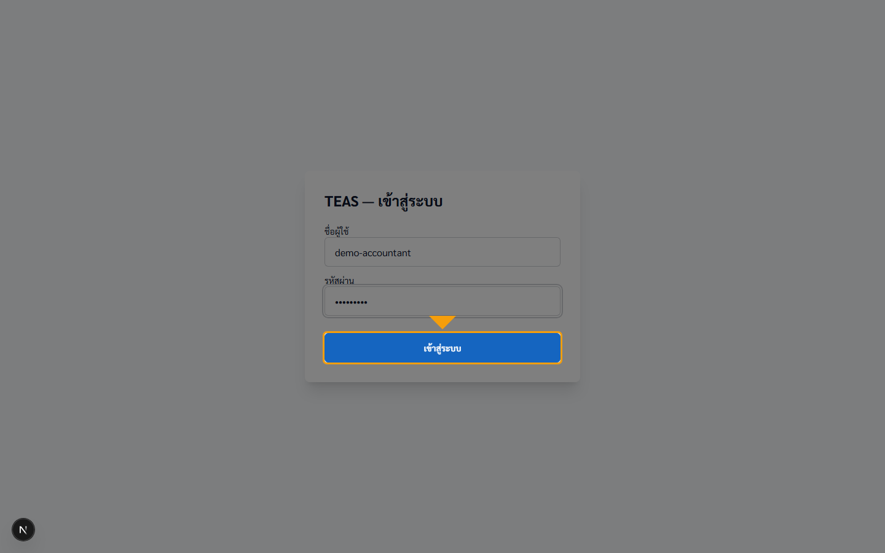
  <figcaption>คลิกปุ่ม "เข้าสู่ระบบ" — ระบบจะตรวจสอบ credentials และเปิด session ผ่าน httpOnly cookie</figcaption>
</figure>

### ขั้นที่ 5

<figure markdown="span">
  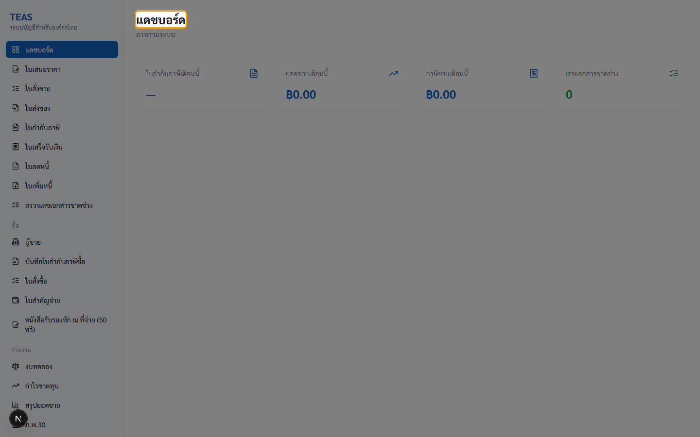
  <figcaption>เข้าสู่ระบบสำเร็จ — หน้า "แดชบอร์ด" ปรากฏพร้อมภาพรวมระบบ: ยอดขายเดือนนี้, ภาษีขาย, ใบกำกับภาษี, เลขเอกสารขาดช่วง. เมนูทางซ้ายแสดงโมดูลหลัก: ขาย, ซื้อ, รายงาน</figcaption>
</figure>

## 01.02 — สำรวจ Dashboard

> **เงื่อนไขก่อนใช้งาน:** login แล้ว (walkthrough 01.01) · อยู่ที่ URL / (dashboard root)

หลัง login สำเร็จ ผู้ใช้จะมาที่ "แดชบอร์ด" — หน้าแรกที่สรุปภาพรวมระบบ
และเป็นจุดเริ่มต้นในการเข้าทุกโมดูล. ในบทนี้คุณจะรู้จัก:

- 4 stat cards ที่สรุปสถานะการเงินของเดือนนี้
- โครงสร้าง sidebar ที่แบ่งเป็น 4 กลุ่ม: ขาย / ซื้อ / รายงาน / ตั้งค่า
- ปุ่ม TH/EN สำหรับสลับภาษา และปุ่ม "ออกจากระบบ"

หมายเหตุ: TEAS ใช้ navigation แบบ sidebar เพียงอย่างเดียว — ไม่มี top header bar.

### ขั้นที่ 1

<figure markdown="span">
  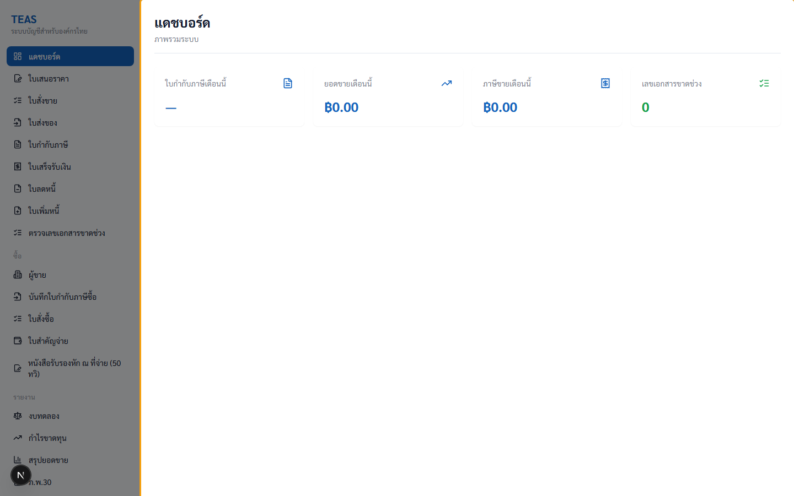
  <figcaption>นี่คือหน้า "แดชบอร์ด" — สรุปภาพรวมระบบของเดือนปัจจุบัน. หัวเรื่อง "แดชบอร์ด" + คำอธิบาย "ภาพรวมระบบ" + 4 stat cards ด้านบน</figcaption>
</figure>

### ขั้นที่ 2

<figure markdown="span">
  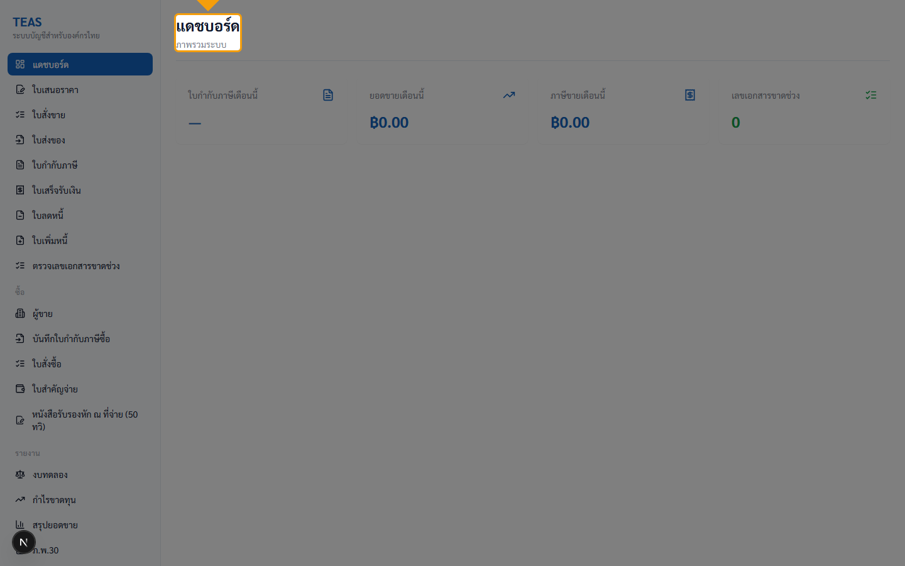
  <figcaption>card แรก "ใบกำกับภาษีเดือนนี้" — จำนวนใบกำกับภาษีขายที่ Post แล้วในเดือนปัจจุบัน. เมื่อยังไม่มีข้อมูลจะแสดง "—"</figcaption>
</figure>

### ขั้นที่ 3

<figure markdown="span">
  
  <figcaption>card "ยอดขายเดือนนี้" — ผลรวม net amount ของใบกำกับภาษีขาย ที่ Post แล้ว (ไม่รวมที่ยกเลิก). หน่วยเป็นบาท (฿)</figcaption>
</figure>

### ขั้นที่ 4

<figure markdown="span">
  
  <figcaption>card "ภาษีขายเดือนนี้" — ผลรวม VAT 7% (Output VAT) ที่ เรียกเก็บจากลูกค้า. เป็นตัวเลขเดียวกับที่จะยื่น ภ.พ.30 ปลายเดือน</figcaption>
</figure>

### ขั้นที่ 5

<figure markdown="span">
  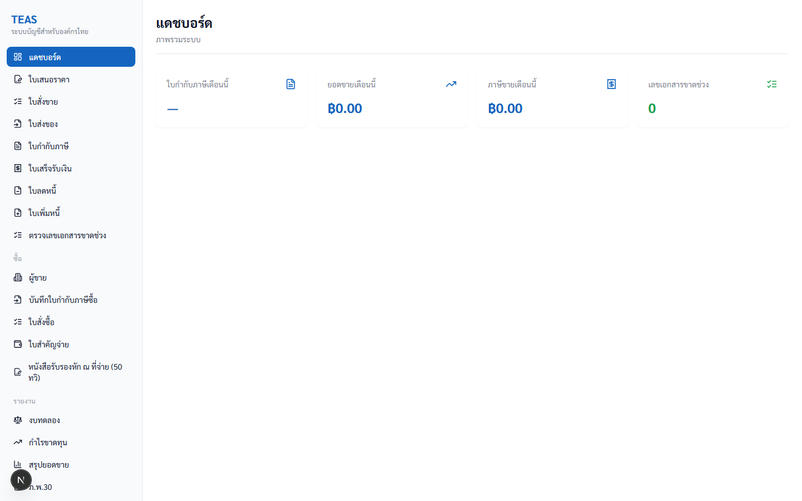
  <figcaption>card "เลขเอกสารขาดช่วง" — จำนวนช่วงของเลขเอกสารที่ขาด (ตามกฎบัญชี TEAS ต้องเป็น gapless). ถ้าไม่ใช่ 0 ต้องรีบตรวจ — ดูบทที่ 5</figcaption>
</figure>

### ขั้นที่ 6

<figure markdown="span">
  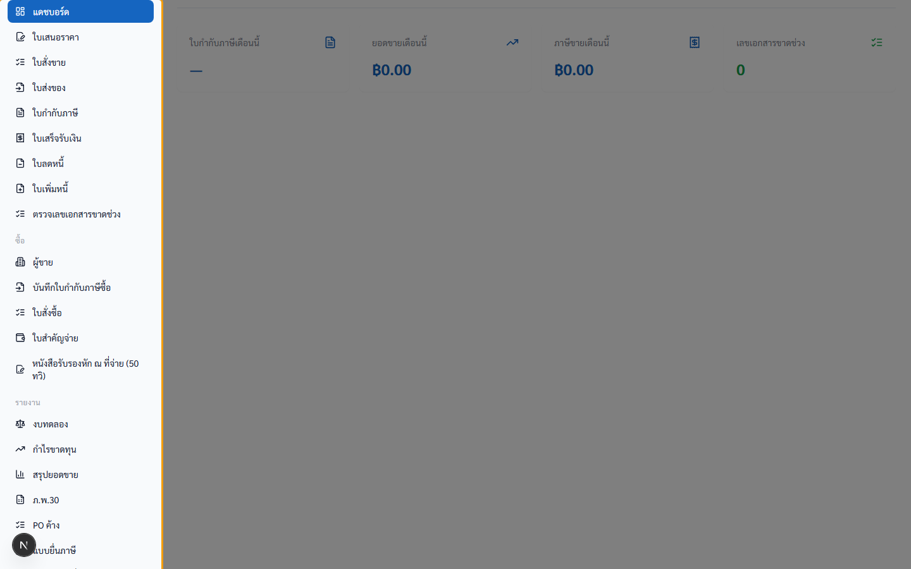
  <figcaption>sidebar กลุ่มแรก (ไม่มีหัวข้อ) คือ "ขาย" — รวม แดชบอร์ด, ใบเสนอราคา, ใบสั่งขาย, ใบส่งของ, ใบกำกับภาษี, ใบเสร็จรับเงิน, ใบลดหนี้, ใบเพิ่มหนี้, ตรวจเลขเอกสารขาดช่วง</figcaption>
</figure>

### ขั้นที่ 7

<figure markdown="span">
  
  <figcaption>กลุ่ม "ซื้อ" — ผู้ขาย, บันทึกใบกำกับภาษีซื้อ, ใบสั่งซื้อ, ใบสำคัญจ่าย, หนังสือรับรองหัก ณ ที่จ่าย (50 ทวิ)</figcaption>
</figure>

### ขั้นที่ 8

<figure markdown="span">
  
  <figcaption>กลุ่ม "รายงาน" — งบทดลอง, กำไรขาดทุน, สรุปยอดขาย, ภ.พ.30, PO ค้าง, แบบยื่นภาษี, ภาษีหัก ณ ที่จ่ายค้างรับ</figcaption>
</figure>

### ขั้นที่ 9

<figure markdown="span">
  
  <figcaption>กลุ่ม "ตั้งค่า" — 5 รายการ. ลิงก์แรก "ข้อมูลบริษัท" (Sprint 13d-P6, ทำก่อนเป็นอันดับแรกสำหรับ tenant ใหม่ — ดูบท 02.05) ตามด้วย สินค้า/บริการ, หน่วยธุรกิจ (Business Unit), ประเภทหัก ณ ที่จ่าย (admin), API Keys (admin)</figcaption>
</figure>

### ขั้นที่ 10

<figure markdown="span">
  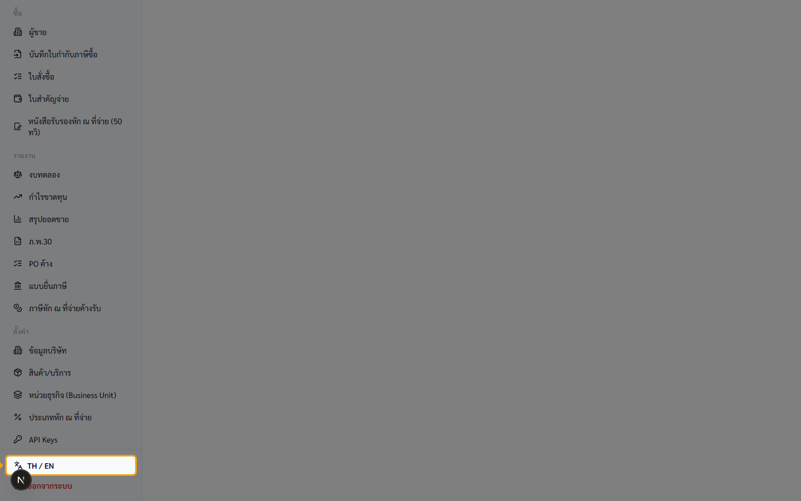
  <figcaption>ด้านล่าง sidebar มี 2 ปุ่ม — "TH / EN" สลับภาษา (ดูบท 01.03) และ "ออกจากระบบ" สำหรับ logout (ดูบท 01.04)</figcaption>
</figure>

## 01.03 — เปลี่ยนภาษา TH / EN

> **เงื่อนไขก่อนใช้งาน:** login แล้ว (walkthrough 01.01) · อยู่ที่ภาษาไทย (default)

TEAS รองรับ 2 ภาษาในหน้าเดียวกัน — ไทย (default) และ English. การสลับ
จะกระทบทั้ง sidebar, headings, labels, และ stat cards ทันที (client-side
locale switch — ไม่ต้อง reload หน้า).

ศัพท์เฉพาะกฎหมายภาษีไทย เช่น "ภ.พ.30", "50 ทวิ", "ภ.ง.ด." จะคงรูปไว้
แม้สลับเป็น English เพราะเป็นชื่อทางการตามมาตรฐานกรมสรรพากร
(เช่น "ภ.พ.30 VAT Return", "WHT Certificates (50 ทวิ)").

User preference จะถูกเก็บไว้ใน cookie ของ browser — ครั้งต่อไปที่ login
ระบบจะจำภาษาที่เลือกล่าสุด.

### ขั้นที่ 1

<figure markdown="span">
  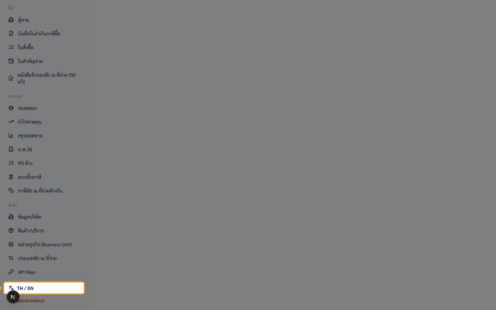
  <figcaption>ปุ่ม "TH / EN" อยู่ล่างสุดของ sidebar (เหนือปุ่ม "ออกจากระบบ") — เป็น toggle 1-คลิกสลับภาษา</figcaption>
</figure>

### ขั้นที่ 2

<figure markdown="span">
  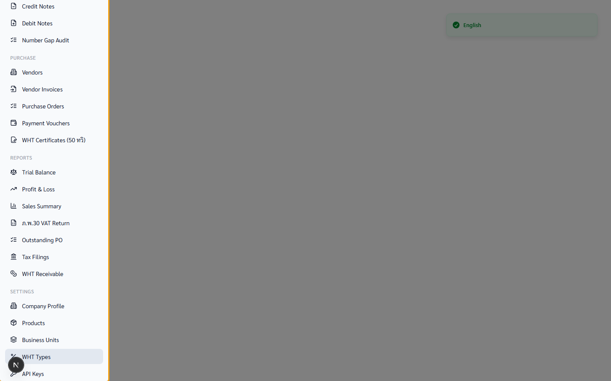
  <figcaption>หลังคลิก → toast "English" ปรากฏมุมขวาบน. Sidebar แปลทั้งหมด: "ใบเสนอราคา" → "Quotations", "ใบกำกับภาษี" → "Tax Invoices", "งบทดลอง" → "Trial Balance" ฯลฯ</figcaption>
</figure>

### ขั้นที่ 3

<figure markdown="span">
  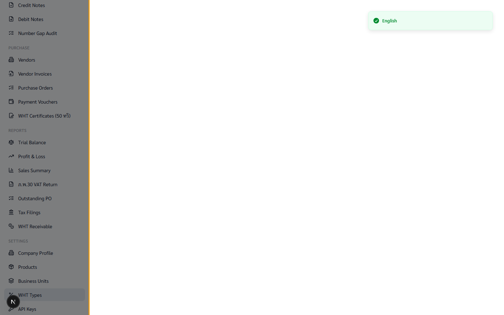
  <figcaption>หน้า dashboard แปลด้วย — "แดชบอร์ด" → "Dashboard", "ภาพรวมระบบ" → "System overview", stat cards: "Tax Invoices this month", "Sales this month", "Output VAT this month", "Number gaps"</figcaption>
</figure>

### ขั้นที่ 4

<figure markdown="span">
  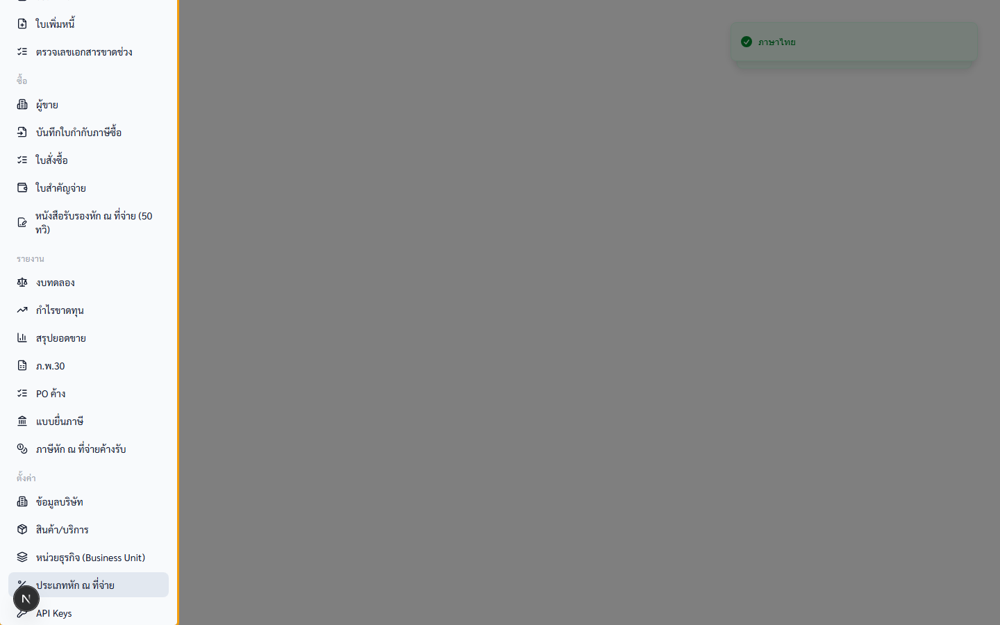
  <figcaption>คลิกอีกครั้ง → กลับเป็นภาษาไทย. Toast "ภาษาไทย" ปรากฏ. ค่าที่เลือกล่าสุดจะถูก save ลง cookie อัตโนมัติ</figcaption>
</figure>

## 01.04 — ออกจากระบบ

> **เงื่อนไขก่อนใช้งาน:** login แล้ว (walkthrough 01.01) · อยู่ที่หน้าใดก็ได้หลัง login (ส่วนใหญ่ใช้จาก dashboard)

การ "ออกจากระบบ" (logout) จะส่ง POST ไปที่ /api/auth/logout — BFF จะ
ลบ httpOnly cookie ที่เก็บ access_token แล้ว redirect กลับ /login.

ความปลอดภัย: เนื่องจาก JWT เก็บเป็น httpOnly cookie (BFF pattern) —
JavaScript ของหน้าเว็บอ่านไม่ได้อยู่แล้ว, การ logout ฝั่ง browser จึง
เพียงพอแม้ยังไม่ revoke token ฝั่ง server (token จะ expire ตามอายุปกติ).

หากต้องการ revoke ทันที (เช่นกรณี mobile device หาย) — admin สามารถ
กดบังคับ logout จาก User Management (ดูบทที่ 6 → "ผู้ใช้งาน" → revoke session).

หมายเหตุ: chapter index เดิมระบุ walkthrough "Dark mode" ที่ 01.04 — แต่
ฟีเจอร์ยังไม่ implement, logout จึงเลื่อนมาเป็น 01.04.

### ขั้นที่ 1

<figure markdown="span">
  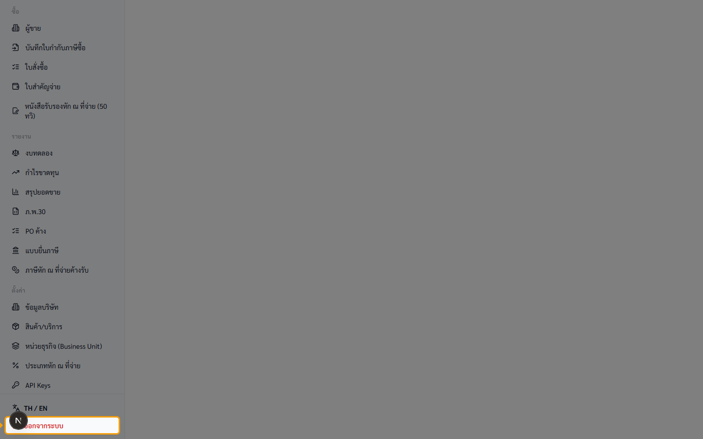
  <figcaption>ปุ่ม "ออกจากระบบ" อยู่ล่างสุดของ sidebar (ใต้ปุ่ม "TH / EN") — สีข้อความเป็นสีแดง บอกว่าเป็น destructive action</figcaption>
</figure>

### ขั้นที่ 2

<figure markdown="span">
  
  <figcaption>หลังคลิก → ระบบจะส่ง POST /api/auth/logout → cookie ถูก clear → redirect กลับหน้า /login. ตอนนี้ session สิ้นสุดแล้ว</figcaption>
</figure>

### ขั้นที่ 3

<figure markdown="span">
  
  <figcaption>ลองกดปุ่ม "Back" ของ browser → ระบบจะ redirect กลับ /login เสมอ (middleware ตรวจ cookie ทุก request). พิสูจน์ว่า session ถูก clear จริง</figcaption>
</figure>
