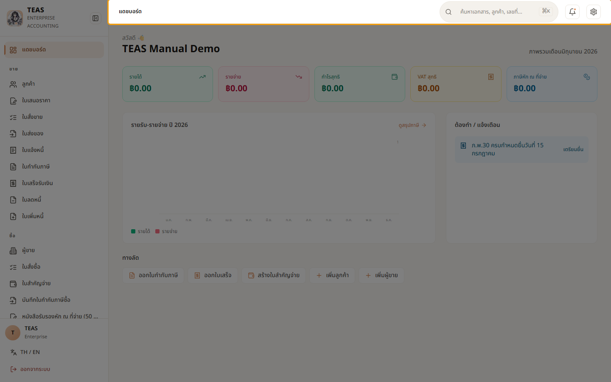
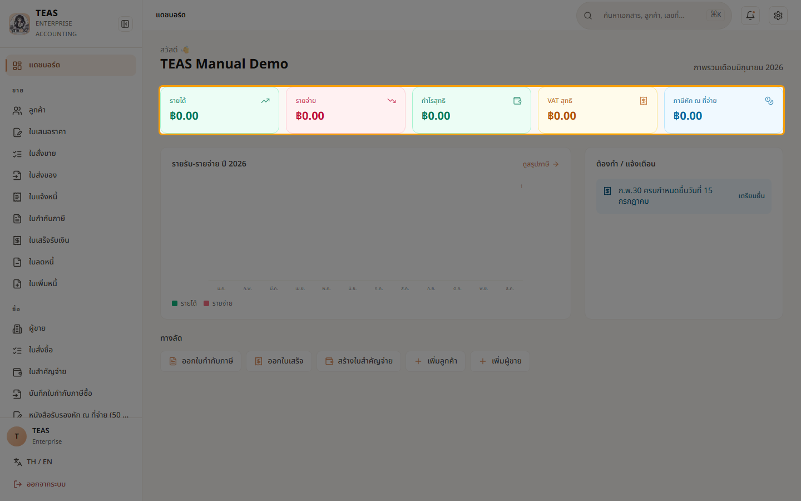
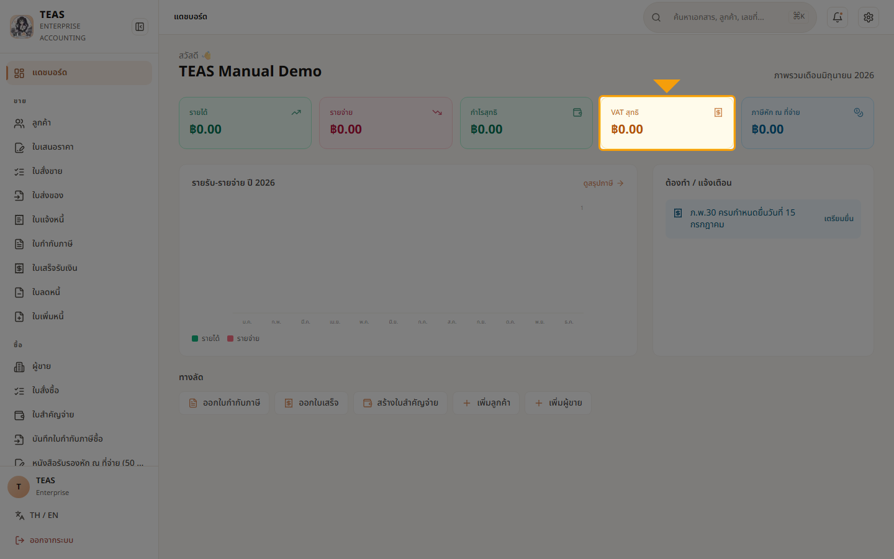
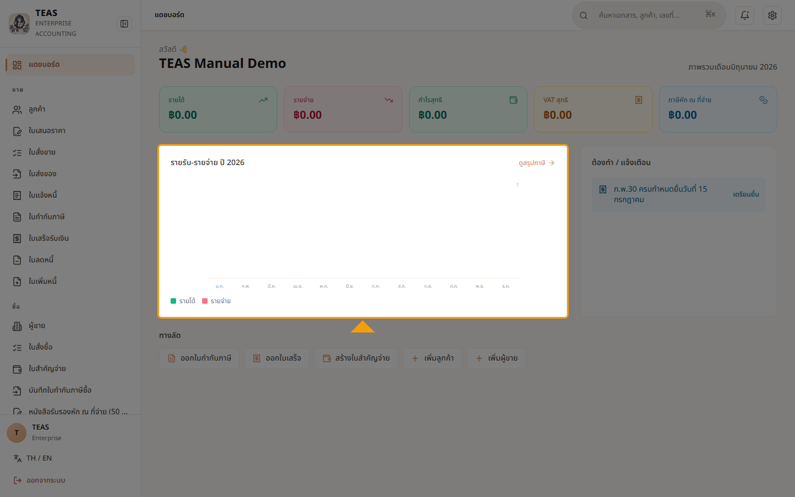
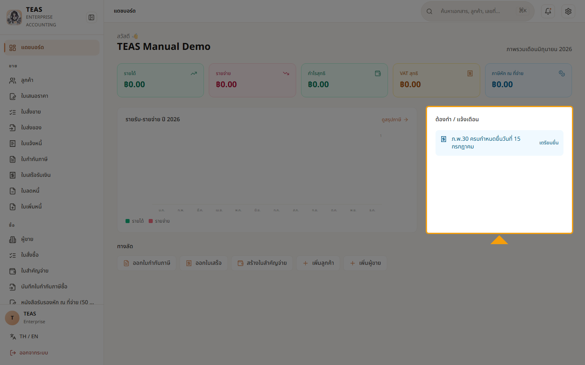
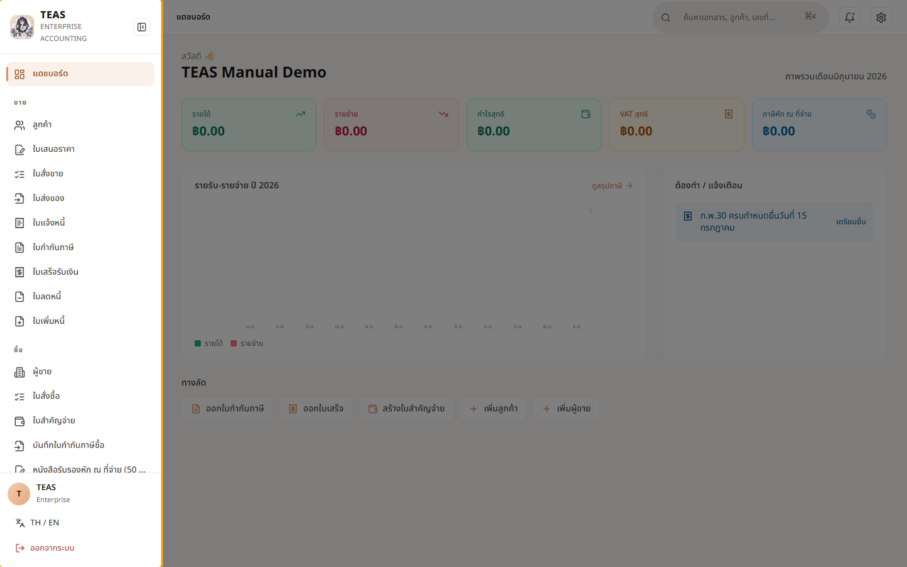

# 1. เริ่มต้นใช้งาน

## 01.01 — เข้าสู่ระบบ

> **เงื่อนไขก่อนใช้งาน:** มี user account ที่ผู้ดูแลระบบสร้างให้แล้ว · รู้ username + password ของตัวเอง

TEAS ใช้รหัสผ่านปกติร่วมกับ MFA (ถ้าเปิดใช้) ผ่านหน้า login เพียงหน้าเดียว.
ระบบจะออก JWT เก็บเป็น httpOnly cookie — ไม่เก็บใน localStorage ของ browser
เพื่อความปลอดภัย (BFF cookie pattern).

ในบทนี้คุณจะได้เรียนรู้:
- หน้าตา login screen
- การกรอก username + password
- หน้า dashboard ที่ปรากฏหลัง login สำเร็จ

### ขั้นที่ 1

<figure markdown="span">
  
  <figcaption>เปิด browser ไปที่ URL ของระบบ — หน้าเข้าสู่ระบบจะแสดงพร้อม ช่อง "ชื่อผู้ใช้" และ "รหัสผ่าน"</figcaption>
</figure>

### ขั้นที่ 2

<figure markdown="span">
  
  <figcaption>กรอก "ชื่อผู้ใช้" ที่ผู้ดูแลระบบให้มา (ตัวอย่างคู่มือนี้ใช้ demo-accountant)</figcaption>
</figure>

### ขั้นที่ 3

<figure markdown="span">
  
  <figcaption>กรอก "รหัสผ่าน" — ตัวอักษรจะถูกซ่อนเป็นจุด. หากตั้ง MFA ไว้ ระบบจะถามรหัส OTP ในขั้นถัดไป</figcaption>
</figure>

### ขั้นที่ 4

<figure markdown="span">
  
  <figcaption>คลิกปุ่ม "เข้าสู่ระบบ" — ระบบจะตรวจสอบ credentials และเปิด session ผ่าน httpOnly cookie</figcaption>
</figure>

### ขั้นที่ 5

<figure markdown="span">
  
  <figcaption>เข้าสู่ระบบสำเร็จ — หน้า "แดชบอร์ด" ปรากฏพร้อมภาพรวมระบบ: ยอดขายเดือนนี้, ภาษีขาย, ใบกำกับภาษี, เลขเอกสารขาดช่วง. เมนูทางซ้ายแสดงโมดูลหลัก: ขาย, ซื้อ, รายงาน</figcaption>
</figure>

## 01.02 — สำรวจหน้าแรก (แดชบอร์ด)

> **เงื่อนไขก่อนใช้งาน:** login แล้ว (walkthrough 01.01) · อยู่ที่ URL / (dashboard root)

หลัง login สำเร็จ ผู้ใช้จะมาที่ "แดชบอร์ด" — หน้าแรกที่สรุปสถานะการเงิน
ของเดือนปัจจุบัน และเป็นจุดเริ่มต้นเข้าทุกโมดูล. ในบทนี้คุณจะรู้จัก:

- **ส่วนหัว** — คำทักทาย + ชื่อบริษัท (ดึงจากข้อมูลบริษัท) + เดือนที่กำลังดู
- **ตัวเลขสำคัญเดือนนี้ (KPI)** — 5 ช่อง: รายได้ / รายจ่าย / กำไรสุทธิ /
  VAT สุทธิ (เฉพาะบริษัทจด VAT) / ภาษีหัก ณ ที่จ่าย
- **กราฟรายรับ-รายจ่ายทั้งปี** + แผง **"ต้องทำ / แจ้งเตือน"** ที่รวมงานค้าง
  (เลขเอกสารขาดช่วง, เอกสารซื้อไม่ครบ, ภ.พ.30 ใกล้ครบกำหนด ฯลฯ)
- **ทางลัด** — ปุ่มสร้างเอกสารที่ใช้บ่อย (แสดงตามสิทธิ์ของผู้ใช้)
- โครงสร้าง **sidebar** ที่แบ่งเป็นกลุ่ม: ขาย / ซื้อ / เงินเดือน / รายงาน / ตั้งค่า

หมายเหตุ: บริษัทตัวอย่างนี้เป็น tenant ใหม่ ยังไม่มีเอกสารที่โพสต์ →
ตัวเลขทุกช่องจึงเป็น ฿0 และกราฟยังว่าง. เมื่อเริ่มออกเอกสารจริง ตัวเลข
จะอัปเดตอัตโนมัติ.

### ขั้นที่ 1

<figure markdown="span">
  
  <figcaption>หน้า "แดชบอร์ด" — หน้าแรกหลัง login. แถบบนสุดมีช่องค้นหาเอกสาร/ลูกค้า (กด ⌘K), กระดิ่งแจ้งเตือน และไอคอนตั้งค่า. ถัดมาเป็นส่วนหัว (คำทักทาย + ชื่อบริษัท + เดือนที่กำลังดู) ตามด้วยตัวเลขสำคัญ, กราฟ, แผงแจ้งเตือน และปุ่มทางลัด — ทั้งหมดของเดือนปัจจุบัน</figcaption>
</figure>

### ขั้นที่ 2

<figure markdown="span">
  
  <figcaption>ส่วนหัว — "สวัสดี 👋" + ชื่อบริษัท (ดึงจากข้อมูลบริษัทที่ตั้งไว้ ในเมนู "ตั้งค่า → ข้อมูลบริษัท" — ดูบท 02.05) และข้อความ "ภาพรวมเดือน…" บอกว่ากำลังดูข้อมูลของเดือนใด</figcaption>
</figure>

### ขั้นที่ 3

<figure markdown="span">
  
  <figcaption>"ตัวเลขสำคัญเดือนนี้" — 5 ช่อง: รายได้, รายจ่าย, กำไรสุทธิ, VAT สุทธิ (เฉพาะบริษัทจด VAT), ภาษีหัก ณ ที่จ่าย. บริษัทใหม่ที่ยังไม่ออก เอกสารจะแสดง ฿0 ทุกช่อง แล้วอัปเดตเองเมื่อโพสต์เอกสาร</figcaption>
</figure>

### ขั้นที่ 4

<figure markdown="span">
  
  <figcaption>ช่อง "VAT สุทธิ" = ภาษีขาย − ภาษีซื้อของเดือนนี้ (ตัวเลขที่จะยื่น ภ.พ.30). มีกำกับ "ต้องชำระ" หรือ "ขอคืนได้" ตามผลลัพธ์. ช่องนี้แสดงเฉพาะ บริษัทที่จดทะเบียน VAT — บริษัทไม่จด VAT จะไม่เห็นช่องนี้</figcaption>
</figure>

### ขั้นที่ 5

<figure markdown="span">
  
  <figcaption>กราฟ "รายรับ-รายจ่าย" ทั้งปี — แท่งคู่รายเดือน (เขียว=รายได้, แดง=รายจ่าย) ครบทั้ง 12 เดือน. tenant ใหม่ยังไม่ออกเอกสาร แท่งจึงเตี้ย (เป็น 0) ทุกเดือน แล้วจะสูงขึ้นเองเมื่อมีรายการจริง. ลิงก์ "ดูสรุปภาษี" มุมขวาบนพาไปหน้าสรุปภาษีรายเดือนแบบละเอียด (บท 07.03)</figcaption>
</figure>

### ขั้นที่ 6

<figure markdown="span">
  
  <figcaption>แผง "ต้องทำ / แจ้งเตือน" — รวมงานค้างที่ต้องจัดการ เช่น เลขเอกสารขาดช่วง, เอกสารซื้อยังไม่ครบ, ภ.พ.30 ใกล้ครบกำหนด. แต่ละรายการ คลิกไปหน้าที่เกี่ยวข้องได้ทันที. ถ้าไม่มีงานค้างจะขึ้น "เรียบร้อยดี" ✓</figcaption>
</figure>

### ขั้นที่ 7

<figure markdown="span">
  
  <figcaption>"ทางลัด" — ปุ่มสร้างเอกสารที่ใช้บ่อย (ออกใบกำกับภาษี, ออกใบเสร็จ, สร้างใบสำคัญจ่าย, เพิ่มลูกค้า/ผู้ขาย). ระบบแสดงเฉพาะปุ่มที่ผู้ใช้มีสิทธิ์ — ผู้ใช้แต่ละบทบาทจึงเห็นปุ่มไม่เหมือนกัน</figcaption>
</figure>

### ขั้นที่ 8

<figure markdown="span">
  
  <figcaption>แถบเมนูซ้าย (sidebar) คือ navigation หลัก แบ่งเป็นกลุ่ม: ขาย / ซื้อ / เงินเดือน / รายงาน / ตั้งค่า (เมนูที่เห็นขึ้นกับสิทธิ์ของผู้ใช้). ด้านล่างสุดมีปุ่มสลับภาษา TH/EN (บท 01.03) และ "ออกจากระบบ" (บท 01.04)</figcaption>
</figure>

## 01.03 — เปลี่ยนภาษา TH / EN

> **เงื่อนไขก่อนใช้งาน:** login แล้ว (walkthrough 01.01) · อยู่ที่ภาษาไทย (default)

TEAS รองรับ 2 ภาษาในหน้าเดียวกัน — ไทย (default) และ English. การสลับ
จะกระทบทั้ง sidebar, headings, labels, และ stat cards ทันที (client-side
locale switch — ไม่ต้อง reload หน้า).

ศัพท์เฉพาะกฎหมายภาษีไทย เช่น "ภ.พ.30", "50 ทวิ", "ภ.ง.ด." จะคงรูปไว้
แม้สลับเป็น English เพราะเป็นชื่อทางการตามมาตรฐานกรมสรรพากร
(เช่น "ภ.พ.30 VAT Return", "WHT Certificates (50 ทวิ)").

User preference จะถูกเก็บไว้ใน cookie ของ browser — ครั้งต่อไปที่ login
ระบบจะจำภาษาที่เลือกล่าสุด.

### ขั้นที่ 1

<figure markdown="span">
  
  <figcaption>ปุ่ม "TH / EN" อยู่ล่างสุดของ sidebar (เหนือปุ่ม "ออกจากระบบ") — เป็น toggle 1-คลิกสลับภาษา</figcaption>
</figure>

### ขั้นที่ 2

<figure markdown="span">
  
  <figcaption>หลังคลิก → toast "English" ปรากฏมุมขวาบน. Sidebar แปลทั้งหมด: "ใบเสนอราคา" → "Quotations", "ใบกำกับภาษี" → "Tax Invoices", "งบทดลอง" → "Trial Balance" ฯลฯ</figcaption>
</figure>

### ขั้นที่ 3

<figure markdown="span">
  
  <figcaption>หน้า dashboard แปลด้วย — "แดชบอร์ด" → "Dashboard", "ภาพรวมระบบ" → "System overview", stat cards: "Tax Invoices this month", "Sales this month", "Output VAT this month", "Number gaps"</figcaption>
</figure>

### ขั้นที่ 4

<figure markdown="span">
  
  <figcaption>คลิกอีกครั้ง → กลับเป็นภาษาไทย. Toast "ภาษาไทย" ปรากฏ. ค่าที่เลือกล่าสุดจะถูก save ลง cookie อัตโนมัติ</figcaption>
</figure>

## 01.04 — ออกจากระบบ

> **เงื่อนไขก่อนใช้งาน:** login แล้ว (walkthrough 01.01) · อยู่ที่หน้าใดก็ได้หลัง login (ส่วนใหญ่ใช้จาก dashboard)

การ "ออกจากระบบ" (logout) จะส่ง POST ไปที่ /api/auth/logout — BFF จะ
ลบ httpOnly cookie ที่เก็บ access_token แล้ว redirect กลับ /login.

ความปลอดภัย: เนื่องจาก JWT เก็บเป็น httpOnly cookie (BFF pattern) —
JavaScript ของหน้าเว็บอ่านไม่ได้อยู่แล้ว, การ logout ฝั่ง browser จึง
เพียงพอแม้ยังไม่ revoke token ฝั่ง server (token จะ expire ตามอายุปกติ).

หากต้องการ revoke ทันที (เช่นกรณี mobile device หาย) — admin สามารถ
กดบังคับ logout จาก User Management (ดูบทที่ 6 → "ผู้ใช้งาน" → revoke session).

หมายเหตุ: chapter index เดิมระบุ walkthrough "Dark mode" ที่ 01.04 — แต่
ฟีเจอร์ยังไม่ implement, logout จึงเลื่อนมาเป็น 01.04.

### ขั้นที่ 1

<figure markdown="span">
  
  <figcaption>ปุ่ม "ออกจากระบบ" อยู่ล่างสุดของ sidebar (ใต้ปุ่ม "TH / EN") — สีข้อความเป็นสีแดง บอกว่าเป็น destructive action</figcaption>
</figure>

### ขั้นที่ 2

<figure markdown="span">
  
  <figcaption>หลังคลิก → ระบบจะส่ง POST /api/auth/logout → cookie ถูก clear → redirect กลับหน้า /login. ตอนนี้ session สิ้นสุดแล้ว</figcaption>
</figure>

### ขั้นที่ 3

<figure markdown="span">
  
  <figcaption>ลองกดปุ่ม "Back" ของ browser → ระบบจะ redirect กลับ /login เสมอ (middleware ตรวจ cookie ทุก request). พิสูจน์ว่า session ถูก clear จริง</figcaption>
</figure>
