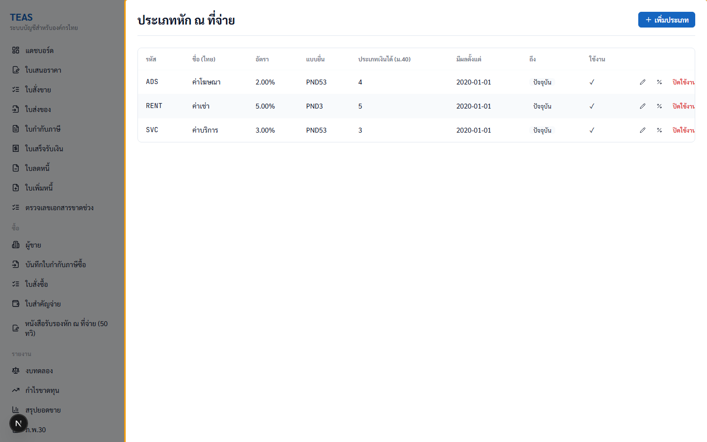
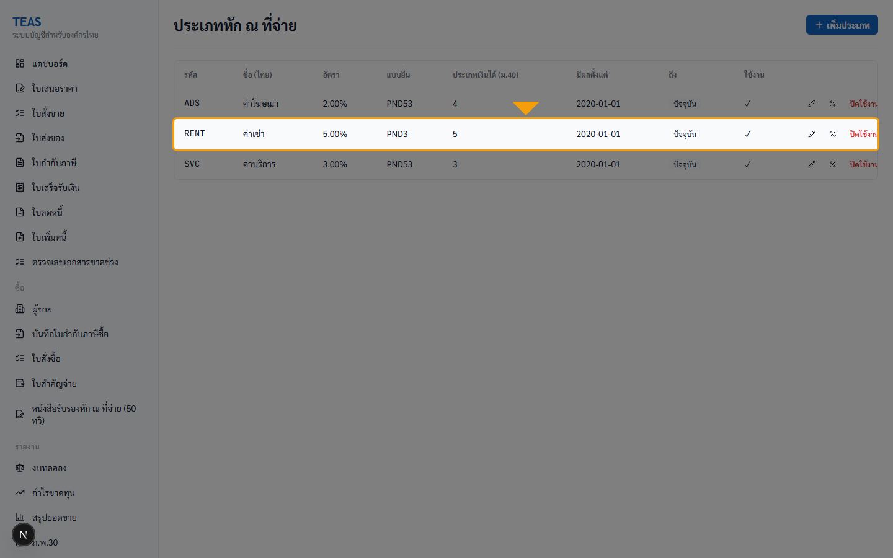
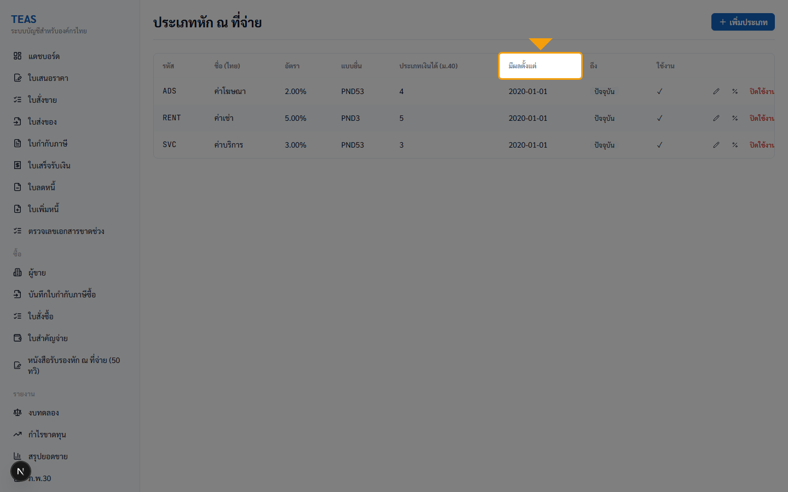
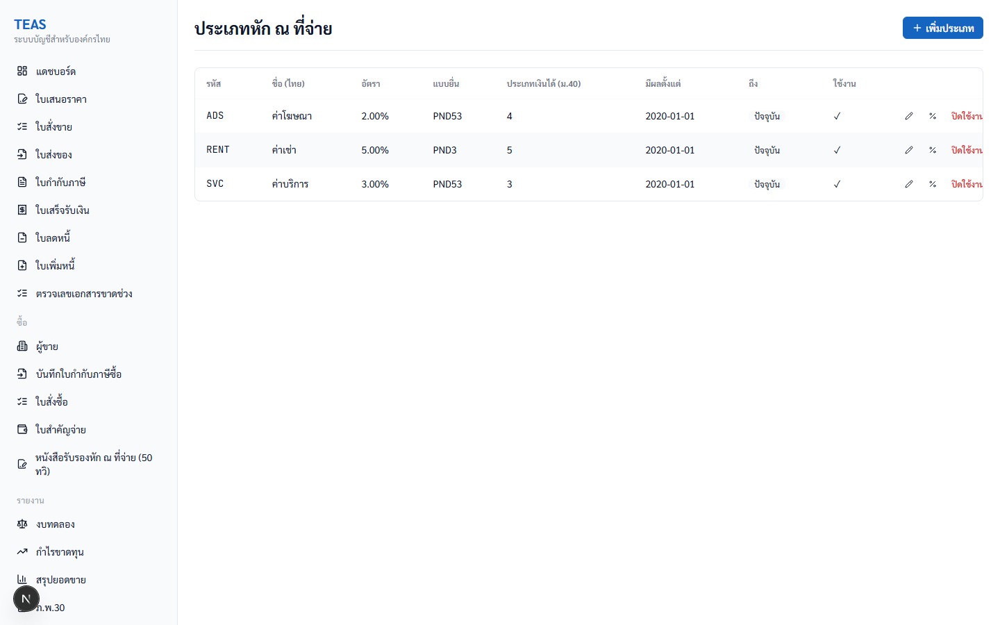
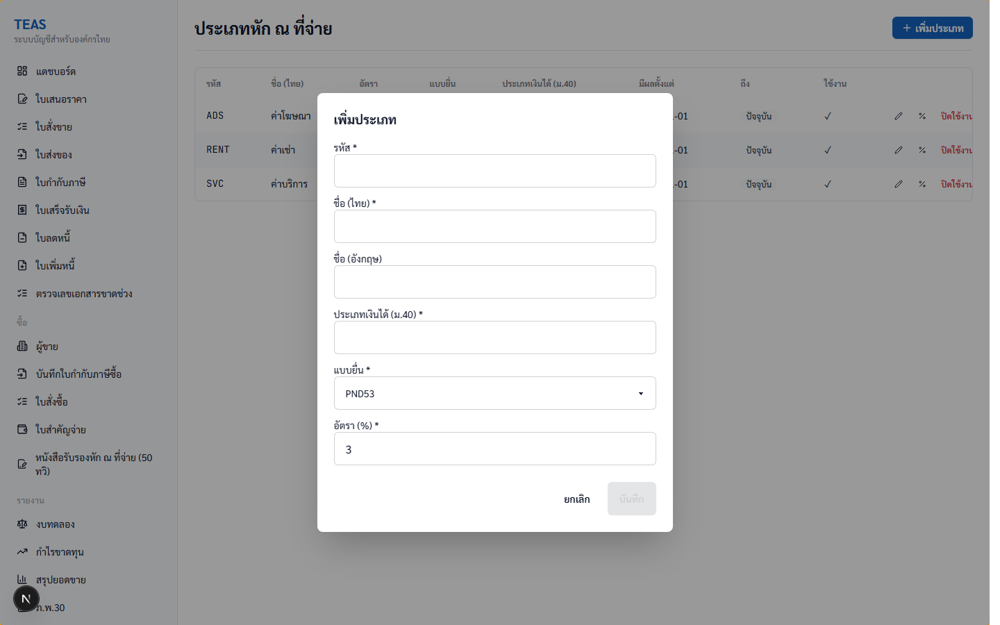
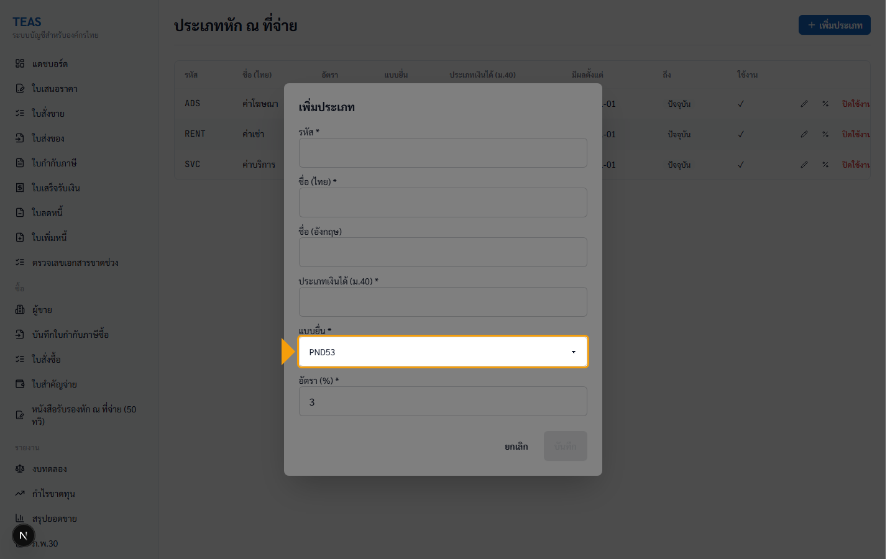
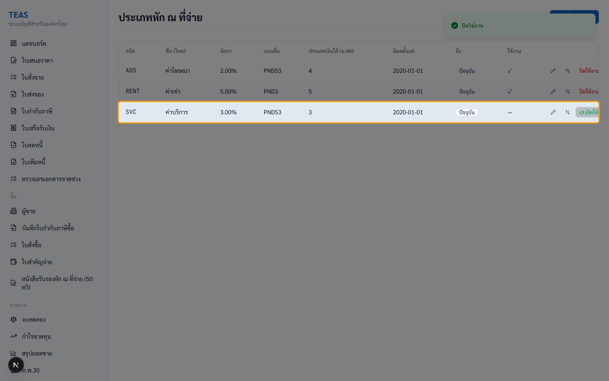
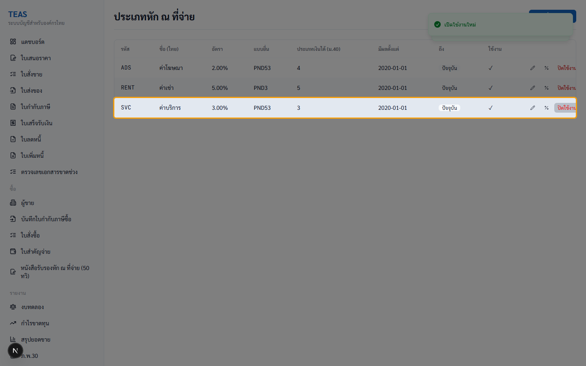
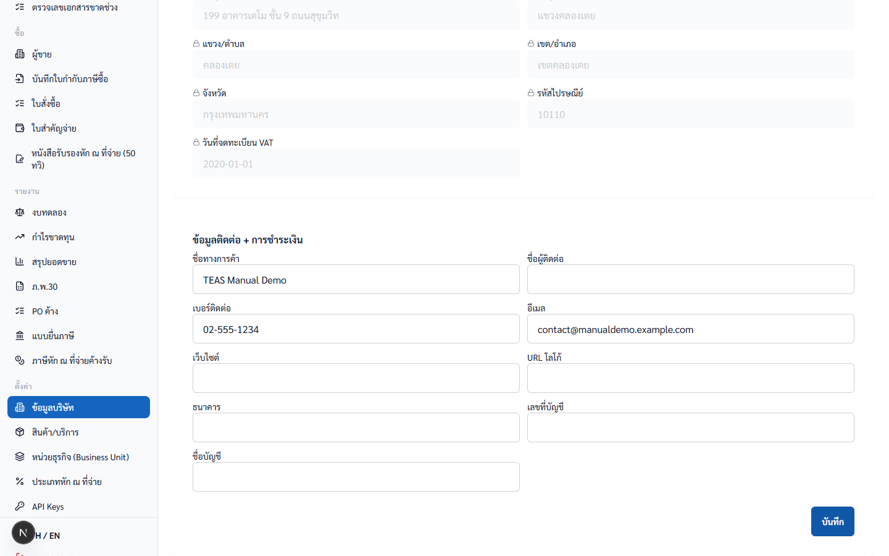

# 2. ตั้งค่าระบบ

## 02.01 — ตั้งค่าหน่วยธุรกิจ (Business Unit)

> **เงื่อนไขก่อนใช้งาน:** login ในฐานะ admin หรือ accountant (ทั้งคู่มีสิทธิ์ master.business_unit.manage) · manual-demo seed applied (ECOM/LAB/REPT)

หน่วยธุรกิจ (BU) ใช้แบ่งกลุ่มภายในบริษัทเดียวกัน — รหัส BU (อักษรพิมพ์ใหญ่
A-Z + ตัวเลข ≤20 ตัว) จะถูกแทรกใน prefix เลขเอกสาร เช่น
`12-2026-TI-ECOM-0001`.

ตั้งให้เรียบร้อยก่อนเริ่มออกเอกสาร — เปลี่ยนรหัสภายหลังจะกระทบเอกสารเก่า
ที่อ้างรหัสเดิม.

ในบทนี้คุณจะได้สาธิตทั้ง 4 actions: เพิ่ม → แก้ไข → ปิดใช้งาน → เปิดใช้งานใหม่.

### ขั้นที่ 1

<figure markdown="span">
  
  <figcaption>หน้า "หน่วยธุรกิจ (Business Unit)" — 3 BUs จาก seed (ECOM อีคอมเมิร์ซ / LAB แล็บ / REPT สัตว์เลื้อยคลาน). คอลัมน์: รหัส, ชื่อ (ไทย), ชื่อ (อังกฤษ), ใช้งาน, [✏️ แก้ไข] [ปิดใช้งาน]</figcaption>
</figure>

### ขั้นที่ 2

<figure markdown="span">
  
  <figcaption>toggle "บังคับระบุหน่วยธุรกิจในเอกสารรายได้" — เมื่อเปิด: ออกใบกำกับภาษี/ใบเสร็จ/ใบลดหนี้/ใบเพิ่มหนี้ ต้องเลือก BU ทุกครั้ง (กดยังต่อไม่ได้ถ้าไม่เลือก)</figcaption>
</figure>

### ขั้นที่ 3

<figure markdown="span">
  
  <figcaption>คลิก "+ เพิ่มหน่วยธุรกิจ" → modal เปิด. Fields: รหัส* (A-Z + 0-9, ≤20), ชื่อ (ไทย)*, ชื่อ (อังกฤษ). ปุ่ม "บันทึก" จะ enable เมื่อกรอก required ครบ</figcaption>
</figure>

### ขั้นที่ 4

<figure markdown="span">
  
  <figcaption>กด "บันทึก" → POST /api/proxy/business-units → toast เขียว "บันทึก" มุมขวาบน → modal ปิด → row ใหม่ "TKZDIU / ทดสอบ KZDIU / Test BU KZDIU" ปรากฏพร้อม ✓ ใช้งาน</figcaption>
</figure>

### ขั้นที่ 5

<figure markdown="span">
  
  <figcaption>คลิก ✏️ แก้ไข ใน row "TKZDIU" → modal เปิดพร้อมค่าปัจจุบัน. ตัวอย่าง: แก้ "ชื่ออังกฤษ" เป็น "Test BU KZDIU (Main)" → กด "บันทึก" → PUT 204 → table refresh. หมายเหตุ: ห้ามแก้รหัส (code) หลังออกเอกสารแล้ว</figcaption>
</figure>

### ขั้นที่ 6

<figure markdown="span">
  
  <figcaption>กด "ปิดใช้งาน" → custom AlertDialog เปิด (Sprint 13d-P1): "⚠️ ยืนยันการทำรายการ — ปิดใช้งานหน่วยธุรกิจนี้? เอกสารเดิมยังอ้างอิงได้". 2 ปุ่ม: "ยกเลิก" (เทา) + "ยืนยัน" (สีแดง — destructive variant)</figcaption>
</figure>

### ขั้นที่ 7

<figure markdown="span">
  
  <figcaption>ยืนยัน → DELETE 204 (soft) → "TKZDIU" row ใช้งาน column เป็น "—" (inactive). ปุ่ม action เปลี่ยน: "ปิดใช้งาน" → "↺ เปิดใช้งานใหม่" (Sprint 13d-P4)</figcaption>
</figure>

### ขั้นที่ 8

<figure markdown="span">
  
  <figcaption>คลิก "↺ เปิดใช้งานใหม่" → PUT isActive=true → toast "เปิดใช้งานใหม่" → row "TKZDIU" กลับเป็น ✓ ใช้งาน + ปุ่มกลับเป็น "ปิดใช้งาน"</figcaption>
</figure>

## 02.02 — ตั้งค่าสินค้า/บริการ

> **เงื่อนไขก่อนใช้งาน:** login (admin หรือ accountant) · manual-demo seed (10 product rows)

สินค้า/บริการคือ master data ที่ใช้ในทุก line item ของเอกสาร
(Quotation, Sales Order, Tax Invoice, Vendor Invoice). การตั้ง
**ประเภท** ให้ถูกต้องสำคัญที่สุด — กระทบการคิด VAT 7% ทันที.

ระบบรองรับ 4 ประเภท:

| ประเภท | VAT 7% | ตัวอย่าง |
|---|---|---|
| GOOD | ✓ ต้องเสีย | ตู้เลี้ยงปลา, เครื่องกรองน้ำ |
| SERVICE | ✓ ต้องเสีย | ค่าที่ปรึกษา, ค่าบริการตรวจ |
| EXEMPT_GOOD | — ยกเว้น | สัตว์มีชีวิต, อาหารสัตว์ |
| EXEMPT_SERVICE | — ยกเว้น | บริการการศึกษา, ค่ารักษาพยาบาล |

ตั้งประเภทผิด → คิด VAT ผิด → ภ.พ.30 ยื่นผิด → โดนเบี้ยปรับ.

รหัส (SKU) จะ lock หลังจากมีการใช้ใน document แล้ว — ตั้งให้ดีตั้งแต่แรก.
"ราคาตั้งต้น" คือ default ที่ pre-fill ตอนเลือกสินค้าในเอกสาร — ผู้ใช้
แก้ราคาในเอกสารได้ตามจริง.

### ขั้นที่ 1

<figure markdown="span">
  
  <figcaption>หน้า "สินค้า/บริการ" — 10 รายการจาก seed. คอลัมน์: รหัส (SKU), ชื่อ (ไทย), ประเภท, ราคาตั้งต้น, สถานะ, [✏️ แก้ไข] [ปิดใช้งาน]</figcaption>
</figure>

### ขั้นที่ 2

<figure markdown="span">
  
  <figcaption>สังเกตคอลัมน์ "ประเภท" — แต่ละ row บอก VAT rule: EXEMPT_GOOD (MP-EXM-* ปลา/อาหารสัตว์ = VAT 0%), GOOD (MP-GD-* อุปกรณ์ = VAT 7%), SERVICE (MP-SVC-* บริการ = VAT 7% + อาจ WHT)</figcaption>
</figure>

### ขั้นที่ 3

<figure markdown="span">
  
  <figcaption>คลิก "+ เพิ่มสินค้า/บริการ" → modal เปิด. Fields: รหัส (SKU)*, ชื่อ (ไทย)*, ชื่อ (อังกฤษ), ประเภท (dropdown 4 options), หน่วยนับ, ราคาตั้งต้น</figcaption>
</figure>

### ขั้นที่ 4

<figure markdown="span">
  
  <figcaption>dropdown "ประเภท" มี 4 options: GOOD (default), SERVICE, EXEMPT_GOOD, EXEMPT_SERVICE. ตัวเลือกที่ขึ้นต้น "EXEMPT_" = ไม่คิด VAT 7%</figcaption>
</figure>

### ขั้นที่ 5

<figure markdown="span">
  
  <figcaption>กด "บันทึก" → POST → toast "บันทึก" → row ใหม่ "MP-SVC-KZMBB / ค่าออกแบบเว็บไซต์ KZMBB / SERVICE / 15,000.00 / ใช้งาน" ปรากฏ. ระบบจะคิด VAT 7% และเตือนหัก ณ ที่จ่ายอัตโนมัติเมื่อใช้ในเอกสาร</figcaption>
</figure>

### ขั้นที่ 6

<figure markdown="span">
  
  <figcaption>กด "ปิดใช้งาน" → AlertDialog เปิด (เหมือน BU 02.01). ถ้าเอกสารเดิมอ้างสินค้านี้ — ยังอ้างได้ (soft delete + audit trail)</figcaption>
</figure>

### ขั้นที่ 7

<figure markdown="span">
  
  <figcaption>row "MP-SVC-KZMBB" สถานะเปลี่ยนเป็น "—" + action เป็น "↺ เปิดใช้งานใหม่". Restore = PUT isActive=true (Sprint 13d-P4)</figcaption>
</figure>

## 02.03 — ตั้งค่าประเภทหัก ณ ที่จ่าย (Admin only)

> **เงื่อนไขก่อนใช้งาน:** login ในฐานะ ADMIN (demo-admin) — ไม่ใช่ accountant · manual-demo seed (3 WHT rows: ADS/RENT/SVC)

ระบบหัก ณ ที่จ่าย (WHT) ในไทยต้องระบุ 3 อย่างพร้อมกัน:

1. **ประเภทเงินได้ (มาตรา 40)** — บอกประเภทของรายได้
   (ม.40(2) ค่าจ้าง, ม.40(3) ค่าลิขสิทธิ์, ม.40(4) ดอกเบี้ย/ปันผล,
   ม.40(5) ค่าเช่า, ม.40(6) วิชาชีพอิสระ, ม.40(7) รับเหมา, ม.40(8) อื่น ๆ)
2. **อัตรา (%)** — เปอร์เซ็นต์หัก ณ ที่จ่าย (เช่น 3%, 5%, 15%)
3. **แบบยื่น** — ภ.ง.ด.1 (เงินเดือน) / ภ.ง.ด.3 (จ่ายให้บุคคล) /
   ภ.ง.ด.53 (จ่ายให้นิติบุคคล) / ภ.ง.ด.54 (จ่ายต่างประเทศ)

**Effective-date pattern**: อัตรา WHT เปลี่ยนตามกฎหมายเป็นบางช่วง — ระบบ
เก็บประวัติอัตราผ่านปุ่ม "เปลี่ยนอัตรา" (ดู step 4). ระบบจะใช้อัตรา
ที่ถูกต้องตามวันที่เอกสารจริง ไม่ใช่อัตราล่าสุด — สอดคล้องกับเอกสารเก่า
ที่ออกก่อนเปลี่ยนกฎหมาย.

**ต้องเป็น admin role** (`tax.wht_type.manage` scope) เพื่อจะ CRUD —
accountant อ่านได้แต่ไม่เห็นปุ่ม action.

### ขั้นที่ 1

<figure markdown="span">
  
  <figcaption>หน้า "ประเภทหัก ณ ที่จ่าย" — 3 ประเภทจาก seed สำหรับ tenant นี้: ADS (ค่าโฆษณา) 2% PND53, RENT (ค่าเช่า) 5% PND3, SVC (ค่าบริการ) 3% PND53. หมายเหตุ: Sprint 13f แก้ cross-tenant leak — ก่อนหน้านี้ admin เห็น 18 rows รวมข้อมูล tenant อื่น</figcaption>
</figure>

### ขั้นที่ 2

<figure markdown="span">
  
  <figcaption>แต่ละ row บอก รหัส, ชื่อ, อัตรา, แบบยื่น (PND3/PND53), ประเภทเงินได้ (ม.40), ช่วงมีผล (มีผลตั้งแต่ — ถึง), สถานะ, actions: [✏️ แก้ไข] [% เปลี่ยนอัตรา] [ปิดใช้งาน]</figcaption>
</figure>

### ขั้นที่ 3

<figure markdown="span">
  
  <figcaption>คอลัมน์ "มีผลตั้งแต่ / ถึง" — แสดงช่วงเวลาที่อัตรานี้ใช้. "ปัจจุบัน" = row ที่ใช้อยู่ตอนนี้. row เก่ามี "ถึง" เป็นวันที่ — ใช้กับ เอกสารที่ออกก่อนวันนั้น (เก็บประวัติเพื่อ render เอกสารเก่าถูกต้อง)</figcaption>
</figure>

### ขั้นที่ 4

<figure markdown="span">
  
  <figcaption>ปุ่ม "% เปลี่ยนอัตรา" — ใช้เมื่อกฎหมายเปลี่ยนอัตรา (เช่น สรรพากรลด WHT 3% → 1.5%). ระบบจะสร้าง row ใหม่ + set "ถึง" ของ row เก่าเป็นวันก่อนหน้า → เอกสารเก่าใช้อัตราเดิม, เอกสารใหม่ ใช้อัตราใหม่ (effective-date pattern, plan §16.4)</figcaption>
</figure>

### ขั้นที่ 5

<figure markdown="span">
  
  <figcaption>คลิก "+ เพิ่มประเภท" → modal เปิด. Fields: รหัส*, ชื่อ (ไทย)*, ชื่อ (อังกฤษ), ประเภทเงินได้ (ม.40)*, แบบยื่น (dropdown), อัตรา (%)*</figcaption>
</figure>

### ขั้นที่ 6

<figure markdown="span">
  
  <figcaption>dropdown "แบบยื่น" — ภ.ง.ด.1 (เงินเดือน), ภ.ง.ด.3 (บุคคลธรรมดา), ภ.ง.ด.53 (นิติบุคคล — ใช้บ่อยสุด)</figcaption>
</figure>

### ขั้นที่ 7

<figure markdown="span">
  
  <figcaption>⚠️ คลิก "ปิดใช้งาน" SVC row → disable ทันที (no confirm). Sprint 13d-P1 ได้ migrate 7 callers จาก window.confirm → AlertDialog แต่ WHT-types ยังไม่ในชุดนั้น (task #58). ระวังการคลิกผิด</figcaption>
</figure>

### ขั้นที่ 8

<figure markdown="span">
  
  <figcaption>SVC row inactive แล้ว action เปลี่ยนเป็น "↺ เปิดใช้งานใหม่". คลิก → POST /wht-types/{id}/reactivate → 204 → toast "เปิดใช้งานใหม่" → row กลับมา active (Sprint 13f-P2 Option A: dedicated endpoint)</figcaption>
</figure>

## 02.04 — สร้าง API Keys (Admin only)

> **เงื่อนไขก่อนใช้งาน:** login ในฐานะ ADMIN (demo-admin) · BU ตั้งครบแล้ว (walkthrough 02.01) · ทราบว่า external app จะใช้ scopes อะไรบ้าง (least privilege)

API Key ใช้ให้ระบบภายนอก (microservice, mobile app, partner integration)
เรียก TEAS โดยไม่ต้อง login. แต่ละ key มี:

- **Scopes** — granular permissions เฉพาะที่จำเป็น (least privilege)
  เช่น `sales.tax_invoice.create`, `sales.receipt.post`
- **Business Unit เริ่มต้น** (Sprint 14) — ผูก key กับ 1 BU
  เอกสารที่สร้างจาก key นี้จะถูก tag กับ BU นั้นอัตโนมัติ —
  ป้องกัน microservice ของ ECOM ไปสร้างเอกสารใน LAB โดยไม่ตั้งใจ
- **หมดอายุ** (optional) — แนะนำตั้งสำหรับ contractor / temp staff

**🔐 สำคัญ — key เห็นได้ครั้งเดียวเท่านั้น**: หลังกด "สร้าง" ระบบจะแสดง
full key 1 ครั้ง. ระบบเก็บแค่ hash + prefix. ถ้าไม่ copy เก็บใน secret
manager ของ external app → ลืมแล้วต้องสร้างใหม่ (revoke ของเก่า).

**Request header**: external app ส่ง key มาทาง `X-Api-Key: <full_key>`
ในทุก request ไป `/api/v1/*` endpoints.

**Role**: ADMIN only — sys.api_key.manage scope. Accountant เห็น
NoAccessState ("ต้องมีสิทธิ์ผู้ดูแลระบบ").

### ขั้นที่ 1

<figure markdown="span">
  
  <figcaption>หน้า "API Keys" — เริ่มต้นไม่มี key (empty state พร้อม icon). คอลัมน์: ชื่อ, Key prefix, สิทธิ์ (scopes), Business Unit เริ่มต้น, ใช้ล่าสุด, หมดอายุ, สถานะ</figcaption>
</figure>

### ขั้นที่ 2

<figure markdown="span">
  
  <figcaption>หมายเหตุ — accountant ที่เข้าหน้านี้จะเห็น "ต้องมีสิทธิ์ ผู้ดูแลระบบ" (Sprint 13d-P2 NoAccessState) + ไม่มีปุ่ม "+ สร้าง" (Sprint 13d-P3 PermissionGate). ต้อง admin เท่านั้น</figcaption>
</figure>

### ขั้นที่ 3

<figure markdown="span">
  
  <figcaption>คลิก "+ สร้าง API key" → modal เปิด. 4 sections: ชื่อ*, สิทธิ์ (scopes)*, Business Unit เริ่มต้น, หมดอายุ</figcaption>
</figure>

### ขั้นที่ 4

<figure markdown="span">
  
  <figcaption>กรอก "ชื่อ" — ใช้บอกว่า key นี้สำหรับอะไร (เช่น "ECOM Storefront — production"). ไม่กระทบความปลอดภัย แต่ช่วย ตอน revoke ทีหลัง</figcaption>
</figure>

## 02.05 — ตั้งค่าข้อมูลบริษัท (Company Profile — ทำก่อนเป็นอันแรก)

> **เงื่อนไขก่อนใช้งาน:** login ในฐานะ ADMIN (demo-admin) สำหรับ edit · manual-demo seed (รัน 410_seed_manual_demo_company_profile.sql)

ข้อมูลบริษัทถูก embed ในทุกเอกสารทางภาษี (Tax Invoice / Receipt / CN / DN
header). ตามกฎหมาย ข้อมูลที่พิมพ์ในเอกสารต้องตรงกับ ภ.พ.20 ที่จดทะเบียน
VAT กับกรมสรรพากร.

**Hybrid lock model** (plan §6.7):

**Hard fields (อ่านอย่างเดียวใน Phase 1):**
- ชื่อนิติบุคคล, เลขผู้เสียภาษี, เลขทะเบียนนิติบุคคล, รหัสสาขา
- ที่อยู่จดทะเบียน (line 1+2, แขวง, เขต, จังหวัด, ไปรษณีย์)
- วันที่จดทะเบียน VAT

→ ต้องแก้ผ่าน ops + ยื่น ภ.พ.09 ก่อน. Phase 2 จะมี 2-person approval +
attachment upload ของ ภ.พ.09.

**Soft fields (admin role แก้ได้):**
- ชื่อทางการค้า (Brand name), โลโก้, เบอร์, อีเมล, เว็บไซต์, ผู้ติดต่อ
- Banking info (สำหรับ payment instructions)

**สำคัญ**: ทำ walkthrough นี้ **ก่อน** walkthrough อื่นใน chapter 2 หาก
เพิ่งตั้ง tenant ใหม่ — เพราะข้อมูลถูก embed ในเอกสารที่ออกหลังจากนั้น.

**Role**:
- Read: ทุก authenticated user (ใช้ render document headers)
- Update soft: ADMIN only (master.company.manage scope)
- Update hard: returns 501 — Phase 2 feature

### ขั้นที่ 1

<figure markdown="span">
  
  <figcaption>หน้า "ข้อมูลบริษัท" (sidebar "ตั้งค่า" → ลิงก์แรก). 2 sections: "ข้อมูลทางกฎหมาย" (hard, locked) + "ข้อมูลติดต่อ + การชำระเงิน" (soft, editable). Banner ⚠️ ส้มด้านบนเตือนเรื่อง ภ.พ.09</figcaption>
</figure>

### ขั้นที่ 2

<figure markdown="span">
  
  <figcaption>Banner ⚠️ — "การเปลี่ยนข้อมูลทางกฎหมายของบริษัทควรอัปเดต ภ.พ.20 ที่กรมสรรพากรก่อน (ยื่น ภ.พ.09)". ผู้ใช้ต้องไปสรรพากรก่อน จึงจะมาแก้ในระบบ</figcaption>
</figure>

### ขั้นที่ 3

<figure markdown="span">
  
  <figcaption>Section "ข้อมูลทางกฎหมาย" 🔒 — 11 fields ทั้งหมด disabled+readOnly. ตัวอย่าง: ชื่อนิติบุคคล "บริษัท แมนนวล เดโม จำกัด", เลขผู้เสียภาษี 0000000000002, ที่อยู่ "199 อาคารเดโม ชั้น 9 ถนนสุขุมวิท", จังหวัดกรุงเทพ, รหัสไปรษณีย์ 10110, วันที่จดทะเบียน VAT 2020-01-01. ไม่มีปุ่ม Save section นี้ (read-only by design)</figcaption>
</figure>

### ขั้นที่ 4

<figure markdown="span">
  
  <figcaption>hover hard field → tooltip: "การเปลี่ยนข้อมูลนี้ต้องผ่านขั้นตอนพิเศษ — ติดต่อผู้ดูแลระบบหรือยื่น ภ.พ.09 ก่อน". อธิบายworkaround ให้ผู้ใช้ทราบทันทีโดยไม่ต้องไปอ่านคู่มือ</figcaption>
</figure>

### ขั้นที่ 5

<figure markdown="span">
  
  <figcaption>Section "ข้อมูลติดต่อ + การชำระเงิน" — fields editable: ชื่อทางการค้า, โลโก้ URL, เบอร์ติดต่อ, อีเมล, เว็บไซต์, ผู้ติดต่อ, Banking (ธนาคาร / เลขที่บัญชี / ชื่อบัญชี). ปุ่ม "บันทึก" สำหรับ section นี้แยกต่างหาก</figcaption>
</figure>

### ขั้นที่ 6

<figure markdown="span">
  
  <figcaption>กรอกตัวอย่าง — ชื่อทางการค้า "TEAS Manual Demo", เบอร์ "02-555-1234", อีเมล "contact@manualdemo.example.com"</figcaption>
</figure>

### ขั้นที่ 7

<figure markdown="span">
  
  <figcaption>กด "บันทึก" → PUT /api/proxy/company-profile/soft → 204 → toast เขียว → fields ใหม่ persistent. Hard fields ไม่กระทบ (ดู section "ข้อมูลทางกฎหมาย" ด้านบน — ค่าเดิม)</figcaption>
</figure>

### ขั้นที่ 8

<figure markdown="span">
  
  <figcaption>"URL โลโก้" — Phase 1 รับ URL อย่างเดียว (ยังไม่มี upload widget). Phase 2 จะรองรับ upload ผ่าน Sprint 11 attachment infra. Workaround: host logo บน CDN/S3 ของตัวเอง + ใส่ URL ที่นี่</figcaption>
</figure>
