# 3. ข้อมูลหลัก

## 03.01 — สร้างลูกค้า

> **เงื่อนไขก่อนใช้งาน:** login ในฐานะผู้มีสิทธิ์ master.customer.manage (admin)

ลูกค้า (Customer) คือ master data ที่ใช้เป็น "ผู้ซื้อ" ในทุกเอกสารขาย
(ใบเสนอราคา → ใบกำกับภาษี → ใบเสร็จ). ต้องสร้างลูกค้าก่อนจึงจะออกเอกสารให้ได้.

ฟอร์มแบ่งเป็น 4 ส่วน:

- **ข้อมูลทั่วไป** — รหัสลูกค้า*, ชื่อ (ไทย)*, ชื่อ (อังกฤษ), ประเภท (บุคคลธรรมดา / นิติบุคคล)
- **ข้อมูลภาษี** — จดทะเบียน VAT, เลขประจำตัวผู้เสียภาษี, รหัสสาขา
- **ที่อยู่ / ผู้ติดต่อ** — ที่อยู่ออกใบกำกับ, ผู้ติดต่อ, โทรศัพท์, อีเมล
- **เงื่อนไขการค้า** — วงเงินเครดิต, เครดิตเทอม, สกุลเงิน

**สำคัญ (กฎหมาย ม.86/4):** ถ้าลูกค้าจดทะเบียน VAT ต้องกรอก **เลขประจำตัวผู้เสียภาษี
(13 หลัก)** + **รหัสสาขา (5 หลัก, 00000 = สำนักงานใหญ่)** เพราะข้อมูลนี้ต้องพิมพ์
ลงบนใบกำกับภาษีของผู้ซื้อที่เป็นผู้ประกอบการ VAT.

### ขั้นที่ 1

<figure markdown="span">
  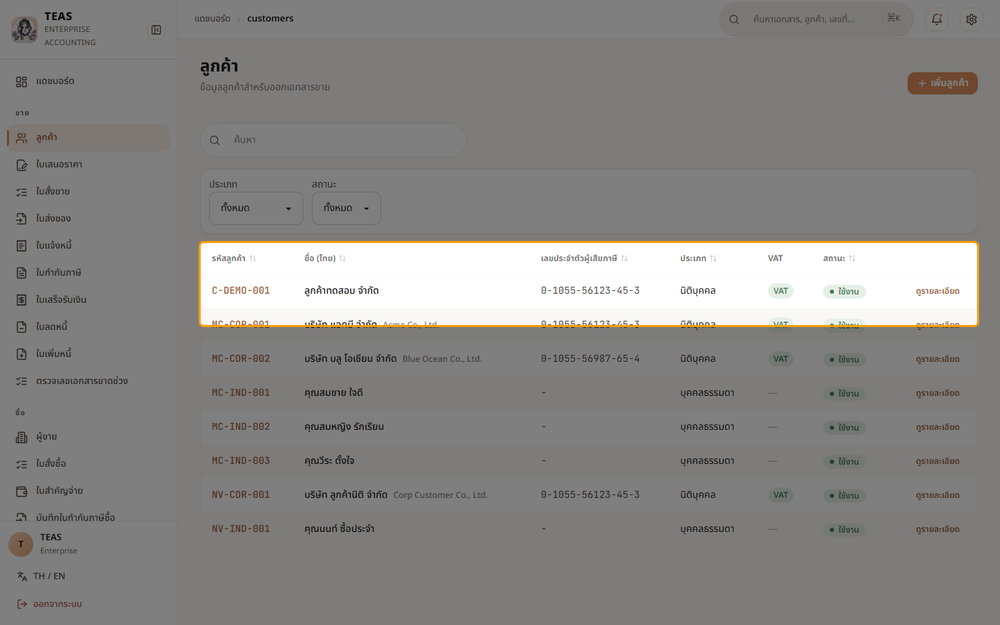
  <figcaption>หน้า "ลูกค้า" — รายการลูกค้าทั้งหมด. คอลัมน์: รหัส, ชื่อ, ประเภท, เลขผู้เสียภาษี, สถานะ. ปุ่ม "เพิ่มลูกค้า" มุมขวาบนเปิดฟอร์มสร้างใหม่</figcaption>
</figure>

### ขั้นที่ 2

<figure markdown="span">
  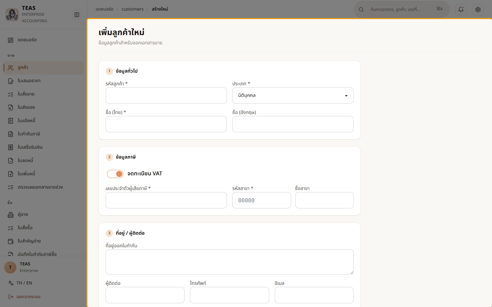
  <figcaption>ฟอร์ม "เพิ่มลูกค้าใหม่" — 4 ส่วน: ข้อมูลทั่วไป, ข้อมูลภาษี, ที่อยู่/ผู้ติดต่อ, เงื่อนไขการค้า. ช่องที่มี * คือบังคับ (รหัส + ชื่อไทย)</figcaption>
</figure>

### ขั้นที่ 3

<figure markdown="span">
  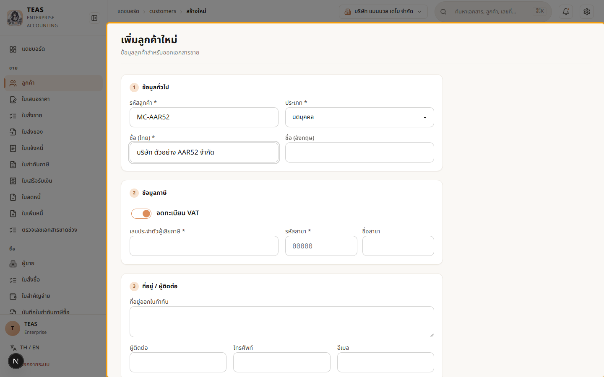
  <figcaption>กรอกข้อมูลทั่วไป — รหัส "MC-AAR52" + ชื่อไทย. ลูกค้าที่ จดทะเบียน VAT (สวิตช์ "จดทะเบียน VAT" ในส่วนข้อมูลภาษี เปิดเป็นค่าตั้งต้น) ต้องกรอกเลขผู้เสียภาษี 13 หลัก + รหัสสาขา (ม.86/4). เสร็จแล้วกด "บันทึก" ลูกค้าจะพร้อมใช้ในเอกสารขายทันที</figcaption>
</figure>

## 03.02 — สร้างผู้ขาย

> **เงื่อนไขก่อนใช้งาน:** login ในฐานะผู้มีสิทธิ์ master.vendor.manage (admin)

ผู้ขาย (Vendor) คือ master data ฝั่งซื้อ — ใช้เป็นคู่ค้าในใบสั่งซื้อ,
ใบกำกับภาษีซื้อ, และใบสำคัญจ่าย. การตั้งค่าผู้ขายให้ถูกต้องสำคัญต่อ
**ภาษีซื้อ (Input VAT)** ที่ขอคืนได้ และ **ภาษีหัก ณ ที่จ่าย (WHT)**.

ฟอร์มรองรับเคสพิเศษที่กระทบภาษีอัตโนมัติ:

- **ผู้ขายจดทะเบียน VAT / ไม่จด** — non-VAT (รายได้ < 1.8 ล้าน หรือบุคคลธรรมดา)
  ออกได้แค่ใบเสร็จ, เคลม Input VAT ไม่ได้, แต่ยังหัก WHT ได้ปกติ
- **ผู้ขายต่างประเทศ** — ถ้ายังไม่จด VAT-D ในไทย ระบบจะ default หัก WHT 15% (ม.70)
  + self-assess VAT 7% (ภ.พ.36) ตอนสร้าง PV/VI ให้อัตโนมัติ

กรอกข้อมูลให้ถูกตั้งแต่สร้าง → ระบบคิดภาษีตอนทำเอกสารซื้อให้ถูกเอง.

### ขั้นที่ 1

<figure markdown="span">
  
  <figcaption>หน้า "ผู้ขาย" — รายการผู้ขายทั้งหมด. ปุ่ม "เพิ่มผู้ขาย" มุมขวาบนเปิดฟอร์มสร้างใหม่</figcaption>
</figure>

### ขั้นที่ 2

<figure markdown="span">
  
  <figcaption>ฟอร์ม "เพิ่มผู้ขาย" — รหัสผู้ขาย*, ประเภท (นิติบุคคล/บุคคลธรรมดา), ชื่อ*, เลขผู้เสียภาษี, รหัสสาขา, เครดิต, ที่อยู่ + ข้อมูลการชำระเงิน (ธนาคาร/เลขบัญชี). มีสวิตช์ "Vendor ต่างประเทศ" / "จด VAT" สำหรับเคสพิเศษ</figcaption>
</figure>

### ขั้นที่ 3

<figure markdown="span">
  
  <figcaption>กรอกรหัส "MV-AAXQ7" + ชื่อไทย. เลือกประเภท/สวิตช์ VAT ให้ตรง กับสถานะจริงของผู้ขาย เพราะมีผลต่อการคิด Input VAT + WHT ตอนทำเอกสารซื้อ. กด "บันทึกผู้ขาย" เพื่อเพิ่มเข้า master</figcaption>
</figure>

## 03.03 — ลูกค้าบุคคลธรรมดา (ไม่มีเลขผู้เสียภาษี)

> **เงื่อนไขก่อนใช้งาน:** login admin (สิทธิ์ master.customer.manage + tax_invoice)

ลูกค้าแบ่งเป็น 2 ประเภท: **นิติบุคคล** (บริษัท/ห้างฯ) และ **บุคคลธรรมดา**
(ผู้บริโภคทั่วไป, ฟรีแลนซ์, ร้านเล็ก ๆ ที่ไม่จด VAT). การตั้งประเภทให้ถูกมีผลต่อ
เอกสารภาษีโดยตรง:

- **ประเภท** (บุคคลธรรมดา / นิติบุคคล) — เลือกตอนสร้าง แก้ภายหลังไม่ได้.
- **สวิตช์ "จดทะเบียน VAT"** — ลูกค้าบุคคลธรรมดาทั่วไป **ไม่จด VAT** → "ปิด" สวิตช์นี้.
  เมื่อปิดแล้ว ช่อง **เลขประจำตัวผู้เสียภาษี (13 หลัก) + รหัสสาขา เลิกเป็นช่องบังคับ**
  (เครื่องหมาย * หาย) เพราะไม่ต้องใช้.

**กฎหมาย ม.86/4 #3:** ใบกำกับภาษีต้องมีเลขผู้เสียภาษีของผู้ซื้อ **เฉพาะเมื่อผู้ซื้อจด VAT**.
ลูกค้าบุคคลธรรมดาที่ไม่จด VAT จึงออกใบกำกับภาษีให้ได้ตามปกติ แต่บล็อกผู้ซื้อบนเอกสาร
แสดงแค่ "ชื่อ" — ไม่มีเลขผู้เสียภาษี (เพราะผู้ซื้อนำไปเคลมภาษีซื้อไม่ได้อยู่แล้ว).

### ขั้นที่ 1

<figure markdown="span">
  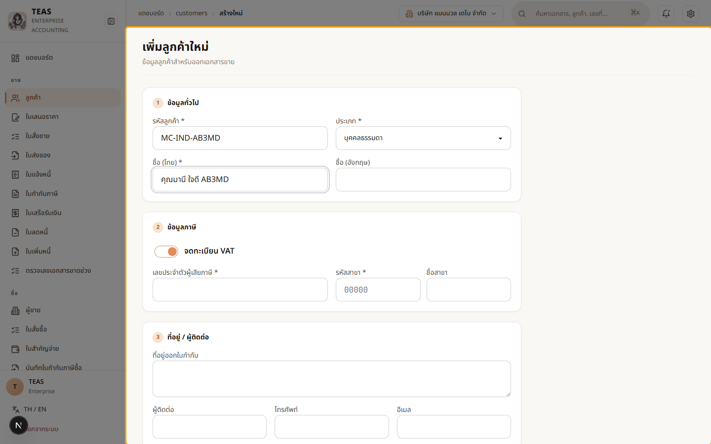
  <figcaption>สร้างลูกค้าใหม่ — ช่อง "ประเภท" เลือก "บุคคลธรรมดา" (ผู้บริโภคทั่วไป/ฟรีแลนซ์). กรอกรหัส + ชื่อไทย. ประเภทนี้ตั้งได้ตอนสร้าง เท่านั้น แก้ภายหลังไม่ได้</figcaption>
</figure>

### ขั้นที่ 2

<figure markdown="span">
  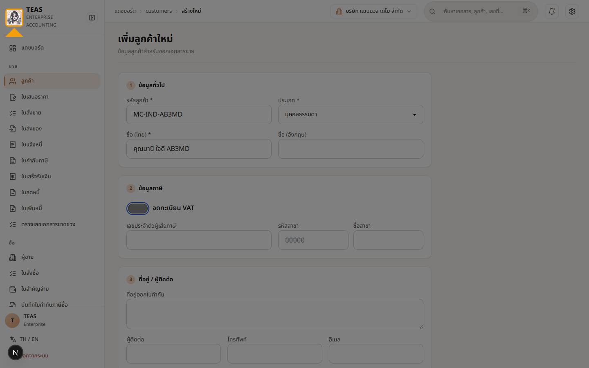
  <figcaption>ปิดสวิตช์ "จดทะเบียน VAT" (ลูกค้าบุคคลธรรมดาทั่วไปไม่จด VAT) → ช่อง "เลขประจำตัวผู้เสียภาษี" และ "รหัสสาขา" เลิกเป็นช่องบังคับทันที (เครื่องหมาย * หายไป) เพราะ ม.86/4 ไม่ต้องใช้เลขผู้เสียภาษีของผู้ซื้อที่ไม่จด VAT</figcaption>
</figure>

### ขั้นที่ 3

<figure markdown="span">
  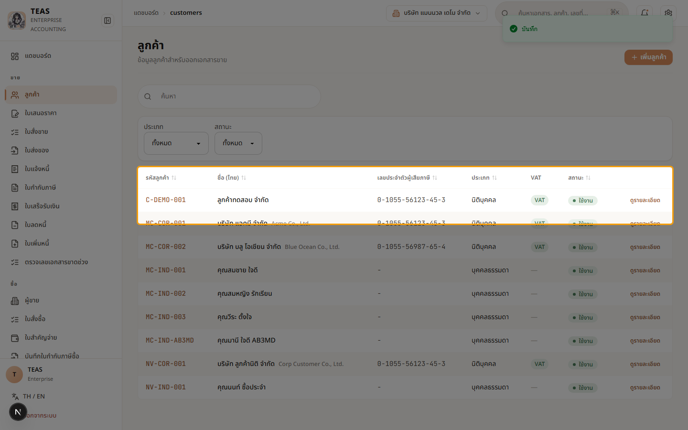
  <figcaption>บันทึกแล้ว — ลูกค้าบุคคลธรรมดา "คุณมานี ใจดี AB3MD" เข้า master (คอลัมน์ "ประเภท" = บุคคลธรรมดา, ไม่มีเลขผู้เสียภาษี). พร้อมใช้เป็นผู้ซื้อในเอกสารขาย</figcaption>
</figure>

### ขั้นที่ 4

<figure markdown="span">
  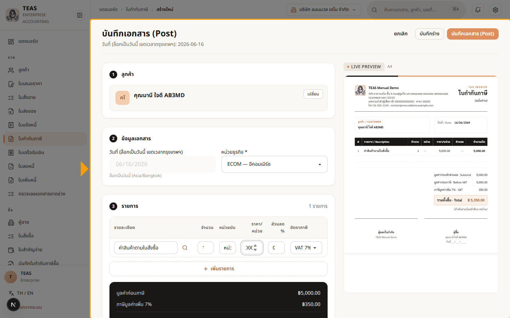
  <figcaption>ออกใบกำกับภาษีให้ "คุณมานี ใจดี AB3MD" — ตัวอย่างเอกสารด้านขวา บล็อกผู้ซื้อ แสดงแค่ "ชื่อ" ไม่มีเลขประจำตัวผู้เสียภาษี 13 หลัก (ม.86/4 #3 ไม่บังคับเมื่อ ผู้ซื้อไม่จด VAT). ยังเป็นใบกำกับภาษีเต็มรูปถูกต้อง และคิด VAT 7% ตามปกติ (ไม่ post)</figcaption>
</figure>

## 03.04 — หมวดค่าใช้จ่าย

> **เงื่อนไขก่อนใช้งาน:** login ในฐานะผู้มีสิทธิ์ sys.expense_category.manage (admin)

หมวดค่าใช้จ่าย (Expense Category) ใช้ติดป้ายให้แต่ละบรรทัดค่าใช้จ่ายในใบสำคัญจ่าย
(PV) / ใบกำกับภาษีซื้อ (VI) เพื่อให้ระบบรู้ 2 เรื่องสำคัญทางภาษี:

| คอลัมน์ | ความหมาย |
|---|---|
| **ภาษีซื้อขอคืนได้** | ภาษีซื้อ (Input VAT) ของหมวดนี้นำไปหักใน ภ.พ.30 ได้หรือไม่ (บางรายการต้องห้าม เช่น ค่ารับรอง) |
| **สินทรัพย์ถาวร (CAPEX)** | เป็นสินทรัพย์ที่ต้องตัดค่าเสื่อม (ไม่ใช่ค่าใช้จ่ายทันที) สำหรับภาษีเงินได้นิติบุคคล |

ตั้งหมวดผิด → ขอคืนภาษีซื้อผิด หรือบันทึกค่าใช้จ่าย/สินทรัพย์ผิด → กระทบ ภ.พ.30
และงบการเงิน. ใน Phase 1 หมวดมาจากชุดมาตรฐานที่ระบบ seed ให้ (อ่านอย่างเดียว).

### ขั้นที่ 1

<figure markdown="span">
  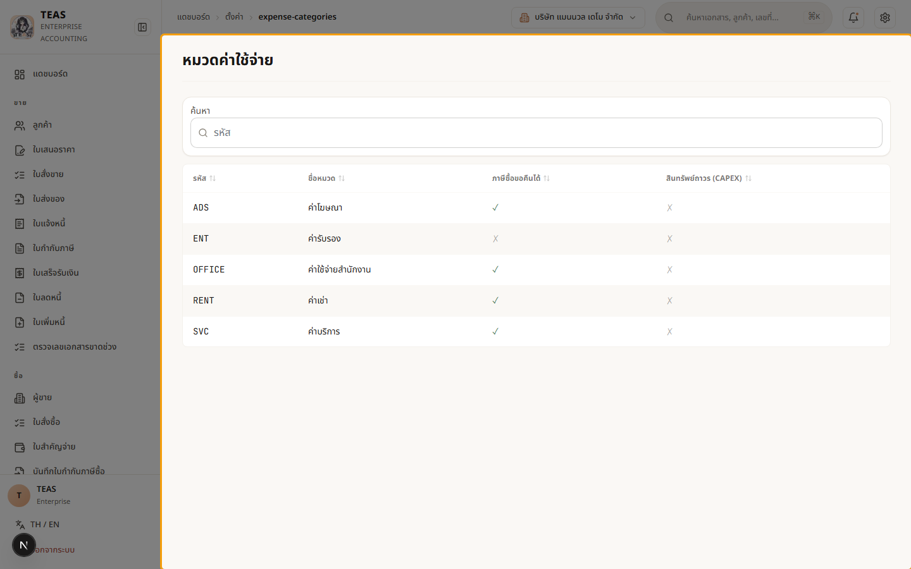
  <figcaption>หน้า "หมวดค่าใช้จ่าย" — รายการหมวดมาตรฐานที่ระบบเตรียมให้. คอลัมน์: รหัส, ชื่อหมวด, ภาษีซื้อขอคืนได้, สินทรัพย์ถาวร (CAPEX)</figcaption>
</figure>

### ขั้นที่ 2

<figure markdown="span">
  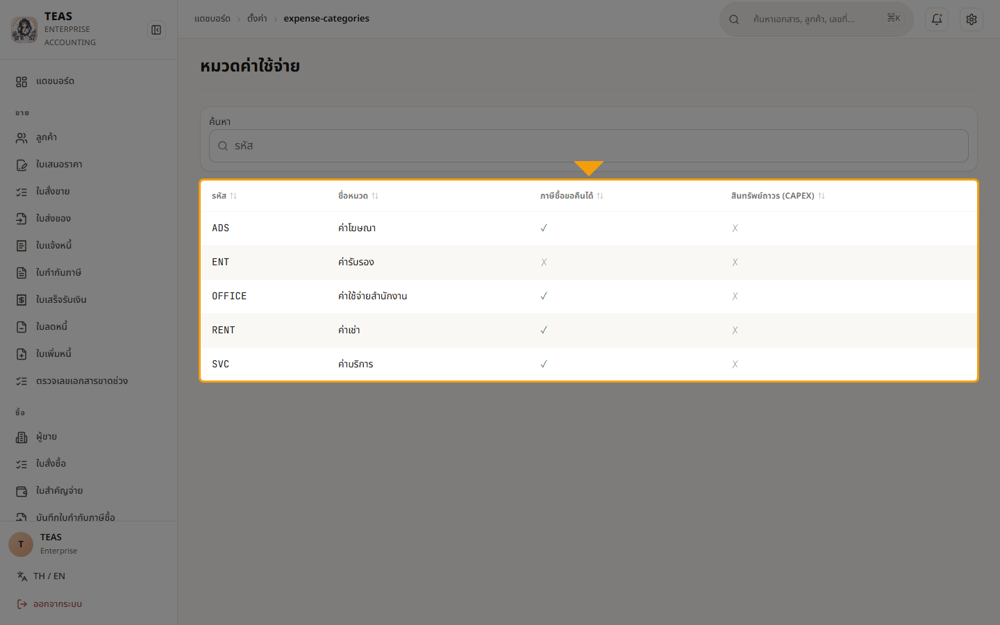
  <figcaption>2 คอลัมน์ขวาคือหัวใจ — "ภาษีซื้อขอคืนได้" บอกว่า Input VAT ของหมวดนี้หักใน ภ.พ.30 ได้ไหม, "CAPEX" บอกว่าต้องตัดค่าเสื่อมแทนการ ลงค่าใช้จ่ายทันที. ตอนทำใบสำคัญจ่าย/ใบกำกับภาษีซื้อจะเลือกหมวดเหล่านี้</figcaption>
</figure>

## 03.05 — พนักงาน (สำหรับเงินเดือน)

> **เงื่อนไขก่อนใช้งาน:** login ในฐานะผู้มีสิทธิ์ master.employee.manage (admin)

พนักงาน (Employee) คือ master data ที่งานเงินเดือน (Payroll) ใช้คำนวณ:

- **เงินเดือน** + เงินได้อื่น
- **ภาษีหัก ณ ที่จ่าย (ภ.ง.ด.1)** — คำนวณจากเงินเดือน, สถานภาพสมรส, จำนวนบุตร,
  คู่สมรสมีเงินได้หรือไม่ (ค่าลดหย่อน)
- **ประกันสังคม (ม.33)** — ถ้าพนักงานอยู่ในระบบประกันสังคม

ฟอร์มเก็บ: รหัสพนักงาน, คำนำหน้า/ชื่อ/นามสกุล, เลขบัตรประชาชน (13 หลัก),
เงินเดือน, วันเริ่มงาน, สถานภาพสมรส + ค่าลดหย่อน, ข้อมูลธนาคาร (รับเงินเดือน),
และที่อยู่. ตั้งให้ครบเพื่อให้รอบเงินเดือน (บทที่ 6) คำนวณภาษีได้ถูกต้อง.

### ขั้นที่ 1

<figure markdown="span">
  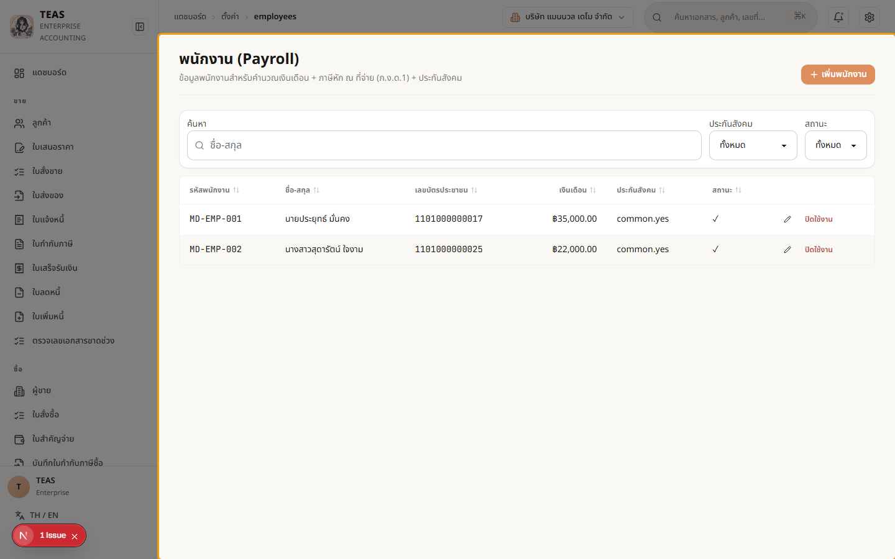
  <figcaption>หน้า "พนักงาน (Payroll)" — รายชื่อพนักงานที่ใช้คำนวณเงินเดือน. ปุ่ม "เพิ่มพนักงาน" เปิดฟอร์มกรอกข้อมูลใหม่</figcaption>
</figure>

### ขั้นที่ 2

<figure markdown="span">
  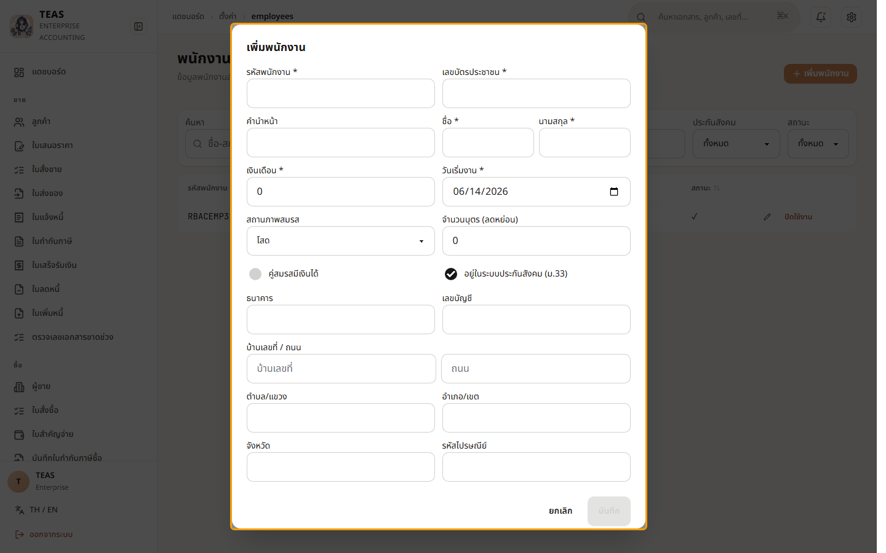
  <figcaption>ฟอร์ม "เพิ่มพนักงาน" — คำนำหน้า/ชื่อ/นามสกุล, เลขบัตรประชาชน (13 หลัก), เงินเดือน, วันเริ่มงาน, สถานภาพสมรส + จำนวนบุตร (ค่าลดหย่อน ภ.ง.ด.1), ประกันสังคม (ม.33), และเลขบัญชีธนาคารสำหรับรับเงินเดือน. กรอกครบแล้วกด "บันทึก" — พนักงานจะถูกดึงเข้ารอบเงินเดือนอัตโนมัติ (บทที่ 6)</figcaption>
</figure>
