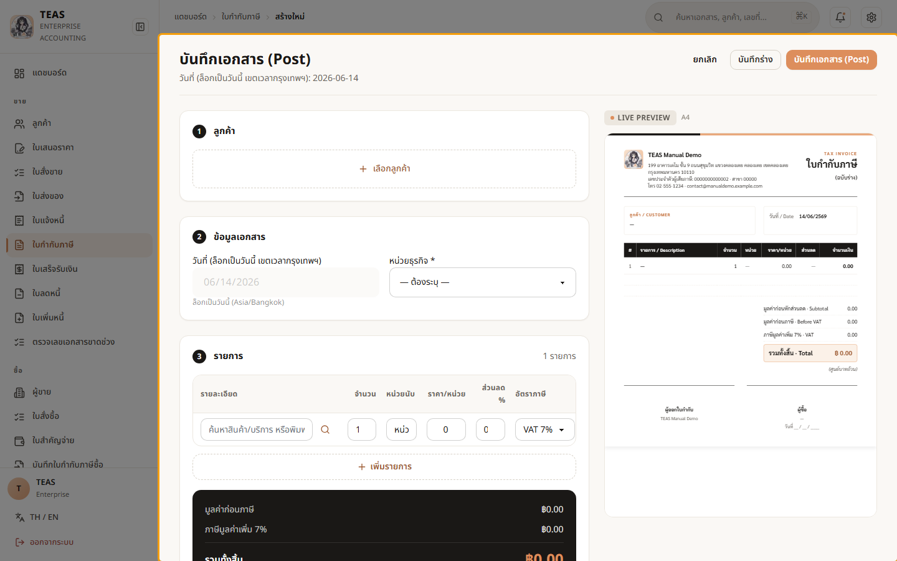
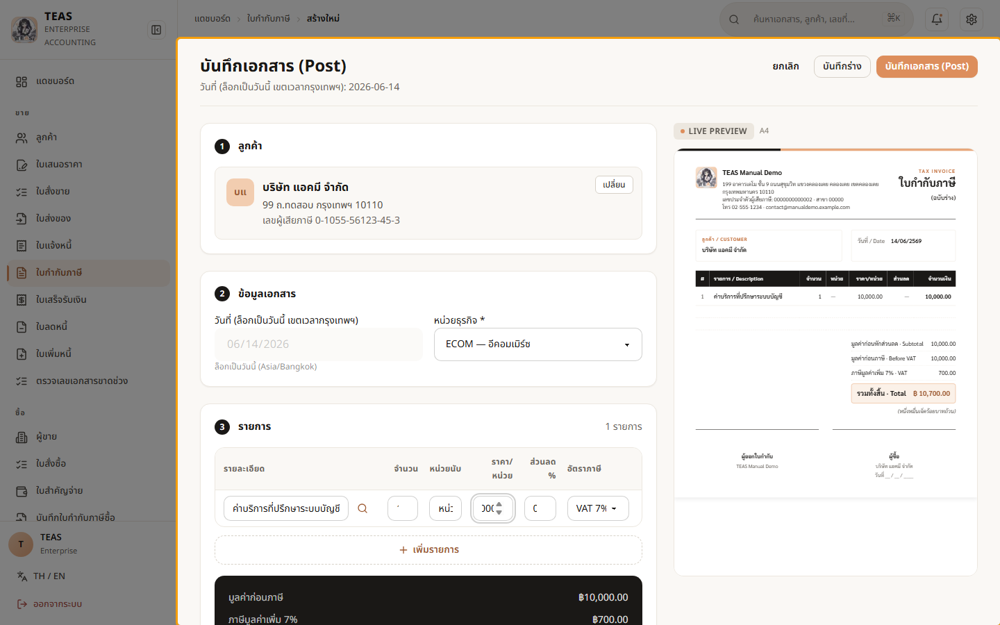
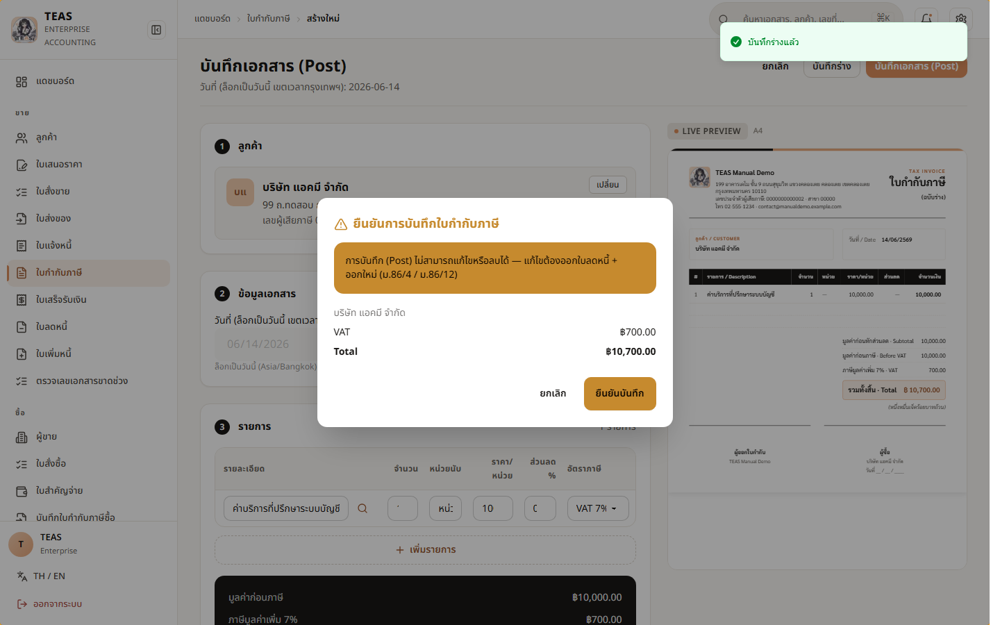

# 4. งานขาย

## 04.04 — ออกและโพสต์ใบกำกับภาษี

> **เงื่อนไขก่อนใช้งาน:** login ในฐานะผู้มีสิทธิ์ sales.tax_invoice.create + .post (admin) · มีลูกค้าจด VAT + หน่วยธุรกิจ ในระบบ (บทที่ 2–3)

ใบกำกับภาษี (Tax Invoice) คือเอกสารทางภาษีที่สำคัญที่สุดของกิจการ VAT —
ออกเมื่อขายสินค้า/บริการให้ผู้ซื้อ และเป็นหลักฐานภาษีขาย (Output VAT).

**กฎหมาย ม.86/4 — ใบกำกับภาษีเต็มรูปต้องมีครบ 8 รายการ:**

1. คำว่า "ใบกำกับภาษี" เด่นชัด
2. ชื่อ-ที่อยู่-เลขผู้เสียภาษี (13 หลัก) + สาขาของผู้ขาย
3. ชื่อ-ที่อยู่-เลขผู้เสียภาษีของผู้ซื้อ **เมื่อผู้ซื้อจด VAT**
4. เลขที่เอกสารเรียงลำดับ **ห้ามขาดช่วง (gapless)**
5. ชื่อ/ชนิด/ปริมาณ/มูลค่าของสินค้าแต่ละบรรทัด
6. **แยกแสดงภาษีมูลค่าเพิ่ม (VAT) ออกจากมูลค่าสินค้า**
7. วันที่ออก = วันที่จุดความรับผิดทางภาษี (tax point)
8. ข้อความอื่นตามที่กำหนด

**การ Post (โพสต์):** ตอนกด Post ระบบจะออกเลขที่เอกสารตามลำดับเดือน (ไม่ขาดช่วง)
และ **ตรึงข้อมูลถาวร** — แก้/ลบไม่ได้อีก (ม.86 + พรบ.การบัญชี). หากออกผิด ต้อง
แก้ด้วย **ใบลดหนี้ (Credit Note)** แล้วออกใบใหม่ ไม่ใช่แก้ใบเดิม.

### ขั้นที่ 1

<figure markdown="span">
  
  <figcaption>ฟอร์ม "สร้างใบกำกับภาษี" — 3 ส่วน: ① ลูกค้า, ② ข้อมูลเอกสาร (วันที่ออก = วันนี้ ล็อกไว้ตามกฎ tax point + หน่วยธุรกิจ), ③ รายการสินค้า /บริการ พร้อมยอดรวมและภาษีแยกบรรทัด</figcaption>
</figure>

### ขั้นที่ 2

<figure markdown="span">
  
  <figcaption>กด "เลือกลูกค้า" → ค้นหาด้วยชื่อหรือเลขผู้เสียภาษี → เลือก "บริษัท แอคมี จำกัด" (ลูกค้าจด VAT). ระบบดึงชื่อ + เลขผู้เสียภาษี 13 หลัก ของผู้ซื้อมาแสดง — ข้อมูลนี้จะพิมพ์ลงใบกำกับภาษี (ม.86/4 #3)</figcaption>
</figure>

### ขั้นที่ 3

<figure markdown="span">
  
  <figcaption>เลือก "หน่วยธุรกิจ" (บริษัทนี้ตั้งค่าให้บังคับระบุในเอกสารรายได้ — ดูบท 02.01). หน่วยธุรกิจช่วยแยกยอดขาย/รายงานตามสายงาน</figcaption>
</figure>

### ขั้นที่ 4

<figure markdown="span">
  
  <figcaption>กรอกรายการ — "ค่าบริการที่ปรึกษาระบบบัญชี" จำนวน 1 ราคา 10,000. กล่องยอดรวมคำนวณให้อัตโนมัติ: มูลค่าก่อนภาษี 10,000 + ภาษีมูลค่าเพิ่ม 7% = 700 → รวมทั้งสิ้น 10,700. สังเกตว่า VAT แสดง "แยก" ตาม ม.86/4 #6</figcaption>
</figure>

### ขั้นที่ 5

<figure markdown="span">
  
  <figcaption>กด "บันทึกเอกสาร" → กล่องยืนยันเตือนว่า การโพสต์จะออกเลขที่ เอกสารถาวรและ "แก้ไขไม่ได้อีก". ตรวจข้อมูลให้ครบถูกก่อนยืนยัน เพราะแก้ทีหลัง ต้องทำผ่านใบลดหนี้เท่านั้น</figcaption>
</figure>

### ขั้นที่ 6

<figure markdown="span">
  
  <figcaption>โพสต์สำเร็จ → ระบบออกเลขที่เอกสารตามลำดับเดือน (รูปแบบ MM-YYYY-PREFIX-NNNN, ไม่ขาดช่วง) และเปลี่ยนสถานะเป็น "โพสต์แล้ว". เอกสารนี้ตรึงถาวร — พิมพ์ PDF / ส่ง e-Tax / ออกใบเสร็จอ้างอิงได้ต่อไป</figcaption>
</figure>
