# 4. งานขาย

## 04.01 — ออกใบเสนอราคา

> **เงื่อนไขก่อนใช้งาน:** login ในฐานะผู้มีสิทธิ์ sales.quotation.create + .send (admin) · มีลูกค้า + หน่วยธุรกิจ ในระบบ (บทที่ 2–3)

ใบเสนอราคา (Quotation) คือเอกสารแรกของสายงานขาย — เสนอราคาสินค้า/บริการให้ลูกค้า
พิจารณาก่อนตัดสินใจซื้อ. ยัง **ไม่ใช่เอกสารทางภาษี** จึงแก้ไขหรือยกเลิกได้ และยัง
ไม่เกิดภาระภาษีขาย.

**สายงานขายเต็มรูป (document chain):**

ใบเสนอราคา → ใบสั่งขาย → ใบส่งของ → ใบแจ้งหนี้ → **ใบกำกับภาษี** → ใบเสร็จรับเงิน

แต่ละขั้นอ้างอิงเอกสารต้นทางได้ ทำให้ตรวจสอบย้อนกลับ (audit trail) ได้ครบ. ใบกำกับภาษี
คือจุดที่เกิดภาระภาษีและตรึงถาวร (ดู 04.04). บทนี้เริ่มจากต้นทาง.

**สิ่งที่กรอกในใบเสนอราคา:** ลูกค้า · วันที่ + วันที่ยืนราคา (ค่าเริ่มต้น +30 วัน) ·
หน่วยธุรกิจ (บริษัทตัวอย่างตั้งให้บังคับในเอกสารรายได้) · รายการสินค้า/บริการ พร้อม
ราคาและภาษีมูลค่าเพิ่มที่คำนวณให้อัตโนมัติในตัวอย่างเอกสารด้านขวา.

### ขั้นที่ 1

<figure markdown="span">
  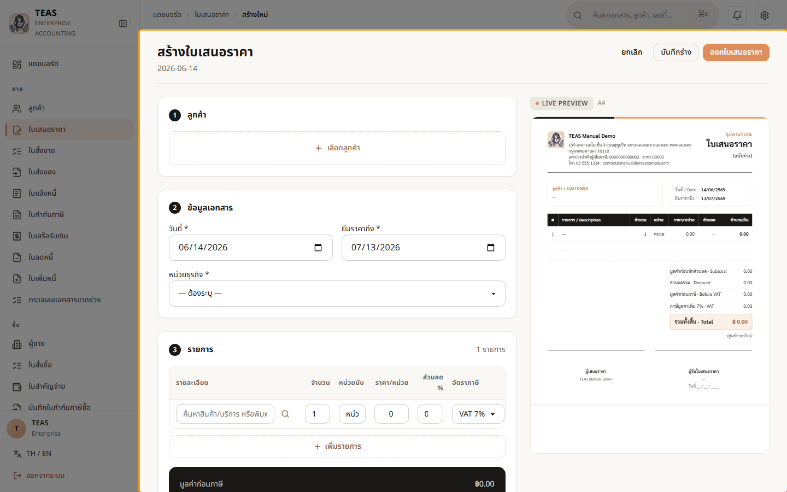
  <figcaption>ฟอร์ม "สร้างใบเสนอราคา" — ซ้ายเป็นช่องกรอก 4 ส่วน (① ลูกค้า, ② ข้อมูลเอกสาร, ③ รายการ, ④ หมายเหตุ) ขวาเป็นตัวอย่างเอกสาร A4 ที่อัปเดตสด ตามที่กรอก</figcaption>
</figure>

### ขั้นที่ 2

<figure markdown="span">
  
  <figcaption>กด "เลือกลูกค้า" → ค้นหา → เลือก "บริษัท แอคมี จำกัด". ระบบดึงชื่อ และที่อยู่มาแสดงในตัวอย่างเอกสารด้านขวาทันที</figcaption>
</figure>

### ขั้นที่ 3

<figure markdown="span">
  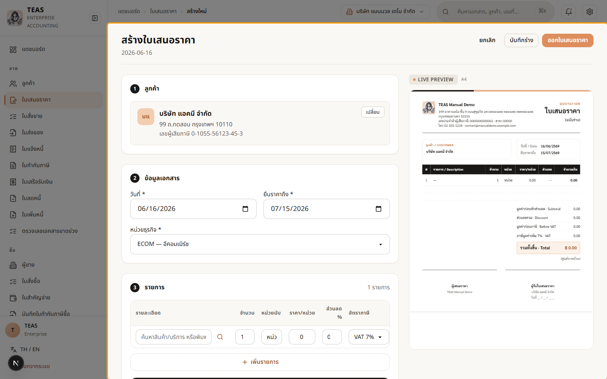
  <figcaption>เลือก "หน่วยธุรกิจ" (บริษัทตัวอย่างตั้งค่าให้บังคับระบุในเอกสาร รายได้ — ดู 02.01). วันที่และ "ยืนราคาถึง" มีค่าเริ่มต้นให้ (+30 วัน) แก้ได้</figcaption>
</figure>

### ขั้นที่ 4

<figure markdown="span">
  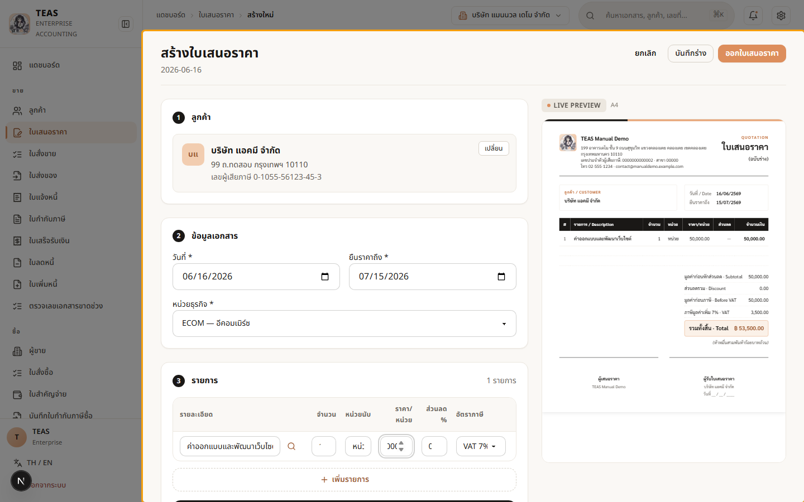
  <figcaption>กรอกรายการ — "ค่าออกแบบและพัฒนาเว็บไซต์" จำนวน 1 ราคา 50,000. กล่องสรุปคำนวณ มูลค่าก่อนภาษี + ภาษีมูลค่าเพิ่ม 7% = รวมทั้งสิ้น ให้อัตโนมัติ</figcaption>
</figure>

### ขั้นที่ 5

<figure markdown="span">
  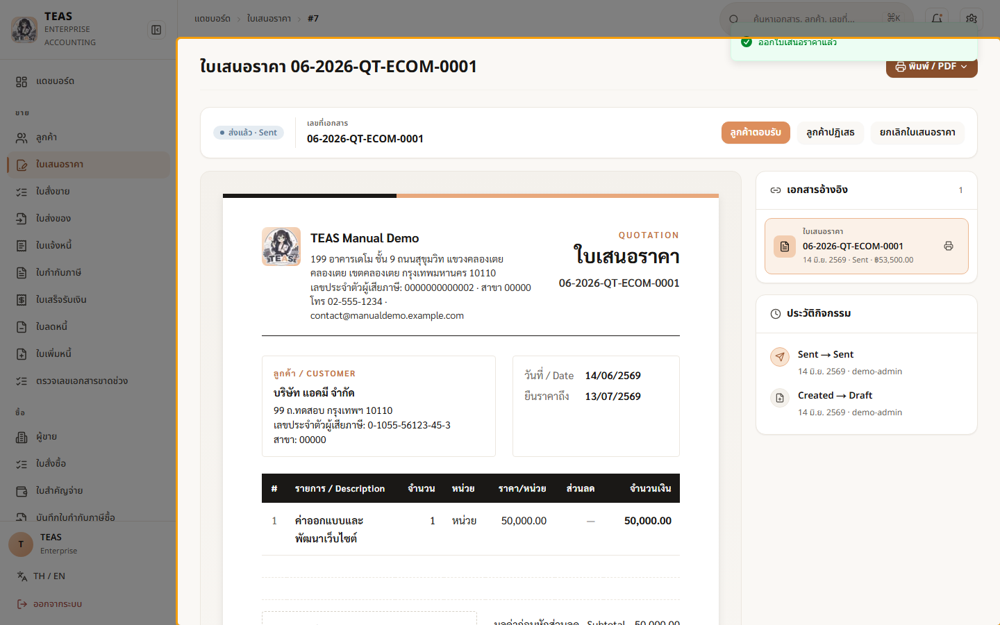
  <figcaption>กด "ออกใบเสนอราคา" → ระบบออกเลขที่เอกสารและเปลี่ยนสถานะเป็น "ส่งแล้ว". จากหน้านี้พิมพ์ PDF ส่งลูกค้า หรือแปลงเป็นใบสั่งขายต่อได้</figcaption>
</figure>

## 04.02 — ใบสั่งขาย และ ใบส่งของ

> **เงื่อนไขก่อนใช้งาน:** login admin (สิทธิ์ sales_order + delivery_order) · มีลูกค้า + หน่วยธุรกิจ ในระบบ

หลังลูกค้าตอบรับใบเสนอราคา ขั้นถัดไปคือ:

1. **ใบสั่งขาย (Sales Order)** — บันทึกคำสั่งซื้อที่ยืนยันแล้ว (จำนวน/ราคา/หน่วยธุรกิจ).
   เป็นเอกสารภายในที่ผูกราคาไว้ ใช้เป็นฐานในการจัดส่งและออกใบกำกับภาษีต่อไป.
2. **ใบส่งของ (Delivery Order)** — หลักฐานการส่งมอบสินค้า/บริการ. เป็นเอกสาร
   **non-fiscal** คือ ไม่มีราคาและภาษี (แสดงเฉพาะรายการ + จำนวน + หน่วยนับ).
   ที่อยู่จัดส่งและผู้รับสินค้าบันทึกในช่องหมายเหตุ.

ทั้งสองอ้างอิงเอกสารต้นทางได้ และในงานจริงนิยม "แปลง" ต่อกัน (ใบเสนอราคา → ใบสั่งขาย,
ใบสั่งขาย → ใบส่งของ) ผ่านปุ่มบนหน้ารายละเอียด. ที่นี่แสดงการสร้างฟอร์มใหม่โดยตรง.

### ขั้นที่ 1

<figure markdown="span">
  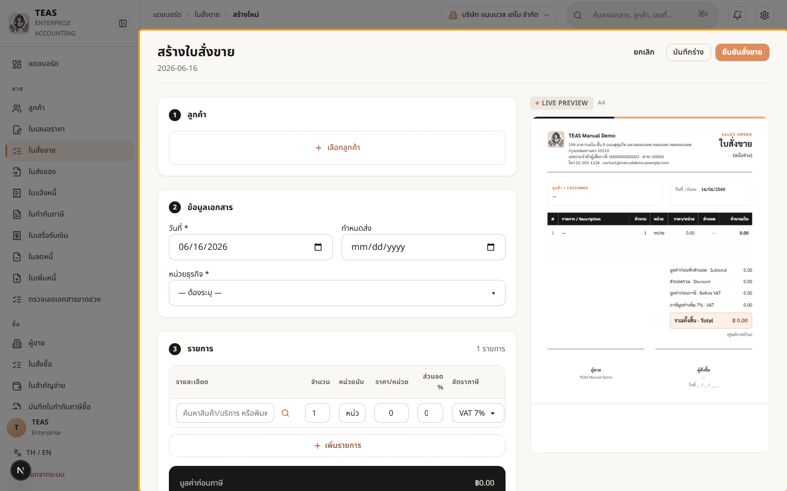
  <figcaption>ฟอร์ม "สร้างใบสั่งขาย" — โครงเดียวกับใบเสนอราคา (ลูกค้า / ข้อมูลเอกสาร / รายการ) พร้อมตัวอย่างเอกสารด้านขวา</figcaption>
</figure>

### ขั้นที่ 2

<figure markdown="span">
  
  <figcaption>เลือกลูกค้า "บริษัท แอคมี จำกัด" + หน่วยธุรกิจ + กรอกรายการ (10 × 3,500). ตัวอย่างเอกสารคำนวณมูลค่าก่อนภาษี 35,000 + VAT 7% อัตโนมัติ</figcaption>
</figure>

### ขั้นที่ 3

<figure markdown="span">
  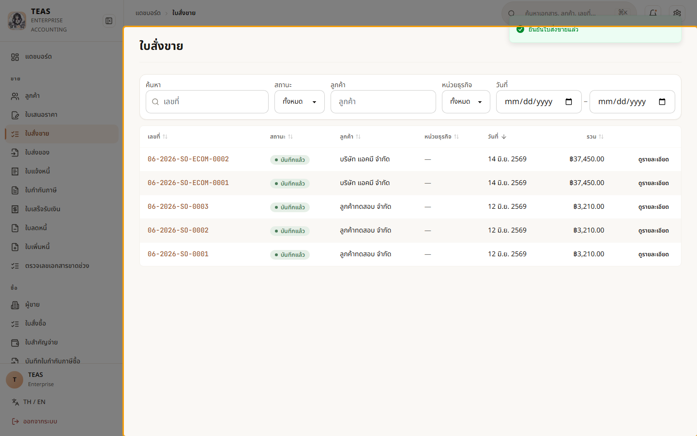
  <figcaption>กด "ยืนยันสั่งขาย" → ระบบออกเลขที่เอกสารและยืนยันใบสั่งขาย (สถานะ "บันทึกแล้ว" = ยืนยัน/โพสต์แล้ว เห็นเป็นแถวบนสุดของรายการ). พร้อมจัดส่งและออกใบกำกับภาษีต่อ</figcaption>
</figure>

### ขั้นที่ 4

<figure markdown="span">
  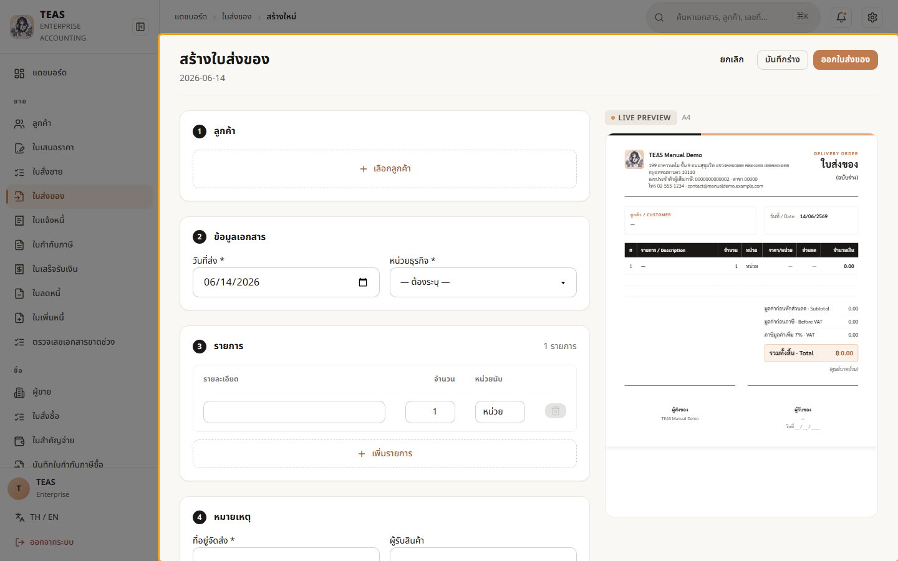
  <figcaption>ฟอร์ม "สร้างใบส่งของ" — สังเกตตารางรายการ "ไม่มีคอลัมน์ราคา/ภาษี" เพราะใบส่งของเป็นเอกสารส่งมอบ ไม่ใช่เอกสารเรียกเงิน (non-fiscal)</figcaption>
</figure>

### ขั้นที่ 5

<figure markdown="span">
  
  <figcaption>เลือกลูกค้าเดิม + หน่วยธุรกิจ + กรอกรายการที่ส่งมอบ (จำนวน + หน่วยนับ เท่านั้น ไม่มีราคา). ที่อยู่จัดส่ง/ผู้รับสินค้าระบุในส่วนหมายเหตุด้านล่าง</figcaption>
</figure>

### ขั้นที่ 6

<figure markdown="span">
  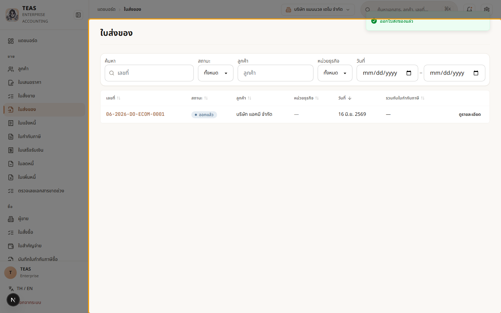
  <figcaption>กด "ออกใบส่งของ" → ระบบออกเลขที่เอกสารและบันทึกใบส่งของ (เห็นแถว บนสุด). เมื่อยืนยัน "ส่งมอบแล้ว" ระบบจะออกใบกำกับภาษีให้ในขั้นถัดไปอัตโนมัติ</figcaption>
</figure>

## 04.03 — ออกใบแจ้งหนี้ / ใบวางบิล

> **เงื่อนไขก่อนใช้งาน:** login admin (สิทธิ์ billing_note) · มีลูกค้า + หน่วยธุรกิจ ในระบบ

ใบแจ้งหนี้ / ใบวางบิล (Billing Note) คือเอกสาร **เรียกเก็บเงิน** ที่ส่งให้ลูกค้าเพื่อ
แจ้งยอดที่ต้องชำระและกำหนดวันครบกำหนด.

**ใช้งานได้ 2 แบบ:**

1. **รวมใบกำกับภาษีหลายใบ** — กิจการที่ส่งของหลายครั้งในเดือน แล้ววางบิลรวมครั้งเดียว
   สามารถเลือกใบกำกับภาษีที่ออกไว้แล้วมารวมในใบแจ้งหนี้ใบเดียว.
2. **ออกพร้อมรายการของตัวเอง** — กรอกรายการสินค้า/บริการลงในใบแจ้งหนี้โดยตรง
   (เหมือนใบเสนอราคา) ตามที่บทนี้แสดง.

เมื่อลูกค้าชำระเงิน จะออก **ใบเสร็จรับเงิน** อ้างอิงใบแจ้งหนี้/ใบกำกับภาษีนี้ (ดู 04.05).
มีช่อง "วันที่ครบกำหนด" (ค่าเริ่มต้น +30 วัน) เพื่อติดตามลูกหนี้.

### ขั้นที่ 1

<figure markdown="span">
  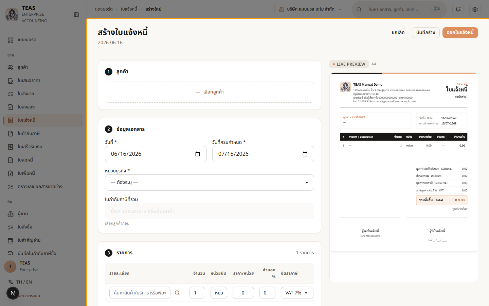
  <figcaption>ฟอร์ม "สร้างใบแจ้งหนี้" — มีส่วนลูกค้า, ข้อมูลเอกสาร (วันที่ + วันที่ครบกำหนด), รายการ และตัวเลือกจัดกลุ่มใบกำกับภาษี พร้อมตัวอย่างเอกสารด้านขวา</figcaption>
</figure>

### ขั้นที่ 2

<figure markdown="span">
  
  <figcaption>เลือกลูกค้า "บริษัท แอคมี จำกัด" + หน่วยธุรกิจ. "วันที่ครบกำหนด" ตั้งค่าเริ่มต้นเป็น +30 วัน ใช้ติดตามลูกหนี้ที่ยังไม่ชำระ</figcaption>
</figure>

### ขั้นที่ 3

<figure markdown="span">
  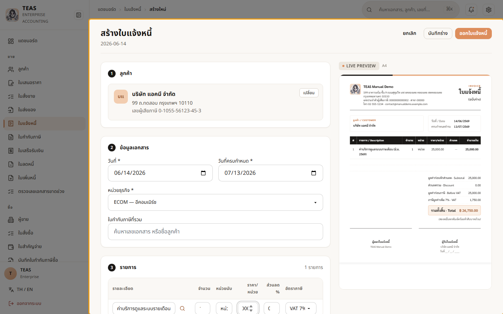
  <figcaption>กรอกรายการ — "ค่าบริการดูแลระบบรายเดือน" 25,000. กล่องสรุป คำนวณมูลค่าก่อนภาษี + ภาษีมูลค่าเพิ่ม 7% = ยอดเรียกเก็บรวม อัตโนมัติ</figcaption>
</figure>

### ขั้นที่ 4

<figure markdown="span">
  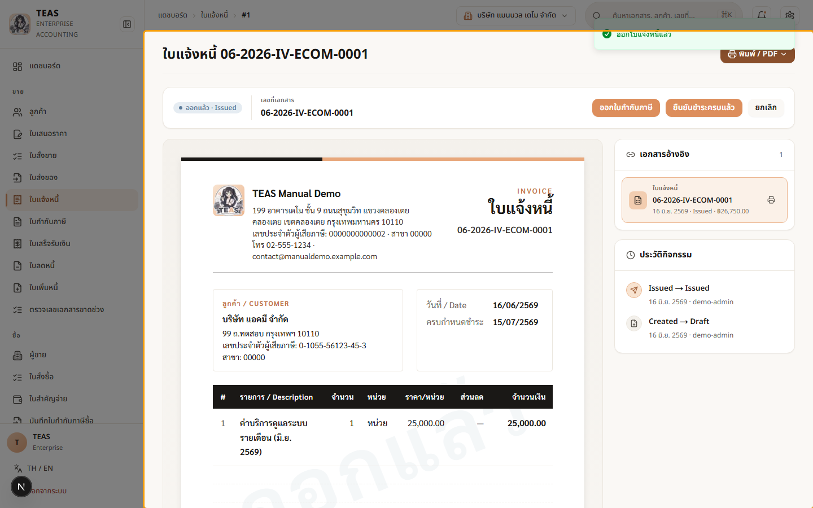
  <figcaption>กด "ออกใบแจ้งหนี้" → ระบบออกเลขที่เอกสารและบันทึกใบแจ้งหนี้สถานะ "ออกแล้ว". จากหน้านี้พิมพ์ PDF ส่งลูกค้า, กด "ออกใบกำกับภาษี" เพื่อออกเอกสารภาษี, หรือ "ยืนยันชำระเงินครบแล้ว" เมื่อได้รับเงิน (การออกใบเสร็จ ดู 04.05)</figcaption>
</figure>

## 04.04 — ออกและโพสต์ใบกำกับภาษี

> **เงื่อนไขก่อนใช้งาน:** login ในฐานะผู้มีสิทธิ์ sales.tax_invoice.create + .post (admin) · มีลูกค้าจด VAT + หน่วยธุรกิจ ในระบบ (บทที่ 2–3)

ใบกำกับภาษี (Tax Invoice) คือเอกสารทางภาษีที่สำคัญที่สุดของกิจการ VAT —
ออกเมื่อขายสินค้า/บริการให้ผู้ซื้อ และเป็นหลักฐานภาษีขาย (Output VAT).

**กฎหมาย ม.86/4 — ใบกำกับภาษีเต็มรูปต้องมีครบ 8 รายการ:**

1. คำว่า "ใบกำกับภาษี" เด่นชัด
2. ชื่อ-ที่อยู่-เลขผู้เสียภาษี (13 หลัก) + สาขาของผู้ขาย
3. ชื่อ-ที่อยู่-เลขผู้เสียภาษีของผู้ซื้อ **เมื่อผู้ซื้อจด VAT**
4. เลขที่เอกสารเรียงลำดับ **ห้ามขาดช่วง (gapless)**
5. ชื่อ/ชนิด/ปริมาณ/มูลค่าของสินค้าแต่ละบรรทัด
6. **แยกแสดงภาษีมูลค่าเพิ่ม (VAT) ออกจากมูลค่าสินค้า**
7. วันที่ออก = วันที่จุดความรับผิดทางภาษี (tax point)
8. ข้อความอื่นตามที่กำหนด

**การ Post (โพสต์):** ตอนกด Post ระบบจะออกเลขที่เอกสารตามลำดับเดือน (ไม่ขาดช่วง)
และ **ตรึงข้อมูลถาวร** — แก้/ลบไม่ได้อีก (ม.86 + พรบ.การบัญชี). หากออกผิด ต้อง
แก้ด้วย **ใบลดหนี้ (Credit Note)** แล้วออกใบใหม่ ไม่ใช่แก้ใบเดิม.

### ขั้นที่ 1

<figure markdown="span">
  
  <figcaption>ฟอร์ม "สร้างใบกำกับภาษี" — 3 ส่วน: ① ลูกค้า, ② ข้อมูลเอกสาร (วันที่ออก = วันนี้ ล็อกไว้ตามกฎ tax point + หน่วยธุรกิจ), ③ รายการสินค้า /บริการ พร้อมยอดรวมและภาษีแยกบรรทัด</figcaption>
</figure>

### ขั้นที่ 2

<figure markdown="span">
  
  <figcaption>กด "เลือกลูกค้า" → ค้นหาด้วยชื่อหรือเลขผู้เสียภาษี → เลือก "บริษัท แอคมี จำกัด" (ลูกค้าจด VAT). ระบบดึงชื่อ + เลขผู้เสียภาษี 13 หลัก ของผู้ซื้อมาแสดง — ข้อมูลนี้จะพิมพ์ลงใบกำกับภาษี (ม.86/4 #3)</figcaption>
</figure>

### ขั้นที่ 3

<figure markdown="span">
  
  <figcaption>เลือก "หน่วยธุรกิจ" (บริษัทนี้ตั้งค่าให้บังคับระบุในเอกสารรายได้ — ดูบท 02.01). หน่วยธุรกิจช่วยแยกยอดขาย/รายงานตามสายงาน</figcaption>
</figure>

### ขั้นที่ 4

<figure markdown="span">
  
  <figcaption>กรอกรายการ — "ค่าบริการที่ปรึกษาระบบบัญชี" จำนวน 1 ราคา 10,000. กล่องยอดรวมคำนวณให้อัตโนมัติ: มูลค่าก่อนภาษี 10,000 + ภาษีมูลค่าเพิ่ม 7% = 700 → รวมทั้งสิ้น 10,700. สังเกตว่า VAT แสดง "แยก" ตาม ม.86/4 #6</figcaption>
</figure>

### ขั้นที่ 5

<figure markdown="span">
  
  <figcaption>กด "บันทึกเอกสาร" → กล่องยืนยันเตือนว่า การโพสต์จะออกเลขที่ เอกสารถาวรและ "แก้ไขไม่ได้อีก". ตรวจข้อมูลให้ครบถูกก่อนยืนยัน เพราะแก้ทีหลัง ต้องทำผ่านใบลดหนี้เท่านั้น</figcaption>
</figure>

### ขั้นที่ 6

<figure markdown="span">
  
  <figcaption>โพสต์สำเร็จ → ระบบออกเลขที่เอกสารตามลำดับเดือน (รูปแบบ MM-YYYY-PREFIX-NNNN, ไม่ขาดช่วง) และเปลี่ยนสถานะเป็น "โพสต์แล้ว". เอกสารนี้ตรึงถาวร — พิมพ์ PDF / ส่ง e-Tax / ออกใบเสร็จอ้างอิงได้ต่อไป</figcaption>
</figure>

## 04.05 — รับชำระเงินและออกใบเสร็จ

> **เงื่อนไขก่อนใช้งาน:** login admin (สิทธิ์ tax_invoice + receipt) · มีลูกค้าจด VAT ในระบบ

ใบเสร็จรับเงิน (Receipt) คือหลักฐานการรับชำระเงินจากลูกค้า. ในระบบ VAT ใบเสร็จจะ
**อ้างอิงใบกำกับภาษี** ที่ออกไว้ (ซึ่งตรึงถาวรแล้ว) เพื่อปิดยอดลูกหนี้ของใบนั้น.

**วิธีที่สะดวกที่สุด** คือออกใบเสร็จจากหน้ารายละเอียดใบกำกับภาษีโดยตรง — กดปุ่ม
"สร้างใบเสร็จ" แล้วระบบจะดึง **ลูกค้า + ใบกำกับภาษี + ยอดเงิน** มากรอกให้อัตโนมัติ
ไม่ต้องพิมพ์ซ้ำ.

**ภาษีหัก ณ ที่จ่าย (WHT):** ถ้าลูกค้าเป็นนิติบุคคลและหักภาษี ณ ที่จ่าย ใบเสร็จมีส่วน
ให้ระบุยอดหัก → ระบบคำนวณ "เงินที่รับจริง = ยอดรวม − ภาษีหัก ณ ที่จ่าย" ให้.
บทนี้แสดงกรณีรับเต็มจำนวน (ไม่มีการหัก).

### ขั้นที่ 1

<figure markdown="span">
  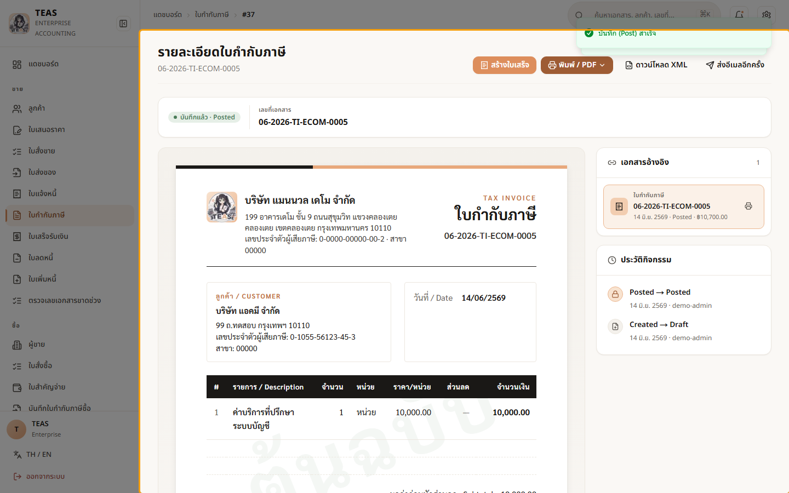
  <figcaption>ใบกำกับภาษีที่โพสต์แล้ว (ยอดรวม 10,700, ยังไม่ชำระ). มุมขวาบนมีปุ่ม "สร้างใบเสร็จ" สำหรับออกใบเสร็จอ้างอิงใบนี้ทันที</figcaption>
</figure>

### ขั้นที่ 2

<figure markdown="span">
  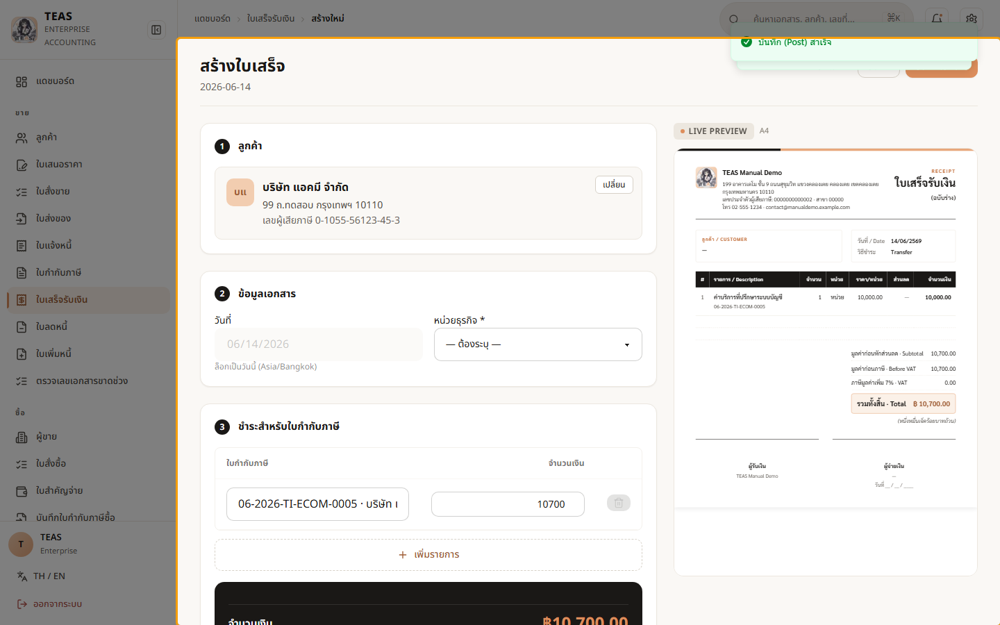
  <figcaption>ฟอร์มใบเสร็จเปิดขึ้นพร้อมข้อมูล "ดึงมาให้แล้ว" — ลูกค้า "บริษัท แอคมี จำกัด", ใบกำกับภาษีต้นทาง และยอดเงิน 10,700. ไม่ต้องกรอกซ้ำ</figcaption>
</figure>

### ขั้นที่ 3

<figure markdown="span">
  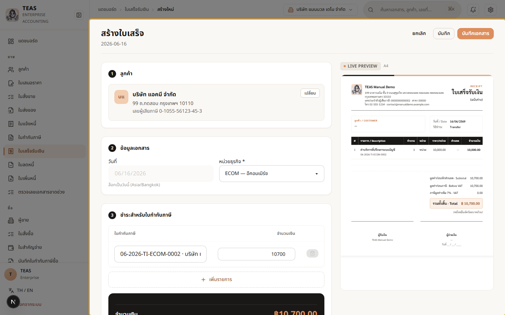
  <figcaption>เลือก "หน่วยธุรกิจ". ส่วน "หัก ณ ที่จ่าย" ปิดอยู่ (รับเต็มจำนวน) → เงินที่รับจริง = ยอดรวม 10,700. หากลูกค้าหักภาษี ณ ที่จ่าย ให้เปิดสวิตช์แล้วระบุประเภทเงินได้</figcaption>
</figure>

### ขั้นที่ 4

<figure markdown="span">
  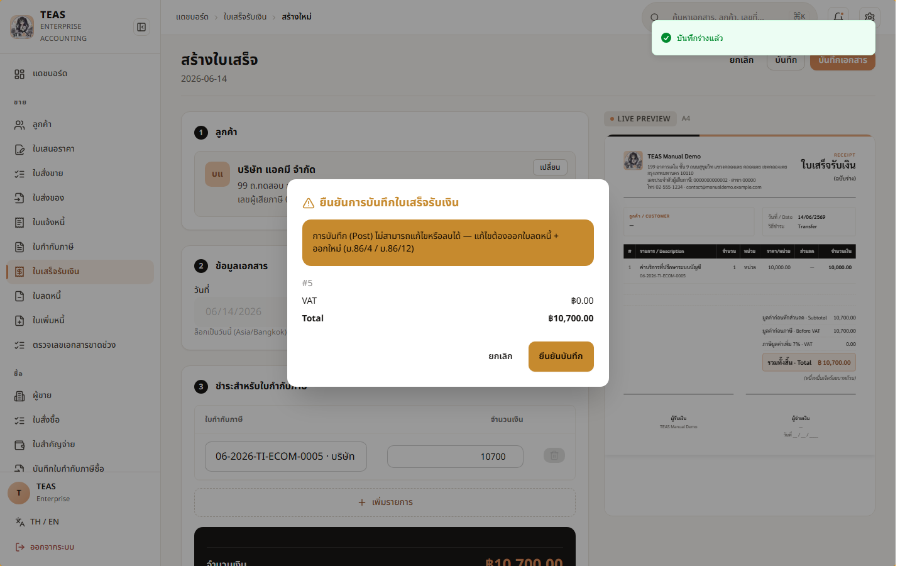
  <figcaption>กด "บันทึกเอกสาร" → กล่องยืนยันสรุปยอดและเตือนว่าใบเสร็จจะถูกบันทึก ถาวร. ตรวจยอดก่อนยืนยัน</figcaption>
</figure>

### ขั้นที่ 5

<figure markdown="span">
  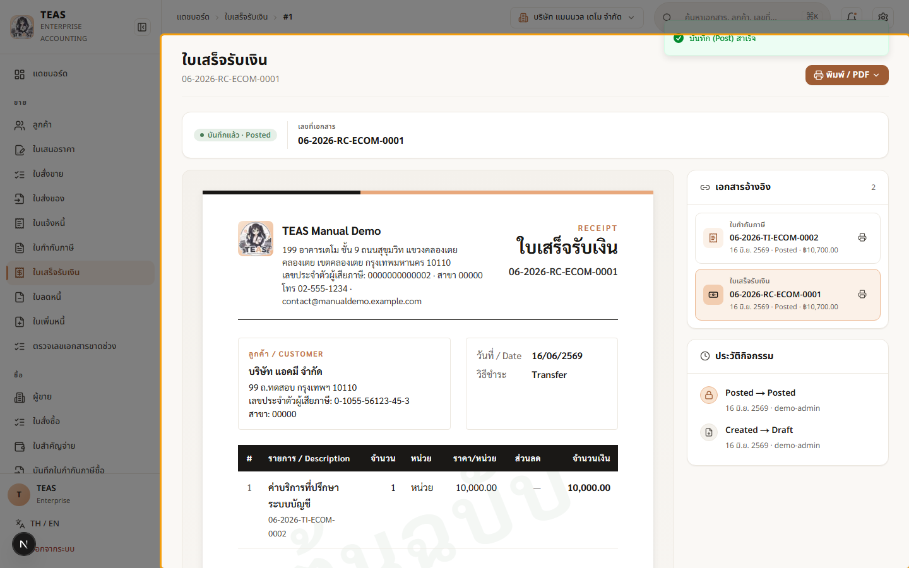
  <figcaption>ใบเสร็จออกเลขที่เอกสารแล้ว (สถานะ "บันทึกแล้ว") และอ้างอิงใบกำกับภาษี ต้นทางใน "เอกสารอ้างอิง". ผลคือยอดลูกหนี้ของใบกำกับภาษีต้นทางถูกปิด — ใบกำกับภาษี นั้นเปลี่ยนสถานะการชำระเงินเป็น "ชำระแล้ว"</figcaption>
</figure>

## 04.06 — ออกใบลดหนี้ (แก้ไขใบกำกับภาษี)

> **เงื่อนไขก่อนใช้งาน:** login admin (สิทธิ์ tax_invoice + credit_note) · มีใบกำกับภาษีที่โพสต์แล้วของลูกค้ารายนั้น

ใบกำกับภาษีที่โพสต์แล้ว **ตรึงถาวร แก้ไข/ลบไม่ได้** (ม.86 + พรบ.การบัญชี). เมื่อมี
เหตุต้องปรับยอดหลังออกใบกำกับภาษี กฎหมายกำหนดให้ออกเอกสารใหม่อ้างอิงใบเดิม:

- **ใบลดหนี้ (Credit Note) — ม.86/10** ใช้เมื่อ "ลดยอด": ลูกค้าคืนสินค้า, ลดราคาหลังขาย,
  คำนวณเรียกเก็บเกิน, สินค้าชำรุด.
- **ใบเพิ่มหนี้ (Debit Note) — ม.86/9** ใช้เมื่อ "เพิ่มยอด": เรียกเก็บขาด, ส่งของเพิ่ม.

ทั้งสองอ้างอิงใบกำกับภาษีเดิมเสมอ และ **คัดลอกผู้ซื้อจากใบเดิม** (ออกใบลดหนี้ให้คนอื่นไม่ได้).
อัตราภาษีถูกล็อกตามใบกำกับภาษีเดิม (7%) และแสดงภาษีแยกออกจากมูลค่าตามกฎ. บทนี้แสดง
"ใบลดหนี้" เป็นตัวอย่าง.

### ขั้นที่ 1

<figure markdown="span">
  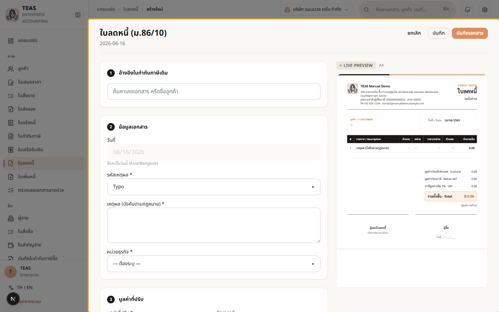
  <figcaption>ฟอร์ม "ใบลดหนี้ (ม.86/10)" — ① อ้างอิงใบกำกับภาษีเดิม, ② เหตุผล (บังคับตามกฎหมาย) + หน่วยธุรกิจ, ③ มูลค่าที่ปรับ. ผู้ซื้อจะคัดลอกจากใบเดิมอัตโนมัติ</figcaption>
</figure>

### ขั้นที่ 2

<figure markdown="span">
  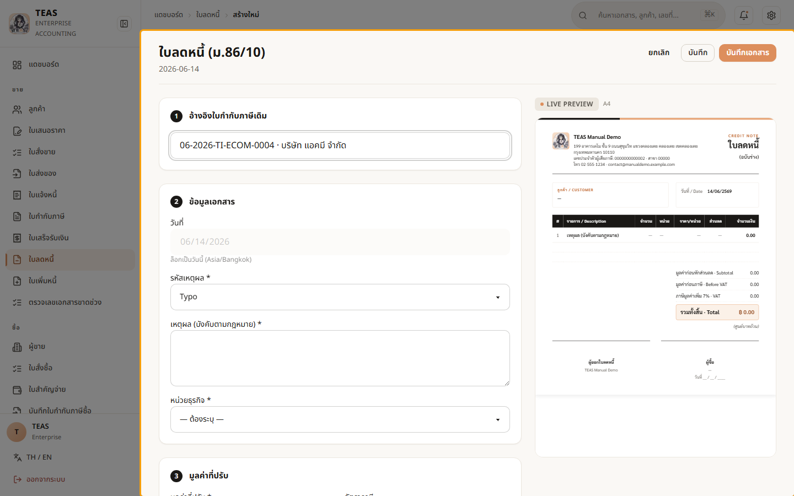
  <figcaption>ค้นหาและเลือก "ใบกำกับภาษีเดิม" (แสดงเฉพาะใบที่โพสต์แล้ว). ระบบดึง ผู้ซื้อ + อัตราภาษีจากใบนั้นมา และล็อกอัตราภาษีไว้ที่ 7% ตามใบเดิม</figcaption>
</figure>

### ขั้นที่ 3

<figure markdown="span">
  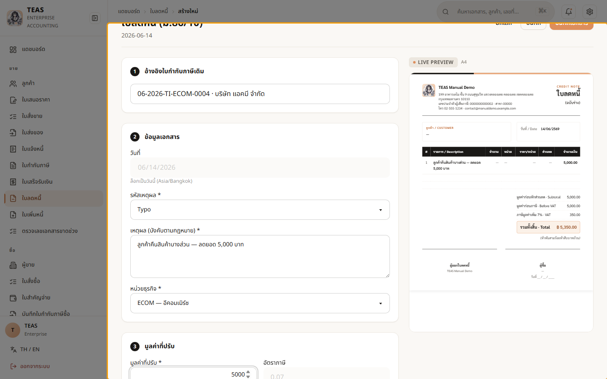
  <figcaption>ระบุ "เหตุผล" (กฎหมายบังคับให้มีเหตุผลในใบลดหนี้) + หน่วยธุรกิจ + "มูลค่าที่ปรับ" 5,000. กล่องสรุปคำนวณภาษีมูลค่าเพิ่ม 7% = 350 แยกออกจากมูลค่า</figcaption>
</figure>

### ขั้นที่ 4

<figure markdown="span">
  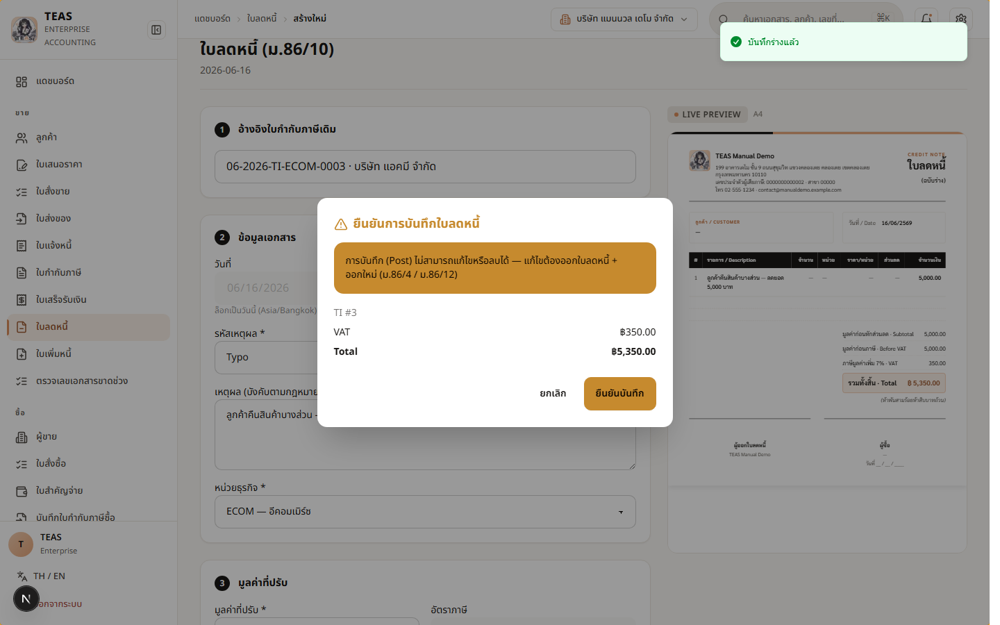
  <figcaption>กด "บันทึกเอกสาร" → กล่องยืนยันสรุปยอดลดหนี้ + ภาษี. เมื่อโพสต์แล้ว ใบลดหนี้จะตรึงถาวรเช่นเดียวกับใบกำกับภาษี</figcaption>
</figure>

### ขั้นที่ 5

<figure markdown="span">
  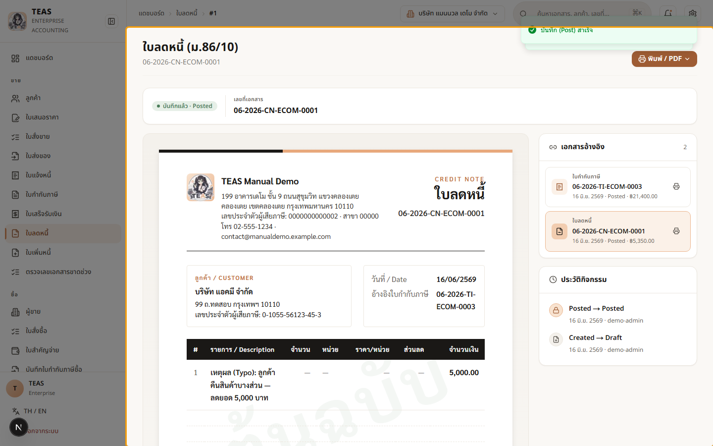
  <figcaption>ใบลดหนี้ออกเลขที่เอกสารแล้ว อ้างอิงใบกำกับภาษีเดิม (เห็นใน "เอกสารอ้างอิง") พร้อมเหตุผลและมูลค่าที่ลด. นี่คือวิธี "แก้ไข" ใบกำกับภาษี ที่ถูกต้องตามกฎหมาย — ออกเอกสารใหม่ ไม่ใช่แก้ใบเดิม</figcaption>
</figure>

## 04.07 — ออกใบเพิ่มหนี้ (แก้ไขใบกำกับภาษี)

> **เงื่อนไขก่อนใช้งาน:** login admin (สิทธิ์ tax_invoice + debit_note) · มีใบกำกับภาษีที่โพสต์แล้วของลูกค้ารายนั้น

ใบเพิ่มหนี้ (Debit Note) — **ม.86/9** เป็นคู่ตรงข้ามของใบลดหนี้ (04.06): ใช้เมื่อต้อง
**เพิ่มยอด** จากใบกำกับภาษีที่ออกไปแล้ว เช่น เรียกเก็บขาด, ส่งสินค้าเพิ่ม, หรือคิดราคา
ต่ำกว่าจริง.

เนื่องจากใบกำกับภาษีที่โพสต์แล้ว **แก้ไขไม่ได้** (ม.86 + พรบ.การบัญชี §4.2) การปรับยอด
ขึ้นจึงต้องออกเอกสารใหม่อ้างอิงใบเดิม ไม่ใช่แก้ใบเดิม. ฟอร์มและขั้นตอนเหมือนใบลดหนี้
ทุกประการ — ต่างเพียง **ทิศทาง (เพิ่ม)** และ **รายการเหตุผล**. ผู้ซื้อและอัตราภาษี (7%)
คัดลอก/ล็อกจากใบกำกับภาษีเดิม และแสดงภาษีแยกออกจากมูลค่า.

### ขั้นที่ 1

<figure markdown="span">
  
  <figcaption>ฟอร์ม "ใบเพิ่มหนี้ (ม.86/9)" — โครงเดียวกับใบลดหนี้: ① อ้างอิงใบกำกับ ภาษีเดิม, ② เหตุผล (บังคับ) + หน่วยธุรกิจ, ③ มูลค่าที่ปรับเพิ่ม</figcaption>
</figure>

### ขั้นที่ 2

<figure markdown="span">
  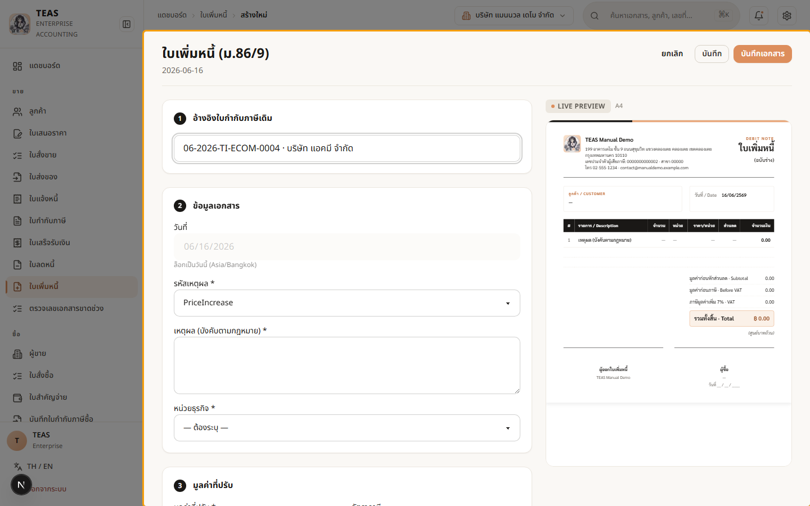
  <figcaption>เลือก "ใบกำกับภาษีเดิม" (เฉพาะใบที่โพสต์แล้ว). ระบบดึงผู้ซื้อ + อัตราภาษีจากใบนั้น และล็อกอัตราภาษีไว้ที่ 7% ตามใบเดิม</figcaption>
</figure>

### ขั้นที่ 3

<figure markdown="span">
  
  <figcaption>ระบุ "เหตุผล" (บังคับ) + หน่วยธุรกิจ + "มูลค่าที่ปรับเพิ่ม" 3,000. กล่องสรุปคำนวณภาษีมูลค่าเพิ่ม 7% = 210 แยกออกจากมูลค่า รวม 3,210</figcaption>
</figure>

### ขั้นที่ 4

<figure markdown="span">
  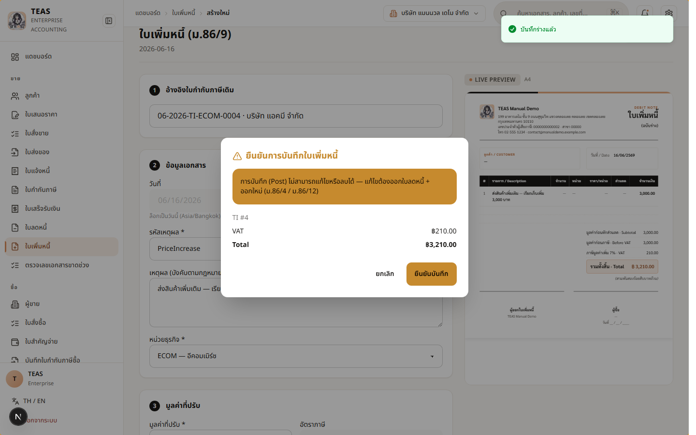
  <figcaption>กด "บันทึกเอกสาร" → กล่องยืนยันสรุปยอดเพิ่มหนี้ + ภาษี. เมื่อโพสต์แล้ว ใบเพิ่มหนี้จะตรึงถาวรเช่นเดียวกับใบกำกับภาษี</figcaption>
</figure>

### ขั้นที่ 5

<figure markdown="span">
  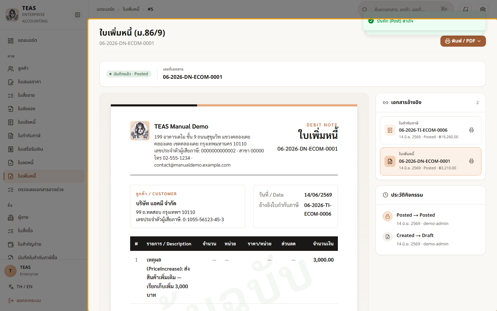
  <figcaption>ใบเพิ่มหนี้ออกเลขที่เอกสารแล้ว อ้างอิงใบกำกับภาษีเดิมใน "เอกสารอ้างอิง" พร้อมเหตุผลและมูลค่าที่เพิ่ม — วิธีปรับยอด "ขึ้น" ที่ถูกต้องตามกฎหมาย</figcaption>
</figure>

## 04.08 — เลือกสินค้า/บริการในเอกสาร

> **เงื่อนไขก่อนใช้งาน:** login admin · มีข้อมูลหลักสินค้า/บริการในระบบ (02.02)

ทุกเอกสารที่มี "รายการสินค้า/บริการ" (ใบเสนอราคา, ใบกำกับภาษี, ใบสั่งซื้อ, ใบสำคัญจ่าย ฯลฯ)
ใช้ช่องเลือกสินค้า/บริการแบบเดียวกัน — แต่ละบรรทัดมีปุ่ม **"เลือกจากรายการ" (🔍)** เปิด
หน้าต่างค้นหาจาก **ข้อมูลหลักสินค้า (Product Master, ดู 02.02)**.

**เลือกจาก master ได้อะไร:** ระบบดึง **ชื่อ + รหัส + ราคาตั้งต้น + หน่วยนับ + ประเภท** มาเติม
ให้อัตโนมัติ ไม่ต้องพิมพ์ซ้ำและลดความผิดพลาด. ถ้าเป็นรายการเฉพาะกิจที่ไม่มีใน master
ก็ **พิมพ์รายละเอียดเองได้** (ad-hoc) โดยไม่ต้องสร้างสินค้าใหม่.

**ประเภทสินค้า/บริการ → ผลทาง VAT:**

| ประเภท | ป้าย | VAT |
|---|---|---|
| สินค้า (GOOD) | 🟦 สินค้า | 7% |
| บริการ (SERVICE) | 🟪 บริการ | 7% |
| สินค้า/บริการยกเว้น (EXEMPT) | 🟧 ยกเว้น VAT | **0% (ม.81)** เช่น สัตว์มีชีวิต พืชผลเกษตร |

ระบบ **คิด VAT ให้ตามประเภทอัตโนมัติ** — เลือกสินค้ายกเว้นแล้วบรรทัดนั้นจะไม่มี VAT ทันที
โดยผู้ใช้ไม่ต้องตั้งเอง (กันออกภาษีผิดประเภท).

### ขั้นที่ 1

<figure markdown="span">
  
  <figcaption>ในส่วน "รายการ" ของเอกสาร แต่ละบรรทัดมีช่องรายละเอียด + ปุ่มแว่นขยาย "เลือกจากรายการ" สำหรับดึงสินค้า/บริการจากข้อมูลหลัก (หรือจะพิมพ์เองก็ได้)</figcaption>
</figure>

### ขั้นที่ 2

<figure markdown="span">
  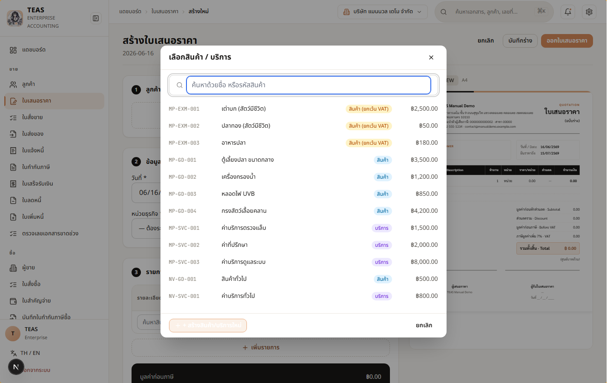
  <figcaption>หน้าต่าง "เลือกสินค้า / บริการ" — ค้นหาด้วยชื่อหรือรหัส. แต่ละรายการ แสดง รหัส · ชื่อ · ป้ายประเภท (สินค้า/บริการ/ยกเว้น VAT) · ราคาตั้งต้น</figcaption>
</figure>

### ขั้นที่ 3

<figure markdown="span">
  
  <figcaption>เลือกบริการ "ค่าที่ปรึกษา" → ระบบเติมชื่อ + ราคาตั้งต้น (2,000) + หน่วยนับให้อัตโนมัติ และตั้งอัตราภาษีเป็น 7% เพราะเป็นประเภท "บริการ"</figcaption>
</figure>

### ขั้นที่ 4

<figure markdown="span">
  
  <figcaption>เลือกสินค้ายกเว้น VAT "เต่าบก (สัตว์มีชีวิต)" → อัตราภาษีของบรรทัด เปลี่ยนเป็น 0 อัตโนมัติ (ยกเว้น VAT ตาม ม.81). ระบบกันการคิดภาษีผิดประเภทให้เอง. รายการที่ไม่มีใน master ให้พิมพ์รายละเอียดเองได้</figcaption>
</figure>
