# 5. งานซื้อ

## 05.01 — ออกและอนุมัติใบสั่งซื้อ

> **เงื่อนไขก่อนใช้งาน:** login admin (สิทธิ์ purchase_order create + approve) · มีผู้ขาย + หน่วยธุรกิจ ในระบบ (บทที่ 3)

ใบสั่งซื้อ (Purchase Order / PO) คือเอกสารแรกของงานซื้อ — ใช้สั่งซื้อสินค้า/บริการจาก
ผู้ขาย และเป็นเครื่องมือ **ควบคุมการใช้จ่าย** ภายในกิจการ (อนุมัติก่อนซื้อจริง).

**สายงานซื้อเต็มรูป (document chain):**

ใบสั่งซื้อ → **บันทึกใบกำกับภาษีซื้อ** (รับของ + ภาษีซื้อ) → ใบสำคัญจ่าย (จ่ายเงิน +
หัก ณ ที่จ่าย) → หนังสือรับรองหัก ณ ที่จ่าย (50ทวิ)

**ขั้นตอนอนุมัติ (workflow):** ใบสั่งซื้อสร้างเป็น "ฉบับร่าง" ก่อน แล้วต้อง **อนุมัติ** จึงจะ
ใช้งานต่อได้ — และระบบจะออก **เลขที่เอกสาร (PO-NNNN) ตอนอนุมัติ** เท่านั้น. ระบบนี้รองรับ
กิจการขนาดเล็กที่มีผู้ใช้คนเดียว (ผู้สร้างอนุมัติเองได้) แต่กิจการใหญ่สามารถแยกผู้สร้าง/
ผู้อนุมัติตามสิทธิ์ได้ (Segregation of Duties).

### ขั้นที่ 1

<figure markdown="span">
  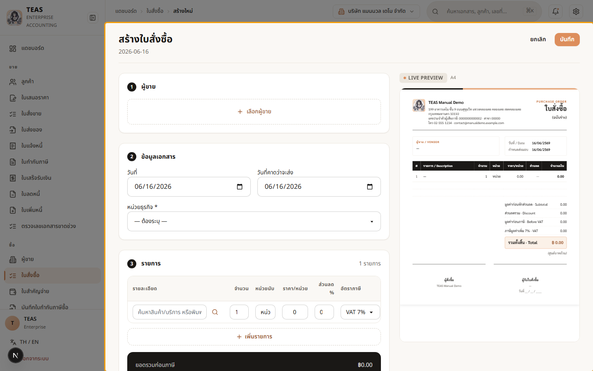
  <figcaption>ฟอร์ม "สร้างใบสั่งซื้อ" — ส่วน ① ผู้ขาย, ② ข้อมูลเอกสาร (วันที่ + วันที่คาดว่าจะส่ง), ③ รายการ. ตัวอย่างเอกสารด้านขวาออกในนามบริษัทเรา ส่งถึงผู้ขาย</figcaption>
</figure>

### ขั้นที่ 2

<figure markdown="span">
  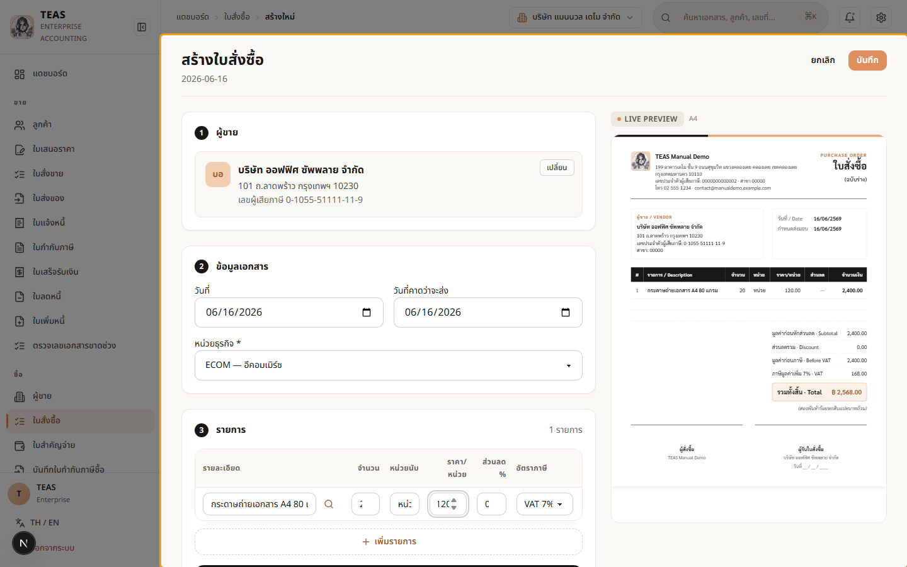
  <figcaption>เลือกผู้ขาย "บริษัท ออฟฟิศ ซัพพลาย จำกัด" (ในประเทศ จด VAT) + หน่วย ธุรกิจ + กรอกรายการ (20 × 120). ระบบคำนวณยอดก่อนภาษี 2,400 + VAT 7% ให้อัตโนมัติ</figcaption>
</figure>

### ขั้นที่ 3

<figure markdown="span">
  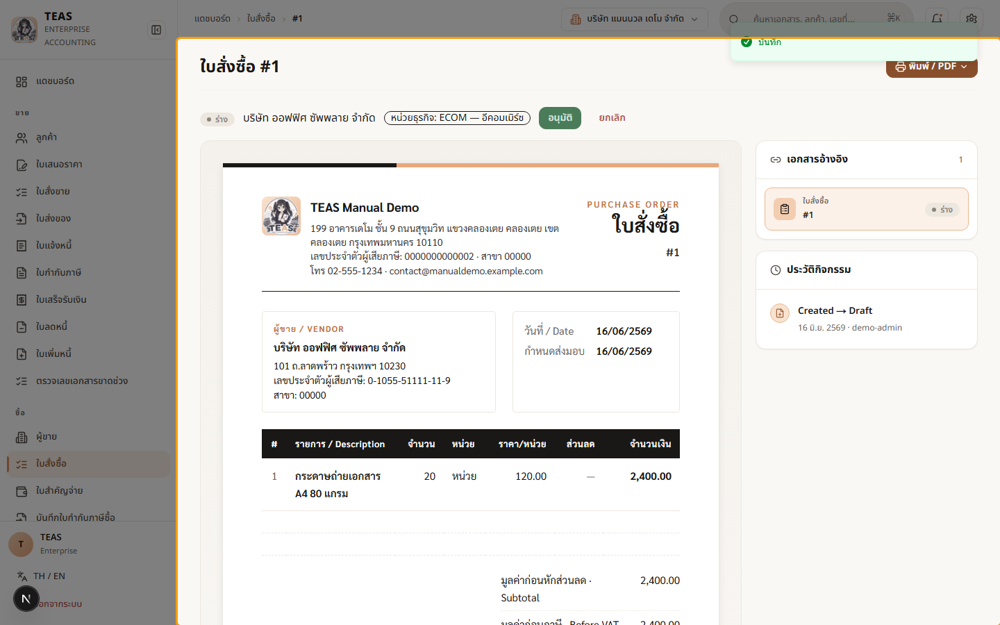
  <figcaption>บันทึกแล้ว → ใบสั่งซื้อสถานะ "ฉบับร่าง" ยัง "ไม่มีเลขที่เอกสาร". มุมขวามีปุ่ม "อนุมัติ" — กิจการตรวจสอบก่อนอนุมัติเพื่อควบคุมการใช้จ่าย</figcaption>
</figure>

### ขั้นที่ 4

<figure markdown="span">
  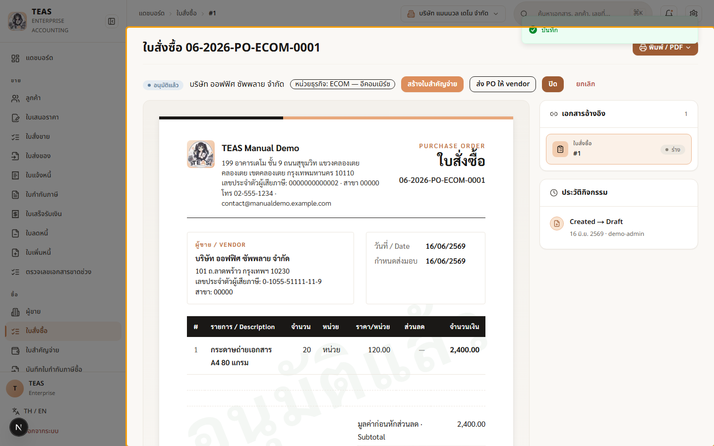
  <figcaption>กด "อนุมัติ" → ระบบออกเลขที่เอกสาร (PO-NNNN) และเปลี่ยนสถานะเป็น "อนุมัติแล้ว". ตอนนี้พร้อมรับของ/บันทึกใบกำกับภาษีซื้อ และสร้างใบสำคัญจ่ายอ้างอิงต่อ</figcaption>
</figure>

## 05.02 — บันทึกใบกำกับภาษีซื้อ

> **เงื่อนไขก่อนใช้งาน:** login admin (สิทธิ์ vendor_invoice create + post) · ได้รับใบกำกับภาษีจากผู้ขายจริง (เลขที่/วันที่)

ใบกำกับภาษีซื้อ (Vendor Invoice) คือการ **บันทึกใบกำกับภาษีที่ได้รับจากผู้ขาย** เข้าระบบ
เพื่อขอเครดิต **ภาษีซื้อ (Input VAT)** ไปหักกับภาษีขายในแบบ ภ.พ.30.

**สิ่งที่ต้องระบุ:**

- **เลขที่ + วันที่ใบกำกับภาษีของผู้ขาย** — เลขเอกสารต้นฉบับจากผู้ขาย (ไม่ใช่เลขของเรา).
- **งวดเครดิตภาษีซื้อ (ม.82/4)** — ภาษีซื้อใช้เครดิตได้ตั้งแต่เดือนของใบกำกับฯ ถึง +6 เดือน.
- **หมวดค่าใช้จ่าย** — กำหนดว่าภาษีซื้อ "เครดิตได้" หรือเป็น **"ภาษีซื้อต้องห้าม"**
  (เช่น ค่ารับรอง — เครดิตไม่ได้ตามกฎหมาย).

ถ้าเคยออกใบสั่งซื้อให้ผู้ขายรายนี้ (05.01) ระบบมีตัวเลือก "เชื่อมกับใบสั่งซื้อ" เพื่อดึง
รายการมาให้ — ที่นี่แสดงการบันทึกแบบกรอกเอง.

### ขั้นที่ 1

<figure markdown="span">
  
  <figcaption>ฟอร์ม "บันทึกใบกำกับภาษีซื้อ" — ① ผู้ขาย, ② ข้อมูลเอกสาร (เลขที่/วันที่ ใบกำกับฯ ของผู้ขาย + งวดเครดิต ม.82/4), ③ รายการพร้อมหมวดค่าใช้จ่าย</figcaption>
</figure>

### ขั้นที่ 2

<figure markdown="span">
  
  <figcaption>เลือกผู้ขาย + กรอก "เลขที่ใบกำกับภาษีของผู้ขาย" (เลขต้นฉบับจากผู้ขาย). "งวดเครดิตภาษีซื้อ (ม.82/4)" ตั้งค่าเริ่มต้นเป็นเดือนของใบกำกับฯ — เลือกได้ถึง +6 เดือน</figcaption>
</figure>

### ขั้นที่ 3

<figure markdown="span">
  
  <figcaption>เลือก "หมวดค่าใช้จ่าย" + กรอกรายละเอียด + จำนวนเงินก่อน VAT 2,400. กล่องสรุปแยก "ภาษีซื้อ (เครดิตได้)" 168 ออกจาก "ภาษีซื้อต้องห้าม" ตามหมวดที่เลือก</figcaption>
</figure>

### ขั้นที่ 4

<figure markdown="span">
  
  <figcaption>กด "บันทึกเอกสาร (Post)" → กล่องยืนยันสรุปยอดและภาษีซื้อ. การโพสต์ บันทึกภาษีซื้อเข้าระบบ ภ.พ.30 ของงวดที่เลือก</figcaption>
</figure>

### ขั้นที่ 5

<figure markdown="span">
  
  <figcaption>บันทึกใบกำกับภาษีซื้อเรียบร้อย — ภาษีซื้อถูกบันทึกเข้าระบบเพื่อใช้เครดิต ในแบบ ภ.พ.30. ขั้นถัดไปคือจ่ายเงินผู้ขายด้วย "ใบสำคัญจ่าย" (05.03)</figcaption>
</figure>

## 05.03 — ใบสำคัญจ่าย + หัก ณ ที่จ่าย (50ทวิ)

> **เงื่อนไขก่อนใช้งาน:** login admin (สิทธิ์ payment_voucher create + approve + post) · มีผู้ขายประเภทค่าบริการ/ค่าเช่า + ประเภทเงินได้ 50ทวิ ในระบบ

ใบสำคัญจ่าย (Payment Voucher) คือเอกสารบันทึกการ **จ่ายเงินให้ผู้ขาย**. จุดสำคัญคือ
**ภาษีหัก ณ ที่จ่าย (Withholding Tax / WHT)**:

เมื่อจ่ายค่าบริการ ค่าเช่า ค่าวิชาชีพ ฯลฯ ให้ผู้รับเงิน ผู้จ่าย (กิจการเรา) มีหน้าที่
**หักภาษีไว้ส่วนหนึ่ง** แล้วนำส่งสรรพากรแทนผู้รับเงิน พร้อมออก **หนังสือรับรองการหักภาษี
ณ ที่จ่าย (50ทวิ)** ให้ผู้รับเงินเก็บไว้:

- **อัตราการหัก** ขึ้นกับประเภทเงินได้ — เช่น ค่าบริการ 3%, **ค่าเช่า 5%**, ค่าโฆษณา 2%.
- **แบบนำส่ง** — จ่ายให้นิติบุคคล = **ภ.ง.ด.53**, จ่ายให้บุคคลธรรมดา = ภ.ง.ด.3.
- **เงินจ่ายสุทธิ = มูลค่า + VAT − ภาษีหัก ณ ที่จ่าย** (ผู้รับได้น้อยลงตามยอดที่ถูกหัก).

ตัวอย่างนี้จ่าย **ค่าเช่าสำนักงานให้นิติบุคคล** จึงหัก 5% และออก 50ทวิ แบบ ภ.ง.ด.53.
(ซื้อ "สินค้า/ของ" ไม่ต้องหัก ณ ที่จ่าย — จึงใช้ผู้ขายค่าเช่า ไม่ใช่ผู้ขายของจาก 05.01.)

### ขั้นที่ 1

<figure markdown="span">
  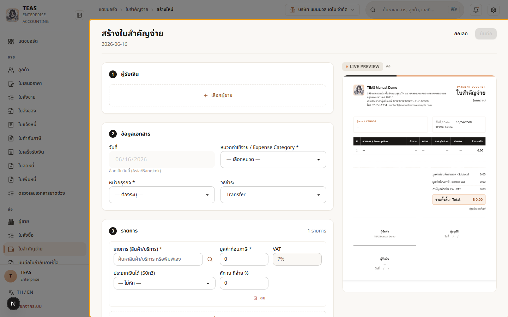
  <figcaption>ฟอร์ม "สร้างใบสำคัญจ่าย" — ① ผู้รับเงิน, ② ข้อมูลเอกสาร (หมวด ค่าใช้จ่าย + วิธีชำระ), ③ รายการ พร้อมช่อง "ประเภทเงินได้ (50ทวิ)" สำหรับหัก ณ ที่จ่าย</figcaption>
</figure>

### ขั้นที่ 2

<figure markdown="span">
  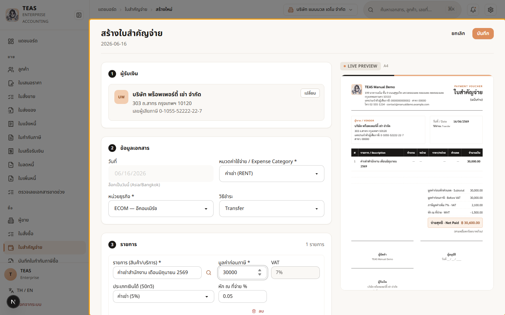
  <figcaption>เลือกผู้รับเงิน + หมวดค่าเช่า + รายการ (ค่าเช่า 30,000) + ประเภทเงินได้ "ค่าเช่า (5%)". ระบบหัก ณ ที่จ่าย 1,500 และคำนวณ "จ่ายสุทธิ" = 30,000 + VAT − 1,500</figcaption>
</figure>

### ขั้นที่ 3

<figure markdown="span">
  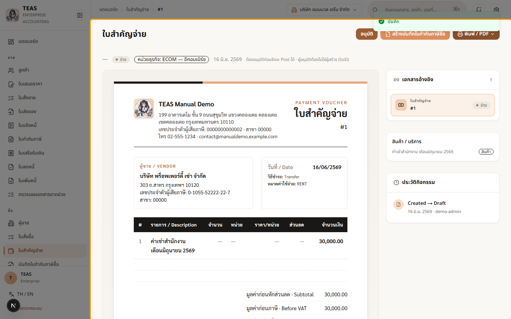
  <figcaption>บันทึกแล้ว → ใบสำคัญจ่ายสถานะ "ฉบับร่าง" แสดงยอดหัก ณ ที่จ่าย และ ยอดจ่ายสุทธิ. ต้อง "อนุมัติ" แล้ว "บันทึก (Post)" จึงลงบัญชีและออก 50ทวิ</figcaption>
</figure>

### ขั้นที่ 4

<figure markdown="span">
  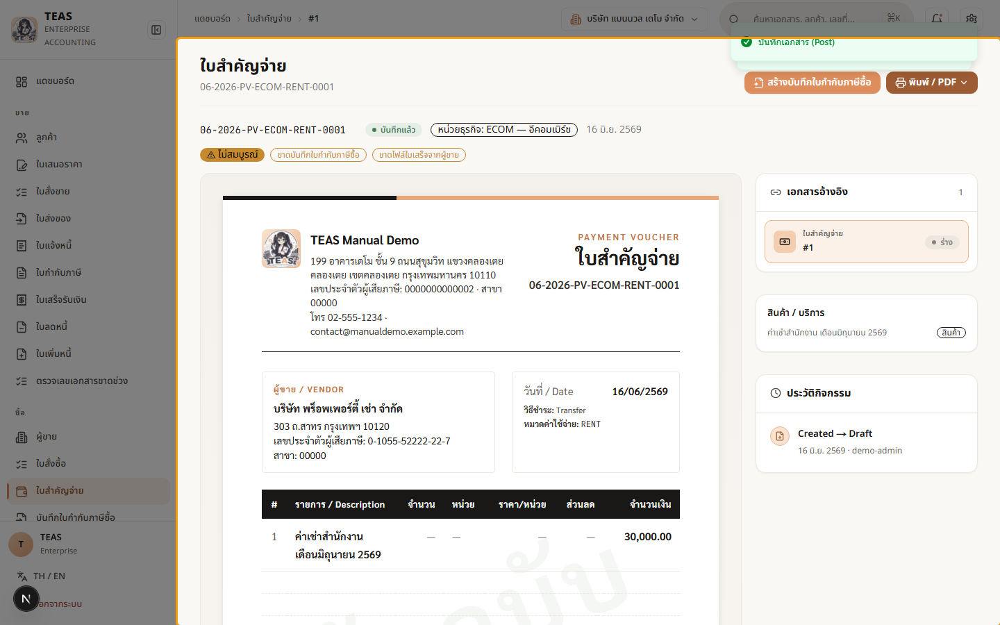
  <figcaption>กด "อนุมัติ" แล้ว "บันทึก (Post)" → ระบบลงบัญชี (เดบิตค่าเช่า/ภาษีซื้อ, เครดิตเงินสด/ภาษีหัก ณ ที่จ่ายค้างนำส่ง) และออกหนังสือรับรอง 50ทวิ ให้อัตโนมัติ</figcaption>
</figure>

### ขั้นที่ 5

<figure markdown="span">
  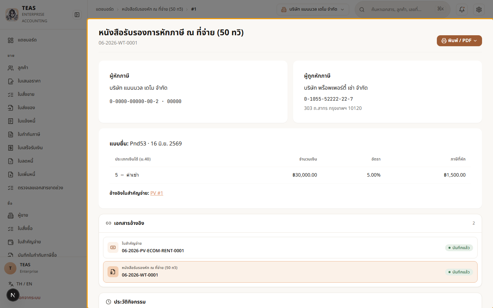
  <figcaption>หนังสือรับรองการหักภาษี ณ ที่จ่าย (50ทวิ) ที่ระบบออกให้ — ระบุผู้ถูกหัก, ประเภทเงินได้, ยอดหัก 1,500 และแบบนำส่ง ภ.ง.ด.53 (จ่ายให้นิติบุคคล). พิมพ์มอบผู้รับเงินได้</figcaption>
</figure>

## 05.04 — ภาษีหัก ณ ที่จ่าย (WHT) โดยละเอียด

> **เงื่อนไขก่อนใช้งาน:** login admin (สิทธิ์ payment_voucher) · มีประเภทเงินได้ 50ทวิ ในระบบ

**ภาษีหัก ณ ที่จ่าย (Withholding Tax / WHT)** คือภาษีที่ "ผู้จ่ายเงิน" หักจากผู้รับไว้
ส่วนหนึ่งแล้วนำส่งสรรพากรแทน พร้อมออกหนังสือรับรอง **50ทวิ** ให้ผู้รับ (ดู flow เต็มใน 05.03).

**อัตราหักขึ้นกับ "ประเภทเงินได้" (ม.40):**

| ประเภทเงินได้ | อัตรา | ตัวอย่าง |
|---|---|---|
| ค่าโฆษณา | 2% | ค่าโฆษณา ค่าประชาสัมพันธ์ |
| ค่าบริการ / ค่าจ้างทำของ | 3% | ค่าที่ปรึกษา ค่าซ่อม ค่าออกแบบ |
| ค่าเช่า (อสังหาฯ) | 5% | ค่าเช่าสำนักงาน/อาคาร |
| ค่าวิชาชีพอิสระ | 3% | ค่าทนายความ ค่าสอบบัญชี |

**แบบนำส่ง** ขึ้นกับผู้รับเงิน: นิติบุคคล = **ภ.ง.ด.53**, บุคคลธรรมดา = **ภ.ง.ด.3**.

**สำคัญ — เมื่อไหร่ "ไม่" หัก:** การซื้อ **สินค้า/ของ** ไม่ต้องหัก ณ ที่จ่าย (เลือก "ไม่หัก");
หักเฉพาะ **ค่าบริการ/ค่าเช่า/ค่าจ้าง** ฯลฯ. และยอดน้อยกว่าเกณฑ์ขั้นต่ำ (1,000 บาท) ก็ไม่ต้องหัก.

**ทั้งสองฝั่ง:** ฝั่ง **ซื้อ** (บทนี้) = เราหักจากผู้ขายตอนจ่าย (ใบสำคัญจ่าย → 50ทวิ);
ฝั่ง **ขาย** = ลูกค้าหักจากเรา → บันทึกตอนรับเงินในใบเสร็จ (ดู 04.05 ส่วน "หัก ณ ที่จ่าย").

**ผู้จ่ายออกภาษีแทน (gross-up):** ถ้าตกลงให้ผู้รับได้เต็มจำนวน ผู้จ่ายต้อง "ออกภาษีแทน"
แล้ว gross-up ยอดภาษีเข้าไปในเงินได้ของผู้รับ — ระบบมีตัวเลือกให้ (บังคับอัตโนมัติสำหรับ
ผู้ขายต่างประเทศที่ไม่มีเลข VAT ไทย).

### ขั้นที่ 1

<figure markdown="span">
  
  <figcaption>ในแต่ละบรรทัดของใบสำคัญจ่ายมีช่อง "ประเภทเงินได้ (50ทวิ)" — เลือกให้ ตรงกับลักษณะเงินที่จ่าย (ค่าบริการ/ค่าเช่า/ค่าโฆษณา ฯลฯ). ถ้าซื้อสินค้าให้เลือก "ไม่หัก"</figcaption>
</figure>

### ขั้นที่ 2

<figure markdown="span">
  
  <figcaption>เลือกประเภท "ค่าบริการ (3%)" → ระบบใส่อัตรา 3% ให้อัตโนมัติ และหัก ณ ที่จ่าย 900 (3% ของ 30,000). ตัวอย่างเอกสารแสดง "จ่ายสุทธิ" = มูลค่า + VAT − 900</figcaption>
</figure>

### ขั้นที่ 3

<figure markdown="span">
  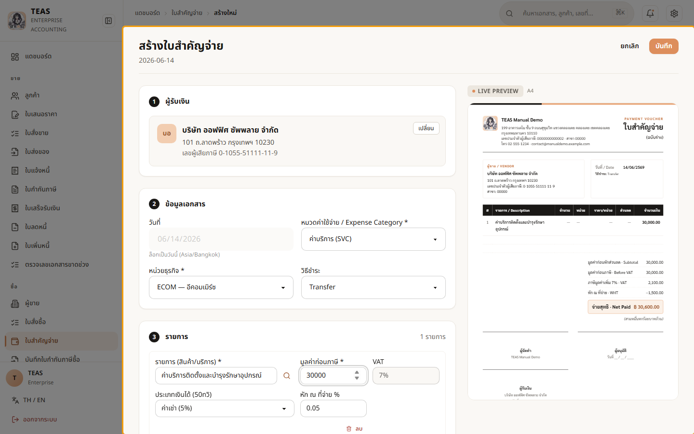
  <figcaption>เปลี่ยนประเภทเป็น "ค่าเช่า (5%)" → อัตราหักเปลี่ยนเป็น 5% และยอดหักเป็น 1,500 ทันที. อัตราหัก "ขึ้นกับประเภทเงินได้" — เลือกผิดประเภท = หักผิดอัตรา</figcaption>
</figure>

### ขั้นที่ 4

<figure markdown="span">
  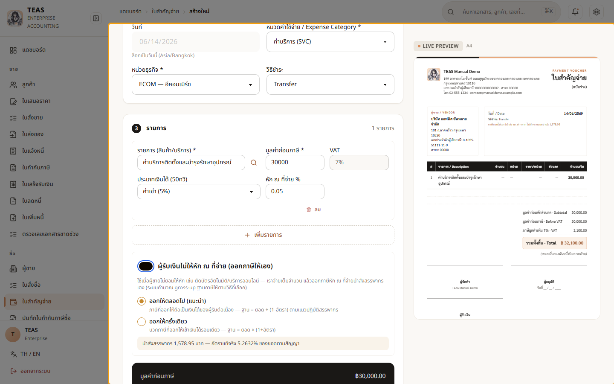
  <figcaption>เปิด "ผู้จ่ายออกภาษีแทน" สำหรับกรณีตกลงให้ผู้รับได้เต็มจำนวน — ระบบ gross-up ยอดภาษีเข้าไปในเงินได้ และให้เลือกวิธี (ออกแทนตลอดไป/ครั้งเดียว). บังคับอัตโนมัติสำหรับผู้ขายต่างประเทศที่ไม่มีเลข VAT ไทย. ผู้รับ (นิติบุคคล) → แบบ ภ.ง.ด.53</figcaption>
</figure>
