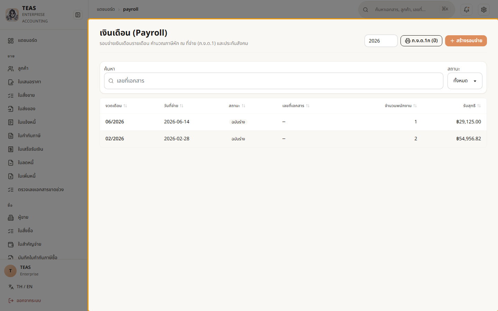
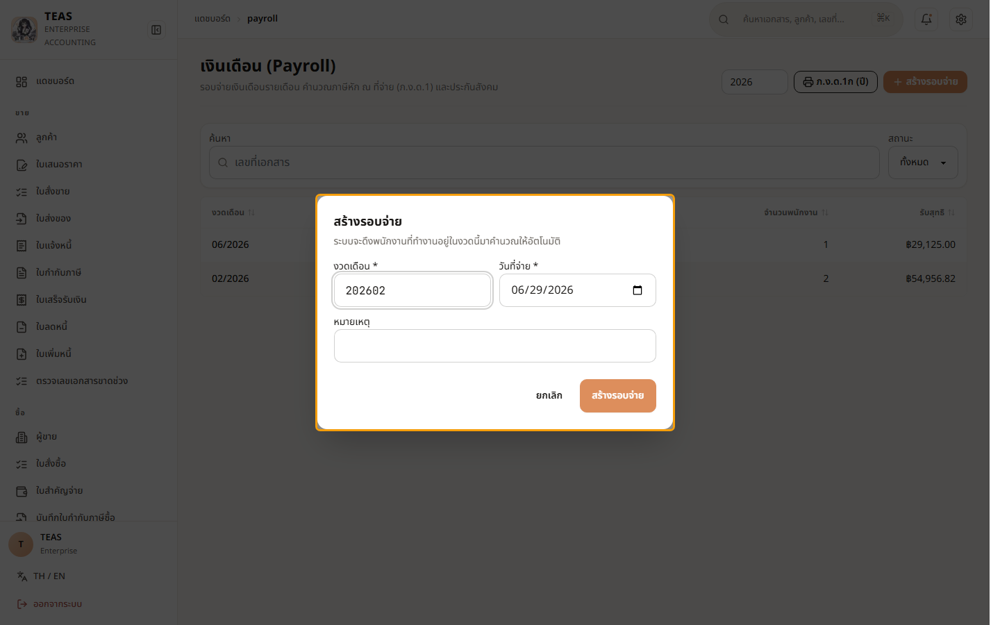
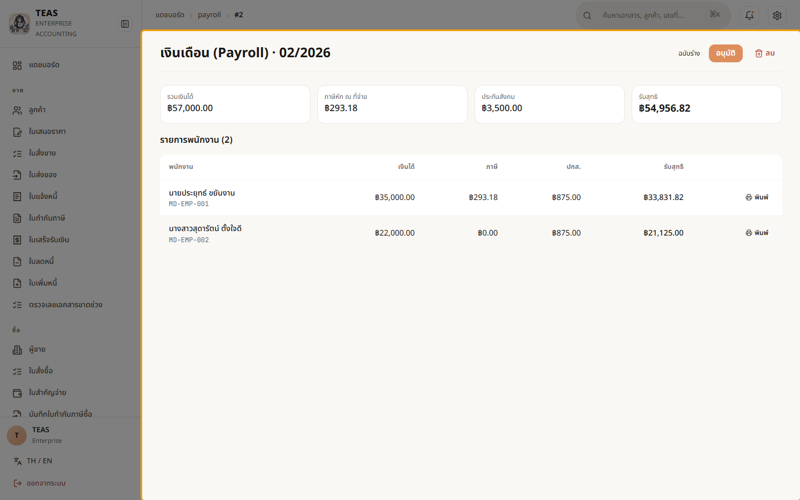

# 6. เงินเดือน

## 06.01 — รอบจ่ายเงินเดือน + ภ.ง.ด.1 + ประกันสังคม

> **เงื่อนไขก่อนใช้งาน:** login admin (สิทธิ์ payroll.run.manage/post/pay) · มีพนักงานพร้อมเงินเดือน + สถานะภาษี ในระบบ (03.05)

ระบบเงินเดือนทำงานเป็น **"รอบจ่าย" (Payroll Run)** ต่อหนึ่งงวดเดือน:

1. **สร้างรอบจ่าย** — ระบุงวดเดือน + วันที่จ่าย → ระบบ **ดึงพนักงานที่ทำงานอยู่ในงวดนั้น
   มาคำนวณให้อัตโนมัติ**: เงินเดือน, **ภาษีหัก ณ ที่จ่าย (PIT → ภ.ง.ด.1)**, และ
   **ประกันสังคม (5% ทั้งฝั่งลูกจ้าง/นายจ้าง สูงสุด 875 บาท/เดือน — เพดานเงินเดือน 17,500)**.
2. **อนุมัติ → บันทึกบัญชี → จ่าย** — รอบจ่ายไหลผ่านสถานะ ร่าง → อนุมัติแล้ว → บันทึกบัญชีแล้ว
   (ลงบัญชี + ล็อกถาวร) → จ่ายแล้ว.
3. **เอกสาร** — หลังบันทึกบัญชี ออก **ภ.ง.ด.1** (นำส่งภาษีพนักงาน), **ปกส.** (นำส่ง
   ประกันสังคม), **สลิปเงินเดือน** และ **ภ.ง.ด.1ก** (สรุปทั้งปี) ได้.

**ภาษีคิดตามสถานะบุคคล** — ลดหย่อนส่วนตัว/คู่สมรส/บุตร ทำให้พนักงานเงินเดือนเท่ากันแต่
สถานะครอบครัวต่างกัน เสียภาษีไม่เท่ากัน (ระบบคิดให้ตามข้อมูลพนักงาน ดู 03.05).

### ขั้นที่ 1

<figure markdown="span">
  
  <figcaption>หน้า "เงินเดือน" แสดงรอบจ่ายแต่ละงวด (สถานะ/จำนวนพนักงาน/ยอดรับสุทธิ). มุมขวามีปุ่ม "สร้างรอบจ่าย" และ "ภ.ง.ด.1ก (PDF)" สำหรับสรุปภาษีทั้งปี</figcaption>
</figure>

### ขั้นที่ 2

<figure markdown="span">
  
  <figcaption>หน้าต่าง "สร้างรอบจ่าย" — ใส่ "งวดเดือน" (YYYYMM) + "วันที่จ่าย". เมื่อกดสร้าง ระบบจะดึงพนักงานที่ทำงานอยู่ในงวดนั้นมาคำนวณภาษี + ประกันสังคมให้เอง</figcaption>
</figure>

### ขั้นที่ 3

<figure markdown="span">
  
  <figcaption>รอบจ่ายตัวอย่าง — การ์ดสรุปด้านบน: รวมเงินได้ · ภาษีหัก ณ ที่จ่าย · ประกันสังคม · รับสุทธิ. ด้านล่างเป็นรายการพนักงานที่ระบบคำนวณภาษีให้ทีละคน ตามเงินเดือน + สถานะครอบครัว — ประยุทธ์ (35,000 โสด) เสียภาษี ฿293, สุดารัตน์ (22,000 สมรส บุตร 2) เสียภาษี ฿0 เพราะลดหย่อนมากกว่าและเงินได้น้อยกว่า</figcaption>
</figure>

### ขั้นที่ 4

<figure markdown="span">
  
  <figcaption>รอบจ่ายสถานะ "ร่าง" — กด "อนุมัติ" แล้ว "บันทึกบัญชี" (ล็อกถาวร) แล้ว "จ่ายแล้ว". หลังบันทึกบัญชีจะมีปุ่มออก ภ.ง.ด.1 / ปกส. / สลิปเงินเดือน ให้นำส่งและแจกพนักงาน</figcaption>
</figure>
