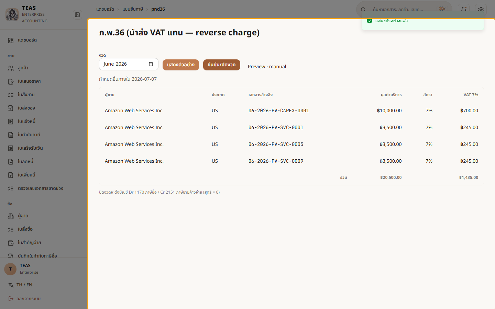
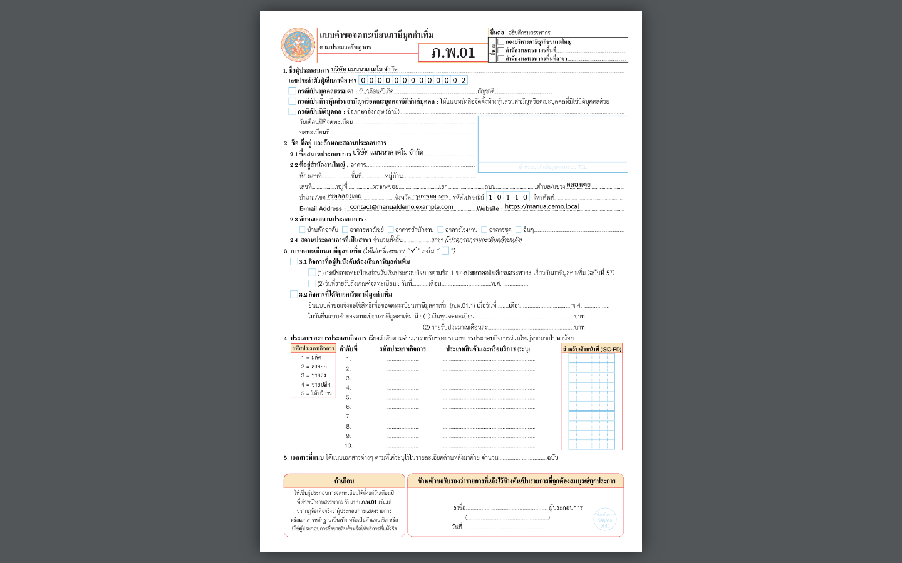
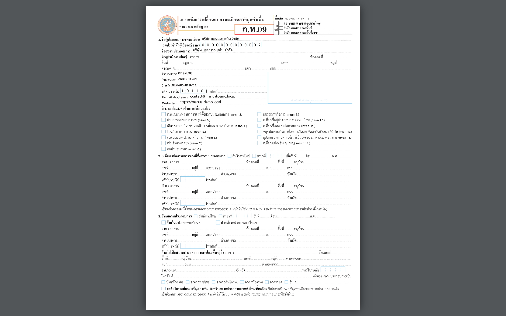
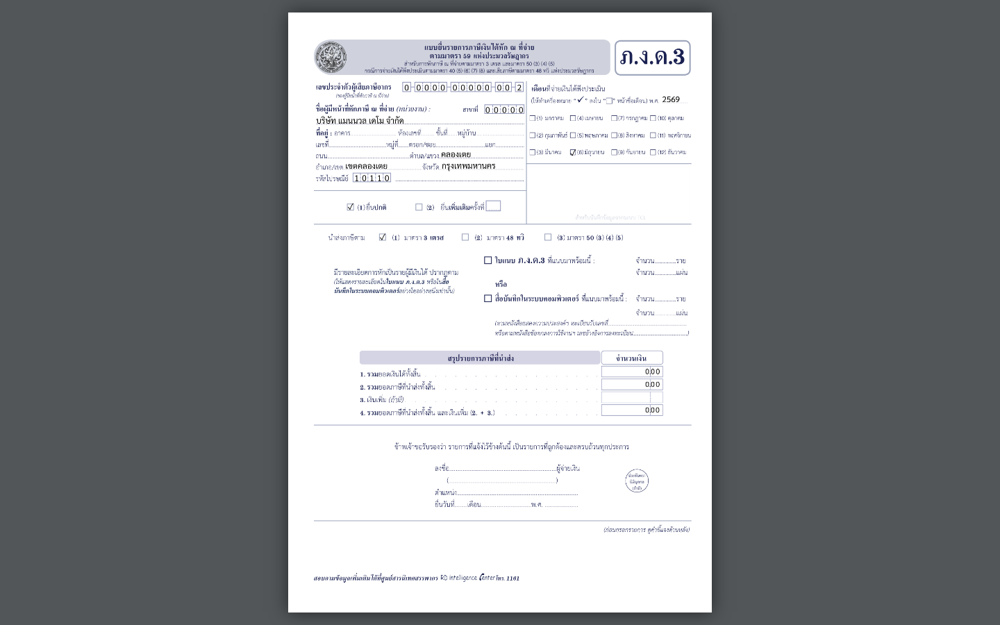

# 7. ภาษี

## 07.01 — ภ.พ.30 ภาษีมูลค่าเพิ่ม — ภาษีขาย − ภาษีซื้อ

> **เงื่อนไขก่อนใช้งาน:** login admin (สิทธิ์ report.pnd30) · กิจการจด VAT + มีใบกำกับภาษี/ภาษีซื้อ ในงวด (ดู บท 4–5)

**ภ.พ.30** คือแบบแสดงรายการ **ภาษีมูลค่าเพิ่ม (VAT)** ที่กิจการจด VAT ต้องยื่น
**ทุกเดือน ภายในวันที่ 15 ของเดือนถัดไป** (§4.5):

- **ภาษีขาย (Output VAT)** — VAT 7% ที่เก็บจากลูกค้า รวมจาก **ใบกำกับภาษี/ใบเพิ่มหนี้**
  ที่ออกในงวด หัก **ใบลดหนี้**.
- **ภาษีซื้อ (Input VAT)** — VAT 7% ที่จ่ายให้ผู้ขาย รวมจาก **ใบกำกับภาษีซื้อ** ที่บันทึก
  (เคลมได้ตามงวดเครดิต ม.82/4 — ดู 05.02).
- **ภาษีที่ต้องชำระสุทธิ = ภาษีขาย − ภาษีซื้อ** (ถ้าติดลบ = **เครดิตยกไปงวดหน้า**).

หน้านี้แยก 2 ขั้น: **"แสดงตัวอย่าง"** = คำนวณจากบัญชีแยกประเภท (GL) ทันที ดูได้ไม่จำกัด;
**"ยืนยัน/ปิดงวด"** = ปิดงวดเพื่อนำส่ง (โหมด `auto` ยื่นผ่าน RD API / `manual` ยื่นเอง —
ตั้งระดับบริษัท §4.6). คู่มือนี้สาธิตเฉพาะ **แสดงตัวอย่าง** (อ่านอย่างเดียว).

### ขั้นที่ 1

<figure markdown="span">
  
  <figcaption>หน้า "ภ.พ.30" — เลือก "งวด (เดือน/ปี)" แล้วกด "แสดงตัวอย่าง" เพื่อให้ระบบ คำนวณภาษีขาย/ภาษีซื้อของงวดนั้นจากบัญชีให้อัตโนมัติ. ปุ่ม "ยืนยัน/ปิดงวด" ใช้ตอนนำส่งจริง</figcaption>
</figure>

### ขั้นที่ 2

<figure markdown="span">
  
  <figcaption>ผลการแสดงตัวอย่าง — ตารางสรุปทีละบรรทัด: ขายที่ต้องเสียภาษี · ขาย 0% · ขายยกเว้น → รวมเป็น "ภาษีขายรวม"; ซื้อที่ขอคืนได้ + สัดส่วนเครดิต (ม.82/6) → "ภาษีซื้อรวม"; บรรทัดล่างสุด "ภาษีที่ต้องชำระสุทธิ" = ภาษีขาย − ภาษีซื้อ. มีกำหนดยื่น + ชื่อ/เลขผู้เสียภาษีบริษัทกำกับ</figcaption>
</figure>

## 07.02 — ภ.ง.ด.3 / ภ.ง.ด.53 นำส่งภาษีหัก ณ ที่จ่าย

> **เงื่อนไขก่อนใช้งาน:** login admin (สิทธิ์ report/tf) · มีใบ 50ทวิ ในงวด (ออกตอน post ใบสำคัญจ่าย — ดู 05.03)

เมื่อจ่ายเงินแล้วหักภาษี ณ ที่จ่าย (ออกใบ **50ทวิ** ดู 05.03) กิจการต้อง **นำส่งภาษีที่หักไว้**
ให้สรรพากรเป็นรายเดือน **ภายในวันที่ 7 ของเดือนถัดไป** โดยแยกแบบตามประเภทผู้รับเงิน:

- **ภ.ง.ด.3** — ผู้รับเงินเป็น **บุคคลธรรมดา**.
- **ภ.ง.ด.53** — ผู้รับเงินเป็น **นิติบุคคล** (บริษัท/ห้างฯ).
- **ภ.ง.ด.54** — จ่ายไปต่างประเทศ (ม.70) · **ภ.พ.36** — VAT นำส่งแทน (reverse charge, ม.83/6).

ในแต่ละแบบ ระบบ **รวมใบ 50ทวิ ของงวดให้อัตโนมัติ** → กด **"แสดงตัวอย่าง"** เห็นรายการ
ราย 50ทวิ + ยอดรวม (อ่านอย่างเดียว คำนวณจากบัญชีทันที) → **ดาวน์โหลดไฟล์รูปแบบกลาง (.txt)**
อัปโหลดเข้าโปรแกรมโอนย้ายข้อมูล/ยื่นผ่าน e-Filing → **"ยืนยัน/ปิดงวด"** เมื่อยื่นแล้ว.
หน้านี้แสดง **ศูนย์รวมแบบยื่นภาษี** ที่ลิงก์ไปทุกแบบและเก็บประวัติการยื่น.

### ขั้นที่ 1

<figure markdown="span">
  
  <figcaption>ศูนย์รวม "แบบยื่นภาษี" — ปุ่มลัดไปแต่ละแบบ (PND30 ภาษีมูลค่าเพิ่ม · PND3/53/54 ภาษีหัก ณ ที่จ่าย · PND36 reverse charge · PND51 ภาษีเงินได้นิติบุคคลครึ่งปี · CIT). ด้านล่างเป็น "ประวัติการยื่น" ทุกแบบที่ปิดงวดแล้ว พร้อมสถานะ/เลขอ้างอิงสรรพากร</figcaption>
</figure>

### ขั้นที่ 2

<figure markdown="span">
  
  <figcaption>ตัวอย่าง **หนังสือรับรองการหักภาษี ณ ที่จ่าย (50ทวิ)** ที่ระบบกรอกให้อัตโนมัติ ตอน post ใบสำคัญจ่าย (05.03) — แบบ ของกรมสรรพากรตัวจริง: ผู้จ่าย/ผู้รับ + เลขผู้เสียภาษี + ประเภทเงินได้ + ยอดเงิน/ภาษีหัก (ตัวอย่าง: ค่าเช่า 30,000 → หัก 5% = 1,500). ใบนี้คือต้นทางของ ภ.ง.ด.3/53</figcaption>
</figure>

## 07.03 — ภาษีเงินได้นิติบุคคล — ภ.ง.ด.51 / ภ.ง.ด.50

> **เงื่อนไขก่อนใช้งาน:** login admin (สิทธิ์ดู CIT/รายงาน) · มีรายการบัญชีในรอบปี (รายได้/รายจ่าย) + เครดิต 50ทวิ (ดู บท 4–5) · รัน manual/render-pdf-samples.py แล้ว (สร้างตัวอย่าง PDF)

นิติบุคคลเสียภาษีเงินได้จาก **กำไรสุทธิทางภาษี** (ไม่ใช่กำไรทางบัญชีตรง ๆ) โดยยื่น 2 แบบต่อปี:

- **ภ.ง.ด.51 (ครึ่งปี, ม.67ทวิ)** — ประมาณการกำไรทั้งปี เสียภาษีครึ่งหนึ่งล่วงหน้า
  ยื่นภายใน 2 เดือนนับจากวันสิ้นครึ่งรอบบัญชี.
- **ภ.ง.ด.50 (ประจำปี)** — ยื่นภายใน 150 วันนับจากวันสิ้นรอบบัญชี; ภาษีที่จ่ายตาม ภ.ง.ด.51
  และ **เครดิตภาษีถูกหัก ณ ที่จ่าย (50ทวิ ขาเข้า)** นำมาหักออกได้.

ระบบดึงรายได้/รายจ่ายจากบัญชีมาทำ **"บันไดคำนวณ"** — กำไรทางบัญชี → บวกกลับรายจ่ายต้องห้าม
(ม.65ตรี) → หักรายการยกเว้น → **กำไรสุทธิทางภาษี** → ภาษี (อัตรา SME/ทั่วไป) แล้ว
**กรอกแบบ RD ตัวจริงให้อัตโนมัติ**. แดชบอร์ดโชว์ทุกตัวเลขก่อน (dry-run) — รวมงบแสดงฐานะ
การเงินย่อที่ต้อง **ดุล (balanced)** — แล้วกดออก PDF.

### ขั้นที่ 1

<figure markdown="span">
  
  <figcaption>แดชบอร์ด CIT (/tax-filings/cit) — การ์ด "โปรไฟล์ SME", "บันไดคำนวณ ภ.ง.ด.50" (กำไรทางบัญชี → กำไรสุทธิทางภาษี → ภาษี − เครดิต = สุทธิ), "งบแสดงฐานะการเงินย่อ" พร้อมป้าย ดุล/ไม่ดุล, ตารางเครดิต 50ทวิ ขาเข้า, และส่วนออก PDF ภ.ง.ด.50 (ติ๊กคำรับรองก่อนดาวน์โหลด)</figcaption>
</figure>

### ขั้นที่ 2

<figure markdown="span">
  
  <figcaption>ตัวอย่าง **ภ.ง.ด.51** (ภาษีกลางปี) ที่ระบบกรอกลงแบบ ของกรมสรรพากรตัวจริงให้ — หัวกระดาษ (ชื่อ/เลขผู้เสียภาษี/รอบบัญชี) + ช่องคำนวณภาษีจากประมาณการ พิมพ์ออกยื่นได้</figcaption>
</figure>

### ขั้นที่ 3

<figure markdown="span">
  
  <figcaption>ตัวอย่าง **ภ.ง.ด.50** (ภาษีประจำปี) หน้าปก ที่ระบบกรอกให้ — แบบเต็มมีหลายหน้า (รายการคำนวณภาษี + งบการเงิน + ใบแนบ) เติมจากบัญชีจริง ตรงกับตัวเลขในแดชบอร์ดขั้นที่ 1</figcaption>
</figure>

## 07.04 — ภ.พ.36 (reverse charge) + ภ.ง.ด.54 — จ่ายต่างประเทศ

> **เงื่อนไขก่อนใช้งาน:** login admin (สิทธิ์ report/tf) · มีใบกำกับภาษีซื้อจากผู้ขายต่างประเทศ (ไม่มี VAT-D) ในงวด — ดู 05.05

เวลาจ่ายเงินไป **ต่างประเทศ** มีภาษี 2 ตัวที่อาจต้องนำส่ง (ภายในวันที่ 7 ของเดือนถัดไป):

- **ภ.พ.36 (นำส่ง VAT แทน — reverse charge, ม.83/6)** — ซื้อ **บริการ** จากผู้ขายต่างประเทศ
  ที่ **ไม่มี VAT-D ในไทย** (เช่น ค่าโฆษณา/คลาวด์/ซอฟต์แวร์) → ผู้จ่ายต้องนำส่ง VAT 7% แทน
  ผู้ขาย. ระบบ **ลงบัญชี (JV) ให้อัตโนมัติ** และยอด VAT นี้ใช้เป็น **ภาษีซื้อ** ในเดือนถัดไปได้
  (ดู 05.05 การเลือกผู้ขายต่างประเทศ).
- **ภ.ง.ด.54 (หัก ณ ที่จ่าย จ่ายต่างประเทศ — ม.70)** — ถ้าจ่ายค่าสิทธิ/ดอกเบี้ย/ค่าบริการบางชนิด
  ให้ผู้รับในต่างประเทศ ต้องหักภาษีนำส่ง. ใช้หน้าจอแบบเดียวกับ ภ.ง.ด.3/53 (period → แสดงตัวอย่าง).

หน้านี้สาธิต **ภ.พ.36** (กิจการมีรายการจริง). **ภ.ง.ด.54** ในชุดข้อมูลตัวอย่างยังไม่มีรายการ ม.70
จึงอธิบายไว้เป็นข้อความ.

### ขั้นที่ 1

<figure markdown="span">
  
  <figcaption>ภ.พ.36 แสดงตัวอย่าง — ตารางรวมการซื้อบริการจากต่างประเทศที่ต้องนำส่ง VAT แทน (ผู้ขาย · ประเทศ · เอกสารอ้างอิง · มูลค่าบริการ · VAT 7%) + ยอดรวม. ระบบลงบัญชี reverse charge (JV) ให้อัตโนมัติตามหมายเหตุท้ายตาราง — VAT ที่นำส่งนี้ใช้เป็นภาษีซื้อเดือนถัดไปได้</figcaption>
</figure>

## 07.05 — ภ.พ.01 / ภ.พ.09 — แบบจดทะเบียน VAT (เติมหัวกระดาษ)

> **เงื่อนไขก่อนใช้งาน:** login admin · ตั้งค่าโปรไฟล์บริษัทครบ (ชื่อ/ที่อยู่/เลขผู้เสียภาษี — ดู 02.05) · รัน manual/render-pdf-samples.py แล้ว

นอกจากแบบ **นำส่งภาษี** (ภ.พ.30 · ภ.ง.ด.3/53/54 · ภ.ง.ด.51/50) ที่ระบบคำนวณตัวเลขให้แล้ว
ระบบยังช่วยกรอก **แบบทะเบียน** ของกรมสรรพากรให้ด้วย:

- **ภ.พ.01** — คำขอ **จดทะเบียนภาษีมูลค่าเพิ่ม**.
- **ภ.พ.09** — คำขอ **แจ้งการเปลี่ยนแปลง** ทะเบียนภาษีมูลค่าเพิ่ม (เช่น ย้ายที่อยู่/เพิ่มสาขา).

ต่างจากแบบนำส่งภาษี — สองแบบนี้เป็น **"แบบคำขอ"** ระบบจึง **เติมให้เฉพาะหัวกระดาษ
(ชื่อกิจการ/ที่อยู่/เลขประจำตัวผู้เสียภาษี จากโปรไฟล์บริษัท)** ส่วนคำตอบที่เหลือเว้นว่างให้
ผู้ยื่น **พิมพ์ออกแล้วกรอกต่อ** ก่อนนำไปยื่น.

### ขั้นที่ 1

<figure markdown="span">
  
  <figcaption>ตัวอย่าง **ภ.พ.01** (คำขอจดทะเบียน VAT) ที่ระบบเติมหัวกระดาษให้ — ชื่อกิจการ/ที่อยู่/เลขประจำตัวผู้เสียภาษี มาจากโปรไฟล์บริษัท. ช่องคำตอบที่เหลือเว้นว่าง ให้พิมพ์ออกไปกรอกต่อแล้วยื่น (เป็นแบบคำขอ ไม่ใช่แบบคำนวณภาษี)</figcaption>
</figure>

### ขั้นที่ 2

<figure markdown="span">
  
  <figcaption>ตัวอย่าง **ภ.พ.09** (แจ้งเปลี่ยนแปลงทะเบียน VAT) เติมหัวกระดาษเช่นกัน — ใช้เมื่อย้ายที่อยู่/เพิ่ม-ปิดสาขา/เปลี่ยนรายละเอียดทะเบียน. กรอกรายการที่เปลี่ยนแล้วยื่นที่สรรพากรพื้นที่</figcaption>
</figure>

## 07.06 — ภ.ง.ด.1 — นำส่งภาษีเงินเดือนรายเดือน

> **เงื่อนไขก่อนใช้งาน:** login admin · มีรอบจ่ายเงินเดือนในงวด (ดู 06.01) · รัน manual/render-pdf-samples.py แล้ว

เมื่อทำ **รอบจ่ายเงินเดือน** (06.01) ระบบหักภาษีเงินได้บุคคลธรรมดา (PIT) จากพนักงานแต่ละคน
ไว้แล้ว — ภาษีก้อนนี้ต้อง **นำส่งกรมสรรพากรรายเดือน** ด้วยแบบ **ภ.ง.ด.1** (ตาม ม.59 เงินได้
ม.40(1)) ภายในวันที่ 7 ของเดือนถัดไป.

ระบบ **กรอกแบบ ภ.ง.ด.1 ของกรมสรรพากรให้อัตโนมัติ** จากรอบจ่าย: หัวกระดาษ (ชื่อ/เลขผู้เสียภาษี/
สาขา/งวด) + สรุปจำนวนพนักงาน · เงินได้รวม · ภาษีที่นำส่ง — พิมพ์ออกยื่นได้เลย (สรุปทั้งปีใช้
**ภ.ง.ด.1ก** หลังปิดรอบจ่ายทั้งปี).

### ขั้นที่ 1

<figure markdown="span">
  
  <figcaption>ตัวอย่าง **ภ.ง.ด.1** ที่ระบบกรอกจากรอบจ่ายเงินเดือนให้ — หัวกระดาษ (ชื่อ/เลขผู้เสียภาษี/สาขา/งวด) + แถวสรุป เงินได้ ม.40(1): จำนวนพนักงาน · เงินได้รวม · ภาษีนำส่ง (ตัวอย่าง: 2 คน · 57,000 · ภาษี 293.18 — ตรงกับรอบจ่าย 06.01). พิมพ์ออกยื่นที่สรรพากรได้เลย</figcaption>
</figure>

## 07.07 — ภ.พ.30 — แบบ VAT ที่ระบบกรอกให้

> **เงื่อนไขก่อนใช้งาน:** login admin (สิทธิ์ report.pnd30) · กิจการจด VAT + มีใบกำกับภาษี/ภาษีซื้อ ในงวด (ดู บท 4–5) · รัน manual/render-pdf-samples.py แล้ว

ใน 07.01 เราดู **ตัวอย่างบนจอ** ของ ภ.พ.30 (ภาษีขาย − ภาษีซื้อ = สุทธิ). เมื่อจะยื่นจริง
ระบบ **กรอกแบบ ภ.พ.30 ของกรมสรรพากรให้อัตโนมัติ** จากยอดชุดเดียวกัน: เลขผู้เสียภาษี ·
สาขา · ชื่อสถานประกอบการ · งวด (เดือน/ปี) · ยอดขายและภาษีขาย · ยอดซื้อและภาษีซื้อ ·
ภาษีที่ต้องชำระ/ขอคืน — **VAT แสดงแยกจากฐาน** (ม.86/4).

เปิด **/reports/pnd30 → เลือกงวด → "ดาวน์โหลด PDF (ภ.พ.30)"** ได้ไฟล์ที่กรอกครบ
พิมพ์ออกยื่นที่สรรพากรได้เลย (ระบบนี้ **ไม่ส่งให้สรรพากรแทน** — เป็นแบบพิมพ์-แล้ว-ยื่นเอง).

### ขั้นที่ 1

<figure markdown="span">
  
  <figcaption>ตัวอย่าง **ภ.พ.30** ที่ระบบกรอกให้ — หัวกระดาษ (ชื่อ/เลขผู้เสียภาษี/สาขา/งวด) + ช่องยอดขายและภาษีขาย − ยอดซื้อและภาษีซื้อ → ภาษีที่ต้องชำระสุทธิ (ตัวอย่างงวด มิ.ย.: ภาษีขาย 6,902 − ภาษีซื้อ 1,281 = ชำระสุทธิ 5,621 — ตรงกับตัวอย่างบนจอใน 07.01). VAT แสดงแยกจากฐาน</figcaption>
</figure>

## 07.08 — ภ.ง.ด.3 — WHT บุคคลธรรมดา + ใบแนบ

> **เงื่อนไขก่อนใช้งาน:** login admin · มีหนังสือรับรองหัก ณ ที่จ่าย (50ทวิ) ของผู้รับเงินบุคคลธรรมดาในงวด (ดู 05.03/05.04) · รัน manual/render-pdf-samples.py แล้ว

**ภ.ง.ด.3** ใช้นำส่งภาษีหัก ณ ที่จ่ายที่หักจาก **ผู้รับเงินที่เป็นบุคคลธรรมดา** (เช่น จ่าย
ค่าเช่าให้เจ้าของที่เป็นบุคคล หัก 5%, จ่ายค่าจ้าง/ค่าบริการ หัก 3%). คู่กับ **ภ.ง.ด.53**
ที่ใช้กับ **นิติบุคคล** (07.09) — ระบบเลือกแบบให้อัตโนมัติตามประเภทผู้รับเงิน.

ระบบกรอกให้ 2 ส่วน: **หน้าหลัก** (ชื่อ/เลขผู้เสียภาษี/สาขาผู้จ่าย · เดือนที่จ่าย · ยอดรวม
เงินได้และภาษีนำส่ง · ☑ "ใบแนบที่แนบมาพร้อมนี้" + จำนวน ราย/แผ่น) และ **ใบแนบ** ที่ลง
**ผู้ถูกหักทีละราย**: ลำดับ · เลขผู้เสียภาษี 13 หลัก · ชื่อ · ประเภทเงินได้ · วันที่จ่าย ·
จำนวนเงิน · อัตรา % · ภาษีที่หัก · เงื่อนไข (1 = หัก ณ ที่จ่าย, 2 = ออกภาษีให้).

> งวดสาธิตของบริษัทตัวอย่างยังไม่มีการจ่ายให้บุคคลธรรมดาที่ถูกหัก ตัวอย่างด้านล่างจึงเป็น
> **หัวฟอร์ม** (ใบแนบจะมีแถวผู้รับเงินเมื่อมีรายการจริง — โครงสร้างเดียวกับ ภ.ง.ด.53 ใน 07.09).

### ขั้นที่ 1

<figure markdown="span">
  
  <figcaption>ตัวอย่าง **ภ.ง.ด.3** (หน้าหลัก) ที่ระบบกรอกให้ — หัวกระดาษผู้จ่าย + เดือนที่จ่าย + ช่องยอดรวมเงินได้/ภาษีนำส่ง + ☑ "ใบแนบที่แนบมาพร้อมนี้". ผู้รับเงิน **บุคคลธรรมดา** แต่ละราย จะถูกลงใน **ใบแนบ** (เลขผู้เสียภาษี · ชื่อ · ประเภทเงินได้ · วันที่จ่าย · จำนวนเงิน · อัตรา · ภาษี)</figcaption>
</figure>

## 07.09 — ภ.ง.ด.53 — WHT นิติบุคคล + ใบแนบ

> **เงื่อนไขก่อนใช้งาน:** login admin · มี 50ทวิ ของผู้รับเงินนิติบุคคลในงวด (ดู 05.03) · รัน manual/render-pdf-samples.py แล้ว

**ภ.ง.ด.53** ใช้นำส่งภาษีหัก ณ ที่จ่ายที่หักจาก **ผู้รับเงินที่เป็นนิติบุคคล** (บริษัท/
ห้างหุ้นส่วน) — เช่น จ่ายค่าเช่าอาคารให้บริษัท หัก 5%, จ่ายค่าบริการให้บริษัทรับเหมา หัก 3%.
เป็นแบบฟอร์มตระกูลเดียวกับ **ภ.ง.ด.3** (บุคคลธรรมดา, 07.08) — ระบบเลือกแบบให้อัตโนมัติ
ตามประเภทผู้รับเงิน.

ระบบกรอกให้ **หน้าหลัก** (หัวกระดาษผู้จ่าย · เดือน · ยอดรวมเงินได้/ภาษีนำส่ง · ☑ ใบแนบ +
จำนวน ราย/แผ่น) และ **ใบแนบ** ที่ลงผู้ถูกหักทีละราย (เลขผู้เสียภาษี 13 หลัก · ชื่อ · ประเภท
เงินได้ · วันที่จ่าย · จำนวนเงิน · อัตรา % · ภาษี · เงื่อนไข) — พิมพ์ออกยื่นได้เลย.

### ขั้นที่ 1

<figure markdown="span">
  
  <figcaption>ตัวอย่าง **ภ.ง.ด.53** (หน้าหลัก) ที่ระบบกรอกให้ — หัวกระดาษผู้จ่าย + เดือนที่จ่าย + ยอดรวมเงินได้/ภาษีนำส่ง + ☑ "ใบแนบที่แนบมาพร้อมนี้" พร้อมจำนวน ราย/แผ่น. ผู้รับเงินนิติบุคคล แต่ละรายอยู่ใน **ใบแนบ** (หน้าถัดไป) เรียงทีละแถว พร้อมยอดรวมทุกคอลัมน์</figcaption>
</figure>

## 07.10 — ภ.ง.ด.54 — WHT จ่ายต่างประเทศ (ม.70)

> **เงื่อนไขก่อนใช้งาน:** login admin · มีการจ่ายเงินให้ผู้รับเงินต่างประเทศที่ถูกหัก ม.70 ในงวด (ดูบริบทใน 07.04) · รัน manual/render-pdf-samples.py แล้ว

**ภ.ง.ด.54** ใช้นำส่งภาษีหัก ณ ที่จ่ายตาม **มาตรา 70** — เมื่อจ่ายเงินได้ (ค่าบริการ ค่าสิทธิ
ดอกเบี้ย เงินปันผล ฯลฯ) ให้ **บริษัท/ห้างหุ้นส่วนนิติบุคคลต่างประเทศที่มิได้ประกอบกิจการในไทย**.
มักมาคู่กับ **ภ.พ.36** (นำส่ง VAT แทนผู้ขายต่างประเทศ — reverse charge, ดู 07.04): เงินก้อน
เดียวกันอาจต้องทั้งหัก ม.70 (ภ.ง.ด.54) และนำส่ง VAT 7% (ภ.พ.36).

แบบนี้เป็นการ **จ่ายครั้งเดียวต่อแผ่น** (ไม่มีใบแนบรายผู้รับเงินแบบ ภ.ง.ด.3/53). ระบบกรอก
**หัวฟอร์มให้**: ชื่อ/เลขผู้เสียภาษี/ที่อยู่ผู้จ่าย + เครื่องหมาย **(1) ตามมาตรา 70** + **ยื่นปกติ**
และช่องชื่อผู้รับเงิน/จำนวนเงิน/อัตรา/ภาษี เมื่อมีรายการจ่ายต่างประเทศที่ถูกหักในงวด.

> งวดสาธิตของบริษัทตัวอย่างยังไม่มีรายการจ่ายต่างประเทศที่ถูกหัก ม.70 ตัวอย่างด้านล่างจึงเป็น
> **หัวฟอร์ม** (เหมือนแบบคำขอ ภ.พ.01/09 ใน 07.05 — ช่องจำนวนเงินกรอกเมื่อมีการจ่ายจริง).

### ขั้นที่ 1

<figure markdown="span">
  
  <figcaption>ตัวอย่าง **ภ.ง.ด.54** ที่ระบบกรอกหัวฟอร์มให้ — ชื่อ/เลขผู้เสียภาษี/ที่อยู่ผู้จ่าย + เครื่องหมาย "(1) ตามมาตรา 70" + "ยื่นปกติ". เป็นแบบจ่ายครั้งเดียว (ไม่มีใบแนบ); ช่องจำนวนเงิน/อัตรา/ภาษี จะกรอกเมื่อมีการจ่ายต่างประเทศที่ถูกหัก ม.70 ในงวด (มักคู่กับ ภ.พ.36 — ดู 07.04)</figcaption>
</figure>
