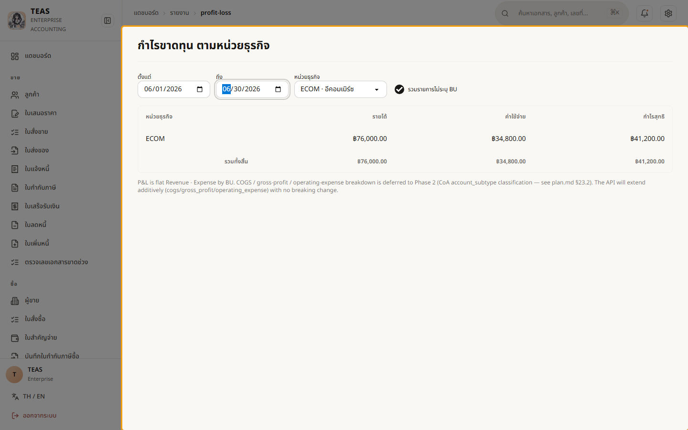
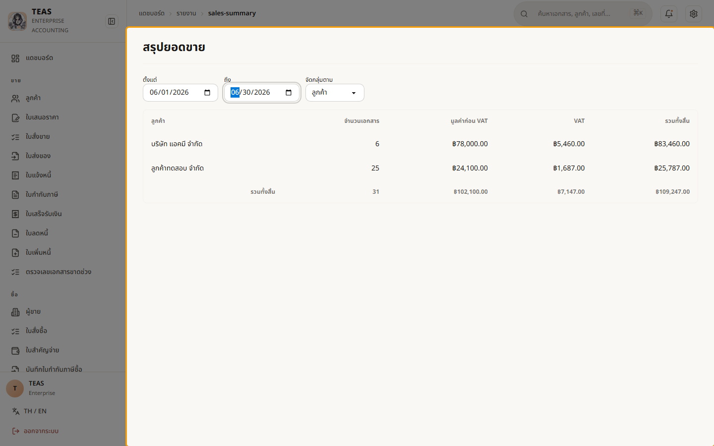
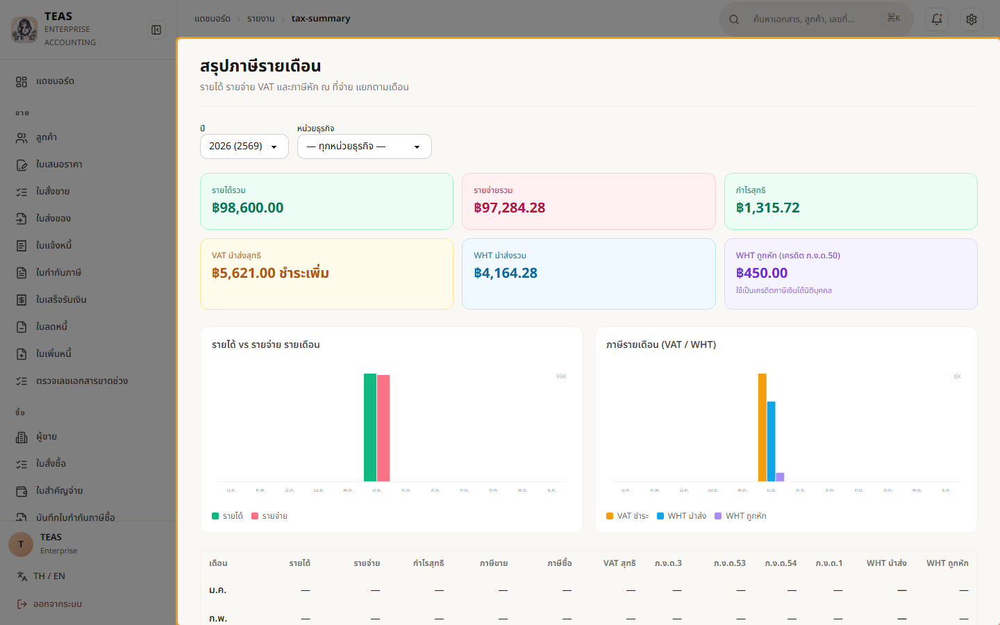
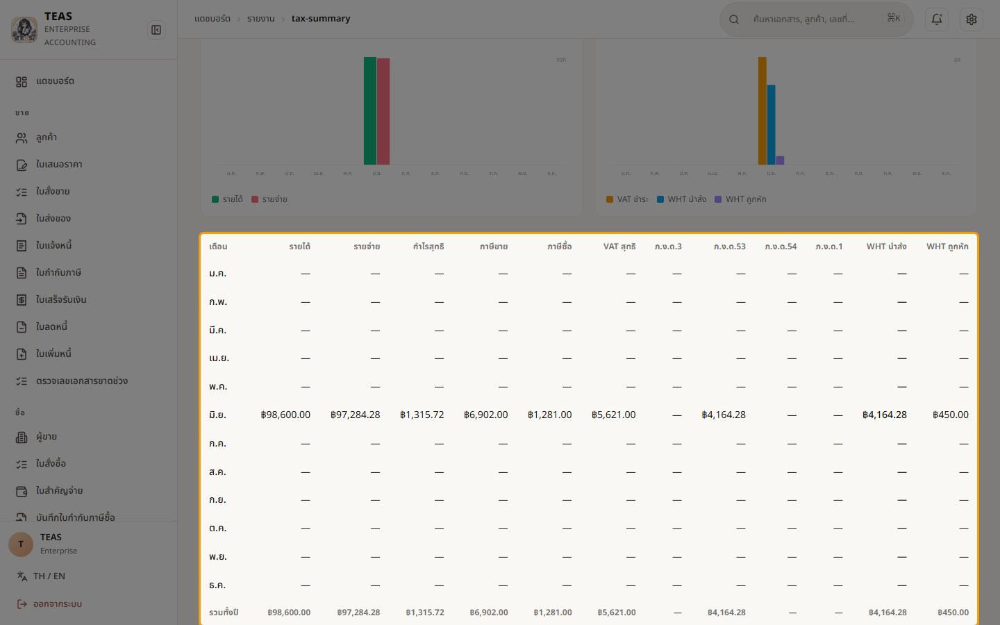

# 8. รายงาน

## 08.01 — งบกำไรขาดทุน (P&amp;L) + สรุปยอดขาย

> **เงื่อนไขก่อนใช้งาน:** login admin (สิทธิ์ดูรายงาน) · มีเอกสารที่บันทึกบัญชีแล้ว (ดู บท 4–6)

ระบบ **ลงบัญชีแยกประเภท (GL) ให้อัตโนมัติ** ทุกครั้งที่บันทึกบัญชีเอกสาร → รายงานพร้อมใช้ทันที
ไม่ต้องคีย์ซ้ำ:

- **งบกำไรขาดทุน (P&L)** — **รายได้ − รายจ่าย = กำไรสุทธิ** ในช่วงวันที่ที่เลือก
  แยกตาม **หน่วยธุรกิจ** ได้ (เทียบผลแต่ละแผนก/สาขา).
- **สรุปยอดขาย (Sales Summary)** — ยอดขายในช่วงเวลา **จัดกลุ่มได้ตาม ลูกค้า / สินค้า /
  หน่วยธุรกิจ** พร้อมจำนวนเอกสาร · ยอดก่อน VAT · VAT · ยอดรวม.

ทุกรายงาน **ดูอย่างเดียว** — เลือกช่วงวันที่/ตัวกรองแล้วแสดงผลจาก GL จริงทันที.

### ขั้นที่ 1

<figure markdown="span">
  
  <figcaption>งบกำไรขาดทุน — เลือกช่วงวันที่ + หน่วยธุรกิจ (ตัวอย่างกรอง ECOM) → รายได้/รายจ่าย/กำไรสุทธิ. เลือก "ทุกหน่วยธุรกิจ" เพื่อดูรวมและเทียบทุกหน่วย. ใช้ดูผลประกอบการรายเดือน/ไตรมาส/ปี</figcaption>
</figure>

### ขั้นที่ 2

<figure markdown="span">
  
  <figcaption>สรุปยอดขาย — เลือกช่วงวันที่ + "จัดกลุ่มตาม" (ลูกค้า/สินค้า/หน่วยธุรกิจ) → ตารางจำนวนเอกสาร · ยอดก่อน VAT · VAT · ยอดรวม ต่อกลุ่ม + แถวรวม</figcaption>
</figure>

## 08.02 — สรุปภาษีและผลประกอบการรายเดือน (Tax Summary)

> **เงื่อนไขก่อนใช้งาน:** login admin (สิทธิ์ดูรายงาน/ภาษี) · มีเอกสารขาย/ซื้อ/จ่าย ที่บันทึกบัญชีในปี (ดู บท 4–7)

**สรุปภาษี (Tax Summary)** คือแดชบอร์ดภาพรวม **ทั้งปี** ที่ดึงทุกอย่างมารวมไว้หน้าเดียว —
ใช้ดูสุขภาพกิจการ + เตรียมยื่นภาษีได้เร็ว:

- **การ์ด KPI** — รายได้ · รายจ่าย · กำไรสุทธิ · VAT สุทธิ (ต้องชำระ/ขอคืน) · ภาษีหัก ณ ที่จ่าย
  ที่นำส่ง · ภาษีที่ถูกหัก (รอเครดิต) ทั้งปี.
- **กราฟ** — รายได้-vs-รายจ่าย และ ภาษี (VAT/WHT) รายเดือน.
- **ตารางรายเดือน 12 เดือน** — แตกตัวเลขทุกประเภท: รายได้/รายจ่าย/กำไร · ภาษีขาย/ซื้อ/VAT สุทธิ ·
  **ภ.ง.ด.3 / 53 / 54 / 1** · WHT นำส่ง · WHT ถูกหัก. ตัวเลขใน **ลิงก์เจาะลึก** ไปหน้าแบบจริง
  (VAT สุทธิ → ภ.พ.30 · WHT นำส่ง → แบบยื่นภาษี · WHT ถูกหัก → รายงานภาษีถูกหักรอเครดิต).

ตัวเลขมาจาก GL จริง สอดคล้องกับแบบภาษีในบทที่ 7 (เช่น VAT สุทธิ = ยอดเดียวกับ ภ.พ.30).

### ขั้นที่ 1

<figure markdown="span">
  
  <figcaption>เลือก "ปี" (และหน่วยธุรกิจถ้าต้องการ) → การ์ด KPI ทั้งปี (รายได้/รายจ่าย/กำไร/VAT สุทธิ/WHT นำส่ง/WHT ถูกหัก) + กราฟแท่งรายเดือน (รายได้-vs-รายจ่าย และ VAT/WHT)</figcaption>
</figure>

### ขั้นที่ 2

<figure markdown="span">
  
  <figcaption>ตารางรายเดือน 12 เดือน — แตกทุกประเภท: รายได้/รายจ่าย/กำไร · ภาษีขาย/ซื้อ/VAT สุทธิ · ภ.ง.ด.3/53/54/1 · WHT นำส่ง/ถูกหัก + แถวรวมทั้งปี. ตัวเลขที่ขีดเส้นใต้ "คลิกเจาะลึก" ไปหน้าแบบภาษีจริง</figcaption>
</figure>
