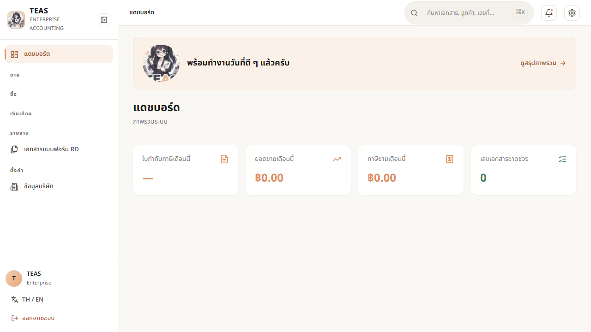
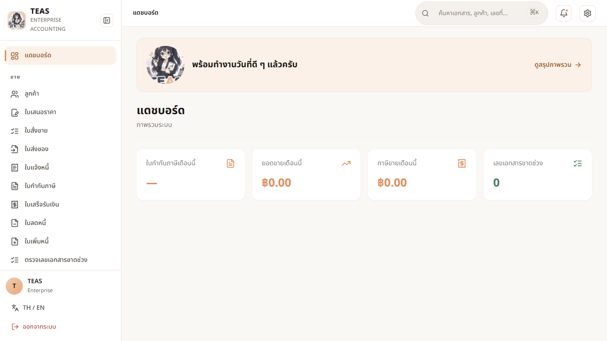

# TEAS — RBAC UI Guide (who sees what)

> GENERATED by `scripts/gen-rbac-manual.mjs` from the `rbac-ui-gating` e2e run. Do not hand-edit the matrices.
> ✓ = the control is shown to that role · blank = hidden · SUPER_ADMIN sees everything (flag bypass). VAT-only features are hidden on a non-VAT company.

## How gating works

The sidebar and each action button are shown only when the signed-in user's role holds the matching permission (super-admins bypass). This is a **UX affordance** — it stops a user opening a form that will 403 on submit. It is **not** the security boundary: the backend enforces the same role×endpoint rule on every request (`RbacCartesianTests`, green ×2). A non-VAT company additionally hides ใบกำกับภาษี / ใบลดหนี้-เพิ่มหนี้ / ภ.พ.30 (ม.86, no VAT documents).

## Visibility matrix — VAT company

### All features × roles (VAT company)

| Feature | SUPER_ADMIN | COMPANY_ADMIN | CHIEF_ACCOUNTANT | ACCOUNTANT | AR_CLERK | AP_CLERK | SALES_STAFF | PURCHASING_STAFF | WAREHOUSE_STAFF | APPROVER | AUDITOR | TAX_OFFICER |
|---|---|---|---|---|---|---|---|---|---|---|---|---|
| Dashboard | ✓ | ✓ | ✓ | ✓ | ✓ | ✓ | ✓ | ✓ | ✓ | ✓ | ✓ | ✓ |
| Customers | ✓ | ✓ | ✓ | ✓ | ✓ | ✓ | ✓ |  |  |  | ✓ |  |
| Quotations | ✓ | ✓ | ✓ | ✓ | ✓ |  | ✓ |  |  |  |  |  |
| Sales orders | ✓ | ✓ | ✓ | ✓ | ✓ |  | ✓ |  |  |  |  |  |
| Delivery orders | ✓ | ✓ | ✓ | ✓ | ✓ |  | ✓ |  |  |  |  |  |
| Invoices (billing) | ✓ | ✓ | ✓ | ✓ | ✓ |  | ✓ |  |  |  | ✓ |  |
| Tax invoices | ✓ | ✓ | ✓ | ✓ | ✓ |  | ✓ |  |  |  | ✓ |  |
| Receipts | ✓ | ✓ | ✓ | ✓ | ✓ |  | ✓ |  |  |  | ✓ |  |
| Credit notes | ✓ | ✓ | ✓ | ✓ | ✓ |  | ✓ |  |  |  | ✓ |  |
| Debit notes | ✓ | ✓ | ✓ | ✓ | ✓ |  | ✓ |  |  |  | ✓ |  |
| Number gaps | ✓ | ✓ | ✓ |  |  |  |  |  |  |  | ✓ | ✓ |
| Vendors | ✓ | ✓ | ✓ |  |  | ✓ |  | ✓ |  |  |  |  |
| Purchase orders | ✓ | ✓ | ✓ | ✓ | ✓ | ✓ |  | ✓ |  | ✓ |  |  |
| Payment vouchers | ✓ | ✓ | ✓ | ✓ |  | ✓ |  |  |  | ✓ |  |  |
| Vendor invoices | ✓ | ✓ | ✓ | ✓ |  | ✓ |  |  |  |  |  |  |
| WHT certificates | ✓ | ✓ | ✓ | ✓ |  | ✓ |  |  |  |  | ✓ | ✓ |
| Payroll | ✓ | ✓ | ✓ |  |  |  |  |  |  |  |  |  |
| Tax summary | ✓ | ✓ | ✓ | ✓ |  |  |  |  |  |  | ✓ | ✓ |
| Trial balance | ✓ | ✓ | ✓ | ✓ |  |  |  |  |  |  | ✓ | ✓ |
| Profit & loss | ✓ | ✓ | ✓ | ✓ |  |  |  |  |  |  | ✓ | ✓ |
| Sales summary | ✓ | ✓ | ✓ | ✓ |  |  |  |  |  |  | ✓ | ✓ |
| ภ.พ.30 | ✓ | ✓ | ✓ | ✓ |  |  |  |  |  |  | ✓ | ✓ |
| Outstanding PO | ✓ | ✓ | ✓ | ✓ | ✓ | ✓ |  | ✓ |  | ✓ |  |  |
| AP aging | ✓ | ✓ | ✓ | ✓ | ✓ | ✓ |  | ✓ |  | ✓ |  |  |
| Tax filings | ✓ | ✓ | ✓ | ✓ |  |  |  |  |  |  |  |  |
| Documents | ✓ | ✓ | ✓ | ✓ | ✓ | ✓ | ✓ | ✓ | ✓ | ✓ | ✓ | ✓ |
| Missing WHT cert | ✓ | ✓ | ✓ | ✓ |  |  |  |  |  |  | ✓ | ✓ |
| WHT receivable | ✓ | ✓ | ✓ | ✓ |  |  |  |  |  |  | ✓ | ✓ |
| Company profile (own) | ✓ | ✓ | ✓ | ✓ | ✓ | ✓ | ✓ | ✓ | ✓ | ✓ | ✓ | ✓ |
| Companies (tax cfg) | ✓ |  |  |  |  |  |  |  |  |  |  |  |
| Roles admin | ✓ | ✓ |  |  |  |  |  |  |  |  |  |  |
| Users admin | ✓ | ✓ |  |  |  |  |  |  |  |  |  |  |
| Products | ✓ | ✓ | ✓ |  | ✓ |  |  |  |  |  |  |  |
| Business units | ✓ | ✓ | ✓ | ✓ |  |  |  |  |  |  |  |  |
| Employees | ✓ | ✓ | ✓ |  |  |  |  |  |  |  |  |  |
| WHT types | ✓ | ✓ | ✓ |  |  |  |  |  |  |  |  |  |
| Expense categories | ✓ | ✓ | ✓ |  |  |  |  |  |  |  |  |  |
| API keys | ✓ | ✓ |  |  |  |  |  |  |  |  |  |  |
| Create customer | ✓ | ✓ | ✓ | ✓ |  |  |  |  |  |  |  |  |
| Create vendor | ✓ | ✓ | ✓ |  |  | ✓ |  | ✓ |  |  |  |  |
| Create tax invoice | ✓ | ✓ | ✓ | ✓ | ✓ |  |  |  |  |  |  |  |
| Create receipt | ✓ | ✓ | ✓ | ✓ | ✓ |  |  |  |  |  |  |  |
| Create payment voucher | ✓ | ✓ | ✓ | ✓ |  | ✓ |  |  |  |  |  |  |
| Create purchase order | ✓ | ✓ |  | ✓ |  | ✓ |  | ✓ |  |  |  |  |
| Create invoice | ✓ | ✓ | ✓ | ✓ | ✓ |  | ✓ |  |  |  |  |  |
| Create quotation | ✓ | ✓ | ✓ | ✓ | ✓ |  | ✓ |  |  |  |  |  |
| Edit registered address | ✓ | ✓ |  |  |  |  |  |  |  |  |  |  |
| Upload logo | ✓ | ✓ |  |  |  |  |  |  |  |  |  |  |
| Save company profile | ✓ | ✓ |  |  |  |  |  |  |  |  |  |  |
| PV detail: approve | ✓ | ✓ | ✓ |  |  |  |  |  |  | ✓ |  |  |
| PV detail: post | ✓ | ✓ | ✓ | ✓ |  | ✓ |  |  |  |  |  |  |
| PO detail: approve | ✓ | ✓ | ✓ |  |  |  |  |  |  | ✓ |  |  |
| PO detail: cancel | ✓ | ✓ | ✓ |  |  |  |  |  |  |  |  |  |
| PO detail: create PV | ✓ | ✓ | ✓ | ✓ |  | ✓ |  |  |  |  |  |  |
| PO detail: mark sent | ✓ | ✓ |  | ✓ |  | ✓ |  | ✓ |  |  |  |  |
| PO detail: close | ✓ | ✓ | ✓ |  |  |  |  |  |  |  |  |  |
| VI detail: post | ✓ | ✓ | ✓ | ✓ |  | ✓ |  |  |  |  |  |  |
| Payroll detail: approve | ✓ | ✓ | ✓ |  |  |  |  |  |  |  |  |  |
| Payroll detail: delete | ✓ | ✓ | ✓ |  |  |  |  |  |  |  |  |  |
| TI detail: post | ✓ | ✓ | ✓ | ✓ | ✓ |  |  |  |  |  |  |  |

## Visibility matrix — non-VAT company

### All features × roles (non-VAT company)

| Feature | SUPER_ADMIN | COMPANY_ADMIN | CHIEF_ACCOUNTANT | ACCOUNTANT | AR_CLERK | AP_CLERK | SALES_STAFF | PURCHASING_STAFF | WAREHOUSE_STAFF | APPROVER | AUDITOR | TAX_OFFICER |
|---|---|---|---|---|---|---|---|---|---|---|---|---|
| Dashboard | ✓ | ✓ | ✓ | ✓ | ✓ | ✓ | ✓ | ✓ | ✓ | ✓ | ✓ | ✓ |
| Customers | ✓ | ✓ | ✓ | ✓ | ✓ | ✓ | ✓ |  |  |  | ✓ |  |
| Quotations | ✓ | ✓ | ✓ | ✓ | ✓ |  | ✓ |  |  |  |  |  |
| Sales orders | ✓ | ✓ | ✓ | ✓ | ✓ |  | ✓ |  |  |  |  |  |
| Delivery orders | ✓ | ✓ | ✓ | ✓ | ✓ |  | ✓ |  |  |  |  |  |
| Invoices (billing) | ✓ | ✓ | ✓ | ✓ | ✓ |  | ✓ |  |  |  | ✓ |  |
| Tax invoices |  |  |  |  |  |  |  |  |  |  |  |  |
| Receipts | ✓ | ✓ | ✓ | ✓ | ✓ |  | ✓ |  |  |  | ✓ |  |
| Credit notes |  |  |  |  |  |  |  |  |  |  |  |  |
| Debit notes |  |  |  |  |  |  |  |  |  |  |  |  |
| Number gaps | ✓ | ✓ | ✓ |  |  |  |  |  |  |  | ✓ | ✓ |
| Vendors | ✓ | ✓ | ✓ |  |  | ✓ |  | ✓ |  |  |  |  |
| Purchase orders | ✓ | ✓ | ✓ | ✓ | ✓ | ✓ |  | ✓ |  | ✓ |  |  |
| Payment vouchers | ✓ | ✓ | ✓ | ✓ |  | ✓ |  |  |  | ✓ |  |  |
| Vendor invoices | ✓ | ✓ | ✓ | ✓ |  | ✓ |  |  |  |  |  |  |
| WHT certificates | ✓ | ✓ | ✓ | ✓ |  | ✓ |  |  |  |  | ✓ | ✓ |
| Payroll | ✓ | ✓ | ✓ |  |  |  |  |  |  |  |  |  |
| Tax summary | ✓ | ✓ | ✓ | ✓ |  |  |  |  |  |  | ✓ | ✓ |
| Trial balance | ✓ | ✓ | ✓ | ✓ |  |  |  |  |  |  | ✓ | ✓ |
| Profit & loss | ✓ | ✓ | ✓ | ✓ |  |  |  |  |  |  | ✓ | ✓ |
| Sales summary | ✓ | ✓ | ✓ | ✓ |  |  |  |  |  |  | ✓ | ✓ |
| ภ.พ.30 |  |  |  |  |  |  |  |  |  |  |  |  |
| Outstanding PO | ✓ | ✓ | ✓ | ✓ | ✓ | ✓ |  | ✓ |  | ✓ |  |  |
| AP aging | ✓ | ✓ | ✓ | ✓ | ✓ | ✓ |  | ✓ |  | ✓ |  |  |
| Tax filings | ✓ | ✓ | ✓ | ✓ |  |  |  |  |  |  |  |  |
| Documents | ✓ | ✓ | ✓ | ✓ | ✓ | ✓ | ✓ | ✓ | ✓ | ✓ | ✓ | ✓ |
| Missing WHT cert | ✓ | ✓ | ✓ | ✓ |  |  |  |  |  |  | ✓ | ✓ |
| WHT receivable | ✓ | ✓ | ✓ | ✓ |  |  |  |  |  |  | ✓ | ✓ |
| Company profile (own) | ✓ | ✓ | ✓ | ✓ | ✓ | ✓ | ✓ | ✓ | ✓ | ✓ | ✓ | ✓ |
| Companies (tax cfg) | ✓ |  |  |  |  |  |  |  |  |  |  |  |
| Roles admin | ✓ | ✓ |  |  |  |  |  |  |  |  |  |  |
| Users admin | ✓ | ✓ |  |  |  |  |  |  |  |  |  |  |
| Products | ✓ | ✓ | ✓ |  | ✓ |  |  |  |  |  |  |  |
| Business units | ✓ | ✓ | ✓ | ✓ |  |  |  |  |  |  |  |  |
| Employees | ✓ | ✓ | ✓ |  |  |  |  |  |  |  |  |  |
| WHT types | ✓ | ✓ | ✓ |  |  |  |  |  |  |  |  |  |
| Expense categories | ✓ | ✓ | ✓ |  |  |  |  |  |  |  |  |  |
| API keys | ✓ | ✓ |  |  |  |  |  |  |  |  |  |  |
| Create customer | ✓ | ✓ | ✓ | ✓ |  |  |  |  |  |  |  |  |
| Create vendor | ✓ | ✓ | ✓ |  |  | ✓ |  | ✓ |  |  |  |  |
| Create tax invoice |  |  |  |  |  |  |  |  |  |  |  |  |
| Create receipt | ✓ | ✓ | ✓ | ✓ | ✓ |  |  |  |  |  |  |  |
| Create payment voucher | ✓ | ✓ | ✓ | ✓ |  | ✓ |  |  |  |  |  |  |
| Create purchase order | ✓ | ✓ |  | ✓ |  | ✓ |  | ✓ |  |  |  |  |
| Create invoice | ✓ | ✓ | ✓ | ✓ | ✓ |  | ✓ |  |  |  |  |  |
| Create quotation | ✓ | ✓ | ✓ | ✓ | ✓ |  | ✓ |  |  |  |  |  |
| Edit registered address | ✓ | ✓ |  |  |  |  |  |  |  |  |  |  |
| Upload logo | ✓ | ✓ |  |  |  |  |  |  |  |  |  |  |
| Save company profile | ✓ | ✓ |  |  |  |  |  |  |  |  |  |  |
| PV detail: approve | – | – | – | – | – | – | – | – | – | – | – | – |
| PV detail: post | – | – | – | – | – | – | – | – | – | – | – | – |
| PO detail: approve | – | – | – | – | – | – | – | – | – | – | – | – |
| PO detail: cancel | – | – | – | – | – | – | – | – | – | – | – | – |
| PO detail: create PV | – | – | – | – | – | – | – | – | – | – | – | – |
| PO detail: mark sent | – | – | – | – | – | – | – | – | – | – | – | – |
| PO detail: close | – | – | – | – | – | – | – | – | – | – | – | – |
| VI detail: post | – | – | – | – | – | – | – | – | – | – | – | – |
| Payroll detail: approve | – | – | – | – | – | – | – | – | – | – | – | – |
| Payroll detail: delete | – | – | – | – | – | – | – | – | – | – | – | – |
| TI detail: post | – | – | – | – | – | – | – | – | – | – | – | – |

## Super-admin-only / backend-enforced-only (not in the matrix)

These controls are intentionally not asserted by the FE matrix above; their gating is proven by the backend tests and (where applicable) the super-only nav rows:

- **Paid-up capital card** (`/settings/company`) — `master.company.manage`, SUPER_ADMIN only (§4.6 tax/company master data). It self-hides via an async `GET /companies`; same gate as the "Companies (tax cfg)" nav row above.
- **Document-detail lifecycle actions** — approve / post / cancel / create-from on Payment Voucher, Purchase Order, Vendor Invoice, and Tax Invoice detail pages ARE asserted by the matrix above (the `* detail:` rows), on the VAT reference company where the full document chain has master data. Each carries its own distinct `PermissionGate` scope (Sprint 13k Plan 2 Phase E) and is independently enforced on the backend (`RbacCartesianTests`).
- **Payroll** detail: the DRAFT-run actions — approve (`payroll.run.post`) and delete (`payroll.run.manage`) — ARE asserted (the `Payroll detail:` rows; the spec seeds an employee + a DRAFT run). The **pay** button (`payroll.run.pay`) needs a POSTED run (approve → post → GL journal) and is left residual.
- **Residual (BE-enforced + FE-gated, not in the matrix):** the payroll **pay** button (needs a POSTED run) + every detail-lifecycle button on the **non-VAT** company (it has no vendor / expense-category / tax-code master data). Both use the identical `PermissionGate` mechanism proven on the VAT company and are enforced at the backend boundary (`RbacCartesianTests`).
- **In-form Save** on `/new` create forms — reached only through a gated create button (shown above) and re-checked by the backend on submit.
- **settings/* create buttons** — the settings page itself is nav-gated by the same `*.manage` permission, so the page (and its create button) is hidden as a unit.

## Screenshots (sidebar per role)

Each image is the dashboard sidebar as that role sees it, on each company type.

### nonvat-ACCOUNTANT-nav

### nonvat-APPROVER-nav

### nonvat-AP_CLERK-nav

### nonvat-AR_CLERK-nav

### nonvat-AUDITOR-nav

### nonvat-CHIEF_ACCOUNTANT-nav

### nonvat-COMPANY_ADMIN-nav

### nonvat-PURCHASING_STAFF-nav

### nonvat-SALES_STAFF-nav

### nonvat-SUPER_ADMIN-nav

### nonvat-TAX_OFFICER-nav

### nonvat-WAREHOUSE_STAFF-nav

### vat-ACCOUNTANT-nav

### vat-APPROVER-nav

### vat-AP_CLERK-nav

### vat-AR_CLERK-nav

### vat-AUDITOR-nav

### vat-CHIEF_ACCOUNTANT-nav

### vat-COMPANY_ADMIN-nav

### vat-PURCHASING_STAFF-nav

### vat-SALES_STAFF-nav

### vat-SUPER_ADMIN-nav

### vat-TAX_OFFICER-nav

### vat-WAREHOUSE_STAFF-nav

